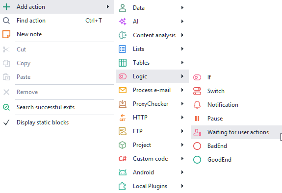
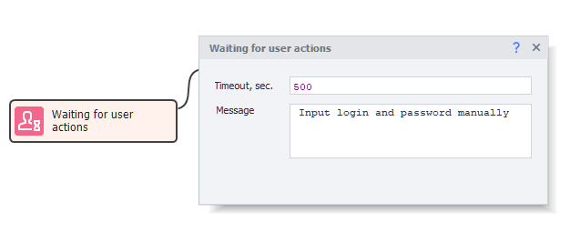
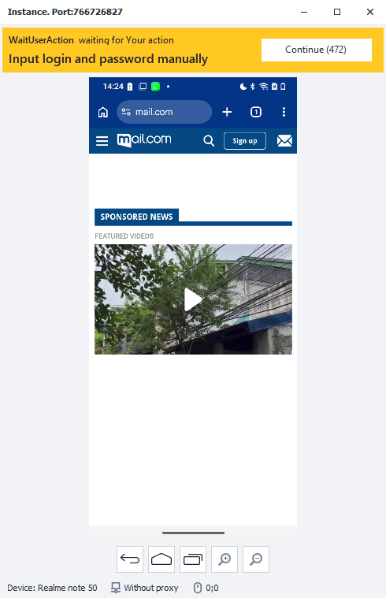

import DisclaimerNotice from '@site/src/components/DisclaimerNotice';

# Waiting for user actions
<DisclaimerNotice />

This action stops the project and hands control over to a person: the device window stays open, and whatever the template should not do itself can be done there by hand.

Used for:
- Typing a login and a password you would rather not keep in the template
- Entering bank card details
- Passing checks the template cannot pass on its own

:::info The same wait can be started from code, with the [**WaitForUserAction**](../../API/Action#waitforuseraction) method of the Action API.
:::

_______________________________________________
### How do I add it to my project?
Through the context menu: **Add action → Logic → Waiting for user actions**.

_______________________________________________
## How does this action work?

### Timeout, sec.
How many seconds are given for the manual work. You can enter a number or use a variable, which has to hold a number.

Once the time is up, the project carries on by itself.

:::info **When you cannot tell in advance how long it will take, set a deliberately large value - `99999`, for instance.**
:::

### Message.
The text the person sees in the device window. This is where you write what exactly has to be done.
_______________________________________________
## The waiting bar.
While the action runs, a bar appears at the top of the device window:

- Top left - **the project name** that stopped on this action.
- Below it - **the message** set in the action.
- On the right - the **Continue** button, with the seconds left until the project carries on by itself in brackets.

Pressing **Continue** hands control back to the template right away, without waiting the timeout out.
_______________________________________________
## Helpful Links.
- [**Pause**](./Pause)
- [**Device window**](../../pm/Interface/DeviceWindow)
