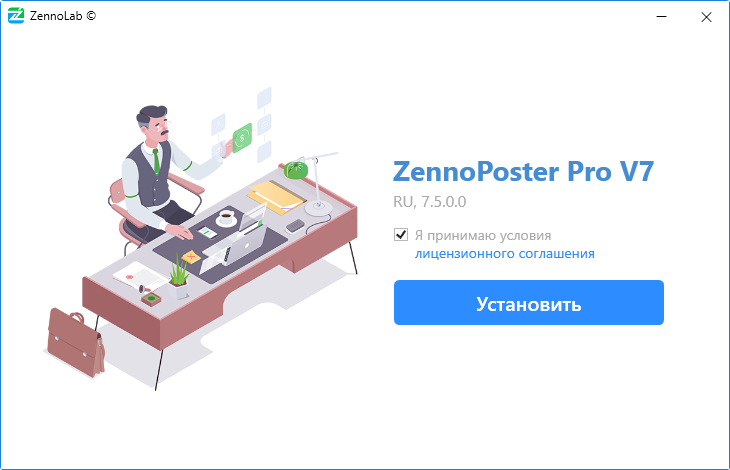
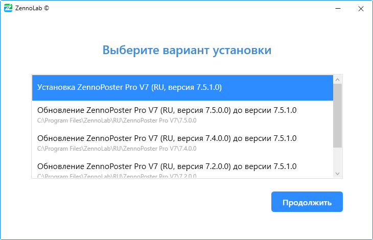
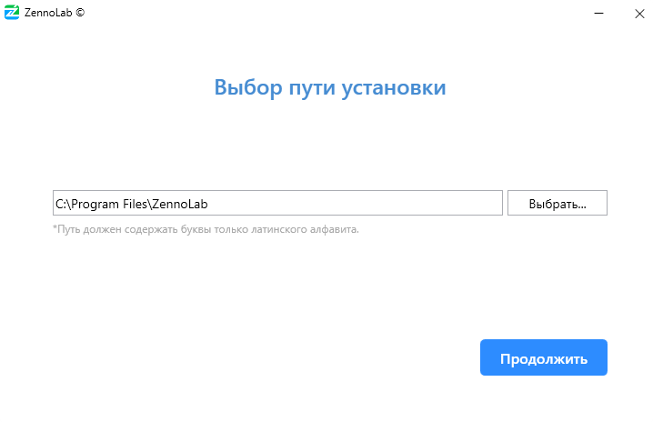
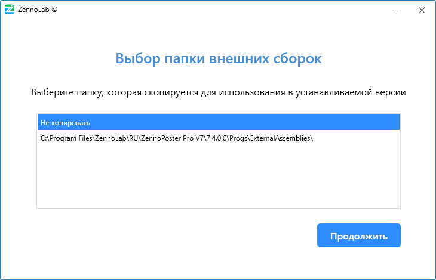
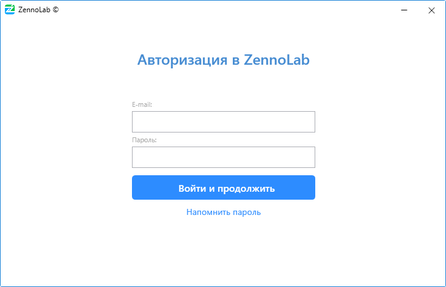
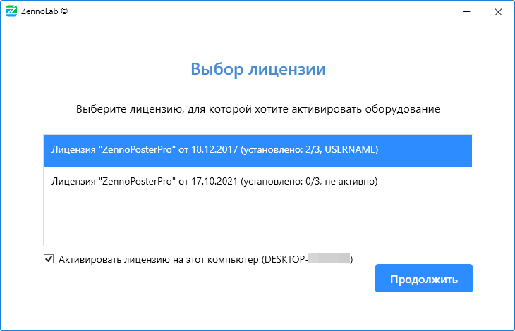
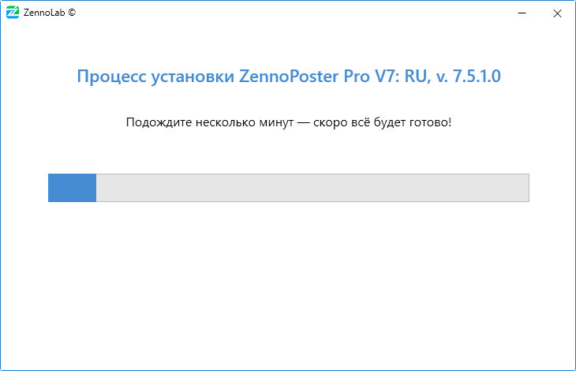
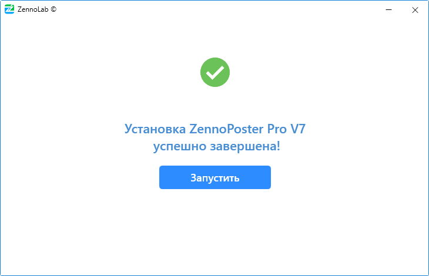
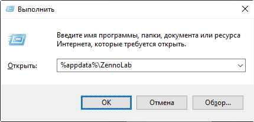

---
sidebar_position: 1
title: "Installing ZennoPoster"
description: "Converted from HTML to MDX"
date: "2025-07-19"
converted: true
originalFile: "Установка ZennoPoster.txt"
targetUrl: "https://zennolab.atlassian.net/wiki/spaces/RU/pages/2062483925"
---
:::info **Please read the [*Guidelines for Using Materials on This Resource*](../Disclaimer).**
:::

> 🔗 **[Original page](https://zennolab.atlassian.net/wiki/spaces/RU/pages/2062483925)** — Source of this material

_______________________________________________  
# Installing ZennoPoster

**1. Download the installer from your** [**Personal Account**](https://userarea.zennolab.com/lk/login.aspx "https://userarea.zennolab.com/lk/login.aspx") **and launch it.**

**2. Read the License Agreement and accept it if you agree, then click the “**Install**” button.**

Screenshot

**3. Installation options.**

If your computer already has older versions of the program, the installer will offer to either update one of them to the version you are installing, or perform a separate installation (you can have several versions of the program installed on one computer at the same time).

Screenshot

**4. Installation path.**

Choose an installation path or leave the default one, and click “Continue” (it is not recommended to change the default path).

Screenshot

**5. Selecting the external assemblies folder.**

If you used external dll libraries in one of the previous versions and copied them to the *ExternalAssemblies* folder, you will be prompted at this step to automatically copy *ExternalAssemblies* into the new installation.

Screenshot

**6. Entering your authorization details.**

Enter your email and password from your Personal Account and click “*Continue.”
If you forgot your account password, click “Forgot password” – your default browser will open the password recovery page.

Screenshot

**7. License selection.**

In this window, you can select a license (if you have several) and whether to activate the program you’re installing on this computer.
Once you’ve made your choice, click “*Continue” and the installation process will begin.

Installation process

More about license selection and hardware activation

**License selection**

If you’ve purchased multiple copies of the program, you can choose which license to use at this step.
The parentheses show the number of instances already installed for this license. **2/3** means the program has already been installed on two computers, with a maximum allowed of 3 installations.

**Activate license on this computer**

*The Pro edition can be installed on up to three computers at the same time. ProjectMaker will work on all three, but ZennoDroid/ZennoPoster will only work on the activated machine! You can activate it in your [*Personal Account](https://userarea.zennolab.com/lk/login.aspx "https://userarea.zennolab.com/lk/login.aspx").

To clarify with an example: You installed the program on a server and on your home computer. The server is the activated hardware, and ZennoPoster runs there, while you develop templates on your home computer.
If you want to install the program on another computer and check this box, you will activate the hardware for the new installation, and ZennoPoster on the server will stop working!

When the installation is complete, you can click “*Start” to launch ProjectMaker, or close the window by clicking the X in the upper right corner.

Screenshot

  

## Settings and projects from previous versions

Most settings are stored in AppData. To quickly open this directory, open the “Run” dialog (`Win+R`), enter `%appdata%\ZennoLab`, and click OK

If you previously had the program installed on this computer, the new version will automatically pick up your existing settings (provided you didn't delete the program folder in AppData).

  

## Useful links

- [❗→ What is ZennoPoster?](/wiki/spaces/RU/pages/475562059 "/wiki/spaces/RU/pages/475562059")
- [❗→ ZennoPoster system requirements](/wiki/spaces/RU/pages/475463745 "/wiki/spaces/RU/pages/475463745")
- [❗→ What is ZennoPoster made of](/wiki/spaces/RU/pages/475431198 "/wiki/spaces/RU/pages/475431198")
- [❗→ ZennoPoster - Demo](https://zennolab.atlassian.net/wiki/spaces/RU/pages/889258323 "https://zennolab.atlassian.net/wiki/spaces/RU/pages/889258323")