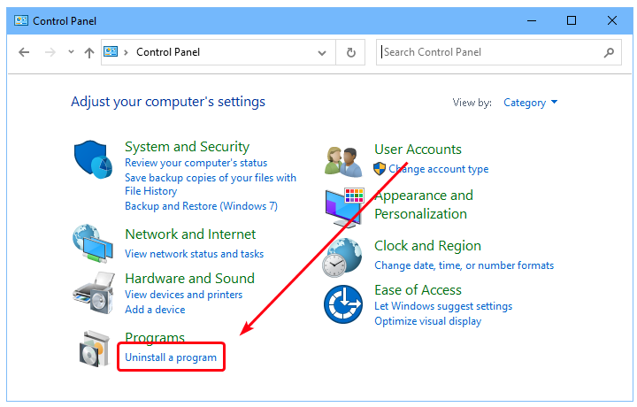
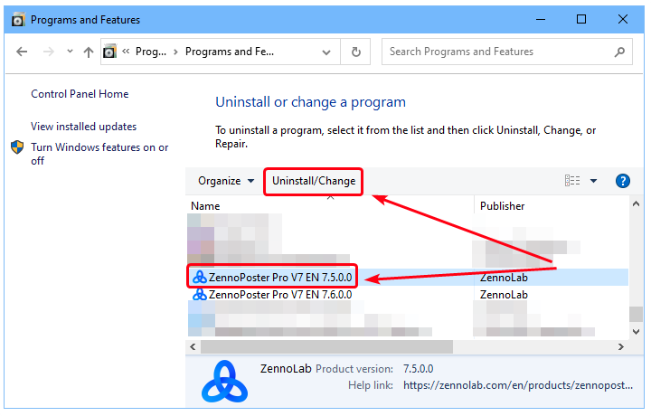
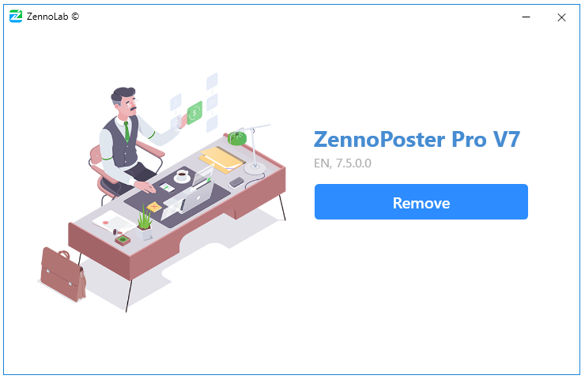
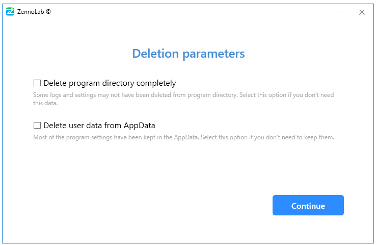
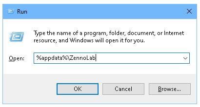
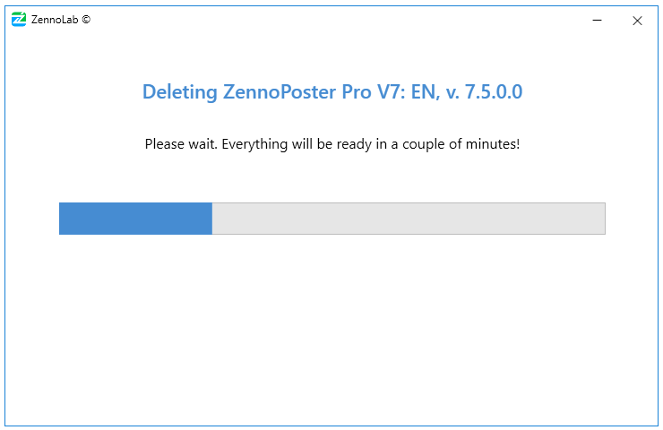
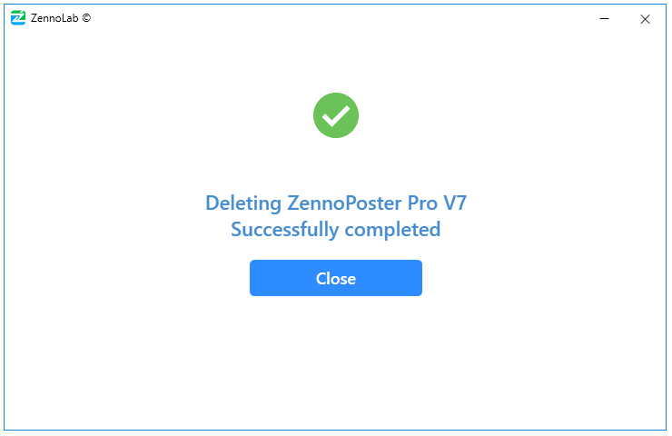

---
sidebar_position: 3
title: "Uninstalling the program"
description: "Converted from HTML to MDX"
date: "2025-07-19"
converted: true
originalFile: "Удаление программы.txt"
targetUrl: "https://zennolab.atlassian.net/wiki/spaces/RU/pages/2064154800"
slug: uninstalling-zennoposter
---
import DisclaimerNotice from '@site/src/components/DisclaimerNotice';

<DisclaimerNotice />

> 🔗 **[Original page](https://zennolab.atlassian.net/wiki/spaces/RU/pages/2064154800)** — Source of this material

_______________________________________________  

**1. Open the “[**[**Control Panel**](https://support.microsoft.com/ru-ru/windows/%D0%B3%D0%B4%D0%B5-%D0%BD%D0%B0%D1%85%D0%BE%D0%B4%D0%B8%D1%82%D1%81%D1%8F-%D0%BF%D0%B0%D0%BD%D0%B5%D0%BB%D1%8C-%D1%83%D0%BF%D1%80%D0%B0%D0%B2%D0%BB%D0%B5%D0%BD%D0%B8%D1%8F-aef7065f-a9ec-1ba9-8cab-79b2b83bdda5 "https://support.microsoft.com/ru-ru/windows/%D0%B3%D0%B4%D0%B5-%D0%BD%D0%B0%D1%85%D0%BE%D0%B4%D0%B8%D1%82%D1%81%D1%8F-%D0%BF%D0%B0%D0%BD%D0%B5%D0%BB%D1%8C-%D1%83%D0%BF%D1%80%D0%B0%D0%B2%D0%BB%D0%B5%D0%BD%D0%B8%D1%8F-aef7065f-a9ec-1ba9-8cab-79b2b83bdda5")**” and select the "Uninstall a program" option.**

Screenshot

**2. Select the program you want and click “Uninstall/Change”**  
A window will open with a list of all programs installed on your computer. Select the program you want and click “Uninstall/Change”

Screenshot

**3. The uninstaller will launch**  
In the window that opens, click “Uninstall”

Screenshot

**4. Uninstallation options**  
On the next step, you can choose additional uninstall options:

Screenshot

- *Completely remove the program directory*  
If you enable this option, the program directory will be completely deleted. This includes the logs folder and ExternalAssemblies (this folder contains external DLL libraries used by your projects).  
Example path for the Russian Pro version of ZennoPoster 7.5.1.0 – `C:\Program Files\ZennoLab\RU\ZennoPoster Pro V7\7.5.1.0`
- *Remove user data in AppData*  
Most program settings are stored at `C:\Users\USERNAME\AppData\Roaming\ZennoLab`—project settings, schedule, and program preferences. If you check this option, all these settings will be permanently lost.  
You can also access the settings folder by opening the "Run" dialog (`Win+R`), entering `%appdata%\ZennoLab`, then clicking OK.

:::caution Important  
ATTENTION! The settings in AppData are shared by all installed versions of the program! If you delete this folder, settings for all versions will be lost, not just the one you're currently uninstalling!
:::

**5. Uninstalling the program**

Once you have selected the desired uninstall options, click “Continue” to start the uninstallation process.

Screenshot

**6. Completion**

After the program is successfully removed, a notification window will appear:

  

## Useful links

- [❗→ Installing ZennoPoster](/wiki/spaces/RU/pages/2062483925 "/wiki/spaces/RU/pages/2062483925")
- [❗→ What is ZennoPoster?](/wiki/spaces/RU/pages/475562059 "/wiki/spaces/RU/pages/475562059")
- [❗→ ZennoPoster system requirements](/wiki/spaces/RU/pages/475463745 "/wiki/spaces/RU/pages/475463745")
- [❗→ What is ZennoPoster made of](/wiki/spaces/RU/pages/475431198 "/wiki/spaces/RU/pages/475431198")
- [❗→ ZennoPoster - Demo](https://zennolab.atlassian.net/wiki/spaces/RU/pages/889258323 "https://zennolab.atlassian.net/wiki/spaces/RU/pages/889258323")