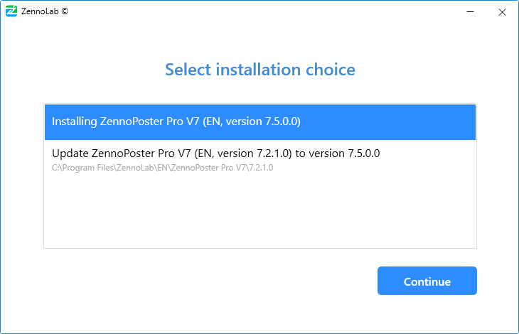
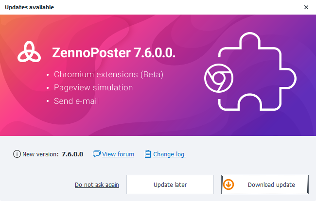
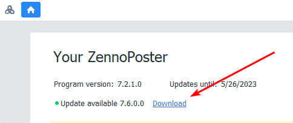
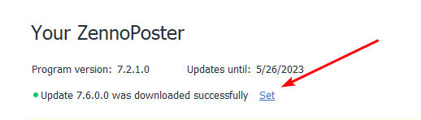
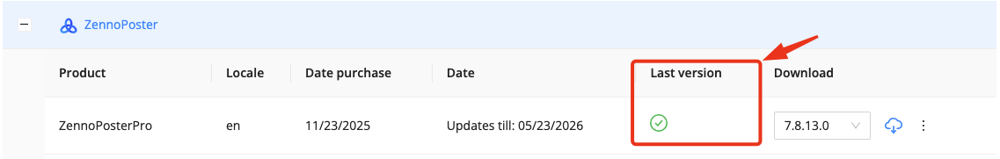
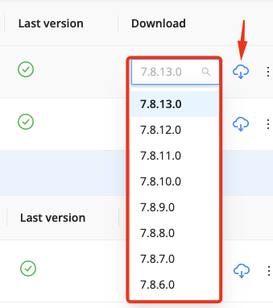

---
sidebar_position: 2
title: "Updating ZennoPoster"
description: " "
date: "2025-07-19"
converted: true
originalFile: ".txt"
targetUrl: "https://zennolab.atlassian.net/wiki/spaces/RU/pages/2090893313"
slug: update-zennoposter
---
import DisclaimerNotice from '@site/src/components/DisclaimerNotice';

<DisclaimerNotice />

> 🔗 **[Original page](https://zennolab.atlassian.net/wiki/spaces/RU/pages/2090893313)** — Source for this material

_______________________________________________  

The process of updating ZennoPoster is similar to installing it. You can update any previous version to the latest one.

- 1 Quick update
- 2 Update from your personal account
- 3 Update from ZennoPoster 5

Can I use multiple versions at the same time?

Yes, you can use multiple versions in parallel. To do this, during the [❗→ installation process](https://zennolab.atlassian.net/wiki/spaces/RU/pages/2062483925/ZennoPoster "https://zennolab.atlassian.net/wiki/spaces/RU/pages/2062483925/ZennoPoster") on the “Choose installation option” step, select “Install”, not “Update”.

## Quick update

ProjectMaker will periodically check for new updates. If one is available, a pop-up window will appear when you launch the program, offering you to download the new version.

You can also check if a new version is available on the main screen of ProjectMaker.

After clicking on the “Download” link, the download process will start. Once it's done, the status will change to “Successfully downloaded” and you can move on to installation by clicking the “Install” link.

Next, follow the [❗→ installation instructions](https://zennolab.atlassian.net/wiki/spaces/RU/pages/2062483925/ZennoPoster "https://zennolab.atlassian.net/wiki/spaces/RU/pages/2062483925/ZennoPoster").

## Update from your personal account

Go to your [personal account](https://userarea.zennolab.com/ "https://userarea.zennolab.com/"), find ZennoPoster in the products section and make sure the “Latest version” column shows you have access to the most current version of the program.

What if I need a different version, not the latest?

Click the “View all available versions for download” button.

Find the version you need there, download it, and proceed to [❗→ installation](https://zennolab.atlassian.net/wiki/spaces/RU/pages/2062483925/ZennoPoster "https://zennolab.atlassian.net/wiki/spaces/RU/pages/2062483925/ZennoPoster").

## Updating from ZennoPoster 5

A quick update from ZennoPoster 5 to version 7+ is not available, so you'll need to do this manually by downloading the installer from your [personal account](https://userarea.zennolab.com/lk/userarea/UserCustomer.aspx "https://userarea.zennolab.com/lk/userarea/UserCustomer.aspx"). The new version will be installed alongside ZennoPoster 5. After successfully installing ZennoPoster 7 (and above), you can remove the fifth version of the program.

Will I lose my old settings when installing ZennoPoster 7?

No, you won't. ZennoPoster 7 is fully compatible with the previous version of the program. All your settings, template lists, schedules, etc. will be preserved during installation.

The only thing to note is that ZennoPoster 7 uses a new format — `.zp`, which replaces the old `.xmlz` format. So you may need to add projects to ZennoPoster again with the new recommended `.zp` extension, replacing the old ones.

**How is the new format better than the old one?**
With this new format, we've tried to fix data storage issues that go back to the earliest program versions. Projects in the new format <u data-renderer-mark="true">take up 60% less space</u> and <u data-renderer-mark="true">load much faster</u> than before (
`.xmlz`). Versioning for all actions is now supported, so you no longer have to guess if a template will work on an older program version.

**Conversion**
When you open an old template in ProjectMaker, it will be converted to the new format. The original `.xmlz` file will remain, and a new `.zp` file will be created next to it. For backward compatibility, in the “Save as” menu, you're able to save the template in the old format.

Will templates from ZennoPoster 5 work in ZennoPoster 7?

Yes, absolutely!

