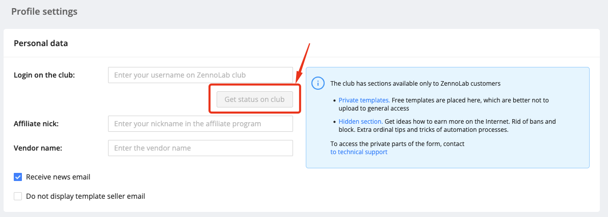

---
sidebar_position: 8
title: "Obtaining Client Status"
description: "Converted from HTML to MDX"
date: "2025-07-08"
converted: true
originalFile: "Получение статуса клиента.txt"
targetUrl: "https://zennolab.atlassian.net/wiki/spaces/RU/pages/908197929"
---
import DisclaimerNotice from '@site/src/components/DisclaimerNotice';

<DisclaimerNotice />

> 🔗 **[Original page](https://zennolab.atlassian.net/wiki/spaces/RU/pages/908197929)** — Source of this material

_______________________________________________  

There are sections on the forum that are available only to ZennoLab clients:

- [Hidden section](https://zennolab.com/discussion/forums/skrytyj-razdel-dlja-klientov.156/ "https://zennolab.com/discussion/forums/skrytyj-razdel-dlja-klientov.156/") – discussions about making money online, bypassing protection and blocks on various websites, and many other automation tips and tricks.
- [Private templates](https://zennolab.com/discussion/forums/privatnye-shablony-dlja-klientov.251/ "https://zennolab.com/discussion/forums/privatnye-shablony-dlja-klientov.251/") – here you will find free templates that are best kept private.

To access the private sections of the forum, you need a "**Client**" status, which any user with one of the following licenses can obtain:

- [ZennoPoster](https://zennolab.com/ru/products/zennoposter/ "https://zennolab.com/ru/products/zennoposter/")
- [CapMonster](https://zennolab.com/ru/products/capmonster/ "https://zennolab.com/ru/products/capmonster/")
- [ZennoDroid](https://zennolab.com/ru/products/zennodroid/ "https://zennolab.com/ru/products/zennodroid/")
- [ZennoProxyChecker](https://zennolab.com/ru/products/zennoproxychecker/ "https://zennolab.com/ru/products/zennoproxychecker/")

1. Create an account on the forum.
2. In your [Personal Account](https://userarea.zennolab.com/lk/login.aspx "https://userarea.zennolab.com/lk/login.aspx"), go to the [Profile](https://userarea.zennolab.com/lk/userarea/Profile.aspx "https://userarea.zennolab.com/lk/userarea/Profile.aspx") section.

3. Enter your forum username and confirm that it is correct. You can only link your forum username once!

4. Make sure your client status has been assigned on the forum.

If something went wrong, please contact [support](https://helpdesk.zennolab.com/ru "https://helpdesk.zennolab.com/ru").