---
sidebar_position: 1
title: "Advantages of the ProjectMaker 7 Interface"
description: ""
date: "2025-07-19"
converted: true
originalFile: "Преимущества интерфейса ProjectMaker 7.txt"
targetUrl: "https://zennolab.atlassian.net/wiki/spaces/RU/pages/506200090"
---
:::info **Please read the [*Terms of Use for Materials on this Resource*](../Disclaimer).**
:::

> 🔗 **[Original Page](https://zennolab.atlassian.net/wiki/spaces/RU/pages/506200090)** — Source of this material

_______________________________________________  

The ProjectMaker 7 interface meets the highest standards for modern software designed for project creation and development.

:::info Information
You can find setup instructions in section “3. Customization”
:::

  

### **3 qualities of the ProjectMaker 7 interface:**

1. [❗→ Modern Look](https://zennolab.atlassian.net/wiki/spaces/RU/pages/506200090/ProjectMaker+7#1.-%D0%A1%D0%BE%D0%B2%D1%80%D0%B5%D0%BC%D0%B5%D0%BD%D0%BD%D1%8B%D0%B9-%D0%B2%D0%B8%D0%B4 "https://zennolab.atlassian.net/wiki/spaces/RU/pages/506200090/ProjectMaker+7#1.-%D0%A1%D0%BE%D0%B2%D1%80%D0%B5%D0%BC%D0%B5%D0%BD%D0%BD%D1%8B%D0%B9-%D0%B2%D0%B8%D0%B4")
2. [❗→ Functionality](https://zennolab.atlassian.net/wiki/spaces/RU/pages/506200090/ProjectMaker+7#2.-%D0%A4%D1%83%D0%BD%D0%BA%D1%86%D0%B8%D0%BE%D0%BD%D0%B0%D0%BB%D1%8C%D0%BD%D0%BE%D1%81%D1%82%D1%8C "https://zennolab.atlassian.net/wiki/spaces/RU/pages/506200090/ProjectMaker+7#2.-%D0%A4%D1%83%D0%BD%D0%BA%D1%86%D0%B8%D0%BE%D0%BD%D0%B0%D0%BB%D1%8C%D0%BD%D0%BE%D1%81%D1%82%D1%8C")
3. [❗→ Customization (Personalize to Your Taste)](https://zennolab.atlassian.net/wiki/spaces/RU/pages/506200090/ProjectMaker+7#3.-%D0%9A%D0%B0%D1%81%D1%82%D0%BE%D0%BC%D0%B8%D0%B7%D0%B0%D1%86%D0%B8%D1%8F-%28%D0%9D%D0%B0%D1%81%D1%82%D1%80%D0%BE%D0%B9%D0%BA%D0%B0-%D0%BF%D0%BE%D0%B4-%D1%81%D0%B2%D0%BE%D0%B9-%D0%B2%D0%BA%D1%83%D1%81%29 "https://zennolab.atlassian.net/wiki/spaces/RU/pages/506200090/ProjectMaker+7#3.-%D0%9A%D0%B0%D1%81%D1%82%D0%BE%D0%BC%D0%B8%D0%B7%D0%B0%D1%86%D0%B8%D1%8F-(%D0%9D%D0%B0%D1%81%D1%82%D1%80%D0%BE%D0%B9%D0%BA%D0%B0-%D0%BF%D0%BE%D0%B4-%D1%81%D0%B2%D0%BE%D0%B9-%D0%B2%D0%BA%D1%83%D1%81)")

  

# 1. Modern Look

:::tip Tip
Minimalism, clarity, and clean shapes make the interface accessible to any user without additional training.
:::

**📹 Video was here**

Bright, easily recognizable buttons, grouped where you need them, make navigating the program quick and intuitive. Clear icon images help you understand the purpose of menu items.

  

# 2. Functionality

## 2.1. Main Menu

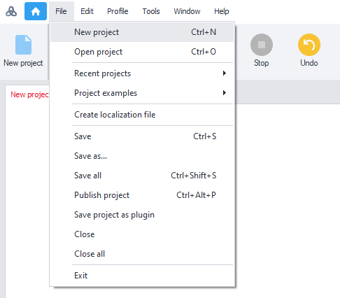

All program features are available through the main menu—a classic interface users have known since early versions of Windows. This is now the standard for today’s project development studios.

## 2.2. Toolbar

In addition to the classic menu, there’s a toolbar you can customize as you wish—choose the look, order, and which buttons appear!

[❗→ How to set up the toolbar](https://zennolab.atlassian.net/wiki/spaces/RU/pages/506200090/ProjectMaker+7#3.2.-%D0%9D%D0%B0%D1%81%D1%82%D1%80%D0%BE%D0%B9%D0%BA%D0%B0-%D0%BF%D0%B0%D0%BD%D0%B5%D0%BB%D0%B8-%D0%B8%D0%BD%D1%81%D1%82%D1%80%D1%83%D0%BC%D0%B5%D0%BD%D1%82%D0%BE%D0%B2 "https://zennolab.atlassian.net/wiki/spaces/RU/pages/506200090/ProjectMaker+7#3.2.-%D0%9D%D0%B0%D1%81%D1%82%D1%80%D0%BE%D0%B9%D0%BA%D0%B0-%D0%BF%D0%B0%D0%BD%D0%B5%D0%BB%D0%B8-%D0%B8%D0%BD%D1%81%D1%82%D1%80%D1%83%D0%BC%D0%B5%D0%BD%D1%82%D0%BE%D0%B2")

## 2.3. Tool Windows

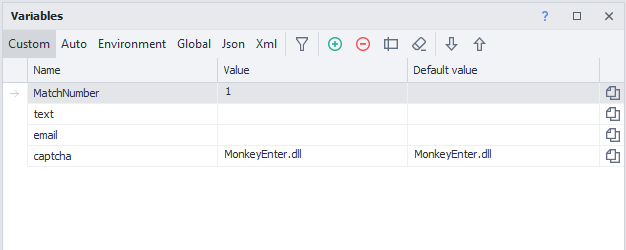

Main and supporting windows—like “Project,” “Browser,” “Action Properties,” “Execution Log,” and others—have a dedicated and familiar look for functional tool windows.

## 2.4. Using 2 Monitors

In ProjectMaker 7, you can move any tool window—even the browser—onto a different monitor whenever you’d like.

**📹 Video was here**

## 2.5. Smart Action Panel (Toolbox for blocks)

In ProjectMaker 7, you can use the Action Panel wherever you want:

1. In “hide browser” mode (Advanced Editor Mode in ZP5)
2. In “show browser” mode (Recording and Debugging Mode in ZP5)
3. Hide and call up the panel quickly with the Ctrl + T hotkey

**📹 Video was here**

### Smart Action Search

:::note Note
Now you no longer need to remember where an action (block) was located or what it was called—the new Action Panel features truly “smart search.”
:::

**📹 Video was here**

## 2.6. Fast Project Navigation

:::warning Attention
Anyone who has worked on large projects has surely asked themselves: “Where does this line go?”
:::

ProjectMaker 7 can answer that! Now, when you hover over a node connection point, you’ll see a preview of the action the line leads to.

**Take a look at how this works:**

**📹 Video was here**

  

# 3. Customization (Personalize to Your Taste)

## 3.1. Interface Theme

:::tip Tip
There are 2 themes—light and dark.
:::

The light theme is great for those who prefer the classic program look. The dark theme has become very popular among some users; it’s perfect if you like something a bit different, or if you work at night and want to reduce eye strain.

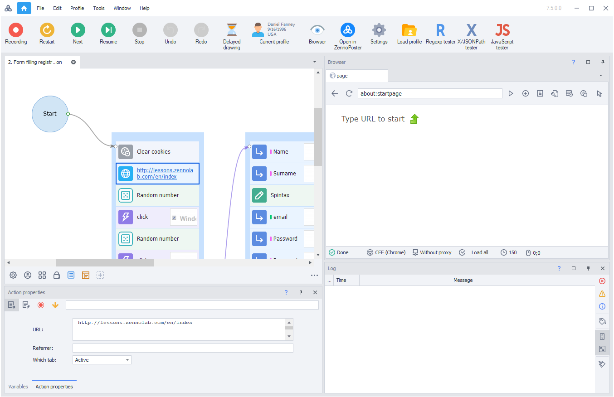

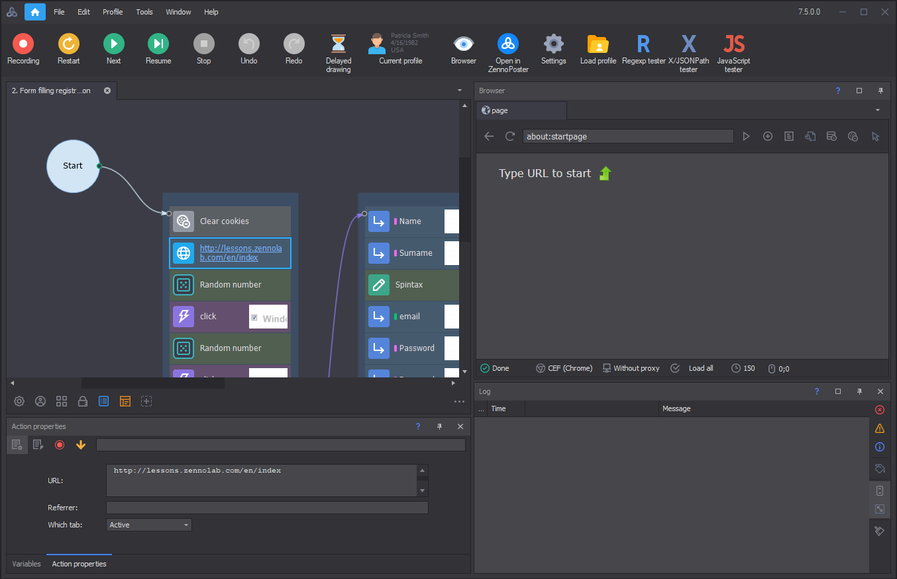

How to set up

Edit → Settings:

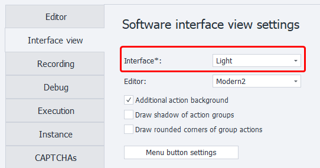

## 3.2. Toolbar Customization

:::tip Tip
There are 3 types of toolbars: standard, compact, and super compact.
:::

### 3.2.1. Standard View

Designed for large monitors (full hd, 2K and higher):

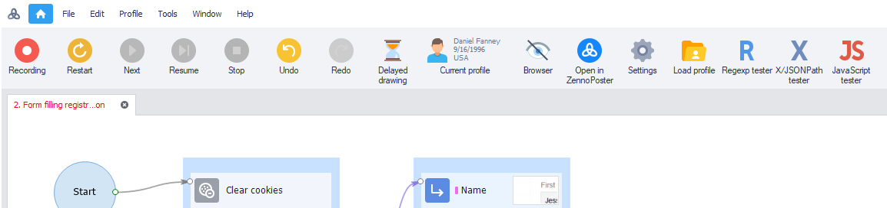

How to set up

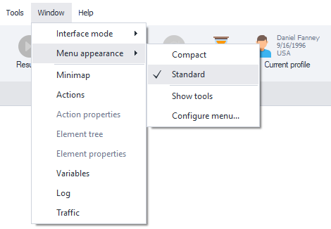

### 3.2.2. Compact

Perfect for laptop screens, or for those who want to save screen space.

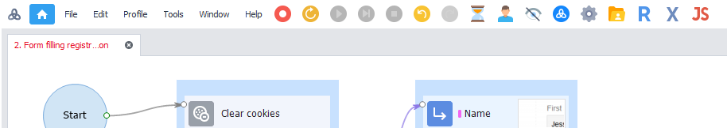

How to set up

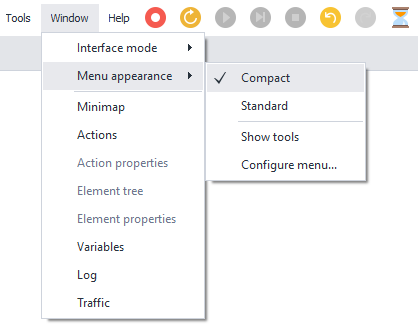

### 3.2.3. Super Compact

You can even remove the classic menu items:

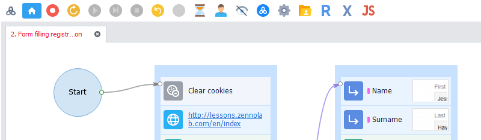

How to set up

To do this, open menu settings:

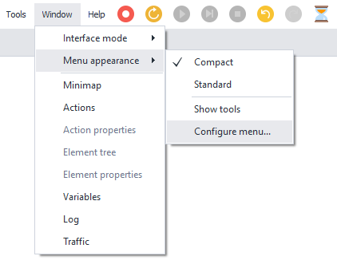

On the right tab you can customize the buttons for showing the main menu:

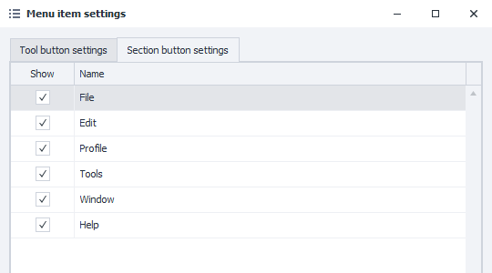

### 3.2.4. Fully Personalized Toolbar

You can also open the menu settings to fully personalize your toolbar:

:::info Information
Window → Menu View → Customize…
:::

Here you can set up any buttons on the panel, and their order—just drag and drop items with your mouse:

**📹 Video was here**

## 3.3. Tool Window Management

Each tool window can be in 4 states:

1. Hidden
2. Shown and pinned to the main window
3. Shown and auto-hidden to the main window
4. Shown separately from the main window

**📹 Video was here**

**In addition, action settings can also be in a special fifth state:**

5. Shown in the editor window.

**📹 Video was here**

## 3.4. Project Theme

:::tip Tip
The project theme controls how your project looks. For ZennoPoster 7, we’ve developed a completely new, modern theme that meets requirements for contrast, visibility of visuals, and readability—while staying easy on your eyes during long work sessions. But if you want the look of version 5, just pick the classic style.
:::

The new ProjectMaker lets you choose from several project themes to match your taste. Our recommended themes:

### 3.4.1. Modern (Modern2 + extra background for actions)

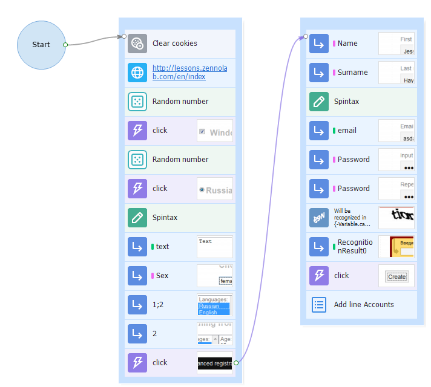

How to enable

Edit → Settings:

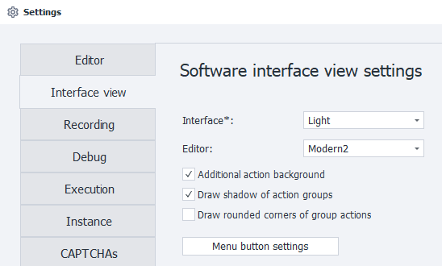

### 3.4.2. Classic

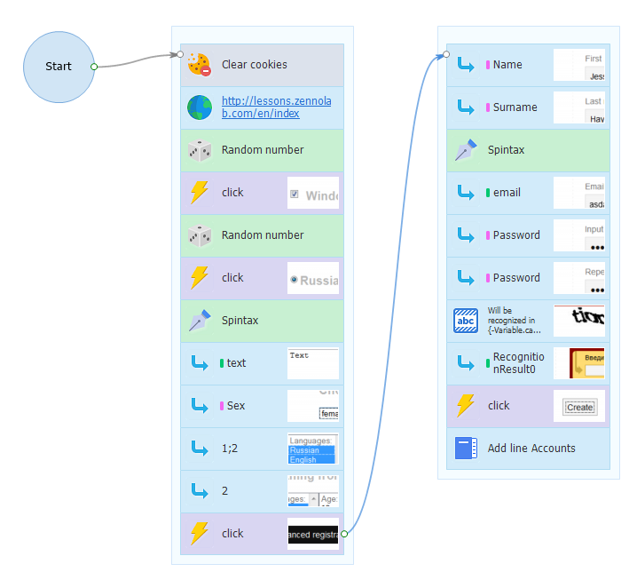

How to enable

Edit → Settings:

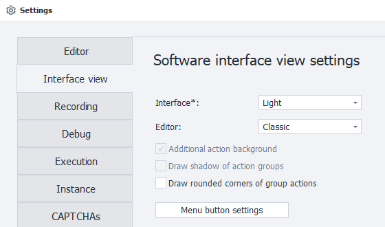

## 3.5. Customizing the Appearance of Project Elements

On top of everything else, ProjectMaker 7 gives you even more ways to customize the look of project elements.

### 3.5.1. Setting Group Colors

Right-click the group:

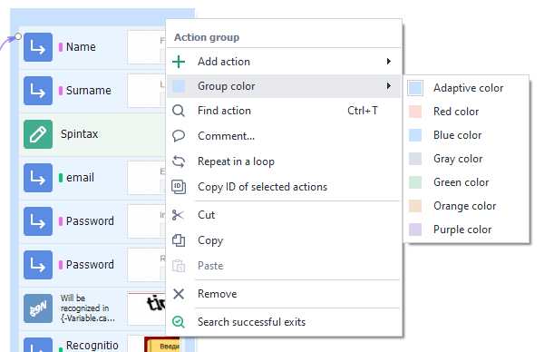

### 3.5.2. Setting the Color and Font of Notes

Right-click the note:

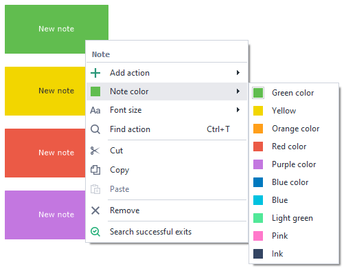

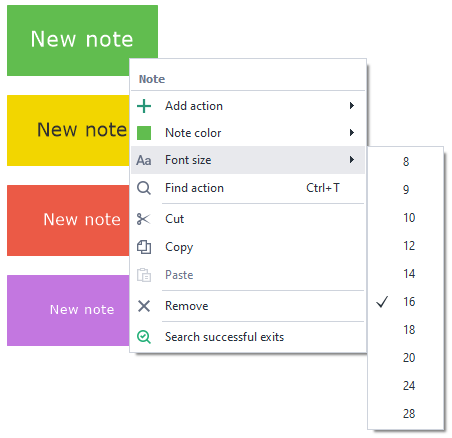