---
sidebar_position: 2
title: "Action Constructor and XPath Search"
description: ""
date: "2025-08-18"
converted: true
originalFile: "Конструктор действий и Поиск по XPath.txt"
targetUrl: "https://zennolab.atlassian.net/wiki/spaces/RU/pages/483426337/XPath"
---
import DisclaimerNotice from '@site/src/components/DisclaimerNotice';

<DisclaimerNotice />

> 🔗 **[Original page](https://zennolab.atlassian.net/wiki/spaces/RU/pages/483426337/XPath)** — Source of this material

_______________________________________________  

## Description

The Action Constructor is a universal tool for working with page elements, allowing you to select the most suitable identifiers for finding them.

:::warning Attention
To use this feature, you’ll need some basic knowledge of HTML markup.
:::

  

## How to open it?

There are two ways to open the constructor:

1. Right-click the element you’re interested in on the page and choose *Send to Action Constructor from the [❗→ context menu](https://zennolab.atlassian.net/wiki/spaces/RU/pages/534315373#%D0%9A%D0%BE%D0%BD%D1%82%D0%B5%D0%BA%D1%81%D1%82%D0%BD%D0%BE%D0%B5-%D0%BC%D0%B5%D0%BD%D1%8E).

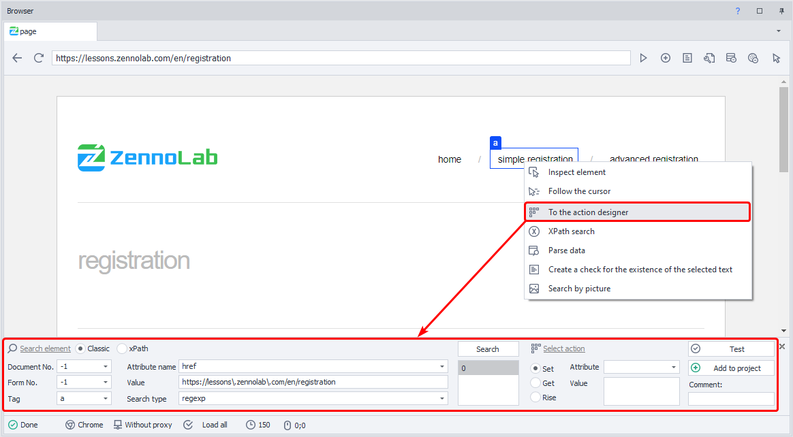

2. The second way is from the [❗→ Element Tree](https://zennolab.atlassian.net/wiki/spaces/RU/pages/727777355 "https://zennolab.atlassian.net/wiki/spaces/RU/pages/727777355") window. Right-click the desired element and select *Send to Action Constructor.

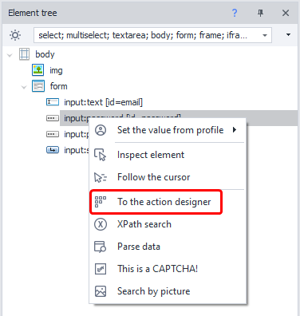

  

:::note Note
When you add an element to the Action Constructor, its available properties and attributes are automatically added to the Properties window.
:::

## Search parameters

### Classic Search

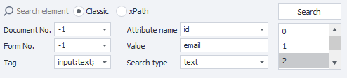

#### **Document number**

It’s recommended to set the value to -1 (search in all documents on the page).

#### **Form number**

It’s also best to set this to -1 (search in all forms on the page). By doing this, your template will be more universal.

&gt; 
&gt; Example: There are 3 forms on the page—search, registration, and product order. Suppose you need to click a button in the order form, and you select “Form” value as 2 (index starts at zero). Sometime later, a new login form appears on the site and is inserted before the order form. Now number 2 will be the login form, and your template will either throw an error saying it can’t find the button, or (even worse) it’ll click a different button in a different form.

:::note Note
In the program settings (Settings → Recording), you can check “Search in all forms on the page” and “Search in all documents on the page” so that the number for document and form will always be -1 when finding elements.
:::

#### **Tag**

The HTML tag you want to find.

Example:  
`

`  
`div` is the tag.

#### **Attribute name**

The attribute of the HTML tag you’ll search by.

`

`  
`class` and `id` are attributes.

#### **Value**

The value of the selected HTML tag’s attribute.

`

`  
`visible` and `username` are attribute values.

#### **Search type**

1. text - search by full or partial text
2. notext - searches for elements that do not contain the specified text
3. regexp - search using [❗→ regular expressions](https://zennolab.atlassian.net/wiki/spaces/RU/pages/534086111 "https://zennolab.atlassian.net/wiki/spaces/RU/pages/534086111")
By default, the search is case-insensitive. To make a regular expression case-sensitive, add `(?-i)` at the start of the expression (this disables case-insensitive search).

As shown in the screenshot, after clicking the *Search button, three elements were found. This isn’t ideal—always try to pick search parameters so that only one element is found.

### XPath Search

With [❗→ XPath expressions](https://zennolab.atlassian.net/wiki/spaces/RU/pages/862093419/ "https://zennolab.atlassian.net/wiki/spaces/RU/pages/862093419/"), you can create a more universal and robust element search algorithm compared to classic search or regular expressions.

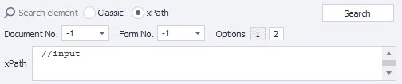

Document number and Form number work the same as in Classic Search.

#### XPath

Field for entering your [❗→ XPath](https://zennolab.atlassian.net/wiki/spaces/RU/pages/862093419 "https://zennolab.atlassian.net/wiki/spaces/RU/pages/862093419") expression.

#### Variants

Here you can select one of the suggested *Constructor expressions.

:::note Note
If none of the suggested options suit you, you can write your own XPath expression.
:::

## Choosing an action

You can select one of three possible actions

**Set** - [❗→ Set value](https://zennolab.atlassian.net/wiki/spaces/RU/pages/534315117 "https://zennolab.atlassian.net/wiki/spaces/RU/pages/534315117")  
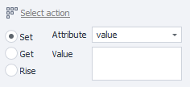

- *Attribute* — the attribute of the element where you want to set a new value
- *Value* — the text you want to insert. You can use plain text or project variables like `{ -Variable.someVar- }`, `{ -Profile.Name- }`.

**Get** — [❗→ Get value](https://zennolab.atlassian.net/wiki/spaces/RU/pages/534315124 "https://zennolab.atlassian.net/wiki/spaces/RU/pages/534315124")  
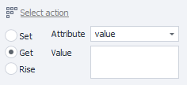

- *Attribute* — the attribute whose value you want to get.
- *Value* — this will display the value of the found attribute.

**Rise** — [❗→ Perform action](https://zennolab.atlassian.net/wiki/spaces/RU/pages/534020211 "https://zennolab.atlassian.net/wiki/spaces/RU/pages/534020211")  
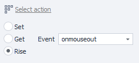  
- here you can choose the necessary action to perform on the found element.

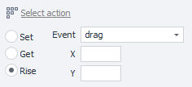  

- For *drag and *drop actions, there are two extra fields for coordinates.

  

## Final steps

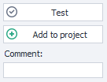

### Testing

After picking the necessary search parameters and selecting the needed action, it’s a good idea to test your parameters by clicking the corresponding button.

### Comment

It’s a good idea to leave a comment for the action, since automatic comments tend not to be very informative.

Default
comments

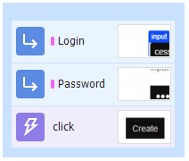

The same actions,
but with your own comments

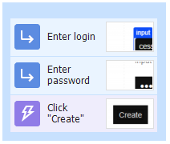

### Adding to project

Once you’ve chosen the right parameters, found the element, and selected and tested the needed action, you can click *Add to project.

  

## Useful links

- [❗→ XPath](https://zennolab.atlassian.net/wiki/spaces/RU/pages/862093419 "https://zennolab.atlassian.net/wiki/spaces/RU/pages/862093419")
- [❗→ Regular expression tester](https://zennolab.atlassian.net/wiki/spaces/RU/pages/534086111 "https://zennolab.atlassian.net/wiki/spaces/RU/pages/534086111")
- [❗→ Set value](https://zennolab.atlassian.net/wiki/spaces/RU/pages/534315117 "https://zennolab.atlassian.net/wiki/spaces/RU/pages/534315117")
- [❗→ Perform event](https://zennolab.atlassian.net/wiki/spaces/RU/pages/534020211 "https://zennolab.atlassian.net/wiki/spaces/RU/pages/534020211")
- [❗→ Get value](https://zennolab.atlassian.net/wiki/spaces/RU/pages/534315124 "https://zennolab.atlassian.net/wiki/spaces/RU/pages/534315124")
- [❗→ Element property window](https://zennolab.atlassian.net/wiki/spaces/RU/pages/735608879 "https://zennolab.atlassian.net/wiki/spaces/RU/pages/735608879")
- [ZennoPoster + xPath with Yandex.Market example](https://zennolab.com/discussion/threads/obzor-zennoposter-xpath-na-primere-jandeks-marketa.37497/ "https://zennolab.com/discussion/threads/obzor-zennoposter-xpath-na-primere-jandeks-marketa.37497/") (contest article from the forum)