---
sidebar_position: 0
title: "Browser Window"
description: ""
date: "2025-08-18"
converted: true
originalFile: "Окно браузера.txt"
targetUrl: "https://zennolab.atlassian.net/wiki/spaces/RU/pages/534315373"
---
import DisclaimerNotice from '@site/src/components/DisclaimerNotice';

<DisclaimerNotice />

> 🔗 **[Original page](https://zennolab.atlassian.net/wiki/spaces/RU/pages/534315373)** — Source of this material

_______________________________________________  

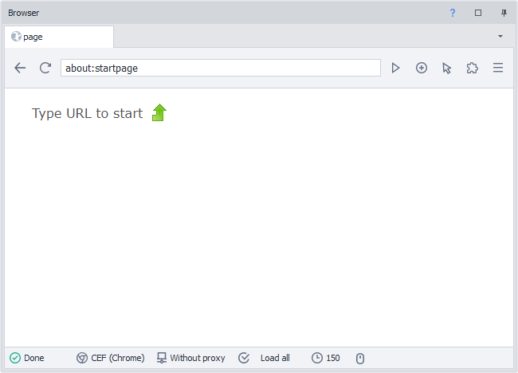

## Description

The browser window is one of the main elements in ProjectMaker for building website automation templates. Essentially, a browser window is an instance of a browser with additional tools to make your project development easier and faster.

The window consists of top and bottom toolbars and the main viewing area or workspace of the browser. In many ways, the functionality and usage of this window are similar to a regular browser.

## Tools

Let's look at all the tools available in the browser window.

### Open Tabs Area

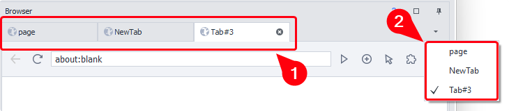

The panel (1) displays all browser tabs currently open. By clicking the button on the right side of the panel (2), you can open a list for quick navigation among the tabs.

You can create, activate, and close tabs via the action [❗→ Manage Browser Tab](https://zennolab.atlassian.net/wiki/spaces/RU/pages/534020201 "https://zennolab.atlassian.net/wiki/spaces/RU/pages/534020201")

### “Back” Button

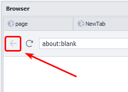

This is used to navigate back through your browsing history and returns you to the previous page. You can achieve the same with code:
C#: `instance.ActiveTab.GoBack();`
JS: `history.back();`

### “Refresh” Button

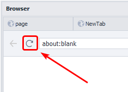

Reloads the current page. While the page is loading, the icon changes to a cross; clicking it can stop the loading process.

### Address Bar

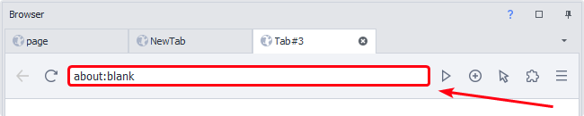

A field for entering, editing, and displaying the page URL. It works just like the address bar in regular browsers.

### Go to Page

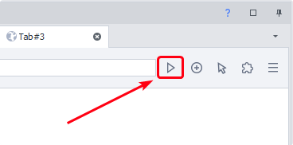

Confirms navigation to the URL entered in the address bar. The same thing happens if you simply press ENTER.

The main way to open a link in the browser is using the action [❗→ Go To Page (Open Page/Navigate)](https://zennolab.atlassian.net/wiki/spaces/RU/pages/534052989 "https://zennolab.atlassian.net/wiki/spaces/RU/pages/534052989")

### Open a New Tab

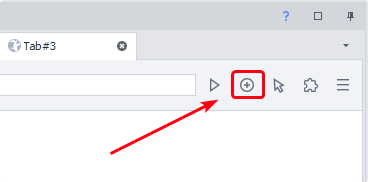

Opens a modal window where you can enter the name of the new tab. You can do the same with the "cube" [❗→ Manage Browser Tab](https://zennolab.atlassian.net/wiki/spaces/RU/pages/534020201 "https://zennolab.atlassian.net/wiki/spaces/RU/pages/534020201")

### Input Mode

Switches the input mode between “mouse” and “touch.” It mainly serves one purpose: in “touch” mode, when recording is enabled, blocks with [❗→ touch events](https://zennolab.atlassian.net/wiki/spaces/RU/pages/735674386/Touch "https://zennolab.atlassian.net/wiki/spaces/RU/pages/735674386/Touch") are created, and vice versa.

### Extensions

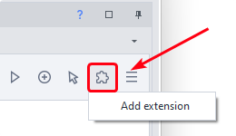

Allows you to interact with installed extensions (Activate, Settings, Details, Remove). You can also install new extensions via crx files.

You can read more about working with extensions in the article [❗→ Working with Extensions](https://zennolab.atlassian.net/wiki/spaces/RU/pages/2081423361 "https://zennolab.atlassian.net/wiki/spaces/RU/pages/2081423361")

### Web Developer Tools

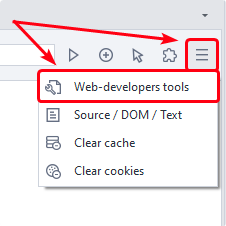

Opens the [❗→ Web Developer Tools window](https://zennolab.atlassian.net/wiki/spaces/RU/pages/1331134465 "https://zennolab.atlassian.net/wiki/spaces/RU/pages/1331134465") similar to the one in Chrome. This is used for advanced work with the DOM, applications, and page traffic.

:::warning Attention
This window opens for the currently active tab!
:::

### View Page Source

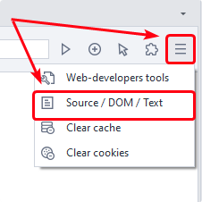

[❗→ Opens the page source window](https://zennolab.atlassian.net/wiki/spaces/RU/pages/735903769 "https://zennolab.atlassian.net/wiki/spaces/RU/pages/735903769"), showing the DOM and page text for the active tab. You can also get the DOM, page source, and text via project environment variables:

`{ -Page.Dom- }`
`{ -Page.Source- }`
`{ -Page.Text- }`

### Clear Cache

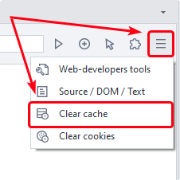

Provides quick access to functionality similar to the corresponding "cube"—it clears all browser cache. You can also clear cache using the action [❗→ Clear Cache](https://zennolab.atlassian.net/wiki/spaces/RU/pages/489324572 "https://zennolab.atlassian.net/wiki/spaces/RU/pages/489324572").

### Clear Cookies

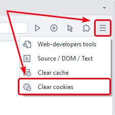

Provides quick access to the same functionality as the corresponding cube—it clears all instance cookies. You can also perform this using the action [❗→ Clear Cookies](https://zennolab.atlassian.net/wiki/spaces/RU/pages/489324572 "https://zennolab.atlassian.net/wiki/spaces/RU/pages/489324572").

:::info Info
In ZennoPoster 7.3.1.0, a new action was added for working with cookies, which allows you not only to clear, but also to load and save cookies in various formats.
:::

### Page Loading Status Indicator

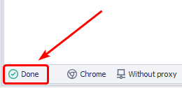

It has three states:

- **Ready** – when fully loaded;
- **Loading** – while loading;
- **Finishing Up** – loading data with scripts and plugins.

### Current Browser Type

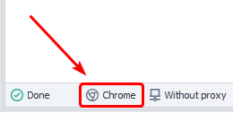

Shows the browser type set for the instance.

You can change the browser type in several ways:

- globally, for all new projects through [❗→ program settings](https://zennolab.atlassian.net/wiki/spaces/RU/pages/808845378#%D0%91%D1%80%D0%B0%D1%83%D0%B7%D0%B5%D1%80-%D0%BF%D0%BE-%D1%83%D0%BC%D0%BE%D0%BB%D1%87%D0%B0%D0%BD%D0%B8%D1%8E "https://zennolab.atlassian.net/wiki/spaces/RU/pages/808845378#%D0%91%D1%80%D0%B0%D1%83%D0%B7%D0%B5%D1%80-%D0%BF%D0%BE-%D1%83%D0%BC%D0%BE%D0%BB%D1%87%D0%B0%D0%BD%D0%B8%D1%8E");
- in the [❗→ current project settings](https://zennolab.atlassian.net/wiki/spaces/RU/pages/534315477#%D0%A2%D0%B8%D0%BF-%D0%B1%D1%80%D0%B0%D1%83%D0%B7%D0%B5%D1%80%D0%B0 "https://zennolab.atlassian.net/wiki/spaces/RU/pages/534315477#%D0%A2%D0%B8%D0%BF-%D0%B1%D1%80%D0%B0%D1%83%D0%B7%D0%B5%D1%80%D0%B0");
- via the action [❗→ Browser=&gt;Settings=&gt;Start Instance](https://zennolab.atlassian.net/wiki/spaces/RU/pages/489324572#%D0%97%D0%B0%D0%BF%D1%83%D1%81%D1%82%D0%B8%D1%82%D1%8C-%D0%B8%D0%BD%D1%81%D1%82%D0%B0%D0%BD%D1%81 "https://zennolab.atlassian.net/wiki/spaces/RU/pages/489324572#%D0%97%D0%B0%D0%BF%D1%83%D1%81%D1%82%D0%B8%D1%82%D1%8C-%D0%B8%D0%BD%D1%81%D1%82%D0%B0%D0%BD%D1%81") you can change the browser type while running a project.

### Browser Proxy

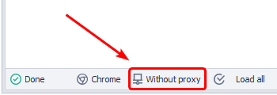

Shows the current proxy.

Starting from version 7.3.2.0, you can also set the proxy by simply clicking this button.

You can also set a proxy via [❗→ Profile Window](https://zennolab.atlassian.net/wiki/spaces/RU/pages/735903758#%D0%92%D0%BA%D0%BB%D0%B0%D0%B4%D0%BA%D0%B0-%E2%80%9C%D0%91%D1%80%D0%B0%D1%83%D0%B7%D0%B5%D1%80%E2%80%9D "https://zennolab.atlassian.net/wiki/spaces/RU/pages/735903758#%D0%92%D0%BA%D0%BB%D0%B0%D0%B4%D0%BA%D0%B0-%E2%80%9C%D0%91%D1%80%D0%B0%D1%83%D0%B7%D0%B5%D1%80%E2%80%9D"), or with the “**Browser**“ cube → “**Settings**“ → “[❗→ **Set Proxy**](https://zennolab.atlassian.net/wiki/spaces/RU/pages/489324572#%D0%A3%D1%81%D1%82%D0%B0%D0%BD%D0%BE%D0%B2%D0%B8%D1%82%D1%8C-%D0%BF%D1%80%D0%BE%D0%BA%D1%81%D0%B8 "https://zennolab.atlassian.net/wiki/spaces/RU/pages/489324572#%D0%A3%D1%81%D1%82%D0%B0%D0%BD%D0%BE%D0%B2%D0%B8%D1%82%D1%8C-%D0%BF%D1%80%D0%BE%D0%BA%D1%81%D0%B8")“.

### Content Loading Rules

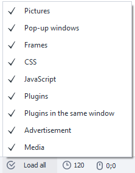

Opens a dropdown list where you can use checkboxes to allow/deny certain types of content to load. You can do the same via the “**Project Settings**” button → “[❗→ **Browser**](https://zennolab.atlassian.net/wiki/spaces/RU/pages/534315477 "https://zennolab.atlassian.net/wiki/spaces/RU/pages/534315477")” or with cubes: “**Add Action**” → “**Browser**” → “**Settings**” → “[❗→ **Images**”/“**Media**”/“**Ads**”/“**Style Loading**”/“**JavaScript**”/“**Popup Blocker**](https://zennolab.atlassian.net/wiki/spaces/RU/pages/489324572 "https://zennolab.atlassian.net/wiki/spaces/RU/pages/489324572")”

For example, you can disable images and CSS styles for faster resource loading.

### Set Timeout

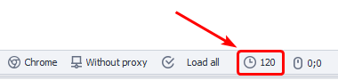

Opens a window where you can set the time in seconds for ZennoPoster to wait for the active tab to fully load.
You can also set a timeout using the action “**Add Action**” → “**Tab**” → “[❗→ **Settings**](https://zennolab.atlassian.net/wiki/spaces/RU/pages/534020228/ "https://zennolab.atlassian.net/wiki/spaces/RU/pages/534020228/")”

### Mouse Cursor Coordinates

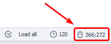

Shows the X and Y mouse coordinates in pixels. The coordinates (0;0) are at the top left of the workspace. This helps you quickly determine the location of HTML elements on the page.

## Context Menu

Unlike other browsers, the browser in ProjectMaker has a completely different context menu, which you can open by right-clicking in the browser workspace.

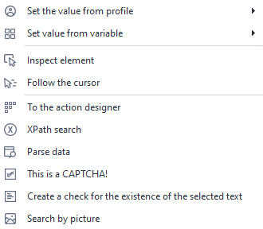

### Set Value from Profile (Variable)

These options appear when you open the context menu on a text field.
They let you quickly paste text from the [❗→ profile](https://zennolab.atlassian.net/wiki/spaces/RU/pages/1976762378/ZennoPoster#%D0%9F%D1%80%D0%BE%D1%84%D0%B8%D0%BB%D1%8C "https://zennolab.atlassian.net/wiki/spaces/RU/pages/1976762378/ZennoPoster#%D0%9F%D1%80%D0%BE%D1%84%D0%B8%D0%BB%D1%8C") or from a [❗→ project variable](https://zennolab.atlassian.net/wiki/spaces/RU/pages/486309922 "https://zennolab.atlassian.net/wiki/spaces/RU/pages/486309922").

### Inspect Element

This opens the [❗→ element tree window](https://zennolab.atlassian.net/wiki/spaces/RU/pages/727777355 "https://zennolab.atlassian.net/wiki/spaces/RU/pages/727777355") and the [❗→ element properties window](https://zennolab.atlassian.net/wiki/spaces/RU/pages/735608879 "https://zennolab.atlassian.net/wiki/spaces/RU/pages/735608879"). There, you can study the document structure and the parameters of the selected HTML element in detail. Afterwards, you can move it to the [❗→ action builder](https://zennolab.atlassian.net/wiki/spaces/RU/pages/483426337/XPath "https://zennolab.atlassian.net/wiki/spaces/RU/pages/483426337/XPath") to perform actions like ([❗→ click](https://zennolab.atlassian.net/wiki/spaces/RU/pages/534020211 "https://zennolab.atlassian.net/wiki/spaces/RU/pages/534020211"), [❗→ set value](https://zennolab.atlassian.net/wiki/spaces/RU/pages/534315117 "https://zennolab.atlassian.net/wiki/spaces/RU/pages/534315117"), [❗→ get value](https://zennolab.atlassian.net/wiki/spaces/RU/pages/534315124 "https://zennolab.atlassian.net/wiki/spaces/RU/pages/534315124")).

### Follow Cursor

When you select “Follow Cursor” mode and move your mouse over the page, an outline will appear around HTML elements (if this [❗→ is not disabled in the program settings](https://zennolab.atlassian.net/wiki/spaces/RU/pages/727777290#%D0%92%D1%8B%D0%B4%D0%B5%D0%BB%D1%8F%D1%82%D1%8C-%D1%82%D0%B5%D0%BA%D1%83%D1%89%D0%B8%D0%B9-%D1%8D%D0%BB%D0%B5%D0%BC%D0%B5%D0%BD%D1%82-%D0%B2-%D0%B1%D1%80%D0%B0%D1%83%D0%B7%D0%B5%D1%80%D0%B5 "https://zennolab.atlassian.net/wiki/spaces/RU/pages/727777290#%D0%92%D1%8B%D0%B4%D0%B5%D0%BB%D1%8F%D1%82%D1%8C-%D1%82%D0%B5%D0%BA%D1%83%D1%89%D0%B8%D0%B9-%D1%8D%D0%BB%D0%B5%D0%BC%D0%B5%D0%BD%D1%82-%D0%B2-%D0%B1%D1%80%D0%B0%D1%83%D0%B7%D0%B5%D1%80%D0%B5")). And you can check their properties live in the [❗→ relevant window](https://zennolab.atlassian.net/wiki/spaces/RU/pages/735608879 "https://zennolab.atlassian.net/wiki/spaces/RU/pages/735608879").

### To Action Builder

[❗→ Action Builder and XPath Search](https://zennolab.atlassian.net/wiki/spaces/RU/pages/483426337 "https://zennolab.atlassian.net/wiki/spaces/RU/pages/483426337") 

### XPath Search

This opens the [❗→ action builder](https://zennolab.atlassian.net/wiki/spaces/RU/pages/483426337/ "https://zennolab.atlassian.net/wiki/spaces/RU/pages/483426337/") with search mode enabled for finding HTML elements using [❗→ XPath](https://zennolab.atlassian.net/wiki/spaces/RU/pages/862093419 "https://zennolab.atlassian.net/wiki/spaces/RU/pages/862093419").

### Parse Data

[❗→ Parse Data](https://zennolab.atlassian.net/wiki/spaces/RU/pages/534053279 "https://zennolab.atlassian.net/wiki/spaces/RU/pages/534053279") 

### This is a Captcha!

This menu item appears when you open the context menu for an image. This element is marked as a captcha, and the corresponding [❗→ action](https://zennolab.atlassian.net/wiki/spaces/RU/pages/534053026 "https://zennolab.atlassian.net/wiki/spaces/RU/pages/534053026") is placed onto the action canvas.

:::warning Attention
Works only with simple text captchas!
:::

### Create Check for Selected Text

Starting with version 7.3.1.0 and above – [❗→ Check for Text Presence](https://zennolab.atlassian.net/wiki/spaces/RU/pages/1308426253 "https://zennolab.atlassian.net/wiki/spaces/RU/pages/1308426253")

Up to version 7.3.1.0 – [❗→ Create Check for Selected Text](https://zennolab.atlassian.net/wiki/spaces/RU/pages/534053296 "https://zennolab.atlassian.net/wiki/spaces/RU/pages/534053296")

### Image Search

[❗→ Image Search](https://zennolab.atlassian.net/wiki/spaces/RU/pages/492044304 "https://zennolab.atlassian.net/wiki/spaces/RU/pages/492044304") 

## Useful Links

- [❗→ View Page Text](/wiki/spaces/RU/pages/735903769)
 - [❗→ Action Builder and XPath Search](/wiki/spaces/RU/pages/483426337/XPath)
 - [❗→ Parse Data](/wiki/spaces/RU/pages/534053279)
 - [❗→ Create Check for Selected Text](/wiki/spaces/RU/pages/534053296)
 - [❗→ Image Search](/wiki/spaces/RU/pages/492044304)
 - [❗→ Web Developer Tools (DevTools)](/wiki/spaces/RU/pages/1331134465/web-+DevTools)
 - [❗→ Font Emulation](/wiki/spaces/RU/pages/2131066881)