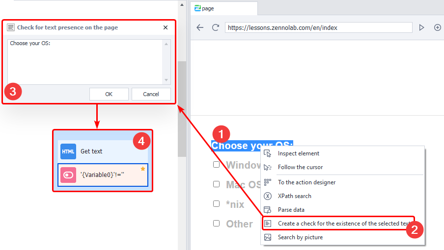
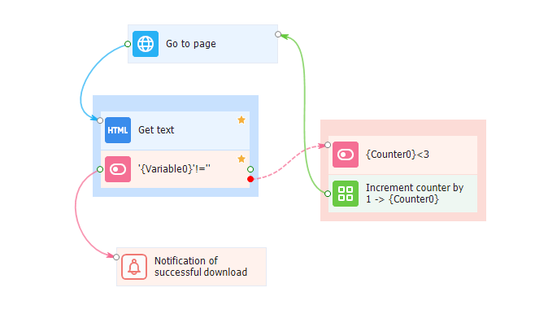

---
sidebar_position: 4
title: "Create Selected Text Presence Check"
description: ""
date: "2025-08-18"
converted: true
originalFile: "Создать проверку наличия выделенного текста.txt"
targetUrl: "https://zennolab.atlassian.net/wiki/spaces/RU/pages/534053296"
---
:::info **Please read the [*Terms of Use for materials on this resource*](../Disclaimer).**
:::

> 🔗 **[Original page](https://zennolab.atlassian.net/wiki/spaces/RU/pages/534053296)** — Source of this material

_______________________________________________  

## Description

As you might guess, this action is used to check whether a specific text exists on a page or not.

This is not a separate action, but a group of actions:

1. Search for the specified text using the [❗→ Data](https://zennolab.atlassian.net/wiki/spaces/RU/pages/534085840 "https://zennolab.atlassian.net/wiki/spaces/RU/pages/534085840") action
2. Check using [❗→ if](https://zennolab.atlassian.net/wiki/spaces/RU/pages/534315151 "https://zennolab.atlassian.net/wiki/spaces/RU/pages/534315151") whether anything was found or not

:::info Information
This is a legacy function. Starting from ZennoPoster 7.3.1.0, a new action is used — Text Presence Check
:::

  

## How to add this action to your project?

1. In ProjectMaker’s browser, select the text you want to check for.
2. Right-click on the selected text and choose the *Create Selected Text Presence Check* option.
3. A dialog window will appear to verify that the selected text was taken correctly. If everything is correct, click OK. You can edit the text in this window.
4. Two actions will be created automatically — [❗→ *Get tab text*](https://zennolab.atlassian.net/wiki/spaces/RU/pages/534085840 "https://zennolab.atlassian.net/wiki/spaces/RU/pages/534085840") and a logic check [❗→ *if*](https://zennolab.atlassian.net/wiki/spaces/RU/pages/534315151 "https://zennolab.atlassian.net/wiki/spaces/RU/pages/534315151").

If the required text is found on the page, the *if* block will succeed (go through the green branch); otherwise, it will trigger an error (red branch).

:::warning Attention
Always double-check that this action works correctly: both when the text is present and when it's not. There are cases where the text isn't visible, but this action still finds it and the green branch is triggered. This happens because of the particular layout of the specific site — the text is hidden from the user, but the program can “see” it.
:::

  

## What is it used for?

Catching errors, or conversely, confirming the success of a specific action.

- During registration
- During posting
- When loading a page
- When solving captchas

  

## Example usage

Checking for successful page load.

Problem: The website does not always load correctly (especially if you are using low-quality [❗→ proxies](https://zennolab.atlassian.net/wiki/spaces/RU/pages/492208129 "https://zennolab.atlassian.net/wiki/spaces/RU/pages/492208129")) — the page might not load (it will be blank or white), or you might get an HTTP error (404, 403, 503, etc.).

Possible solution: Find static text on the page (that never changes) and, after navigating to the site, search for that text on the page. If the text is not found, then the page didn’t load properly. In this case, using a [❗→ loop](https://zennolab.atlassian.net/wiki/spaces/RU/pages/489259031 "https://zennolab.atlassian.net/wiki/spaces/RU/pages/489259031") and a [❗→ page navigation block](https://zennolab.atlassian.net/wiki/spaces/RU/pages/534052989/Navigate "https://zennolab.atlassian.net/wiki/spaces/RU/pages/534052989/Navigate"), you can try reloading the page several times, each time checking for the required text.

  

## Useful links

- [❗→ Regular Expressions Tester](https://zennolab.atlassian.net/wiki/spaces/RU/pages/534086111 "https://zennolab.atlassian.net/wiki/spaces/RU/pages/534086111")
- [❗→ IF (If ... then ... condition)](https://zennolab.atlassian.net/wiki/spaces/RU/pages/534315151 "https://zennolab.atlassian.net/wiki/spaces/RU/pages/534315151")
- [❗→ Data (tab operations)](https://zennolab.atlassian.net/wiki/spaces/RU/pages/534085840 "https://zennolab.atlassian.net/wiki/spaces/RU/pages/534085840")