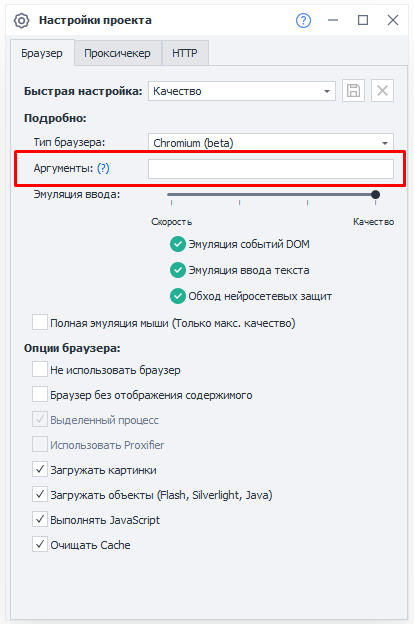
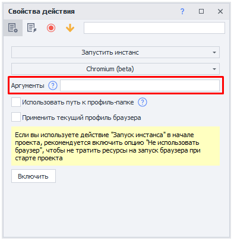

---
sidebar_position: 7
title: "Font Emulation"
description: ""
date: "2025-08-18"
converted: true
originalFile: "Эмуляция шрифтов.txt"
targetUrl: "https://zennolab.atlassian.net/wiki/spaces/RU/pages/2131066881"
---
:::info **Please review the [*Guidelines for using materials on this site*](../Disclaimer).**
:::

> 🔗 **[Original page](https://zennolab.atlassian.net/wiki/spaces/RU/pages/2131066881)** — Source of this material

_______________________________________________  
# Font Emulation

## What is this?

Allows you to set a list of fonts available to the browser.

## What is it used for?

This feature helps to improve the quality of browser emulation.

## How do I set up the font list?

You can set the font list by adding the `--zl-fonts-dir` argument when launching the browser. This argument specifies the directory from which all found fonts will be used.

Examples:

- `--zl-fonts-dir=Z:\Fonts` - fonts will be loaded from `Z:\Fonts`.

If the argument is not set, system fonts will be used.

The specified directory must also contain at least one of the following fonts:

- Sans
- Arial
- MS UI Gothic
- Microsoft Sans Serif
- Segoe UI
- Calibri
- Times New Roman
- Courier New

## Where do I specify the browser launch argument?

There are two places where you can set the argument:

1. Static block - [❗→ Project Settings | Arguments](https://zennolab.atlassian.net/wiki/spaces/RU/pages/534315477#%D0%90%D1%80%D0%B3%D1%83%D0%BC%D0%B5%D0%BD%D1%82%D1%8B)

2. Action `Settings|Launch instance` - [❗→ Browser Settings | Arguments](https://zennolab.atlassian.net/wiki/spaces/RU/pages/489324572#%D0%90%D1%80%D0%B3%D1%83%D0%BC%D0%B5%D0%BD%D1%82%D1%8B)

## Where can I get a list of fonts?

You can download ready-made font packs from the internet. Examples of sets with download links:

- Clean Windows 10 Pro - [ru.zip](https://www.dropbox.com/s/jzigwy17p0v9z34/ru.zip?dl=0) and [en.zip](https://www.dropbox.com/s/jw2jzyuxtqddzx2/en.zip?dl=0)
- Windows 10 Pro + Office - [ru.zip](https://www.dropbox.com/s/4fyudzexzp7pmpl/ru.zip?dl=0) and [en.zip](https://www.dropbox.com/s/5n46v94h2nweve1/en.zip?dl=0)
- Windows 10 Pro + VisualStudio 2022 - [ru.zip](https://www.dropbox.com/s/ertyj80yajtv333/ru.zip?dl=0) and [en.zip](https://www.dropbox.com/s/mhvb5pvqt0u0vqq/en.zip?dl=0)
- Windows 10 Pro + Office + VisualStudio 2022 - [ru.zip](https://www.dropbox.com/s/00pocd1edahsfrs/ru.zip?dl=0) and [en.zip](https://www.dropbox.com/s/foi7lb37cdt914u/en.zip?dl=0)

:::info Info
These font sets emulate a specific OS with installed programs. This means you do NOT need to have Windows 10 Pro installed to use them.
:::

Alternatively, you can create your own font set by installing and configuring Windows:

1. Install Windows on a virtual machine
2. Install the necessary set of applications, as some of them may add additional fonts to the system
3. Download the fonts used by this OS. Most of them are located at `C:\Windows\Fonts`
4. Copy them to the computer where ZennoPoster is installed to enable emulation