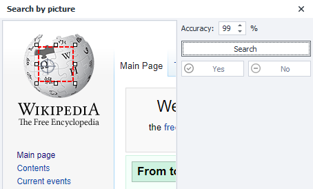
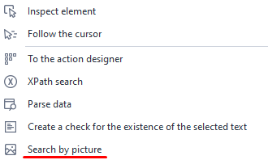
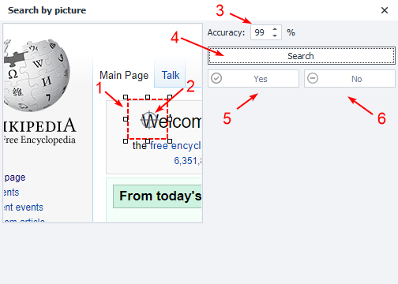
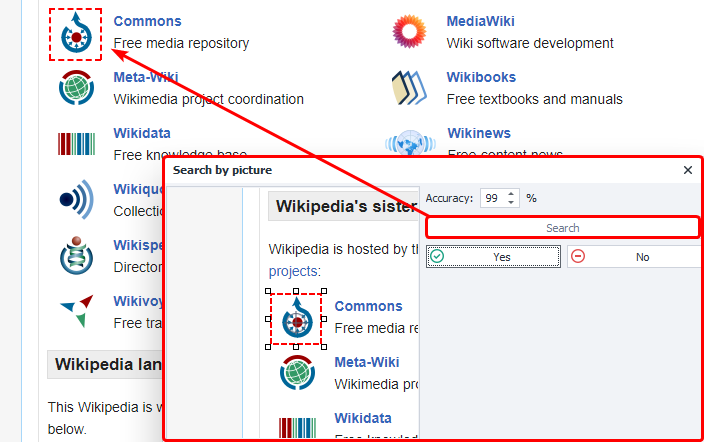
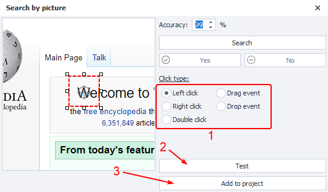
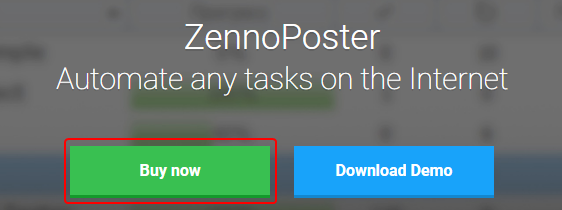
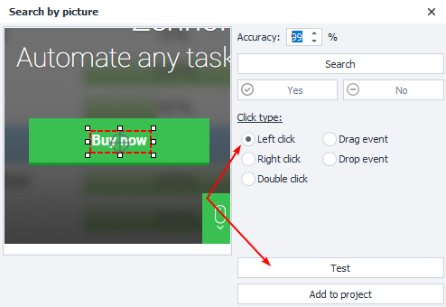
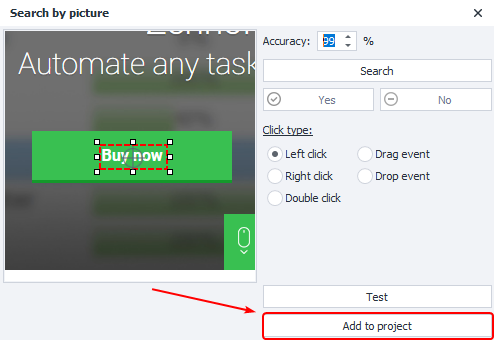
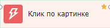
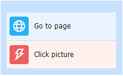

---
sidebar_position: 5
title: "Image Search"
description: ""
date: "2025-08-18"
converted: true
originalFile: "Поиск по картинке.txt"
targetUrl: "https://zennolab.atlassian.net/wiki/spaces/RU/pages/492044304"
---
import DisclaimerNotice from '@site/src/components/DisclaimerNotice';

<DisclaimerNotice />

> 🔗 **[Original page](https://zennolab.atlassian.net/wiki/spaces/RU/pages/492044304)** — Source of this material

_______________________________________________  

## Description

Allows you to click an element using visual search. It’s recommended to use this when it’s not possible to locate the element by other means, or if the element is drawn with Flash or [canvas](https://developer.mozilla.org/ru/docs/Web/API/Canvas_API "https://developer.mozilla.org/ru/docs/Web/API/Canvas_API").

:::warning Attention
This operation uses a lot of computer resources.
:::

  

## How to add to your project?

Hover your mouse over the element and call the context menu with the right mouse button.

  

## What is it used for?

- Clicking an element that can’t be accessed using the [❗→ Run Event](https://zennolab.atlassian.net/wiki/spaces/RU/pages/534020211 "https://zennolab.atlassian.net/wiki/spaces/RU/pages/534020211") action.

  

## How does the window work?

1. **Adjustable search area** – select a unique part of the element. If you’re selecting a button, you don’t need to select the entire thing, since it may contain a lot of uniform color.
2. **Click target** – sets the click location inside the search area, and can be moved.
3. **Match accuracy**.
4. **Search** – search for the element in the browser window.

:::info Info
After you click the Search button, the found element in the browser window will be highlighted with a red frame.
:::

5. **Yes** – if the element is found according to your criteria.

6. **No** – the search was incorrect, change the search parameters.

When the element is correctly detected, proceed to click settings.

1. Choose the *click type*.
2. Test execution in the browser window.
3. Add the configured action to your project.

Example

You need to click a button using image search.

In the browser window, open the search window and set a unique area.

**Unique area**

**Non-unique area**

The button contains a lot of solid color.

Set the click type—in this case, left mouse button—and test it in the browser window.

The click was successfully performed in the browser window—add the action to the project canvas.

All done, you can continue working with your project.

  

## Example use case

This can be useful in Flash games or applications, since there’s no way to access specific elements. For example, if you need to click a button in a Flash application, the algorithm will be as follows:

1. Go to the page and wait for it to fully load.
2. Hover your mouse over the element, open the context menu and select “Image Search”.
3. Set a unique image search area and specify click parameters.
4. Test in the browser window.
5. Add the action to your project.

  

## Useful links

- [❗→ Mouse Emulation](https://zennolab.atlassian.net/wiki/spaces/RU/pages/534315158 "https://zennolab.atlassian.net/wiki/spaces/RU/pages/534315158")
- [❗→ Browser Window](https://zennolab.atlassian.net/wiki/spaces/RU/pages/534315373 "https://zennolab.atlassian.net/wiki/spaces/RU/pages/534315373")