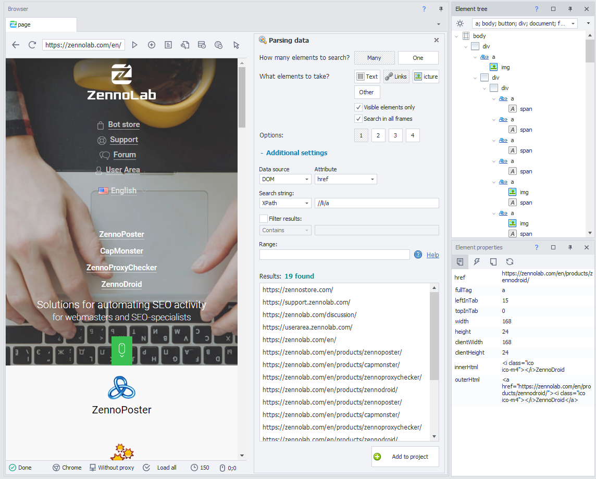
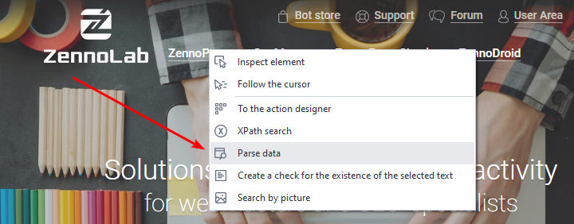
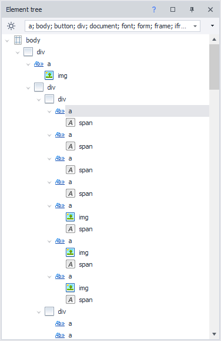
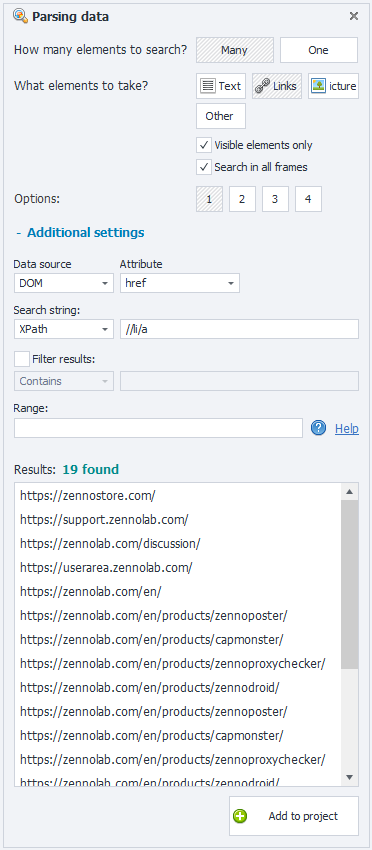
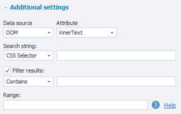
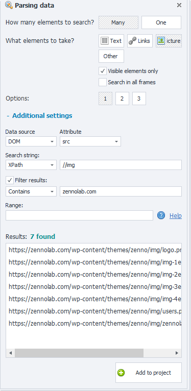

---
sidebar_position: 3
title: "Parse Data"
description: ""
date: "2025-08-18"
converted: true
originalFile: "Парсить данные.txt"
targetUrl: "https://zennolab.atlassian.net/wiki/spaces/RU/pages/534053279"
---
import DisclaimerNotice from '@site/src/components/DisclaimerNotice';

<DisclaimerNotice />

> 🔗 **[Original page](https://zennolab.atlassian.net/wiki/spaces/RU/pages/534053279)** — Source of this material

_______________________________________________  

## Description

ZennoPoster offers a lot of useful tools for analyzing and collecting data. One of them is “*Data Parsing,” which lets you, without any special knowledge, with just a few clicks and a wave of your hand, quickly set up the collection of the data you’re interested in from the current page.

  

## How do you open the Data Parsing window?

In the context menu of the browser window: “***Parse Data***”

In the context menu of the “***Element Tree***” → select the “***Parse Data***” item

  

## Detailed breakdown of the Data Parsing panel

This window is logically divided into two parts:

1. Quick Search
2. Advanced Search (with additional settings)

## Quick Search

### **How many are we looking for?**

One object or multiple objects.

### **What to grab?**

- **Text** – the visible representation of an object.
- **Links** – data in the form of a universal resource identifier.
- **Images** – data as the path to the image (e.g.: https://zennolab.com/wp-content/themes/zenno/img/logo.png).
- **Other** – select or specify the HTML tag you’re interested in.
- **Only visible elements** – parse only the objects that are currently displayed (visible) on the page.
- **Search in all frames** (aka frame) – an independent, nested HTML document, which may contain the data you need, or not.
- **Options** – [ 1 ], [ 2 ], [ 3 ], etc. – automatically suggested options based on possible matching conditions.

## Advanced Search

**+ Additional settings** are used for more flexible searching.

- **Data source** – the data structure as DOM or HTML ([❗→ difference between DOM and Html](https://zennolab.atlassian.net/wiki/spaces/RU/pages/534085840#%D0%A0%D0%B0%D0%B7%D0%BD%D0%B8%D1%86%D0%B0-%D0%BC%D0%B5%D0%B6%D0%B4%D1%83-Source-%D0%B8-Dom "https://zennolab.atlassian.net/wiki/spaces/RU/pages/534085840#%D0%A0%D0%B0%D0%B7%D0%BD%D0%B8%D1%86%D0%B0-%D0%BC%D0%B5%D0%B6%D0%B4%D1%83-Source-%D0%B8-Dom")).
- **Attribute** – property of an HTML tag (element, object).
- **Search string** – here you can specify a path that indicates exactly which element (or elements) of the web page you want to target, using query languages: *XPath or *CSS Selector.
- **Filter results** – filter the found items by condition, but put in the result only what: Contains, Does not contain, Regex ([❗→ regular expression](https://zennolab.atlassian.net/wiki/spaces/RU/pages/534086111 "https://zennolab.atlassian.net/wiki/spaces/RU/pages/534086111")).
- **Range** – [❗→ condition](https://zennolab.atlassian.net/wiki/spaces/RU/pages/488964137 "https://zennolab.atlassian.net/wiki/spaces/RU/pages/488964137") to select data from an array of objects.

### **Results**

A window where you can clearly see the preliminary data results for the selected condition.

  

## Add to Project

Once you’ve chosen all the necessary conditions and checked the result in the preview window, you need to click the ***Add to project*** button. Then, in the project workspace, there will appear an action “[❗→ *Parse Data*](https://zennolab.atlassian.net/wiki/spaces/RU/pages/534085857 "https://zennolab.atlassian.net/wiki/spaces/RU/pages/534085857"),” in which you ***<u data-renderer-mark="true">need to specify where to save the data obtained</u>***.

  

## Example usage

Requirement: Collect the addresses of all images from the active page of the current domain (in this example, the [official zennolab.com website](https://zennolab.com/en/ "https://zennolab.com/en/") is used).

Voilà! Quick and easy… We got the result we needed!

  

## Useful links

- [❗→ Action builder and XPath search](https://zennolab.atlassian.net/wiki/spaces/RU/pages/483426337 "https://zennolab.atlassian.net/wiki/spaces/RU/pages/483426337")
- [❗→ Element tree window](https://zennolab.atlassian.net/wiki/spaces/RU/pages/727777355 "https://zennolab.atlassian.net/wiki/spaces/RU/pages/727777355")
- [❗→ Element properties window](https://zennolab.atlassian.net/wiki/spaces/RU/pages/735608879 "https://zennolab.atlassian.net/wiki/spaces/RU/pages/735608879")
- [❗→ XPath](https://zennolab.atlassian.net/wiki/spaces/RU/pages/862093419 "https://zennolab.atlassian.net/wiki/spaces/RU/pages/862093419")