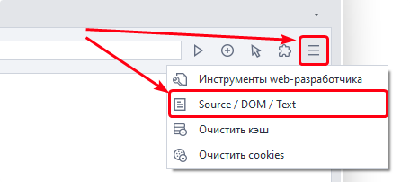
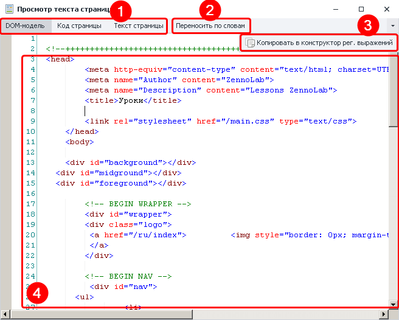
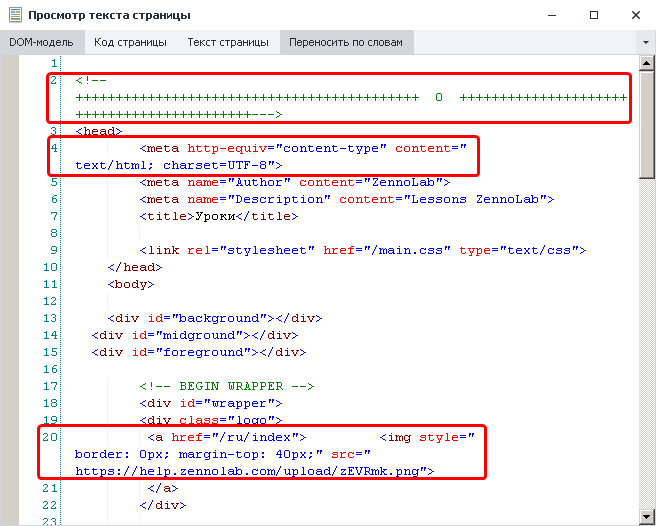
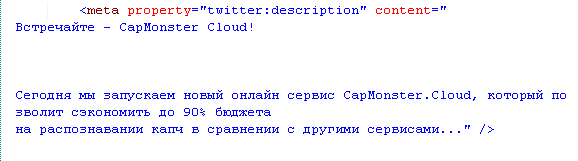
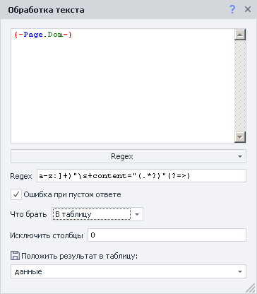
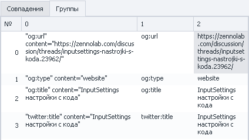

---
sidebar_position: 1
title: "Viewing Page Text"
description: ""
date: "2025-08-18"
converted: true
originalFile: "Просмотр текста страницы.txt"
targetUrl: "https://zennolab.atlassian.net/wiki/spaces/RU/pages/735903769"
---
:::info **Please read the [*Terms of Use for Materials on this Resource*](../Disclaimer).**
:::

> 🔗 **[Original page](https://zennolab.atlassian.net/wiki/spaces/RU/pages/735903769)** — source of this material

_______________________________________________  
# Viewing Page Text
  
## Description

With this tool, you can easily view the source code (Source), DOM model, and displayed text of the page loaded in the [❗→ browser](https://zennolab.atlassian.net/wiki/spaces/RU/pages/534315373 "https://zennolab.atlassian.net/wiki/spaces/RU/pages/534315373").

:::note Note
You can read about the difference between the DOM and the source code in the note Difference between Source and DOM
:::

:::note Note
If you're working in the Chrome engine, you can also use developer tools as an alternative
:::

  

## What is this used for?

This tool is useful when you need to better understand the structure of a page:

- Finding data so you can “attach” to an element for a [❗→ click](https://zennolab.atlassian.net/wiki/spaces/RU/pages/534020211 "https://zennolab.atlassian.net/wiki/spaces/RU/pages/534020211")/[❗→ get](https://zennolab.atlassian.net/wiki/spaces/RU/pages/534315124 "https://zennolab.atlassian.net/wiki/spaces/RU/pages/534315124")/[❗→ set](https://zennolab.atlassian.net/wiki/spaces/RU/pages/534315117 "https://zennolab.atlassian.net/wiki/spaces/RU/pages/534315117") value
- Parsing data you can’t access using the [❗→ action builder](https://zennolab.atlassian.net/wiki/spaces/RU/pages/483426337/.+XPath "https://zennolab.atlassian.net/wiki/spaces/RU/pages/483426337/.+XPath")
- Quickly copying source code, DOM, or text into the [❗→ Regex Tester](https://zennolab.atlassian.net/wiki/spaces/RU/pages/534086111 "https://zennolab.atlassian.net/wiki/spaces/RU/pages/534086111")

  

## How do you open the window?

The button to enable this window is to the right of the browser’s address bar.

  

## How to use the window?

When you click the icon, the window opens:

### Selecting content

Here, you need to select what you want to view: **DOM** (default), **source code**, or **visible text** on the page ([❗→ difference between Source and DOM](https://zennolab.atlassian.net/wiki/spaces/RU/pages/534085840#%D0%A0%D0%B0%D0%B7%D0%BD%D0%B8%D1%86%D0%B0-%D0%BC%D0%B5%D0%B6%D0%B4%D1%83-Source-%D0%B8-Dom "https://zennolab.atlassian.net/wiki/spaces/RU/pages/534085840#%D0%A0%D0%B0%D0%B7%D0%BD%D0%B8%D1%86%D0%B0-%D0%BC%D0%B5%D0%B6%D0%B4%D1%83-Source-%D0%B8-Dom")).

### Word wrap

When this option is enabled, if a line is too long, it will be wrapped to the next line instead of hidden outside the window boundary. Here's a screenshot of the same window but with this option enabled:

### Copy to Regex Builder

When you click this button, the [❗→ Regex Builder](https://zennolab.atlassian.net/wiki/spaces/RU/pages/534086111 "https://zennolab.atlassian.net/wiki/spaces/RU/pages/534086111") will open, and the window’s contents will be automatically copied there.

  

## Usage Example

Let’s say you need to parse `<meta>` tags with the `property` attribute from a [ZennoLab forum topic page](https://zennolab.com/discussion/threads/capmonster-cloud-novyj-servis-avtomaticheskogo-raspoznavanija-kapch.59736/ "https://zennolab.com/discussion/threads/capmonster-cloud-novyj-servis-avtomaticheskogo-raspoznavanija-kapch.59736/"). The [❗→ action builder](https://zennolab.atlassian.net/wiki/spaces/RU/pages/483426337 "https://zennolab.atlassian.net/wiki/spaces/RU/pages/483426337") can’t access them, since these tags aren’t displayed anywhere. Here’s what you do:

- Go to the required page
- Launch the code viewing window (in this case, you can use either DOM or source code; it won’t affect the result) and look for the required tags (there are several, but just one is shown here):

 All these tags have the same structure: they always start with `<meta property="` and end with `>` in quotes, immediately after `property,` is the property name, and in the `content` attribute is the value.
- Copy the content into the [❗→ Regex Builder](https://zennolab.atlassian.net/wiki/spaces/RU/pages/534086111 "https://zennolab.atlassian.net/wiki/spaces/RU/pages/534086111") using the button with the same name. Based on our analysis, we’ll create a regex: `(?<=<meta\ property=)"([a-z:]+)"\s+content="(.*?)"(?=>)`

- Using the [❗→ Text Processing](https://zennolab.atlassian.net/wiki/spaces/RU/pages/488865793 "https://zennolab.atlassian.net/wiki/spaces/RU/pages/488865793") action and its Regex functionality, pull the values you need from the page code and save them in a table:

A few notes on this screenshot:

- `{ -Page.Dom- }` — this variable stores the DOM of the tab. For source code, it’s `{ -Page.Source- }`, for text — `{ -Page.Text- }`. You can find others in the [❗→ variables window](https://zennolab.atlassian.net/wiki/spaces/RU/pages/735608872#%D0%9E%D0%BA%D1%80%D1%83%D0%B6%D0%B5%D0%BD%D0%B8%D0%B5 "https://zennolab.atlassian.net/wiki/spaces/RU/pages/735608872#%D0%9E%D0%BA%D1%80%D1%83%D0%B6%D0%B5%D0%BD%D0%B8%D0%B5").
- *Why was the column with index zero excluded?* The [❗→ regular expression](https://zennolab.atlassian.net/wiki/spaces/RU/pages/534086111 "https://zennolab.atlassian.net/wiki/spaces/RU/pages/534086111") used bracket grouping (**(?&lt;=&lt;meta\ property=)"([a-z:]+)"\s+content="(.\*?)"(?=&gt;)** — two groups highlighted in red). When testing in the Regex Builder, if you go to the *Groups* tab, you’ll notice three groups were found, even though we only have two: the very first group is the text of the *full* match, then come the groups you defined. Since numbering starts from zero, we exclude the column with index 0, not 1.

* * *

## Useful links

- [❗→ Regex Tester](https://zennolab.atlassian.net/wiki/spaces/RU/pages/534086111 "https://zennolab.atlassian.net/wiki/spaces/RU/pages/534086111")
- [❗→ XPath](https://zennolab.atlassian.net/wiki/spaces/RU/pages/862093419 "https://zennolab.atlassian.net/wiki/spaces/RU/pages/862093419")
- [❗→ Text Processing](https://zennolab.atlassian.net/wiki/spaces/RU/pages/488865793 "https://zennolab.atlassian.net/wiki/spaces/RU/pages/488865793")
- [❗→ 💻Browser window](https://zennolab.atlassian.net/wiki/spaces/RU/pages/534315373 "https://zennolab.atlassian.net/wiki/spaces/RU/pages/534315373")