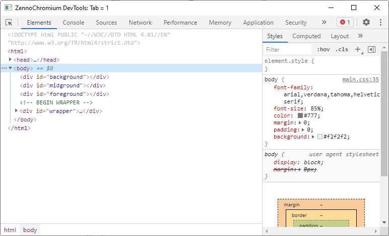
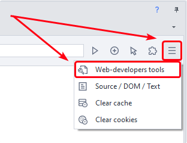
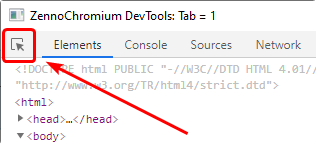
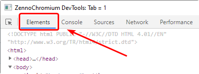
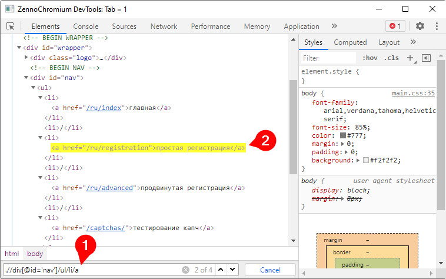
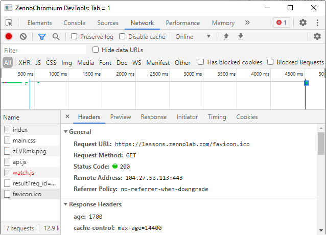

---
sidebar_position: 6
title: "Web Developer Tools (DevTools)"
description: ""
date: "2025-08-18"
converted: true
originalFile: "Инструменты web-разработчика (DevTools).txt"
targetUrl: "https://zennolab.atlassian.net/wiki/spaces/RU/pages/1331134465/web-+DevTools"
---
:::info **Please read the [*Material Usage Rules on this site*](../Disclaimer).**
:::

> 🔗 **[Original page](https://zennolab.atlassian.net/wiki/spaces/RU/pages/1331134465/web-+DevTools)** — Source of this material

_______________________________________________  

## Description

DevTools is a very powerful tool for working with HTML pages, analyzing requests, and debugging JavaScript.

:::warning Attention
Developer tools are available only for the Chrome engine.
:::

  

## How do you open the window?

You can open the window by clicking the corresponding button to the right of the address bar [❗→ browser](https://zennolab.atlassian.net/wiki/spaces/RU/pages/534315373 "https://zennolab.atlassian.net/wiki/spaces/RU/pages/534315373") ProjectMaker

  

## What is it used for?

- Interacting with the DOM model of the page (finding, removing, or modifying elements)
- Analyzing the [❗→ requests](https://zennolab.atlassian.net/wiki/spaces/RU/pages/534085713 "https://zennolab.atlassian.net/wiki/spaces/RU/pages/534085713") made by the page

  

## How to use

### Inspect Button

Click this button and hover your mouse over any element in the browser window—the element will be instantly highlighted on the *Elements* tab.

### Elements Tab

In this tab, you can analyze and modify the DOM of the current tab—change the HTML code of elements (remove or add attributes), or cut out portions of the elements.

#### Searching with XPath

You can use this window to test [❗→ XPath](https://zennolab.atlassian.net/wiki/spaces/RU/pages/862093419 "https://zennolab.atlassian.net/wiki/spaces/RU/pages/862093419") queries: open the *Elements* tab, press the `Ctrl+F` shortcut, and a search field will appear at the bottom of the window (1) (you can enter plain text, XPath, or CSS Selectors).
The matched elements will be highlighted immediately (2).

### Console Tab

Here you can write and debug JavaScript code. All code runs in the context of the current tab, so all modules, libraries, and objects loaded on the current page are available here.
Once the code is ready, you can run it using the [❗→ JavaScript Code](https://zennolab.atlassian.net/wiki/spaces/RU/pages/489259137 "https://zennolab.atlassian.net/wiki/spaces/RU/pages/489259137") action.

### Network Tab

Here you will see all requests made when the page loads. This can be very helpful when creating your own [❗→ requests](https://zennolab.atlassian.net/wiki/spaces/RU/pages/534085713 "https://zennolab.atlassian.net/wiki/spaces/RU/pages/534085713").

  

## Useful Links

- [Official documentation](https://developer.chrome.com/docs/devtools/ "https://developer.chrome.com/docs/devtools/") (in English)
- [Overview of all Chrome DevTools developer tools](https://habr.com/ru/company/simbirsoft/blog/337116/ "https://habr.com/ru/company/simbirsoft/blog/337116/") (Habr)
- [❗→ Traffic window](https://zennolab.atlassian.net/wiki/spaces/RU/pages/735805465 "https://zennolab.atlassian.net/wiki/spaces/RU/pages/735805465")