---
sidebar_position: 2
title: "Action Properties"
description: ""
date: "2025-08-18"
converted: true
originalFile: "Свойства действия.txt"
targetUrl: "https://zennolab.atlassian.net/wiki/spaces/RU/pages/494731280"
---
import DisclaimerNotice from '@site/src/components/DisclaimerNotice';

<DisclaimerNotice />

> 🔗 **[Original page](https://zennolab.atlassian.net/wiki/spaces/RU/pages/494731280)** — Source of this material

_______________________________________________  

## Description

While editing and debugging your project, you can modify any previously saved parameters of actions.

  

## How to open the window?

It depends on the mode in which your project is open.

- with browser:

 - you need to enable the display of this window via the *Window =&gt; *Action Properties* menu. This window will show the settings of the selected action.

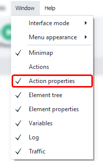

- without browser:

 - you need to double-click the action, and the properties window will open. In this mode, you can open the window for several actions at once:

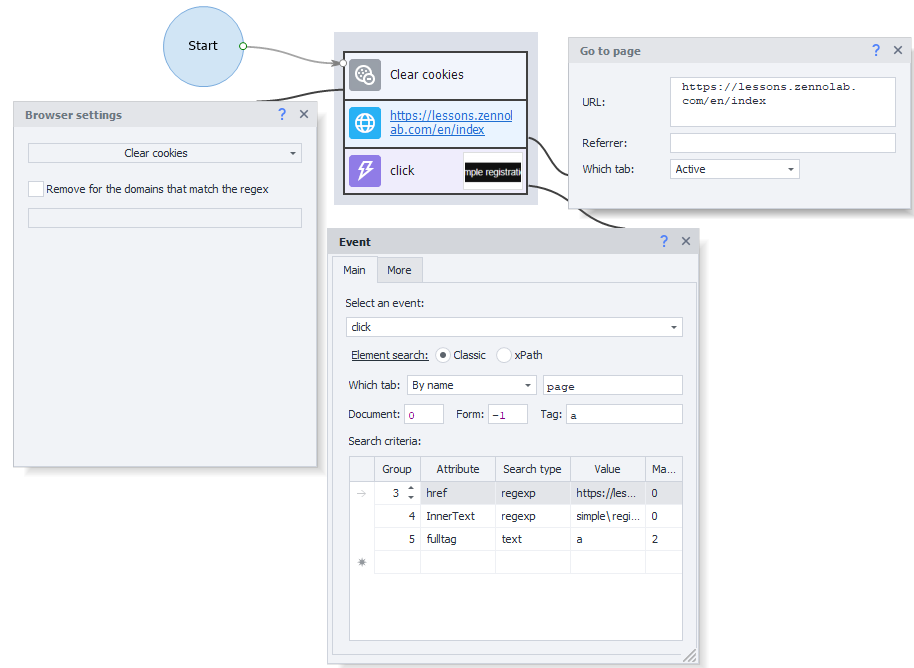

“With browser” mode

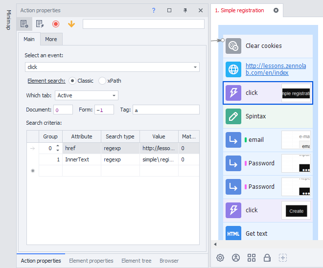

“Without browser” mode

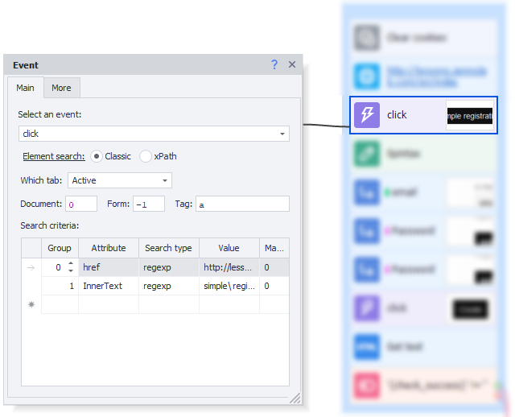

:::note Tip
In "With browser" mode, you can also open the properties window for several actions at once. To do this, go to Edit =&gt; Settings =&gt; Editor tab, and enable the option to Open multiple action settings in "With browser" mode.
:::

  

## The “Completed” Button

If you encounter an error while debugging an action, you can make real-time corrections to various parameters. The feature that lets you see what values variables had when the action ran will help you with this:

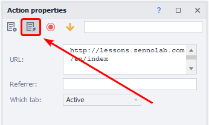

Once you activate this feature, [❗→ variables](https://zennolab.atlassian.net/wiki/spaces/RU/pages/735608872 "https://zennolab.atlassian.net/wiki/spaces/RU/pages/735608872") will be replaced with their stored values.

:::warning Attention
This will only work after the action has been executed.
:::

**Before activation**

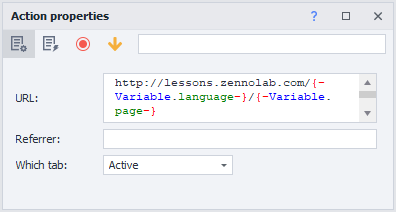

**After activation**

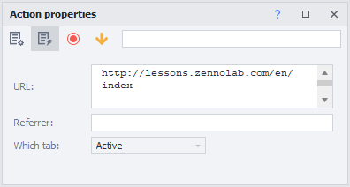

## Comment

For easier navigation within your project, you can add a comment to any action:

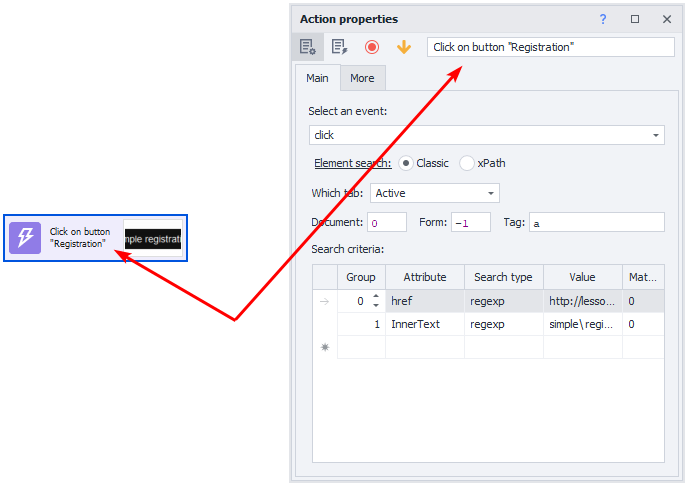

You can also change this text by right-clicking the action and selecting *Comment* from the context menu:

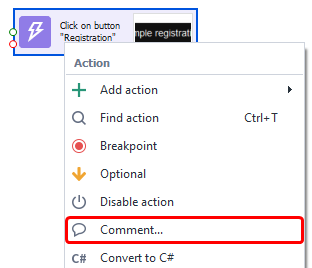

## Breakpoint

Allows you to pause the project at the selected action. This is very useful for debugging when you need to analyze the contents of variables or the page at a specific moment during the project's execution.

There are two ways to enable it: through the context menu, or from the action properties.

Context menu

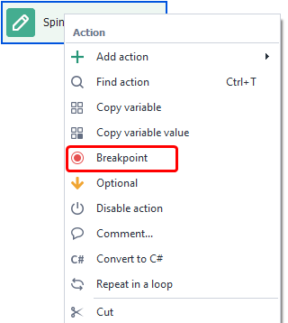

Action properties

Once enabled, a red circle icon will appear on the action:

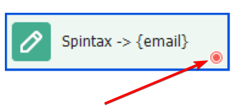

## Optional

When this option is enabled, the action will always follow the successful (green) branch, even if an error actually occurred.

Just like with the breakpoint, you can make an action optional in two ways: via the context menu or action properties.

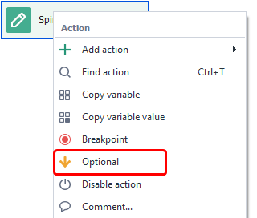

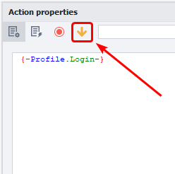

How it looks on the action:

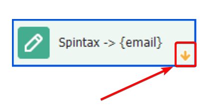