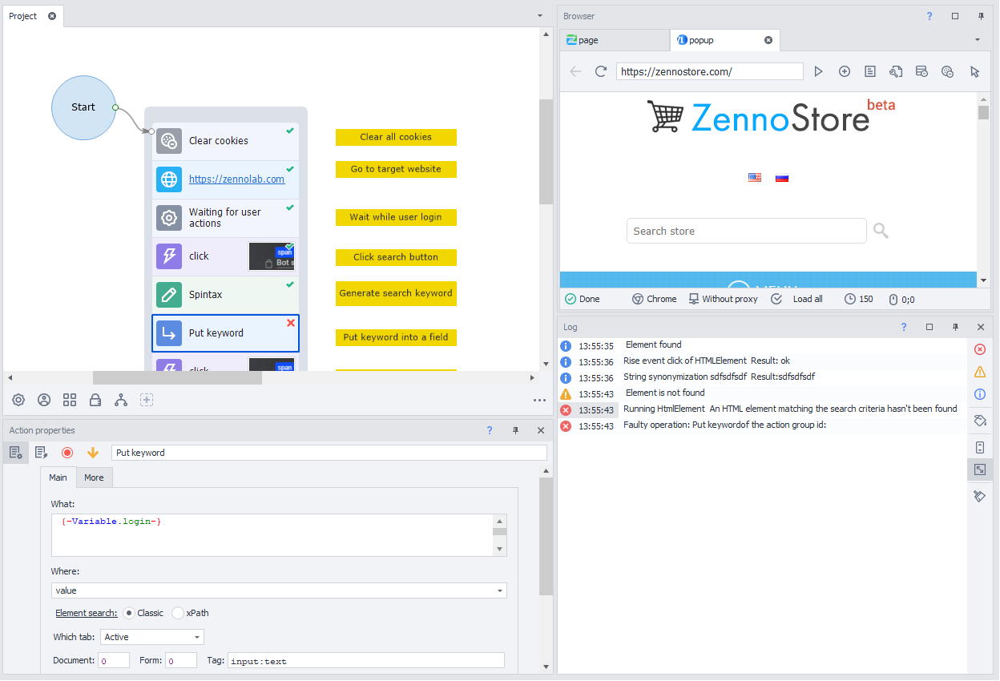
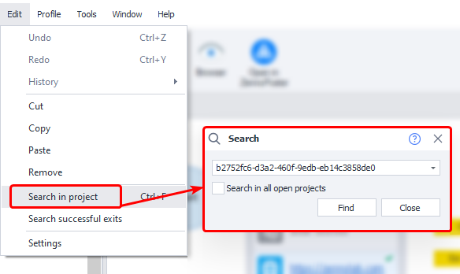

:::info **Please read the [*Material Usage Rules on this site*](../../Disclaimer).**
:::

> 🔗 **[Original page](https://zennolab.atlassian.net/wiki/spaces/RU/pages/494895107)** — Source of this material

_______________________________________________  

When you create and edit a template, you will most likely run into errors during debugging, when you need to adjust certain actions in your project. In this situation, [❗→ the log can help you](https://zennolab.atlassian.net/wiki/spaces/RU/pages/725352532 "https://zennolab.atlassian.net/wiki/spaces/RU/pages/725352532"), where all successful and failed actions are recorded.

If an error occurs, the line in the log will be highlighted in red.

To find the action that caused the error, just double-click on that line in the log, and the focus in the project will automatically be centered on that action.

You can also right-click on the line and copy the action's ID (this also works in the ZennoPoster log).

Once you know the action ID, you can easily [❗→ find it using search](https://zennolab.atlassian.net/wiki/spaces/RU/pages/724566074 "https://zennolab.atlassian.net/wiki/spaces/RU/pages/724566074"):

Once you've found the action that triggered the error, you can [❗→ fix its settings](https://zennolab.atlassian.net/wiki/spaces/RU/pages/494731280 "https://zennolab.atlassian.net/wiki/spaces/RU/pages/494731280") and start debugging [❗→ from that exact spot](https://zennolab.atlassian.net/wiki/spaces/RU/pages/494731265/1#%D0%A1-%D0%BA%D1%83%D1%80%D1%81%D0%BE%D1%80%D0%B0 "https://zennolab.atlassian.net/wiki/spaces/RU/pages/494731265/1#%D0%A1-%D0%BA%D1%83%D1%80%D1%81%D0%BE%D1%80%D0%B0").