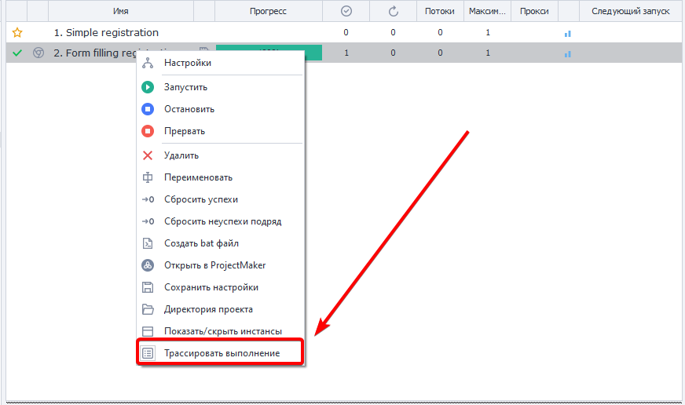

---
sidebar_position: 5
title: "Project Tracing"
description: ""
date: "2025-08-18"
converted: true
originalFile: "Трассировка проектов.txt"
targetUrl: "https://zennolab.atlassian.net/wiki/spaces/RU/pages/494829586"
---
:::info **Please read the [*Rules for Using Materials on This Resource*](../Disclaimer).**
:::

> 🔗 **[Original page](https://zennolab.atlassian.net/wiki/spaces/RU/pages/494829586)** — Source of this material

_______________________________________________  
# Project Tracing

This feature can be helpful when debugging projects, measuring the execution speed of actions, finding where a project hangs, and other tasks related to analyzing how projects work in ZennoPoster.

You can enable execution tracing in the task's context menu:




Tracing begins working immediately after it is enabled, recording the current action and then proceeding in order.

### File save location for results

The files are located in your user directory: C:\Users\&lt;USERNAME&gt;\Documents\ZennoLab\Traces and are organized by task.

### The log format is as follows

&lt;Event Time&gt;|&lt;Message Status&gt;|&lt;Action ID&gt;|&lt;Execution Time (ms)&gt;

### Possible message statuses

**Info** - informational message;  
**In** - indicates the start of executing the action with the specified ID;  
**Good** - successful execution of the action with the specified ID, moving to the green branch;  
**Bad** - unsuccessful execution of the action with the specified ID, moving to the red branch.

### Example contents of a trace file

```23-02-2021 06:08:59.3600|Info|---Project Start Execute---|
23-02-2021 06:09:17.9110|In |cca-1035|
23-02-2021 06:09:20.5203|Good|cca-1035|2520
23-02-2021 06:09:20.5525|In |8c7d7d95-d574-43a5-a677-6ebc17490caf|
23-02-2021 06:09:27.3366|Good|8c7d7d95-d574-43a5-a677-6ebc17490caf|6721
23-02-2021 06:09:27.3571|In |03aa3431-0d85-4374-ad32-2821d22f1674|
23-02-2021 06:09:27.3708|Good|03aa3431-0d85-4374-ad32-2821d22f1674|3
23-02-2021 06:09:27.3893|In |re-2884|
23-02-2021 06:09:28.3229|Good|re-2884|918
23-02-2021 06:09:28.3356|In |00b6f04c-711c-4362-9404-f8fb2fdf5a51|
23-02-2021 06:09:28.3463|Good|00b6f04c-711c-4362-9404-f8fb2fdf5a51|0
23-02-2021 06:09:28.3571|In |re-4835|
23-02-2021 06:09:29.0290|Good|re-4835|661
23-02-2021 06:09:29.0455|In |67c9448b-ebbe-4f54-8206-868f8ddc38c3|
23-02-2021 06:09:29.0612|Good|67c9448b-ebbe-4f54-8206-868f8ddc38c3|2
23-02-2021 06:09:29.3509|Info|---Project Executed---|
```

### Example usage

Sometimes a task may get stuck on a certain action, and visually there's no way to tell which action is causing the problem. In this case, you just need to enable tracing for the task, and the current action will immediately be recorded to the file.