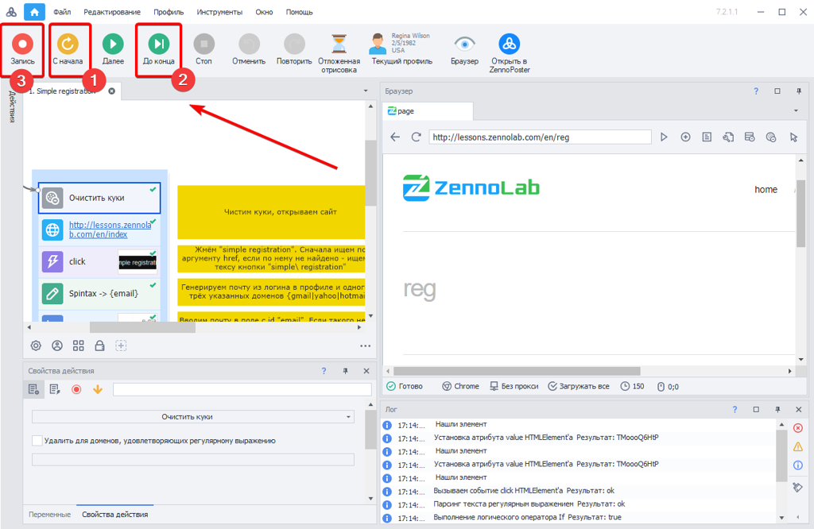

---
sidebar_position: 4
title: "Re-recording Problematic Sections"
description: ""
date: "2025-08-18"
converted: true
originalFile: "Дозапись проблемных участков.txt"
targetUrl: "https://zennolab.atlassian.net/wiki/spaces/RU/pages/494731287"
---
:::info **Please review the [*Rules for Using Materials on This Resource*](../Disclaimer).**
:::

> 🔗 **[Original page](https://zennolab.atlassian.net/wiki/spaces/RU/pages/494731287)** — Source of this material

_______________________________________________  
# Re-recording Problematic Sections

Sometimes, a site you previously worked with might change the structure or code of its pages, and your template will no longer run successfully.

In such cases, you have the option to add new actions without changing the main structure of the template.

To do this, open the template and run it **From the Beginning** (1) up to the breakpoint or by clicking **To the End** (2) (in this case, execution will stop at the first breakpoint). If an error occurs (for example, an element's attributes have changed, or the element is no longer on the page), you can click **Record** (3) in real time and record new actions instead of the old ones that, for some reason, no longer work correctly.

