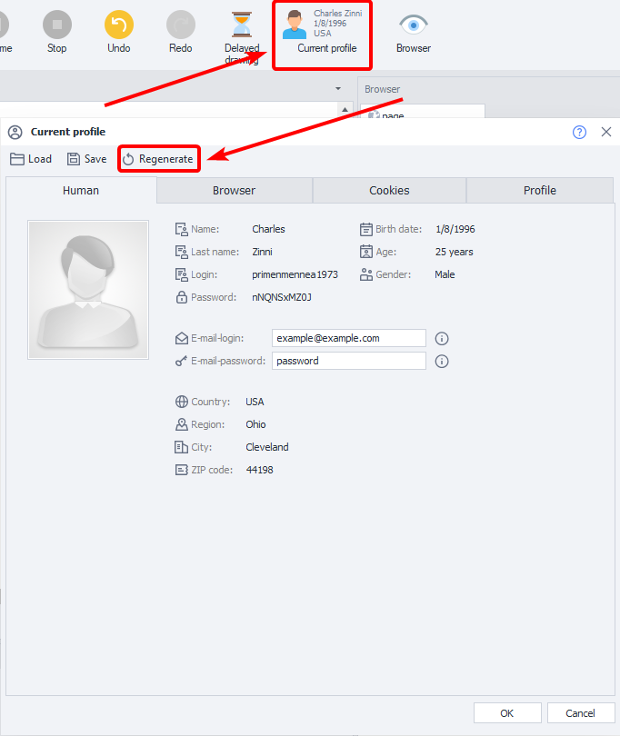

:::info **Please read the [*Material Usage Rules on this site*](../../Disclaimer).**
:::

> 🔗 **[Original page](https://zennolab.atlassian.net/wiki/spaces/RU/pages/494731265)** — Source of this material

_______________________________________________  

Starting from version 5 of ZennoPoster, the ability to record and debug a project in parallel has been implemented.

## From the Beginning

To start the project from the beginning (just like when launching a new project in ZennoPoster), click the corresponding button [1]. This will generate a new profile and new browser data based on [❗→ these](https://zennolab.atlassian.net/wiki/spaces/RU/pages/475332799 "https://zennolab.atlassian.net/wiki/spaces/RU/pages/475332799") settings.

## Step by Step

When you start debugging, you'll be offered the option to run the project step by step. In this mode, each subsequent action will only be executed after you click button [2]. If you decline the step-by-step run, the template will be executed automatically to the end or until the next breakpoint (which you can set by right-clicking any action).

You can switch between these two modes (step-by-step and to the breakpoint) during debugging by alternately using buttons [2] and [3].

## From the Cursor

By placing the cursor on any of the actions, you can start running the template from the selected step, either in the [2] step-by-step mode or in [3] mode.

This is very convenient when debugging parts of the template where errors occur: you can change the action settings and re-test their operation.

## Profile Regeneration

While running the template, you can modify or completely regenerate the identity or browser profile values using the appropriate tools marked with the number [5]. This is handy if you want to test how a site works with a different User Agent, for example.

You can find more detailed information about profiles in the article [❗→ Profile window](https://zennolab.atlassian.net/wiki/spaces/RU/pages/735903758 "https://zennolab.atlassian.net/wiki/spaces/RU/pages/735903758").