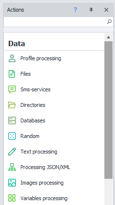
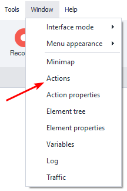
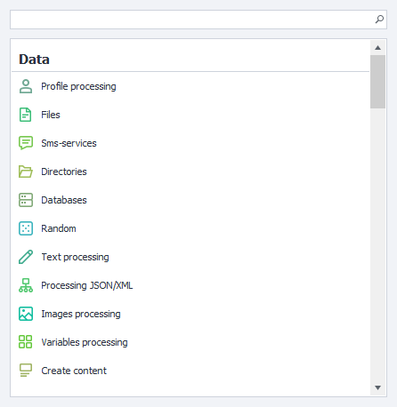
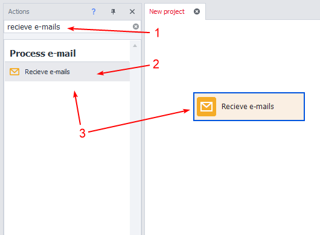
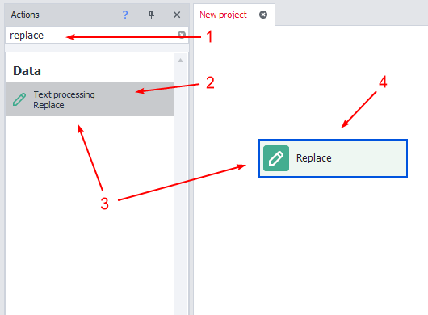
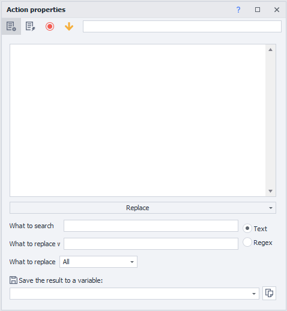
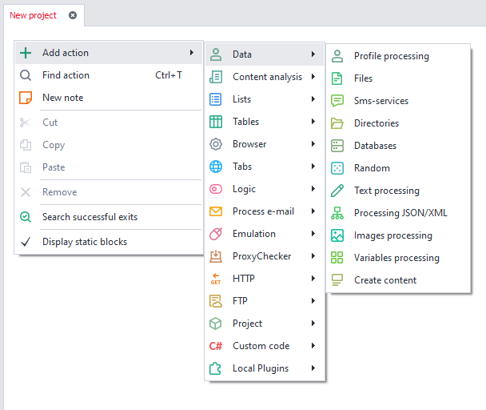

:::info **Please read the [*Material Usage Rules on this site*](../../Disclaimer).**
:::

> 🔗 **[Original page](https://zennolab.atlassian.net/wiki/spaces/RU/pages/727777324)** — Source of this material

_______________________________________________  

## Description

A navigation window that lets you quickly find and add actions to your project by name or function.

## How do I open the window in ProjectMaker?

### Method 1:

### Method 2:

Open the popup window by pressing the hotkey **Ctrl + T**

## What is this used for?

- Search for actions by function or name
- Add an action to the project with the selected function
- Quickly move actions by double-clicking

## How do you work with the Actions Window?

:::info Information
When the window is active, pressing Ctrl + T will focus the cursor in the search bar
:::

### Searching for an action by name and adding it to your project.

1. Enter the name in the search bar.
2. Choose the desired action from the suggestions.
3. Double-click the left mouse button or drag the block into the project with the cursor.

:::info Information
The smart search understands alternative names. For example: regex
:::

  

### Searching for an action by function name and adding it to your project.

1. Enter the name in the search bar.
2. Choose the desired action with the required function from the suggestions.
3. Double-click the left mouse button or drag the block into the project with the cursor.
4. A block with the specific function will appear in the project.

:::info Information
The action is created immediately with the selected function
:::

  

### Alternative way to add actions.

Right-click anywhere in the project window to open the [❗→ context menu](/wiki/spaces/RU/pages/486342706 "/wiki/spaces/RU/pages/486342706").

  

## Example of use

The window helps you quickly find and add actions to your project. If you forget where a needed function is, just enter it in the search. This way you can save time while building your project.

The actions window contains the entire vast functionality of the program—over a hundred functions.
Enter keywords to find the function you need:

**📹 There was a video here**

You can find a reference for available actions here: [❗→ Actions](/wiki/spaces/RU/pages/486342706 "/wiki/spaces/RU/pages/486342706")

## Useful links

1. [❗→ Actions in ProjectMaker ("Actions", "Blocks")](https://zennolab.atlassian.net/wiki/spaces/RU/pages/486342706/ProjectMaker "https://zennolab.atlassian.net/wiki/spaces/RU/pages/486342706/ProjectMaker")
2. [❗→ Advantages of the ProjectMaker 7 interface](https://zennolab.atlassian.net/wiki/spaces/RU/pages/506200090/ProjectMaker+7 "https://zennolab.atlassian.net/wiki/spaces/RU/pages/506200090/ProjectMaker+7")