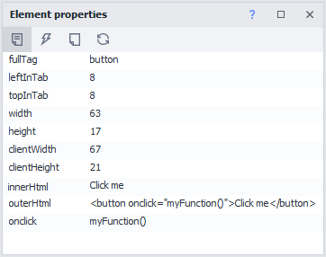
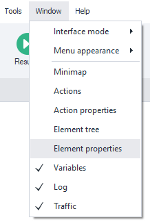
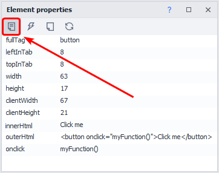
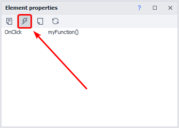
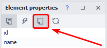
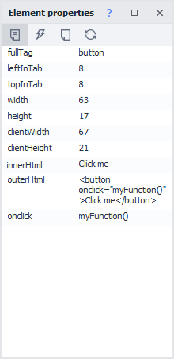
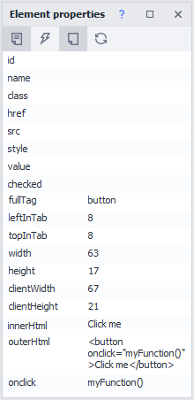
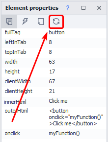

---
sidebar_position: 6
title: "Element Properties Window"
description: ""
date: "2025-07-19"
converted: true
originalFile: "Окно свойства элемента.txt"
targetUrl: "https://zennolab.atlassian.net/wiki/spaces/RU/pages/735608879"
---
:::info **Please read the [*Material Usage Rules on this site*](../Disclaimer).**
:::

> 🔗 **[Original page](https://zennolab.atlassian.net/wiki/spaces/RU/pages/735608879)** — Source of this material

_______________________________________________  

## Description

When working with the HTML code of a page, depending on the tag, an element has its own attributes that help you analyze or identify the object for further work.

When analyzing the source code, you may often come across elements that seem identical at first glance, which can lead to incorrect results when working with data. By using the *Element Properties* window, you can examine objects in detail, specifically their attributes (properties).

  

## How do you work with the window?

### Enabling the window

To enable it, click *Window* in the top menu and select **Element Properties**: 

### Showing information for the desired element

There are several ways to display information in this window for the element you’re interested in:

- Add it to the [❗→ Action Builder and XPath Search](/wiki/spaces/RU/pages/483426337 "/wiki/spaces/RU/pages/483426337")
- Select it in the [❗→ element tree window](/wiki/spaces/RU/pages/727777355 "/wiki/spaces/RU/pages/727777355")
- Right-click the desired element and choose *Inspect* or *Follow Cursor* from the context menu.

### The “Properties” tab

This tab is open by default.

It displays the attributes of the selected HTML element.

### The “Events” tab

This tab displays the JavaScript events attached to this element.

**IMPORTANT!** An event will only appear here if it’s explicitly specified as an attribute in the HTML code of the element being analyzed:

### The “Show Empty Fields” button

When enabled, the “Properties” and “Events” tabs will also display empty attributes/events.

**Before enabling**

**After enabling**

### The “Refresh Fields” button

This button lets you refresh the values of the element’s attributes.

  

## Useful links

- [❗→ Element tree window](/wiki/spaces/RU/pages/727777355 "/wiki/spaces/RU/pages/727777355")
- [❗→ Action Builder and XPath Search](/wiki/spaces/RU/pages/483426337 "/wiki/spaces/RU/pages/483426337")
- [❗→ Web Developer Tools (DevTools)](/wiki/spaces/RU/pages/1331134465 "/wiki/spaces/RU/pages/1331134465")
- [❗→ Viewing page text](/wiki/spaces/RU/pages/735903769 "/wiki/spaces/RU/pages/735903769")