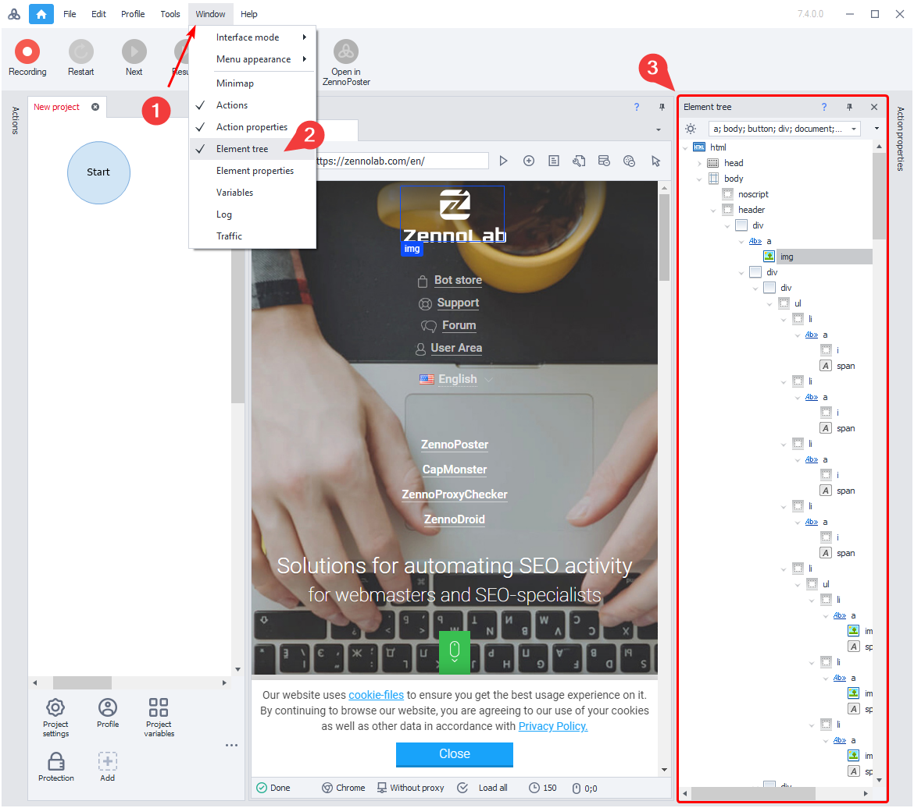
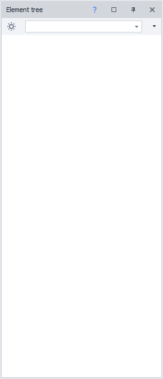
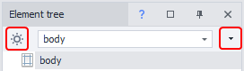
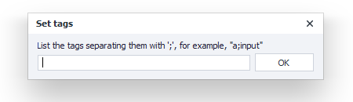
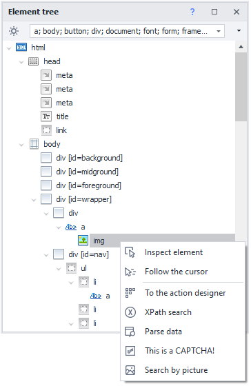
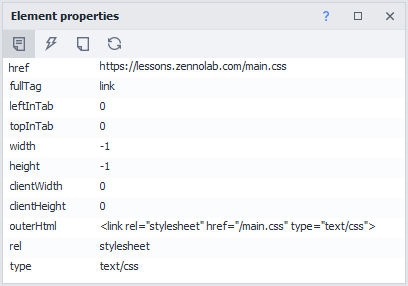
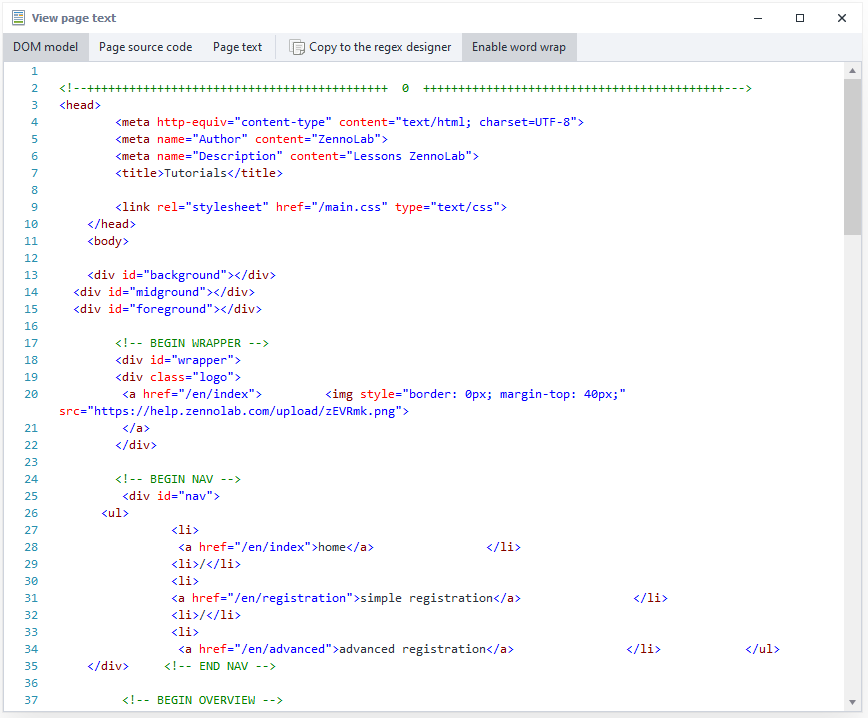
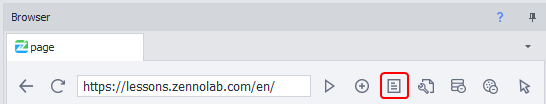
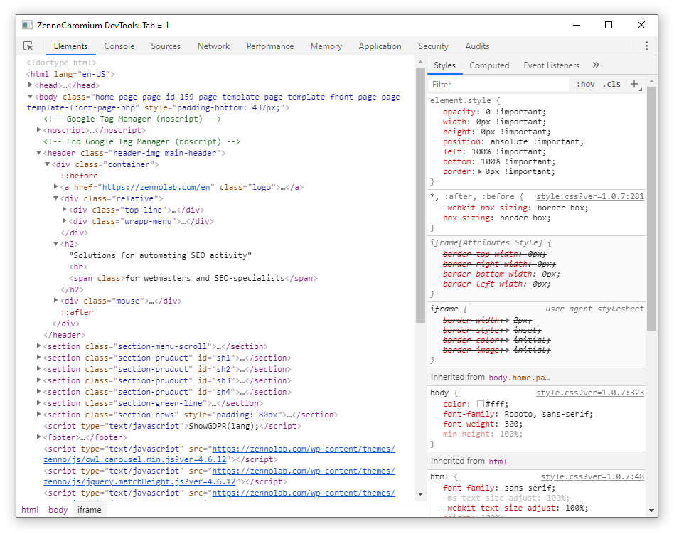
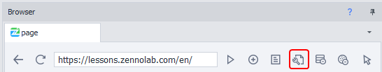

---
sidebar_position: 5
title: "Element Tree Window"
description: ""
date: "2025-07-19"
converted: true
originalFile: "Окно дерева элементов.txt"
targetUrl: "https://zennolab.atlassian.net/wiki/spaces/RU/pages/727777355"
---
:::info **Please read the [*Terms of Use for materials on this resource*](../Disclaimer).**
:::

> 🔗 **[Original page](https://zennolab.atlassian.net/wiki/spaces/RU/pages/727777355)** — Source of this material

_______________________________________________  

A tool for visual analysis of a page’s HTML code.

**A quick overview of how a page is built**

When you request a website page, the browser receives the raw HTML code in response. But before any graphics are rendered, there's a stage where the code is analyzed and built into a node tree (**render tree**). If you’re working on any browser-related project, you’ll frequently deal with this HTML structure. To make this easier, ZennoPoster includes an extension for visual analysis of the element tree.

## How to open the window in the program

To open this window in ProjectMaker, in the top menu, click:

Main menu: “***Window***” → “***Element Tree***“

|  |
| :--: |
| Element Tree in ZennoPoster |

With this tool, you can move through the elements of the page, and in the browser you'll visually see the highlighted object.

## Element tree filter
In the element tree window, you can customize which tags are displayed. This way, you can skip unnecessary elements, making document analysis easier and speeding up the search for the tag you need.

|  |
| :--: |
| Element tree window filter |

There are also buttons on the window panel:

|  |
| :--: |
| Element tree window interface |

- **Show only important elements** – automatically leaves only the (important) most commonly used tags.
- **Add or remove tags** – by default, the program includes frequently used elements, but you can manage the list yourself.

|  |
| :--: |
| Add tags to the element tree panel |

## Working with a page object

|  |
| :--: |
| Working with a page object |

Right-click (RMB) on the selected element to open the context menu. From there, you can choose an action for further work with this element as an object.

- **Inspect element** – opens the “[❗→ Element properties window](/wiki/spaces/RU/pages/735608879 "/wiki/spaces/RU/pages/735608879")” for a more detailed look at the properties of your selected element.
- **Add to action builder** – the [❗→ action builder tool](/wiki/spaces/RU/pages/483426337 "/wiki/spaces/RU/pages/483426337") lets you fine-tune element search methods and test actions on it at the same time.
- **Find by XPath** – automatically builds the path to the element in XML Path Language format, for further use in the action builder.
- **Parse data** – [❗→ tool](/wiki/spaces/RU/pages/534053279 "/wiki/spaces/RU/pages/534053279") allows you to set up data collection conditions with just a few clicks. The result preview is shown in the same window.
- **This is a captcha** – adds to your project the [❗→ manual captcha entry module](/wiki/spaces/RU/pages/534053215 "/wiki/spaces/RU/pages/534053215").
- **Image-based search** – [❗→ tool](/wiki/spaces/RU/pages/492044304 "/wiki/spaces/RU/pages/492044304") for specific mouse actions over the selected area.

## Additional tools for working with a page’s source code

Element properties

[❗→ Panel for analyzing HTML element attributes](/wiki/spaces/RU/pages/735608879 "/wiki/spaces/RU/pages/735608879")

|  |
| :--: |
| Element properties panel |

### **How to open the “Element properties” window**

“Window” → “Element properties“

Viewing source code, DOM, and page text

A tool for analyzing: the document’s DOM model, source HTML code, and the page’s text content.

|  |
| :--: |
| Viewing source code, DOM, and page text |

### **How to open the “View page text” window**

“*Browser” → “*View source code, DOM, and page text“

|  |
| :--: |
| Button to view source code, DOM, and page text |

### **Use cases**

Besides analyzing the current page’s source code, you can also search via regular expressions. To do this, click “[❗→ Copy to regex builder](/wiki/spaces/RU/pages/534086111 "/wiki/spaces/RU/pages/534086111")” and the document content will be placed in the “Text to process” area for further creation or testing of regular expressions.

Developer tools

Developer tools, or DevTools for short, are a suite of tools that help you test, debug, profile, check code compliance with standards, and much more.

The developer tools are available only when working with the Google Chrome browser.

|  |
| :--: |
| Developer tools in ZennoChromium |

### **How to open the “Developer Tools” window**

“*Browser” → “*Developer tools for the active tab“

This button on the panel is only active when using the Google Chrome browser.

|  |
| :--: |
| Developer tools for the active tab |

