---
sidebar_position: 4
title: "Log Window"
description: ""
date: "2025-07-19"
converted: true
originalFile: "Окно лога.txt"
targetUrl: "https://zennolab.atlassian.net/wiki/spaces/RU/pages/725352532"
---
:::info **Please familiarize yourself with the [*Terms of Use for materials on this resource*](../Disclaimer).**
:::

> 🔗 **[Original page](https://zennolab.atlassian.net/wiki/spaces/RU/pages/725352532)** — Source of this material

_______________________________________________  

## Description

The log is used to display messages to the user. A message can be one of three types:

- informational (“Starting work”, “Beginning registration”, “Account created successfully”, etc.)
- warning (any non-critical errors in the template's operation)
- error (when you need to inform the user that a serious issue occurred that needs attention).

Among other things, these three types of messages are distinguished by icons:

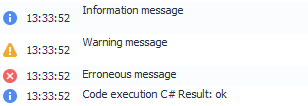


Also, starting from ZennoPoster 7.2.1.0, you can set a background color for messages

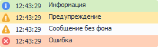


Messages are output to the log using the [❗→ *Notification](https://zennolab.atlassian.net/wiki/spaces/RU/pages/534053050/Notification "https://zennolab.atlassian.net/wiki/spaces/RU/pages/534053050/Notification") action.

  

## What is it used for?

Imagine you have created a template, and each execution takes about 8 minutes. You don’t use the log at all. You run the template, and it completes one cycle fine, two, three, five, ten. But on the 11th run, the template “hangs” — it doesn’t finish successfully, nor does it exit with an error and keeps hanging for 10, 20, 30 minutes. In this situation, you have to force-quit the program and restart the template, hoping this won’t happen again.

On the other hand, you can add log messages to the template so you can clearly see which stage is currently being executed. And if the template hangs somewhere, the log will help you figure out roughly where the error happened.

If you feel that ZennoPoster logs too many messages and you don’t want to delete the actions completely, you can set it so that they’re only shown in ProjectMaker. To do this, in the [❗→ *Notification](https://zennolab.atlassian.net/wiki/spaces/RU/pages/534053050/Notification "https://zennolab.atlassian.net/wiki/spaces/RU/pages/534053050/Notification") action, uncheck the box “Show in ZennoPoster”.

  

## How to use the window?

### Enabling the log window

To enable the log window, click on the *Window menu in the top bar and select *Log:

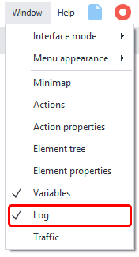


<details>
<summary>If the log window doesn't appear</summary>

Sometimes, the log window might not show up even though its checkbox is checked in the settings (as shown in the screenshot above), indicating it should be enabled. If, after several attempts, the window still doesn't appear, you can reset all window settings in ProjectMaker.

**ATTENTION!** The following steps will reset the window layout settings. In other words, if you've adjusted the program interface to your liking by arranging the windows in a convenient way, these settings will be deleted and reset to default.

Go to the settings (*Edit-Settings), choose the *Debug tab, and look for the *Reset panels button at the very bottom of the window. After pressing this button and restarting ProjectMaker, all window settings will be reset, but enabling the log window should work correctly again (this method can also be used if you have display issues with other program windows).

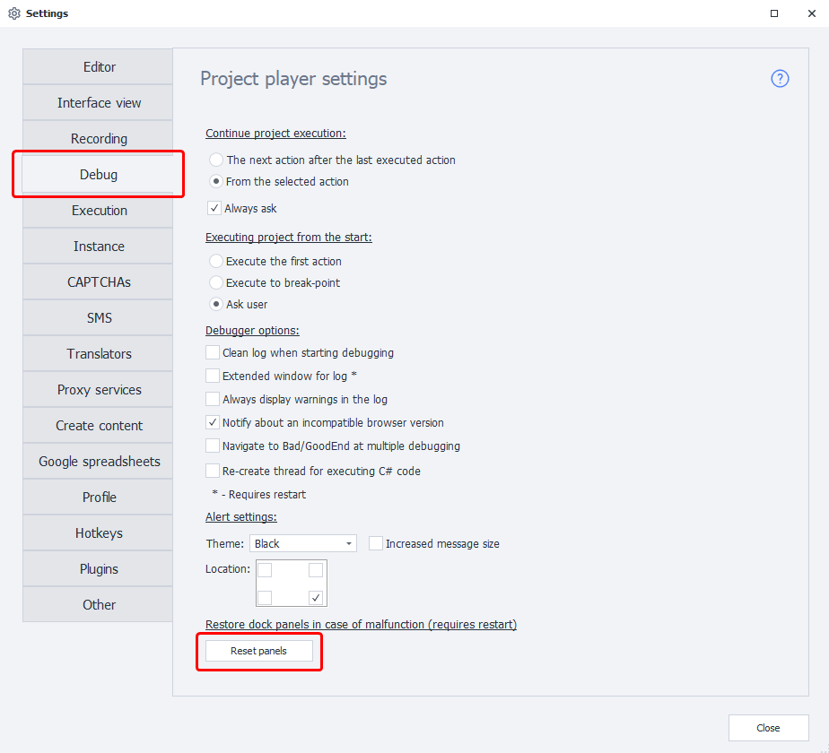


</details>
  

### Appearance (Standard Log)

#### Message Output Window

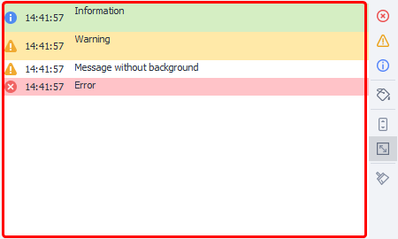


First, an icon appears corresponding to the message type, then the time of the message, and then the message text itself.

#### Sorting by Message Type and Color

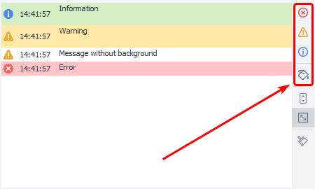


With the buttons in this section, you can filter displayed messages by their type and/or color.

#### Auto-scroll

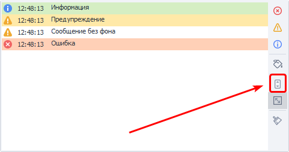


If this option is enabled, the log window will automatically scroll so the latest message is always visible.

:::note Tip
In the program settings, under the Misc tab, you can change the conditions under which auto-scroll is disabled.
:::

#### Auto-fit Row Height


If the message is too large, the row height will be adjusted so the entire message fits. If this option is disabled, only the top line of the message will be shown.

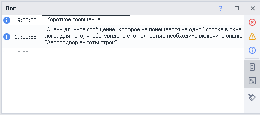


#### Clear Log

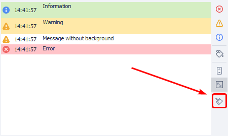


You can use this button to clear all messages from the window.

#### Double-clicking a Log Entry

If you double-click any entry in the log, the project focus will shift to the action that generated that entry.

  

The buttons in the right block of the window collapse when you reduce the height of the log window. To access them, click the respective button.

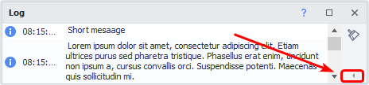


  

### Log Context Menu

When you right-click (RMB) a log entry, a context menu appears

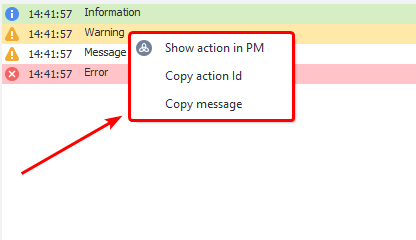


#### Show Action in PM

The project that generated this message will open in ProjectMaker, and the focus will shift to the action that sent the message.

#### Copy Action Id

The unique id of the action that sent the message will be copied to the clipboard. Example id: `3e6988d1-9518-4535-a6d2-f0a33420c730`. You can use this id to search within the project. For more details, see the article [❗→ Project Search](/wiki/spaces/RU/pages/724566074 "/wiki/spaces/RU/pages/724566074") 

#### Copy Message

When you select this item, the text of the message will be copied to the clipboard.

  

:::warning Attention
The functions described below are intended for advanced users.
:::

### Log File on Your Computer

ProjectMaker and ZennoPoster also save logs locally in the folder where the program is installed, in the Logs subfolder. Here is an example path to this folder: `C:\Program Files\ZennoLab\RU\ZennoPoster Pro V7\7.1.6.1\Progs\Logs`

#### Splitting by Template and Thread

By default, all logs from all templates are written to one file. You can change this behavior using [❗→ C# code](/wiki/spaces/RU/pages/492011596 "/wiki/spaces/RU/pages/492011596"), which should be placed at the start of the template:

```
// Redirects the log for this template to a separate file.
project.LogOptions.LogFile = @"D:\log.txt";
// A separate log file will be created for each thread.
// Thread identifiers will be appended to the file names (in our case, log).
project.LogOptions.SplitLogByThread = true;
```

### Extended Log Option

In the program settings, you can enable the *Extended Log. To do this, in the top menu, click *Edit then *Settings, and then choose the *Debug tab and look for the [❗→ *Extended Log Window Option](https://zennolab.atlassian.net/wiki/spaces/RU/pages/725352498#%D0%A0%D0%B0%D1%81%D1%88%D0%B8%D1%80%D0%B5%D0%BD%D0%BD%D1%8B%D0%B9-%D0%B2%D0%B0%D1%80%D0%B8%D0%B0%D0%BD%D1%82-%D0%BE%D0%BA%D0%BD%D0%B0-%D0%BB%D0%BE%D0%B3%D0%B0 "https://zennolab.atlassian.net/wiki/spaces/RU/pages/725352498#%D0%A0%D0%B0%D1%81%D1%88%D0%B8%D1%80%D0%B5%D0%BD%D0%BD%D1%8B%D0%B9-%D0%B2%D0%B0%D1%80%D0%B8%D0%B0%D0%BD%D1%82-%D0%BE%D0%BA%D0%BD%D0%B0-%D0%BB%D0%BE%D0%B3%D0%B0"). For the changes to take effect, you need to restart ProjectMaker.

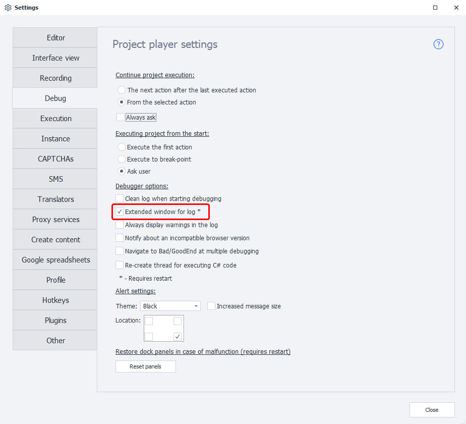


:::note Tip
When you enable the extended log in ProjectMaker, it will also automatically be enabled in ZennoPoster.
:::

#### Appearance of the Extended Log Window

The first thing you’ll notice is the appearance of headers:

- Message type
- Time
- *Unnamed header (in version 5.X.X.X it was called *Path)
- Message

By clicking on any header, you can sort the messages in the log 

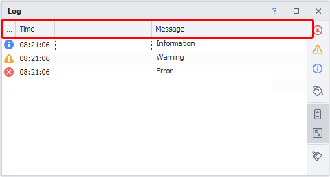


#### Message Filter

When you hover your mouse over any header, a filter icon appears. 

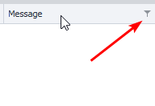


The type of filter depends on which column you clicked: 

- For the *Time column, you get date filters (you can show messages for a specific day, between two dates, before or after a set date, and many other filters. Or you can create a complex filter with multiple conditions)

<details>
<summary>Screenshots</summary>

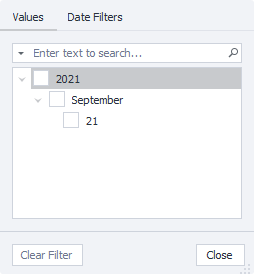


  

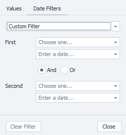


  

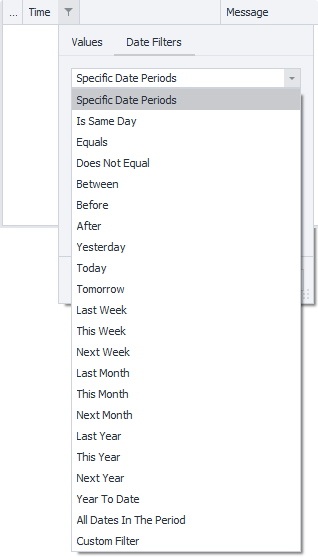


</details>
- For the *Message and *Unnamed columns, you get text filters.

<details>
<summary>Screenshots and filter translations</summary>

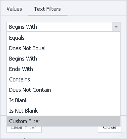


**Equals -** The string equals the filter (exact match)

**Does Not Equal -** Does NOT equal the filter

**Begins With -** Begins with…

**Ends With -** Ends with…

**Contains -** Contains

**Does Not Contain -** Does not contain

**Is Blank -** The string is empty

**Is Not Blank -** The string is NOT empty

**Custom -** Composite filter.

</details>
#### Auto-filter and Filter Builder 

Right-clicking the header opens a context menu with additional options: grouping by the selected column, hiding columns, auto-fitting column width. For now, we’re interested in *Auto-filter and Filter Builder.

**Auto-filter -** lets you quickly create a simple message filter. ** When enabled, an extra row appears^(1)^ below the headers, where you set the type of filter and enter the needed characters and/or words to filter which messages are shown. The screenshot below shows the new row and a simple filter^(2)^ — only rows containing the “o” character are shown (the search is by the *Message column). In each row, on the left, there’s an icon you can click to open a context menu^(3)^ to select the filter type. The filter types and input depend on the column: for the *Time column, these are comparison operators (greater than - &gt;, less than - &lt;, equal - =, etc.) and dates; for *Message — text searches (Contains, Does not contain, Begins with, etc.), plus comparison operators.

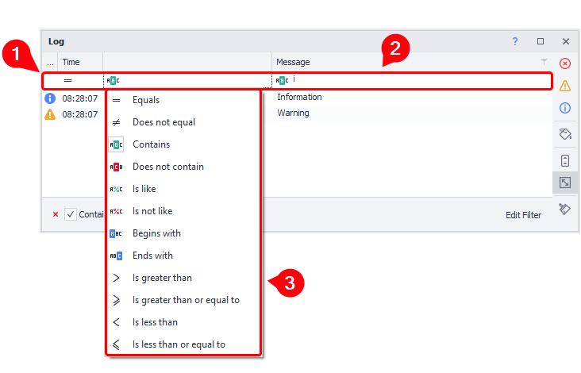


**Filter Builder -** similar to auto-filter, but lets you create much more complex filtering conditions. 

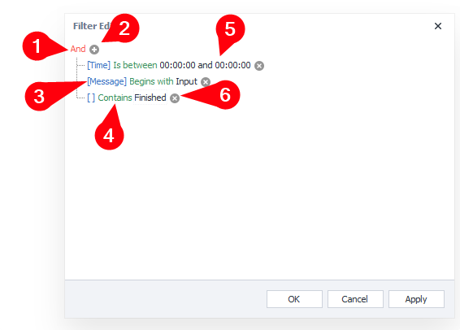


1. By clicking this button, you can add a new condition, a group of conditions, or clear all search conditions. You also need to define the logical relationship between conditions:

 1. **AND -** satisfies ALL conditions
 2. **OR -** satisfies at least one of the conditions
 3. **NOT AND** **-** does NOT satisfy ALL conditions
 4. **NOT OR -** does NOT satisfy at least one condition
2. With this button, you can easily add an extra condition.
3. The column to which the filter is applied is shown in blue in square brackets (in the screenshot, the last condition’s brackets are empty — this is the *Unnamed column. Even though it doesn’t have its own name, you can still filter by it).
4. The filter type is shown in green.
5. Black text is the filter value you entered.
6. This button lets you easily remove a filter.

#### How to write to the *Unnamed column (and why might you need this)?

Unfortunately, you cannot write to this column using the standard [❗→ Notification](/wiki/spaces/RU/pages/534053050 "/wiki/spaces/RU/pages/534053050") action (as of this writing, the latest version is 7.4.0.0). To do so, you need to use the [❗→ Custom C# code](/wiki/spaces/RU/pages/492011596 "/wiki/spaces/RU/pages/492011596") block and have some basic familiarity with C#.

There are four methods for outputting log messages — 
`project.SendInfoToLog`, `project.SendWarningToLog`, `project.SendErrorToLog`, and `project.SendToLog` (with which you can set message color). Each method has an overload (the use in `project.SendInfoToLog`, `project.SendWarningToLog`, `project.SendErrorToLog` is identical, so we’ll look only at `project.SendInfoToLog` here)

`// First method variant.
// Arguments:
// 1st - string, will be shown in the "Message" column
// 2nd - bool, whether to show this message in the ZennoPoster log
project.SendInfoToLog("Message", true);

// Second method variant:
// Arguments:
// 1st - string, shown in the "Message" column
// 2nd - string, this will appear in the unnamed column.
// 3rd - bool, whether to show the message in the ZennoPoster log
project.SendInfoToLog("Message", "Way", true);`

Here’s what a call to this code looks like:

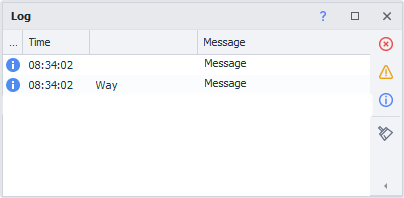


**When might this come in handy:**

- if you’re working with multiple threads, you can put the account name in the *Unnamed* column, and in *Message* specify what action this account is currently performing. If needed, you can group messages by this column (right-click the header and choose the option), or set up a filter.
- sometimes you need to build large templates that perform many functions in a single pass, for example — registration, profile filling, product search, parsing and processing products, publishing processed data (all in a single template run). Each part can include many actions. During logging, you can write which part the process is currently in to the *Unnamed* column and the specific action in the *Message* column.

* * *

## Useful links

- [❗→ Notification (Notification/Write to log)](/wiki/spaces/RU/pages/534053050 "/wiki/spaces/RU/pages/534053050")
- [❗→ Project Search](/wiki/spaces/RU/pages/724566074 "/wiki/spaces/RU/pages/724566074")