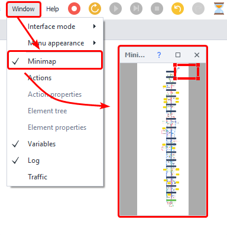
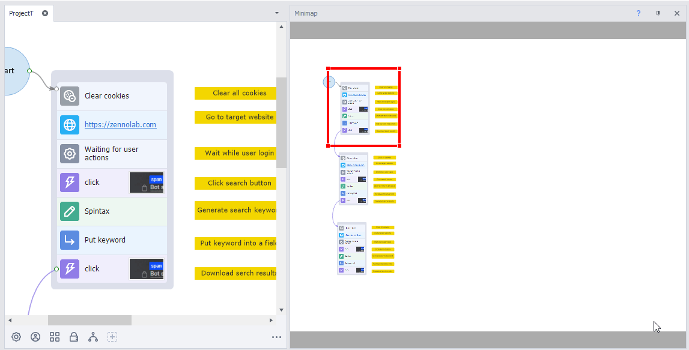
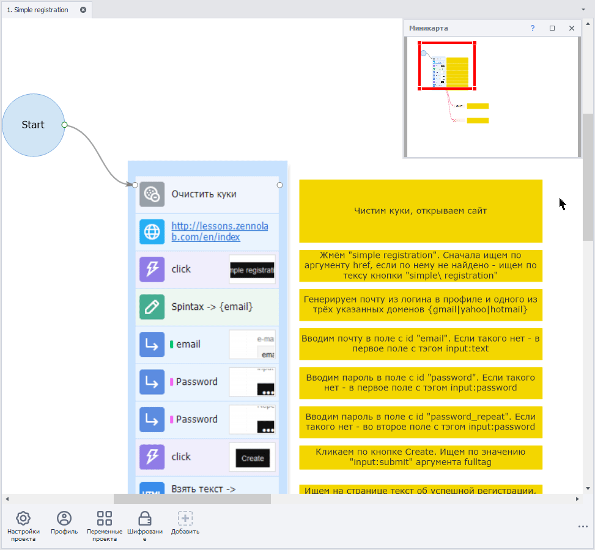
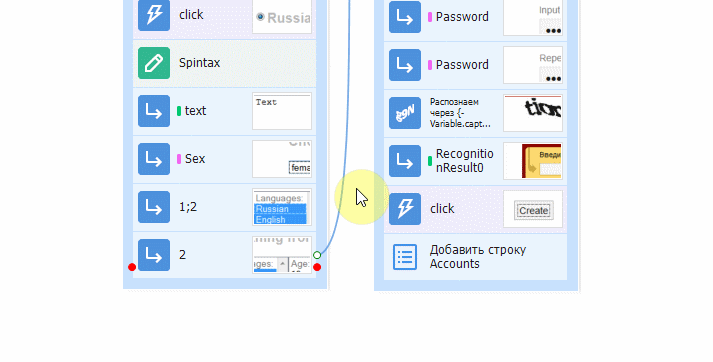
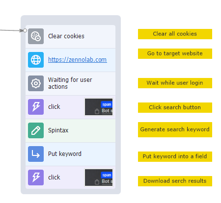
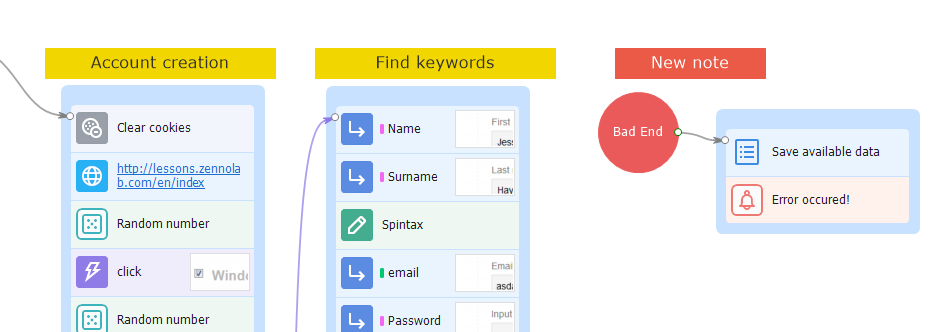
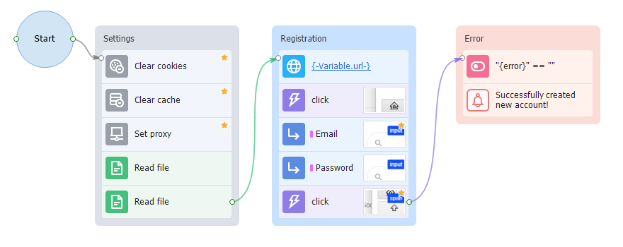

---
sidebar_position: 2
title: "Minimap Window"
description: ""
date: "2025-07-19"
converted: true
originalFile: "Окно миникарты.txt"
targetUrl: "https://zennolab.atlassian.net/wiki/spaces/RU/pages/735772693"
---
import DisclaimerNotice from '@site/src/components/DisclaimerNotice';

<DisclaimerNotice />

> 🔗 **[Original page](https://zennolab.atlassian.net/wiki/spaces/RU/pages/735772693)** — Source of this material

_______________________________________________  

## Description

To open this window in ProjectMaker, click on:

“Window” → “Minimap“ in the top menu.

## Where It's Used

When your template workspace gets crowded with lots of actions, the minimap helps you quickly navigate and move around the project in seconds. Just click any point on the map to instantly jump to that part of your project.

## Additional tools for convenient project work

Besides the minimap, there are other handy navigation features:

Zooming

You can easily zoom in and out of your project to see the big picture. To do this, use the keyboard shortcut `Ctrl` + `Mouse Wheel`, or `Ctrl` + `+` to zoom in and `Ctrl` + `-` to zoom out.

Interactive hints for jumping to actions

When your template has lots of arrows or actions that are far apart, navigating the project can get tricky. To help with this, use the go-to-action feature, which jumps you right to the needed action.

How does it work?

1. Hover your mouse cursor over the connection point of the block you want to trace.
2. If the action is off the visible canvas, an interactive hint will appear.

This is also useful when a block has several pointers connected to it at once.

Notes

Using [❗→ notes](/wiki/spaces/RU/pages/534020312 "/wiki/spaces/RU/pages/534020312"), you can comment on a specific set of actions and group them by color.

Setting a color for a group of actions

With this feature, you can label groups logically by color. For example:
Settings – **gray**, authorization block – **orange**, registration – **red**, and so on.

There's also Adaptive color, which sets the group color to match the most common action color in the group.

