---
sidebar_position: 8
title: "Profile Window"
description: ""
date: "2025-07-19"
converted: true
originalFile: "Окно профиля.txt"
targetUrl: "https://zennolab.atlassian.net/wiki/spaces/RU/pages/735903758"
---
:::info **Please make sure to read the [*Terms of Use for materials on this resource*](../Disclaimer).**
:::

> 🔗 **[Original page](https://zennolab.atlassian.net/wiki/spaces/RU/pages/735903758)** — Source of this material

_______________________________________________  

## Description

*The Profile Window is used to display information about the current identity.

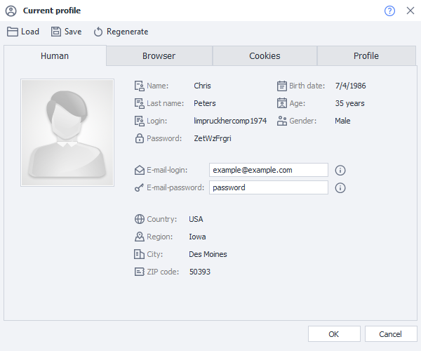

A profile is a virtual identity whose data is generated by ProjectMaker. You [❗→ can fine-tune the settings](/wiki/spaces/RU/pages/483426308 "/wiki/spaces/RU/pages/483426308") for each project individually—choose browser, OS, platform, nationality, gender, age, emulated data, and more.

  

## How to open the window?

To activate the window, click the *Current Profile* button.

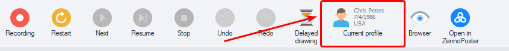

  

## What is it used for?

This window is very convenient for use during project creation or debugging: you can quickly regenerate a profile or load another one to see how your project behaves with different sets of profile data.

:::note Note
When you save/load a profile, cookies and browser cache are carried over too, among other things.
:::

  

## Working with the window

### Loading, saving, and generating

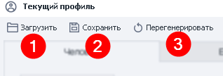

1. **Load** – This feature lets you upload a previously saved profile. When you click the button, a standard file selection window will open.
2. **Save** – Saves the current profile to the specified path.
3. **Regenerate** – Fully updates all profile parameters.

:::note Note
While running a project, you can load and save the profile using the Profile Operations action. You can also use it to change some fields (but not all).
:::

  

### The “Person” tab

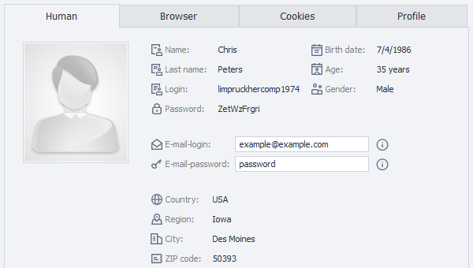

This tab displays basic information about the current profile.

Most parameters are available for viewing and copying only. To copy a parameter, double-click it, then right-click the selection to open the familiar context menu:

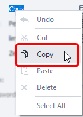

You can only change the email and its password. These will be changed only for the current profile.

:::note Note
In the program settings, you can set a default email for all profiles. You can also specify profile nationality there.
:::

  

### The “Browser” tab

On this tab, you can change some settings that affect browser behavior.

:::note Note
Many of these settings can be enabled/disabled using the Browser Settings action.
:::

:::warning Attention
These settings are not reset when the profile is regenerated!
:::

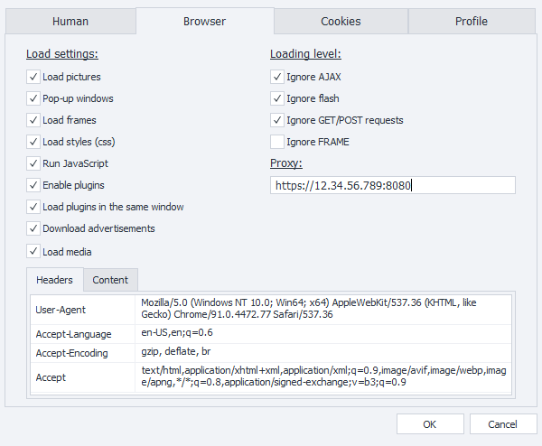

#### Loading settings

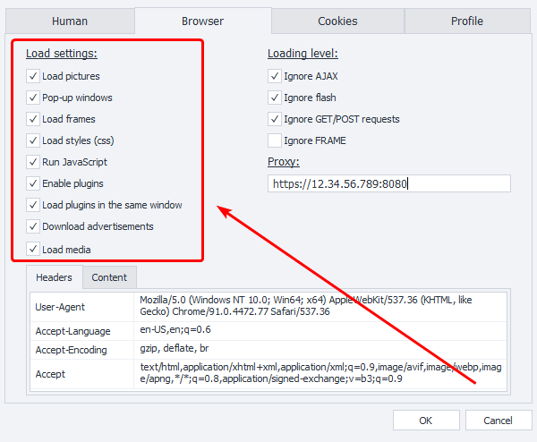

With these options, you can disable/enable loading/execution of certain webpage components. This can help speed up page loading and reduce traffic usage.

:::warning Attention
This may affect website functionality (especially if you disable JavaScript)!
:::

***Load images** – For some sites, projects can work without images. Disabling them can save a lot of traffic.

***Pop-up windows** – This setting prevents new tabs from opening in the browser.  
If a link would normally open in a new tab and this setting is enabled, it won't open.

***Load frames** – If disabled, elements inside `iframe` frames won't be loaded.

***Load styles** – You can use this option to disable CSS styles on the page. This may slightly reduce resource consumption but may also change the page layout and cause errors. Use this option carefully.

***Run JavaScript** – If disabled, scripts on the page won't execute. This can break functionality on most modern sites.

***Enable plugins** – Turn legacy browser plugins like Flash/Java/Silverlight on or off. This can help with old sites and reduce resource load and traffic.

***Load plugins in the same window** – Allows you to take screenshots of flash or other plugins. If you load them in another window, a blank square will appear instead of the plugin's image.

***Load ads** – Blocks advertisement banners to save traffic.

***Load media** – Enable/disable media content with HTML elements  

```xml
<video></video>
```  
  
```xml
<audio></audio>
```  
and so on. This also helps save resources and traffic.

#### Load state detection

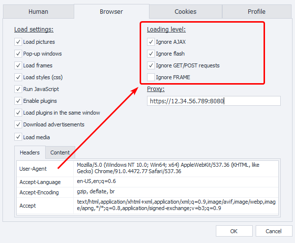

These settings determine whether the browser ignores or waits for the loading of certain components (actions are not performed while the browser is waiting for loading).

- For example, modern sites often use AJAX and load data after the site loads. If you disable the “Ignore AJAX” option, ProjectMaker will wait for every such request to finish. Be careful with this, as some sites <u data-renderer-mark="true">constantly</u> send AJAX requests, which can paralyze your template!
- Or sometimes the browser may wait a long time for a frame with content from a “downed” site, wasting time and resources waiting.

#### Proxy

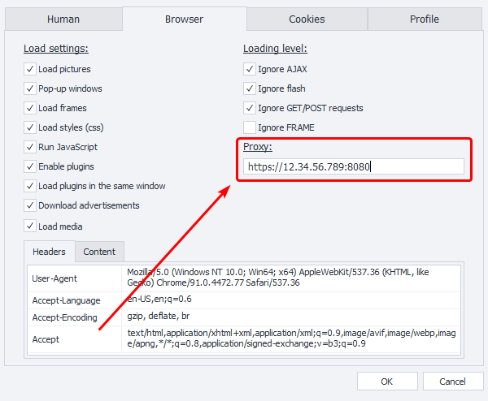

Here you can set a proxy for this profile. The format is `protocol://username:password@ip:port` with authorization, or `protocol://ip:port` without. If `protocol` is not specified, `http://` is used by default.

#### Headers

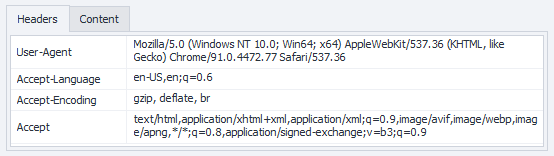

This tab shows the [browser headers](https://developer.mozilla.org/ru/docs/Web/HTTP/%D0%97%D0%B0%D0%B3%D0%BE%D0%BB%D0%BE%D0%B2%D0%BA%D0%B8 "https://developer.mozilla.org/ru/docs/Web/HTTP/%D0%97%D0%B0%D0%B3%D0%BE%D0%BB%D0%BE%D0%B2%D0%BA%D0%B8"). Their values can be changed right in this window.

:::warning Attention
If Recording is enabled, any changes you make to these settings (from Loading Settings up to Headers) and then clicking OK will create corresponding actions on the canvas.
:::

#### Content

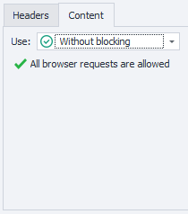

In this tab, you can control which addresses and domains the browser will ignore or load. This feature is described in more detail in the article about the [❗→ Traffic Window](/wiki/spaces/RU/pages/735805465 "/wiki/spaces/RU/pages/735805465"), particularly the section on [❗→ Content Policy](https://zennolab.atlassian.net/wiki/spaces/RU/pages/735805465#%D0%9F%D0%BE%D0%BB%D0%B8%D1%82%D0%B8%D0%BA%D0%B0-%D1%81%D0%BE%D0%B4%D0%B5%D1%80%D0%B6%D0%B8%D0%BC%D0%BE%D0%B3%D0%BE.-%D0%91%D0%B5%D0%BB%D1%8B%D0%B9-%D0%B8-%D1%87%D1%91%D1%80%D0%BD%D1%8B%D0%B9-%D1%81%D0%BF%D0%B8%D1%81%D0%BA%D0%B8 "https://zennolab.atlassian.net/wiki/spaces/RU/pages/735805465#%D0%9F%D0%BE%D0%BB%D0%B8%D1%82%D0%B8%D0%BA%D0%B0-%D1%81%D0%BE%D0%B4%D0%B5%D1%80%D0%B6%D0%B8%D0%BC%D0%BE%D0%B3%D0%BE.-%D0%91%D0%B5%D0%BB%D1%8B%D0%B9-%D0%B8-%D1%87%D1%91%D1%80%D0%BD%D1%8B%D0%B9-%D1%81%D0%BF%D0%B8%D1%81%D0%BA%D0%B8")

:::warning Attention
Regardless of whether Recording is enabled or not, after making changes and clicking OK, a Content Policy action will be created with all changes you made.
:::

### The “Cookies” tab

:::info Info
Added in version 7.2.1.1
:::

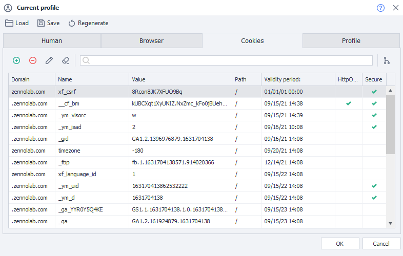

This tab displays all the cookies associated with the current profile.

**Editing**

In this window, you can not only view cookies but also edit them.

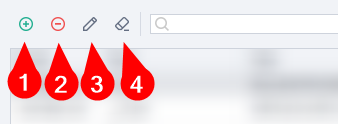

1. Add a new cookie.
2. Delete the selected cookie.
3. Edit.
4. Use the “Clear” button to delete all cookies at once.

**Search**

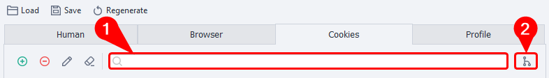

You can filter the displayed cookies using the relevant field (1).

You can also group cookies by domain (2).

These tools can be combined.

### The “Profile” tab

This tab shows detailed information about both the generated identity (first name, last name, date of birth, login, etc.) and about the browser and system (for more details on these parameters, see [❗→ this article](https://zennolab.atlassian.net/wiki/spaces/RU/pages/483426308#%D0%92%D0%BA%D0%BB%D0%B0%D0%B4%D0%BA%D0%B0-%D0%91%D1%80%D0%B0%D1%83%D0%B7%D0%B5%D1%80 "https://zennolab.atlassian.net/wiki/spaces/RU/pages/483426308#%D0%92%D0%BA%D0%BB%D0%B0%D0%B4%D0%BA%D0%B0-%D0%91%D1%80%D0%B0%D1%83%D0%B7%D0%B5%D1%80")).

  

## Accessing profile data through variables

### The Variables Window

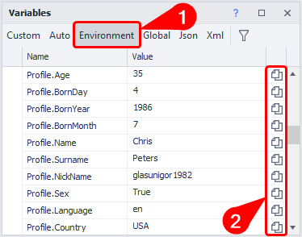

You can find the list of available variables in the [❗→ variables window](/wiki/spaces/RU/pages/735608872 "/wiki/spaces/RU/pages/735608872") on the *Environment* tab^(1)^ (scroll down to variables that start with *Profile), where you can also copy the variable macro directly^(2)^.

### Manually

In any field that supports variable macros (for example, in the [❗→ Notification](/wiki/spaces/RU/pages/534053050 "/wiki/spaces/RU/pages/534053050") action), press ctrl+space, select *Profile from the dropdown, then add a dot, and a list of all profile variables will appear. Double-click the desired field, and the macro will be inserted automatically.

**CTRL+space**

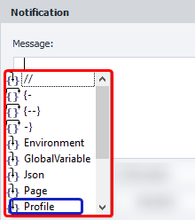

**Selecting the needed field**


**Final macro appearance**


:::note Note
There are a few variables that do not appear on the “Person” tab in the Profile Window but are available in the Variables Window and can be inserted manually: `{ -Profile.NickName- }` (the value in this field is different from `{ -Profile.Login- }`, which is shown on the tab), `{ -Profile.SecretQuestionAnswer1- }`, `{ -Profile.SecretQuestionAnswer2- }`
:::

### Profile Gender (`{ -Profile.Sex- }`)

Please note that the profile gender in ProjectMaker is a boolean type:

- male – True
- female – False

  

## Example usage

You can find usage examples in the article about the [❗→ Profile Operations](https://zennolab.atlassian.net/wiki/spaces/RU/pages/486539291#%D0%92%D0%BE%D0%B7%D0%BC%D0%BE%D0%B6%D0%BD%D0%BE%D0%B5-%D0%BF%D1%80%D0%B0%D0%BA%D1%82%D0%B8%D1%87%D0%B5%D1%81%D0%BA%D0%BE%D0%B5-%D0%BF%D1%80%D0%B8%D0%BC%D0%B5%D0%BD%D0%B5%D0%BD%D0%B8%D0%B5 "https://zennolab.atlassian.net/wiki/spaces/RU/pages/486539291#%D0%92%D0%BE%D0%B7%D0%BC%D0%BE%D0%B6%D0%BD%D0%BE%D0%B5-%D0%BF%D1%80%D0%B0%D0%BA%D1%82%D0%B8%D1%87%D0%B5%D1%81%D0%BA%D0%BE%D0%B5-%D0%BF%D1%80%D0%B8%D0%BC%D0%B5%D0%BD%D0%B5%D0%BD%D0%B8%D0%B5") action or in the article about [❗→ configuring profile generation parameters](https://zennolab.atlassian.net/wiki/spaces/RU/pages/483426308#%D0%94%D0%BB%D1%8F-%D1%87%D0%B5%D0%B3%D0%BE-%D1%8D%D1%82%D0%BE-%D0%B8%D1%81%D0%BF%D0%BE%D0%BB%D1%8C%D0%B7%D1%83%D0%B5%D1%82%D1%81%D1%8F%3F "https://zennolab.atlassian.net/wiki/spaces/RU/pages/483426308#%D0%94%D0%BB%D1%8F-%D1%87%D0%B5%D0%B3%D0%BE-%D1%8D%D1%82%D0%BE-%D0%B8%D1%81%D0%BF%D0%BE%D0%BB%D1%8C%D0%B7%D1%83%D0%B5%D1%82%D1%81%D1%8F%3F"). Additionally, you can use the profile when working with [❗→ GET](/wiki/spaces/RU/pages/534315165 "/wiki/spaces/RU/pages/534315165"), [❗→ POST](/wiki/spaces/RU/pages/534315180 "/wiki/spaces/RU/pages/534315180"), or [❗→ other](/wiki/spaces/RU/pages/489259052 "/wiki/spaces/RU/pages/489259052") requests (you can use either the current or a previously saved profile) to substitute headers.

  

## Useful links

- [❗→ Profile](/wiki/spaces/RU/pages/483426308 "/wiki/spaces/RU/pages/483426308")
- [❗→ Profile Operations](/wiki/spaces/RU/pages/486539291 "/wiki/spaces/RU/pages/486539291")
- [❗→ Profile (PM)](/wiki/spaces/RU/pages/735608848 "/wiki/spaces/RU/pages/735608848")
- [❗→ Variables Window](/wiki/spaces/RU/pages/735608872 "/wiki/spaces/RU/pages/735608872")
- [❗→ Browser Settings](/wiki/spaces/RU/pages/489324572 "/wiki/spaces/RU/pages/489324572")
- [❗→ Using the profile folder](/wiki/spaces/RU/pages/1251475485 "/wiki/spaces/RU/pages/1251475485")