---
sidebar_position: 7
title: "Traffic Window"
description: ""
date: "2025-07-19"
converted: true
originalFile: "Окно трафика.txt"
targetUrl: "https://zennolab.atlassian.net/wiki/spaces/RU/pages/735805465"
---
import DisclaimerNotice from '@site/src/components/DisclaimerNotice';

<DisclaimerNotice />

> 🔗 **[Original page](https://zennolab.atlassian.net/wiki/spaces/RU/pages/735805465)** — Source of this material

_______________________________________________  

## Description

The traffic window displays all requests made by the ProjectMaker browser. It also shows requests made using actions like [❗→ GET request](/wiki/spaces/RU/pages/534315165 "/wiki/spaces/RU/pages/534315165"), [❗→ POST request](/wiki/spaces/RU/pages/534315180 "/wiki/spaces/RU/pages/534315180"), [❗→ HTTP requests](/wiki/spaces/RU/pages/489259052 "/wiki/spaces/RU/pages/489259052").

|  |
| :--: |
| View of the traffic window after navigating to https://lessons.zennolab.com/ru/advanced |

  

## How do I use the traffic window?

### Enabling

In the top menu, find *Window and choose *Traffic from the dropdown list.

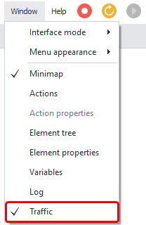

What to do if the window doesn't appear

Sometimes the window doesn't show up even if the checkbox next to it is ticked in the settings (as shown in the screenshot above), indicating it's enabled. If you've tried turning it on several times and it still doesn't appear, you can reset all window settings in ProjectMaker.

**ATTENTION!** The following steps will reset your window settings—which means if you've set up the program’s interface to your liking, arranging its windows conveniently, all those settings will be lost and restored to default.

Go to settings (*Edit-Settings), open the *Debug tab**, and at the very bottom of the window, look for the *Reset Panels button. Once you click this button and restart ProjectMaker, all window settings will be reset, but the traffic window should now appear and work correctly.

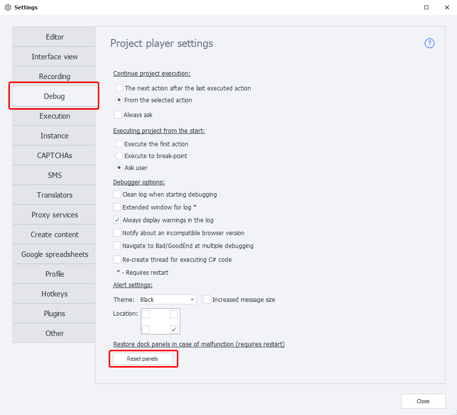

  

### Window appearance

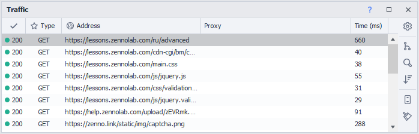

#### List of requests

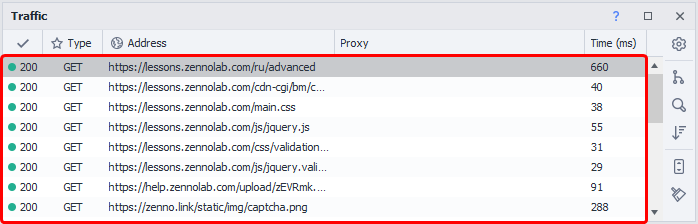

It contains the following columns:

- Response status (can be 200, 403, 404, 407, 503, etc.)
- Request method ([❗→ GET request](/wiki/spaces/RU/pages/534315165 "/wiki/spaces/RU/pages/534315165"), [❗→ POST request](/wiki/spaces/RU/pages/534315180 "/wiki/spaces/RU/pages/534315180"), [❗→ PUT, DELETE, etc.](/wiki/spaces/RU/pages/489259052 "/wiki/spaces/RU/pages/489259052"))
- The URL for the request
- [❗→ Proxy](/wiki/spaces/RU/pages/492208129 "/wiki/spaces/RU/pages/492208129") (if used)
- Time (ms) — the time in milliseconds spent on the request

#### Content policy settings

This is described further down in the article.

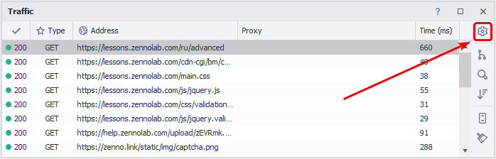

#### Group by domain

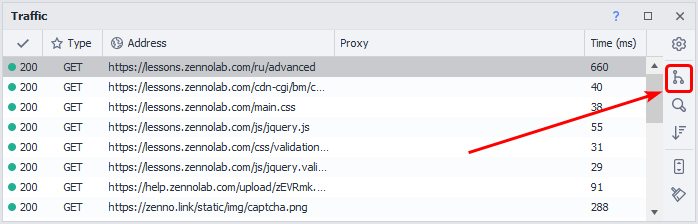

A separate tab with its requests will be created for each domain (every subdomain gets its own tab):

Example

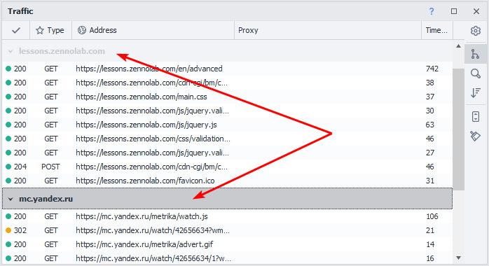

#### Search panel

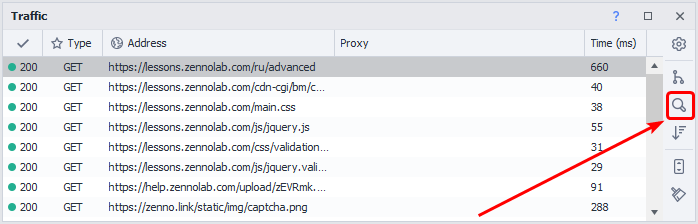

You can use this together with "Grouping".

Example

The screenshot shows an example of searching for loaded JavaScript files for the http://yandex.ru domain.

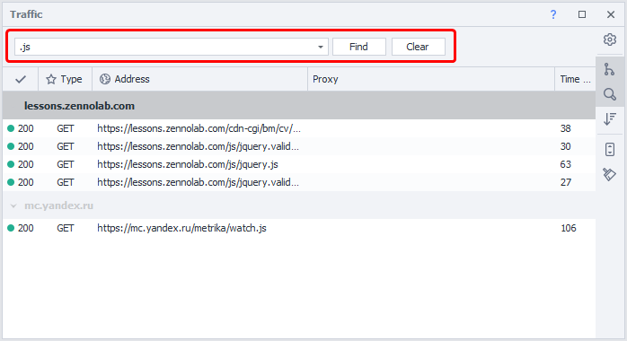

#### Default sorting

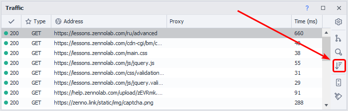

If you click any column header, the requests will be sorted alphabetically by that column. The *Default sorting option lets you restore the original order—by the time the requests were sent.

#### Autoscroll

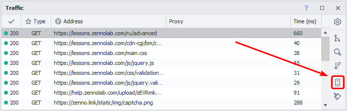

When this option is enabled, the traffic window will automatically scroll as new requests come in. This way, the most recent request will always be visible.

#### Clear

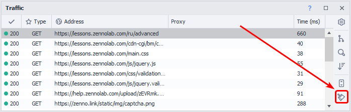

Deletes all requests from the window.

#### Enable/disable columns

If you right-click on any column header, a context menu will appear where you can show/hide columns.

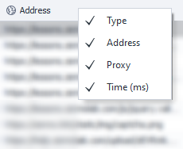

#### Request details

Double-clicking any request in the traffic window opens its detailed information. This window contains four tabs. Here’s a quick overview:

**Headers**

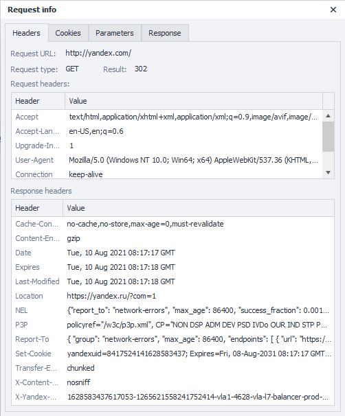

This tab shows the main information about the request:

- URL
- Method
- Response status
- Proxy (if used)
- Request and response headers

**Cookies**

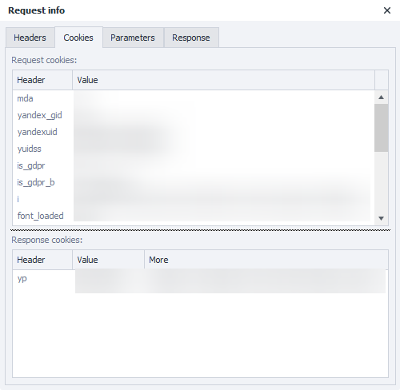

Sent and received cookies

**Parameters**

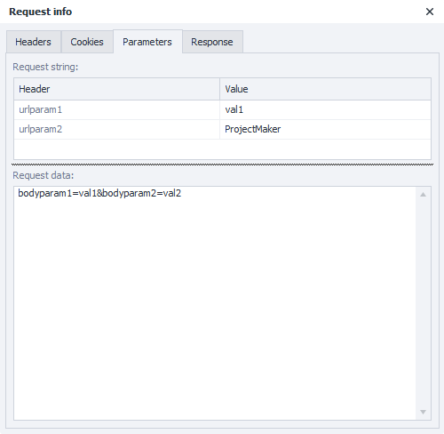

Parameters sent in the request:

- *Query string — parameters sent as part of the URL (for the request in this screenshot, the URL was `https://httpbin.org/post?urlparam1=val1&urlparam2=ProjectMaker`)
- *Request data — parameters sent in the request body.

**Response**

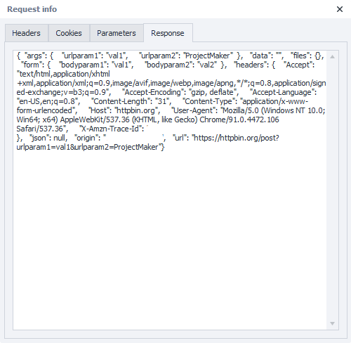

The screenshot shows the server’s response after a [❗→ POST request](/wiki/spaces/RU/pages/534315180 "/wiki/spaces/RU/pages/534315180") to https://httpbin.org/post.

  

## What is this used for?

- Analyzing requests made by the browser:

 - for creating your own requests using actions like [❗→ GET request](/wiki/spaces/RU/pages/534315165 "/wiki/spaces/RU/pages/534315165"), [❗→ POST request](/wiki/spaces/RU/pages/534315180 "/wiki/spaces/RU/pages/534315180"), [❗→ HTTP requests](/wiki/spaces/RU/pages/489259052 "/wiki/spaces/RU/pages/489259052")
- Blocking unwanted requests (using whitelist or blacklist)

## Request context menu

If you right-click any request in the traffic window, a context menu with extra options appears.

### Copying request data

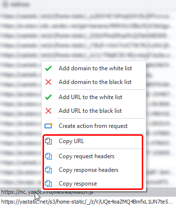

You can easily copy a request’s URL, headers (both request and response), and the server’s response.

### Auto-creating requests

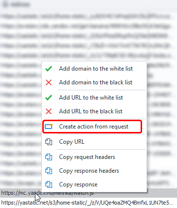

ProjectMaker will automatically create an action with the required request type. It will insert the headers, parameters, and proxy (if used).

:::note Note
After creating an action, it’s still a good idea to manually check the data that was included.
:::

### Content policy: Whitelist and blacklist

With the *content policy, you can allow or block ProjectMaker from loading specific domains or URLs. You can also use [❗→ regular expressions](/wiki/spaces/RU/pages/534086111 "/wiki/spaces/RU/pages/534086111") for this.

There are three possible states:

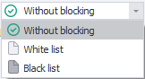

:::warning Attention
Only one list—whitelist or blacklist—can be active at a time.
:::

1. *No restrictions — all addresses are loaded without exceptions.
2. *Whitelist — only the domains and addresses specified in the whitelist will be loaded.
3. Blacklist — all addresses will be loaded except those in the blacklist.

#### Why might you need this?

- ProjectMaker waits for the page to finish loading before performing any action. But sometimes a page is stuck loading forever or takes veeery loooong to load, slowing template execution. This can happen if the browser is trying to load a script from a third-party site but can't for some reason. The *Content Policy* can help—add the script address to the blacklist, switch the policy to *Blacklist, and that unresponsive script will stop bothering you.
- By blocking unwanted addresses, you can:

 - speed up page loading
 - improve template stability
 - reduce data usage (especially important for proxies with traffic limits)

#### How does it work?

There are several ways to enable blacklists/whitelists.

**Method #1** (the easiest)

Right-click the required request in the *Traffic Window and add the domain or address from that request to one of the lists. If there is no *Content Policy action in the project, one will be automatically added (the mode in the new action will depend on which list you added the domain/address to—whitelist or blacklist).

You can manually edit the elements you've added in the action later.

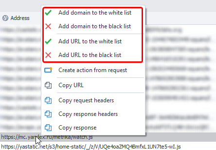

**Method #2** (through the context menu)

**Add Action** → **Browser** → **Settings**

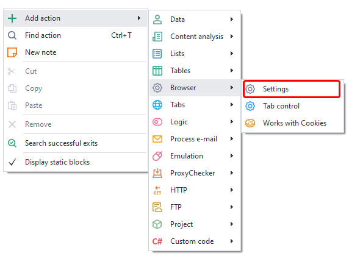

In the action settings (dropdown menu), find *Content Policy

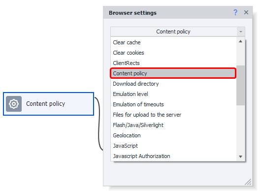

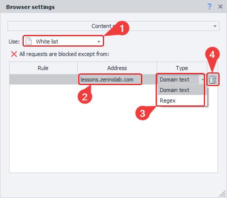

1. Choose the operating mode.
2. Address to filter (domain or [❗→ regular expression](/wiki/spaces/RU/pages/534086111 "/wiki/spaces/RU/pages/534086111"))
3. How to handle the address from step 2
4. Use this button to remove a condition (alternative: select the condition and press DELETE on your keyboard)

**Method #3** (via [❗→ *Profile window](/wiki/spaces/RU/pages/735903758 "/wiki/spaces/RU/pages/735903758"))

First, click the *Profile icon in the main ProjectMaker window^(1)^ — the *Current Profile window will open, then open the *Browser tab^(2)^ in it. At the bottom of this tab, activate *Content^(3)^. Here you can manually add new filtering conditions for requests.

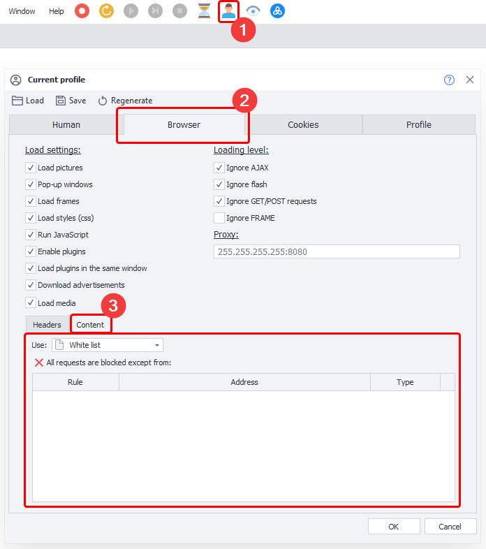

Adding a new rule

In version 7.1.6.0 with the standard theme (*Interface - Light, *Editor - Modern2), it may not be obvious how to add new rules manually (this applies to both profile and action methods).

Immediately after adding an action and selecting a mode (Whitelist or Blacklist), the top row is highlighted.

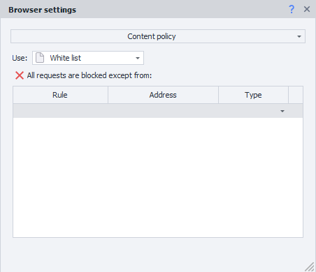

After you add a new condition and select how it should be handled, the cursor does not move to a new row and there is no "Add" button.

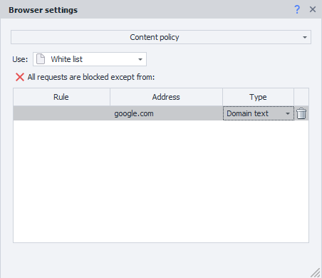

To add a new rule, you need to click several times below the newly added condition—then you’ll be able to create another one.

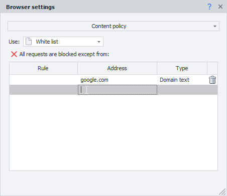

Below is a GIF showing the whole process (adding via profile works the same way).

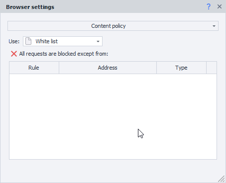

  

## Usage example

Let's look at an example using the forum https://zennolab.com/discussion/

Open the traffic window and go to the URL above. You’ll see lots of requests made by the browser — to VK, Facebook, Yandex, Google, CloudFlare, and other resources besides https://zennolab.com/discussion/.

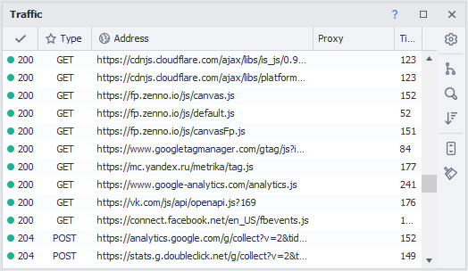

|  |
| :--: |
| The screenshot shows just a small portion of the requests. |

Imagine you want to block requests to VK, Facebook, and Yandex. Additionally, you want to block any address containing the word *analytics (anywhere in the URL). Here’s what the *Content Policy action might look like for this:

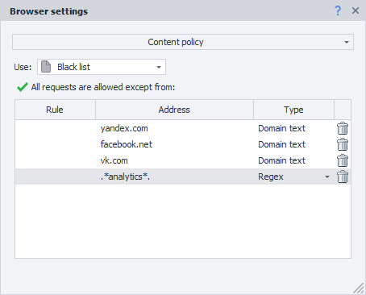

Here’s what the *Traffic Window looks like after applying the rules in the above screenshot and visiting https://zennolab.com/discussion/ again.

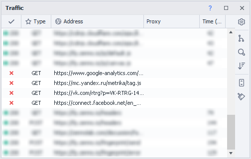

  

## Useful links

- [❗→ GET request](/wiki/spaces/RU/pages/534315165 "/wiki/spaces/RU/pages/534315165")
- [❗→ POST request](/wiki/spaces/RU/pages/534315180 "/wiki/spaces/RU/pages/534315180")
- [❗→ HTTP requests](/wiki/spaces/RU/pages/489259052 "/wiki/spaces/RU/pages/489259052")
- [❗→ Regular Expression Tester](/wiki/spaces/RU/pages/534086111 "/wiki/spaces/RU/pages/534086111")
- [❗→ Web Developer Tools (DevTools)](/wiki/spaces/RU/pages/1331134465 "/wiki/spaces/RU/pages/1331134465")