---
sidebar_position: 3
title: "Variable Window"
description: ""
date: "2025-07-19"
converted: true
originalFile: "Окно переменных.txt"
targetUrl: "https://zennolab.atlassian.net/wiki/spaces/RU/pages/735608872"
---
:::info **Please read the [*Terms of Use for materials on this resource*](../Disclaimer).**
:::

> 🔗 **[Original page](https://zennolab.atlassian.net/wiki/spaces/RU/pages/735608872)** — Source of this material

_______________________________________________  

## Description

The variable window is used for creating, deleting, renaming project variables and editing their values. Essentially, this window is a table with the ability to edit and sort variables.

:::note Note
This window is convenient for debugging. During project execution, you can change variable values using the Variable Processing action.
:::

  

## What is it used for?

- Various operations with variables.
- Tracking changes to variables while debugging your project.

  

## How to open the window?

- One way to open the “**Variable Window**” is to click the corresponding button in the [❗→ static blocks panel](/wiki/spaces/RU/pages/534053179 "/wiki/spaces/RU/pages/534053179").

:::warning Attention
If you don’t see the static blocks panel, right-click on an empty area in the workspace and check “Show static blocks” in the context menu.
:::

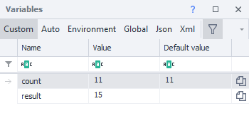

- Another way is via the **Window =&gt; Variables** menu.

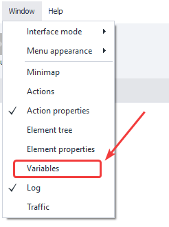

  

## Controls

Let’s take a look at each element of the variable window:

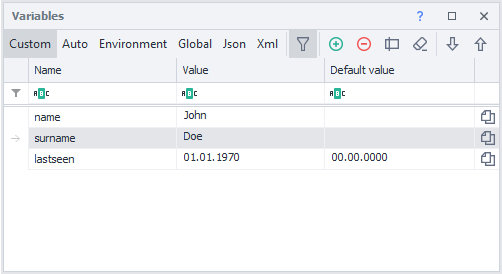

### Types of Variables

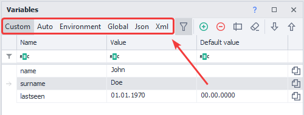

Basically, this is a tab that switches the display of the selected variable type. There are six options:

#### **Custom**

These are variables you create yourself when writing a template. Variable names must use the Latin alphabet. You can’t use spaces or characters other than the underscore `_`. Digits are allowed in names, but not at the start.

#### **Auto**

Auto-variables are generated automatically in project recording mode, as well as when adding certain [❗→ blocks](https://zennolab.atlassian.net/wiki/spaces/RU/pages/486342706/ProjectMaker "https://zennolab.atlassian.net/wiki/spaces/RU/pages/486342706/ProjectMaker"), for example when you automatically add the [❗→ Get Value](/wiki/spaces/RU/pages/534315124 "/wiki/spaces/RU/pages/534315124") block. Auto-generated variable names look like this: `Variable1, RecognitionResult0`, but you can always move auto-variables to **Custom** and then give them any desired name.

##### **How do you move an auto-created variable to Custom?**

To do this, go to the **Auto** tab, select the variable, and click the “Move to Custom” button:

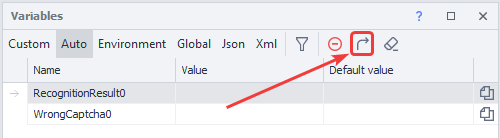

:::note Note
After moving a variable to Custom, you can rename it to something more meaningful.
:::

#### Environment

This tab displays the environment variables of the project: various instance page parameters (URL, DOM, text, domain, notification and alert text, etc.), time and date variables, project variables (name, folder, proxy rules, last error id, etc.), many profile variables (email, gender, name, user agent, etc.)

:::note Note
You can find the full list of environment variables in the article Environment Variables in ZennoPoster.
:::

#### Global

Ordinary variables are visible only within a single project thread (if the project runs multithreaded, each thread will have its own local, independent variable).

Global variables, on the other hand, **are available to all projects and their threads** in ZennoPoster.

To prevent confusion, global variables have an extra property – *Namespace*.

:::warning Attention
ProjectMaker and ZennoPoster have separate global variables. In other words, changes made to a global variable in PM won't be visible in ZP, and vice versa.
:::

#### Json

These variables are also generated automatically, but during JSON parsing. In “Parsing” mode, for the “[❗→ JSON/XML Processing](https://zennolab.atlassian.net/wiki/spaces/RU/pages/488964124/ "https://zennolab.atlassian.net/wiki/spaces/RU/pages/488964124/")“ action, you can instantly split values from JSON into automatically created variables matching the nodes.

Later in the project, you can use these variables with the `{ -Json….- }` prefix, or in [❗→ C#](/wiki/spaces/RU/pages/492011596 "/wiki/spaces/RU/pages/492011596") using the `project.Json` object. More details: [❗→ Working with JSON and XML](/wiki/spaces/RU/pages/488964124 "/wiki/spaces/RU/pages/488964124") 

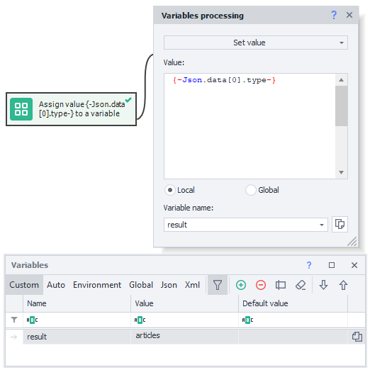

#### Xml

XML variables are automatically created in the corresponding tab after parsing an XML document. In “**Parsing**” mode, for the “[❗→ JSON/XML Processing](https://zennolab.atlassian.net/wiki/spaces/RU/pages/488964124/ "https://zennolab.atlassian.net/wiki/spaces/RU/pages/488964124/")“ action, you parse XML, which itself can also be contained in a variable.

Like JSON variables, XML variables can be used with the `{ -XML….- }` prefix, or in [❗→ C#](/wiki/spaces/RU/pages/492011596 "/wiki/spaces/RU/pages/492011596") through the `project.XML` object properties.
 For more info: [❗→ Working with JSON and XML](/wiki/spaces/RU/pages/488964124 "/wiki/spaces/RU/pages/488964124") 

### Filter

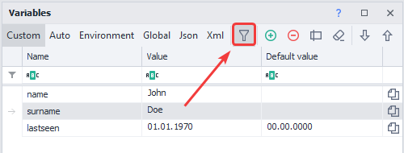

Opens and closes the filter field.

#### Filter Field

If your project has a large number of variables, finding the required one may take a lot of time. That’s why the variable window has advanced filtering. You can filter each column in 12 different ways.

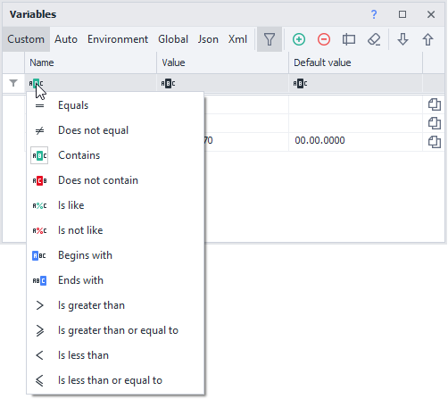

:::note Note
Read more about filters in the article describing the Log Window.
:::

### Clear Sorting

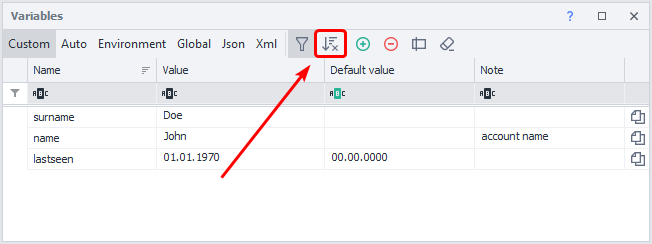

Resets sorted variables.

:::note Note
The button is displayed only when variables are sorted by one of the columns. A bit more about sorting is written in the paragraph about Headers.
:::

### Add

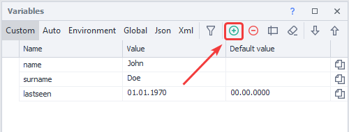

Opens a dialog where you can enter the name of the new variable.

:::note Note
A variable name can consist of Latin letters, digits, and underscore, but it must start with a letter.
:::

### Delete

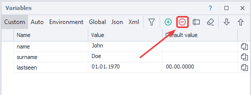

Deletes the selected variable after showing a confirmation window. To select a variable, just click anywhere on its row.

### Rename

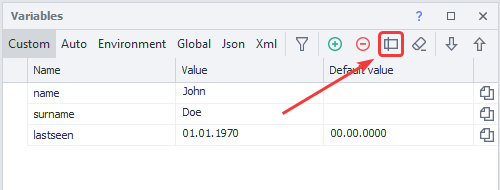

Brings up a dialog where you can edit the variable name.

:::note Note
Quick access to renaming – double-click on the variable row in the “Name” column.
:::

:::note Note
Renaming is available only for Custom and Global types.
:::

:::warning Attention
The variable name will also change in all actions where it is used!
:::

### Clear Unused Variables

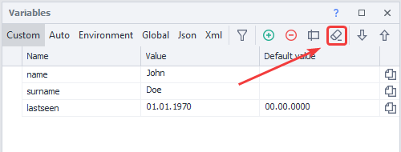

In large projects, variables sometimes get created that are no longer used in the template. To avoid wasting memory and cluttering your workspace, you can periodically delete such variables. ZennoPoster will find all unused variables and show you a list so you can delete them. You need to clean up each variable type separately.

### Manual Variable Sorting (Drag & Drop)

:::info Information
Added in ZennoPoster 7.2.1.0
:::

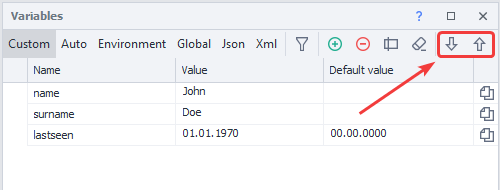

You can arrange the variables however you like using the “Up” and “Down” buttons or by dragging with your mouse (Drag & Drop). Your custom order works only when column sorting is turned off (to do this, click the “Clear Sorting” button).

Example

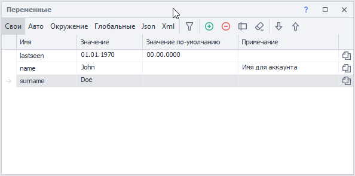

:::note Note
To reset manual sorting, you can sort the variables by any of the columns.
:::

### Column Headers

They serve for both filtering and sorting variables. Just click a column header to sort variable names or values in ascending or descending order. Clicking again changes the sort direction.

By right-clicking a column header, you can choose which columns are displayed in the menu.

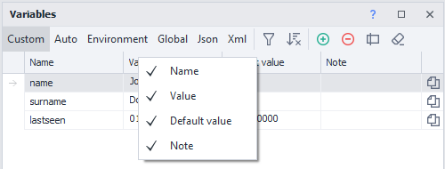

#### “Name” Column

Displays the names of variables used in the project.

:::note Note
If you double-click a variable’s name, a renaming dialog will appear.
:::

:::warning Attention
Variable names are case-sensitive: Name, NAME, and name are three different variables!
:::

#### “Value” Column

Shows the current values of variables. Click a variable’s value to edit right in the input field.

#### “Default Value” Column

If you want a variable to already have a certain value when the project starts (by default, all variables are empty), enter the value here.

:::note Note
Environment, Json, and Xml variables do not have default values, so this column is missing for them.
:::

#### “Note” Column

By default, this column is hidden.

You can use it for comments about variables (for example, to specify what the variable is used for).

:::note Note
Global variables have an extra column for the namespace.
:::

### Copy Variable Macro to Clipboard

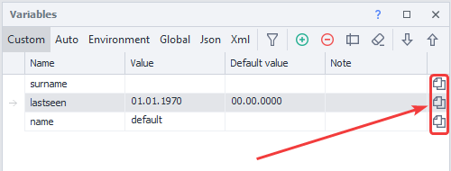

Quick way to copy a macro such as 
`{ -Variable.value- }` – just click the icon on the variable’s row.

### Context Menu

Right-click next to a variable to bring up the context menu.

:::note Note
Available for Custom, Auto, and Global tabs.
:::

*Custom, Global* tabs

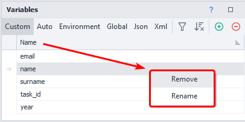

*Auto* tab

* * *

## Copying Variables from One Project to Another

Sometimes you need to create a new project using variables from an old template. Copying variables one by one is very inefficient, so you can copy all variables from one project at once and paste them into another.

- Open the old project.
- Right-click the “**Project Variables**” button in the “[❗→ **Static Blocks Panel**](/wiki/spaces/RU/pages/534053179 "/wiki/spaces/RU/pages/534053179")” and click “**Copy Variables**”.

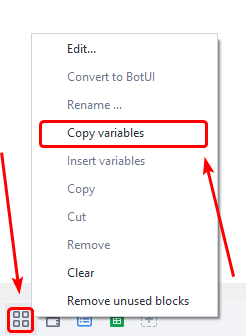

- Then open the new project, right-click the “**Project Variables**” button again in the “[❗→ **Static Blocks Panel**](/wiki/spaces/RU/pages/534053179 "/wiki/spaces/RU/pages/534053179")” and click “**Paste Variables**”.

- In the window that pops up, check the types of variables you want to insert into the project and confirm the insertion. Variables are copied along with their default values.

* * *

## Working with Variables

### Variable Macros

In ProjectMaker, you can use variables through macros like `{ -Variable.myVariable- }` – this macro will pass the value of `myVariable` when the project runs. Just insert the variable macro into any action property field (where possible), and the action will substitute the variable’s value at runtime.

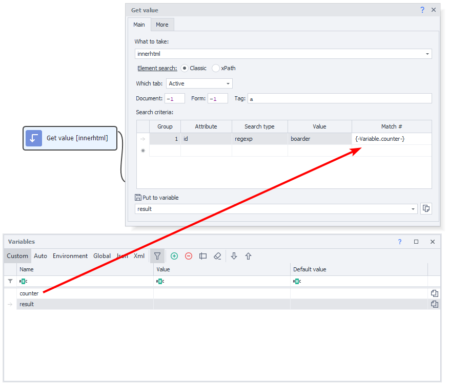

For global variables, you need to specify the scope in the macro: `{ -GlobalVariable.someNamespace.text- }`

Working with Variables using C# and JS Actions

Generally, ZennoPoster variables are of three types:

- **Numeric** (
`0, 1, 12.652, 10500`).
- **Text** (`"Hello World"`, `"
Hello World
"`).
- **Boolean** (`True`, `False`).

You can perform various operations with variables in a **C#** block or a **JavaScript** block, but remember that in **C#** all variables are received as text, so you need to convert them to numbers or booleans before using them as such.

For example, here’s how to convert string variables to **int** in **C#** using two different methods, add them together, and return them as a string for further use in the project:

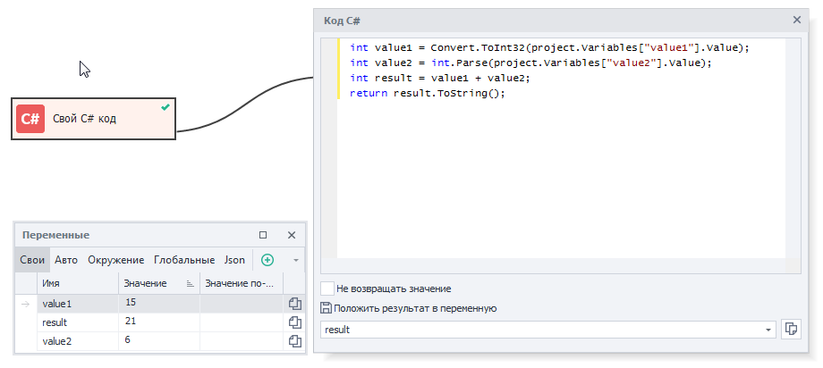

For string operations in a **JavaScript** block, wrap text variables in quotes – `'{ -Variable.value1- }'`

### Naming Recommendations for Variables

Try to name your variables in a way that immediately makes their purpose and usage clear. Avoid using short, meaningless names like 
`f1`, `qwerty` – this will make future fixes and support much harder both for you and for others who might work with the template.
If a variable is frequently used in the project, try to make the name short but clear – `counter`, `username`, `proxy`. 
When naming variables with two or more words, separate them either using uppercase letters (`secondPassword`) or underscores (`page_html`). 

These are standard practices that will greatly improve readability and efficiency in your project.

### Assigning a Value

A basic example of using variables is combining static text, custom variables, and environment variables using the [❗→ Variable Processing](/wiki/spaces/RU/pages/486309922 "/wiki/spaces/RU/pages/486309922") action.

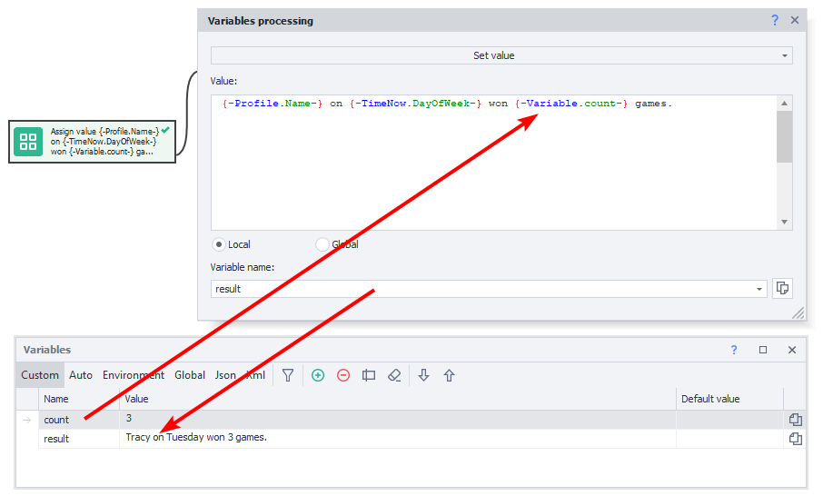

In this example, the name is taken from the environment variable `{ -Profile.Name- }`, the day of the week from `{ -TimeNow.DayOfWeek- }`, and the age from your custom variable `count`. After running the block, the result is saved in the `result` variable.

### Arithmetic Operations on Numbers

By using JavaScript syntax and the corresponding block, you can perform various mathematical operations with numbers.

In this case, `value1` and `value2` contain integers you want to add together and then multiply by 10. The result is stored in the `result` variable.

### Using Variables

Try to use variables instead of hardcoded text in places where values may change later.

For example, with file paths – your computer has one path, while your client has another. If the required file is in the same directory as the project (or one of its subdirectories), it’s a good idea to use the macro `{ -Project.Directory- }` – the path to the template's folder. For example: `{ -Project.Directory- }file.txt`

  

## Useful Links

- [❗→ Working with Variables](/wiki/spaces/RU/pages/486309922 "/wiki/spaces/RU/pages/486309922")
- [❗→ Working with JSON and XML](/wiki/spaces/RU/pages/488964124 "/wiki/spaces/RU/pages/488964124")