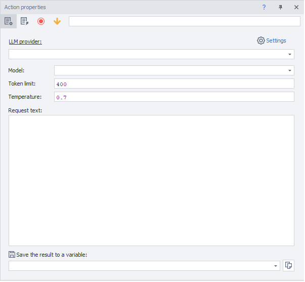
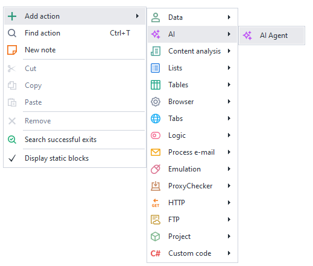
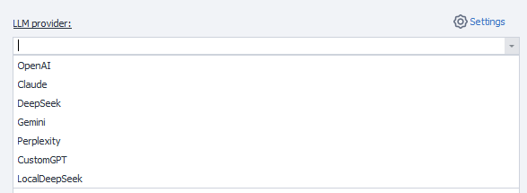
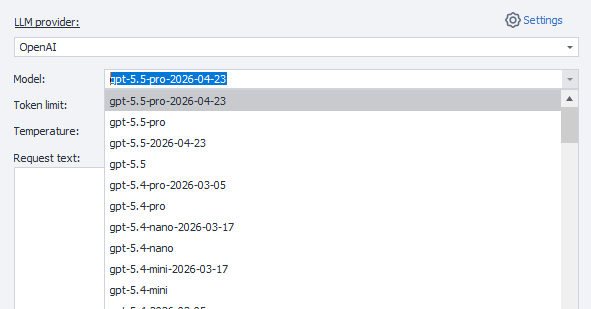
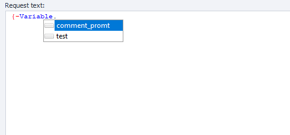

## Description
This action is used to work with LLM providers (OpenAI, Anthropic, DeepSeek, Gemini, Perplexity). It allows you to send a text prompt from a request or variable and receive the response into a variable.



### How to add the action to a project?
Via the context menu: **Add action → AI → AI Agent**



### What is it used for?
- Maintaining a conversation with an AI
- Writing and generating articles, posts, and texts
- Creating and applying prompts
- Analyzing and classifying data
- Automating content creation

_______________________________________________
## How it works

### Basic settings


1. Select the LLM module from the dropdown list.
2. You must first enter your API key for the service in the settings.

_______________________________________________
### Model


Model — the name of the LLM model that will be used for text generation.

After selecting a provider, the list of models is automatically loaded into the dropdown list.
If you are using your own LLM service, enter the model name manually.

The selected model affects:
- response quality;
- generation speed;
- request cost.

_______________________________________________
### Token limit
Token limit — a parameter that restricts the maximum number of tokens the model can generate in a response.

Suitable for:
- controlling response length;
- reducing API request costs;
- decreasing generation latency;
- preventing excessively long responses.

Details:
- only output tokens are counted, not the input prompt (control the input prompt in the "Request text" field);
- if the limit is reached, generation stops;
- too small a value may cut off the response mid-sentence.

The default value is **400**. Increase it if you need longer responses (you can also add an additional constraint in the prompt text, for example — `"Comment no longer than 300 characters"`).

:::info A token is not a word or a character
A token is a chunk of text, so the length depends heavily on the language and content.
:::

Approximate estimates for modern LLMs:

| Language   | 1 token ≈                    | 100 tokens ≈                        |
|------------|------------------------------|-------------------------------------|
| English    | 3–4 characters / ~0.75 words | ~70–80 words                        |
| Russian    | 2–3 characters / ~0.4–0.6 words | ~40–60 words                     |
| German     | 2–4 characters               | ~50–70 words                        |
| Chinese    | 1–2 characters               | ~100–150 characters                 |
| Japanese   | 1–2 characters               | ~80–120 characters                  |
| Code       | highly syntax-dependent      | often more tokens than plain text   |

:::warning
Russian text is usually "more expensive" in tokens than English text of the same length.
:::

_______________________________________________
### Temperature
Temperature — a parameter that controls the degree of randomness and creativity in text generation.

How it works:
- low values → responses are more precise, predictable, and stable;
- high values → responses are more diverse, creative, and unexpected.

Typical range: from `0` to `2` (depending on the LLM).

Practical usage:
- `0.0–0.3` → code, SQL, documentation, precise answers;
- `0.4–0.7` → regular chat and most tasks (default);
- `0.8–1.2+` → creativity, ideas, storytelling.

Details:
- Temperature `0` does not guarantee 100% identical results, but makes responses maximally deterministic;
- high temperature increases the likelihood of unusual phrasing and errors.

_______________________________________________
### Request text


Request text (or prompt) — the instruction and input data passed to the model to generate a response.

:::tip
Variable and project macros can be used.
:::

The prompt determines:
- what the model should do;
- what format to respond in;
- what style to use;
- what data to analyze.

A good prompt typically includes:
- the task;
- context;
- constraints;
- the desired response format.

#### Example of a good prompt for x.com

```
You are an active Crypto Twitter user.

Write a reply to the post in the style of an experienced crypto/AI user.

Tone:
- smart but not overly formal
- short and to the point
- meme phrases are allowed
- maximum 280 characters
- no hashtags
- no emoji-spam

Post:
{-POST_TEXT-}

Return only the reply.
```

_______________________________________________
### Save to variable
Select the variable where the result will be returned.

_______________________________________________
## Useful links

- [❗→ Traffic Window](/wiki/spaces/RU/pages/735805465 "/wiki/spaces/RU/pages/735805465")
- [❗→ Variables Window](/wiki/spaces/RU/pages/735608872 "/wiki/spaces/RU/pages/735608872")
- [❗→ Data](https://zennolab.atlassian.net/wiki/spaces/RU/pages/534085840/- "https://zennolab.atlassian.net/wiki/spaces/RU/pages/534085840/-")
- [❗→ AI Settings](/zennoposter/ProjectMaker/ProjectMaker%20Settings/AI_PM)
