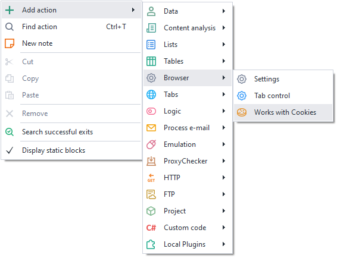
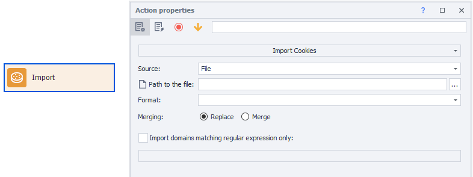
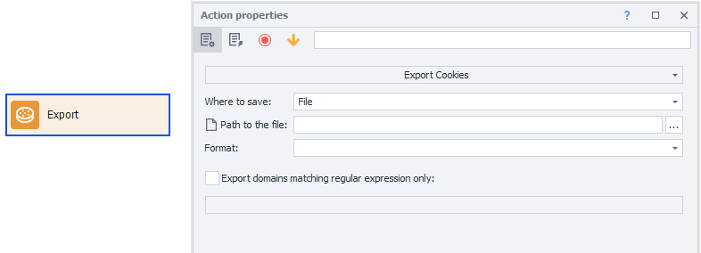
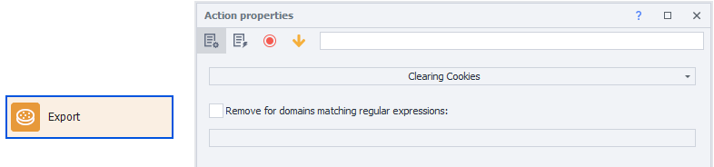

---
sidebar_position: 0
title: "Working with Cookies"
description: "Converted from HTML to MDX"
date: "2025-07-24"
converted: true
originalFile: "Работа с Cookies.txt"
targetUrl: "https://zennolab.atlassian.net/wiki/spaces/RU/pages/1307738124/Cookies"
---
import DisclaimerNotice from '@site/src/components/DisclaimerNotice';

<DisclaimerNotice />

> 🔗 **[Original page](https://zennolab.atlassian.net/wiki/spaces/RU/pages/1307738124/Cookies)** — Source for this material

_______________________________________________  

## Description

:::info Information
Added in ZennoPoster 7.3.1.0
:::

This action lets you manage your project's cookies. You can import, export, and clear cookies. For loading or saving, you can use either a file or a variable. Both Netscape and JSON formats are supported ([❗→ Netscape cookie file format](https://zennolab.atlassian.net/wiki/spaces/RU/pages/2155872263) [❗→ Json cookie file format](https://zennolab.atlassian.net/wiki/spaces/RU/pages/2155479041)).

Goes perfectly with the [❗→ Cookie Management Tool](https://zennolab.atlassian.net/wiki/spaces/RU/pages/735903758#%D0%92%D0%BA%D0%BB%D0%B0%D0%B4%D0%BA%D0%B0-%E2%80%9CCookies%E2%80%9D "https://zennolab.atlassian.net/wiki/spaces/RU/pages/735903758#%D0%92%D0%BA%D0%BB%D0%B0%D0%B4%D0%BA%D0%B0-%E2%80%9CCookies%E2%80%9D").

## How to add this action to your project?

Via the context menu **Add Action** → **Browser** → **Cookie Management**

Or use the [❗→ smart search](https://zennolab.atlassian.net/wiki/spaces/RU/pages/506200090/ProjectMaker+7#%D0%A3%D0%BC%D0%BD%D1%8B%D0%B9-%D0%BF%D0%BE%D0%B8%D1%81%D0%BA-%D0%B4%D0%B5%D0%B9%D1%81%D1%82%D0%B2%D0%B8%D0%B9 "https://zennolab.atlassian.net/wiki/spaces/RU/pages/506200090/ProjectMaker+7#%D0%A3%D0%BC%D0%BD%D1%8B%D0%B9-%D0%BF%D0%BE%D0%B8%D1%81%D0%BA-%D0%B4%D0%B5%D0%B9%D1%81%D1%82%D0%B2%D0%B8%D0%B9").

## Where can you use this / What is it for?

- Import cookies from purchased accounts
- Export cookies for use in a regular browser
- Add missing cookies to a profile

## How to work with the action?

### Import

Loads cookies into the profile for use in a project, with or without a browser.

#### Source

Choose where the cookies will be loaded from: a *file or a [❗→ *variable](/wiki/spaces/RU/pages/735608872 "/wiki/spaces/RU/pages/735608872").

#### File path

:::note Note
This option is shown if you chose File as the Source.
:::

Specify the full path to the file from which cookies will be loaded.

#### Variable

:::note Note
This option is shown if you chose Variable as the Source.
:::

Select the variable where your cookies are saved.

#### Format

Here you need to select the format for the cookies to be loaded. The available options are **JSON** and **Netscape** ([❗→ Netscape cookie file format](https://zennolab.atlassian.net/wiki/spaces/RU/pages/2155872263) [❗→ Json cookie file format](https://zennolab.atlassian.net/wiki/spaces/RU/pages/2155479041)).

#### Merge

**Replace** – existing cookies will be deleted before setting new cookies.

**Merge** – existing cookies in the browser will be merged with the loaded cookies.

:::warning Warning
When merging, if a cookie name matches, the browser’s cookie will be replaced by the imported one.
:::

#### Import only domains matching the regular expression

If you want to load cookies only for certain domains, enable this setting and enter a [❗→ regular expression](/wiki/spaces/RU/pages/534086111 "/wiki/spaces/RU/pages/534086111").

  

### Export

Exports the current cookies.

#### Where to save

Select where the cookies will be saved: to a *file or to a [❗→ *variable](/wiki/spaces/RU/pages/735608872 "/wiki/spaces/RU/pages/735608872").

#### File path

:::note Note
This option is shown if you chose File as Where to Save.
:::

Specify the full path to the file where cookies will be saved.

#### Variable

:::note Note
This option is shown if you chose Variable as Where to Save.
:::

Select the variable where cookies will be saved.

#### Format

Here you need to select the save format for the cookies. The available options are **JSON** and **Netscape**.

#### Export only domains matching the regular expression

If you want to save cookies only for certain domains, enable this setting and enter a [regular expression](https://zennolab.atlassian.net/wiki/pages/resumedraft.action?draftId=534086111 "https://zennolab.atlassian.net/wiki/pages/resumedraft.action?draftId=534086111").

  

### Clear Cookies

A block with this property will clear browser cookies completely for all sites, or only for specified domains using [❗→ regular expressions](/wiki/spaces/RU/pages/534086111 "/wiki/spaces/RU/pages/534086111"). Works similarly to the action in the [❗→ Browser → Settings](https://zennolab.atlassian.net/wiki/spaces/RU/pages/489324572#%D0%9E%D1%87%D0%B8%D1%81%D1%82%D0%B8%D1%82%D1%8C-%D0%BA%D1%83%D0%BA%D0%B8 "https://zennolab.atlassian.net/wiki/spaces/RU/pages/489324572#%D0%9E%D1%87%D0%B8%D1%81%D1%82%D0%B8%D1%82%D1%8C-%D0%BA%D1%83%D0%BA%D0%B8") group.

  

## Useful links

- [❗→ Cookie Management Tool](https://zennolab.atlassian.net/wiki/spaces/RU/pages/735903758#%D0%92%D0%BA%D0%BB%D0%B0%D0%B4%D0%BA%D0%B0-%E2%80%9CCookies%E2%80%9D "https://zennolab.atlassian.net/wiki/spaces/RU/pages/735903758#%D0%92%D0%BA%D0%BB%D0%B0%D0%B4%D0%BA%D0%B0-%E2%80%9CCookies%E2%80%9D")
- [❗→ Browser → Settings → Clear Cookies](https://zennolab.atlassian.net/wiki/spaces/RU/pages/489324572#%D0%9E%D1%87%D0%B8%D1%81%D1%82%D0%B8%D1%82%D1%8C-%D0%BA%D1%83%D0%BA%D0%B8 "https://zennolab.atlassian.net/wiki/spaces/RU/pages/489324572#%D0%9E%D1%87%D0%B8%D1%81%D1%82%D0%B8%D1%82%D1%8C-%D0%BA%D1%83%D0%BA%D0%B8")
- [❗→ Regular Expressions](/wiki/spaces/RU/pages/534086111 "/wiki/spaces/RU/pages/534086111")
- [❗→ Netscape cookie file format](https://zennolab.atlassian.net/wiki/spaces/RU/pages/2155872263)
- [❗→ Json cookie file format](https://zennolab.atlassian.net/wiki/spaces/RU/pages/2155479041)