:::info **Please read the [*Material Usage Rules on this site*](../../../../Disclaimer).**
:::

> 🔗 **[Original page](https://zennolab.atlassian.net/wiki/spaces/RU/pages/489324572)** — Source of this material

_______________________________________________  

## Description

[❗→ Browser](https://zennolab.atlassian.net/wiki/spaces/RU/pages/534315373 "https://zennolab.atlassian.net/wiki/spaces/RU/pages/534315373") is the main part of ZennoPoster automation. This action brings together various actions for changing browser options and properties. Some of these can also be found in [❗→ Project Settings](https://zennolab.atlassian.net/wiki/spaces/RU/pages/534315477 "https://zennolab.atlassian.net/wiki/spaces/RU/pages/534315477"), but you should distinguish between them - project settings are set when the template starts, while the settings in this action can be changed right in the course of template execution. For example, you can enable or disable image display in the browser whenever necessary during the workflow.

## How to add an action to your project?

Via the context menu **Add Action** → **Browser** → **Settings**

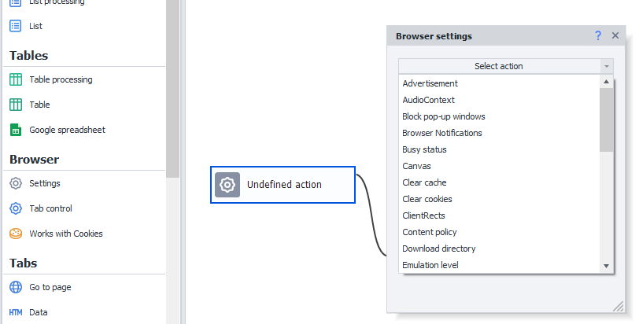

Or you can use the [❗→ smart search](https://zennolab.atlassian.net/wiki/spaces/RU/pages/506200090/ProjectMaker+7#%D0%A3%D0%BC%D0%BD%D1%8B%D0%B9-%D0%BF%D0%BE%D0%B8%D1%81%D0%BA-%D0%B4%D0%B5%D0%B9%D1%81%D1%82%D0%B2%D0%B8%D0%B9 "https://zennolab.atlassian.net/wiki/spaces/RU/pages/506200090/ProjectMaker+7#%D0%A3%D0%BC%D0%BD%D1%8B%D0%B9-%D0%BF%D0%BE%D0%B8%D1%81%D0%BA-%D0%B4%D0%B5%D0%B9%D1%81%D1%82%D0%B2%D0%B8%D0%B9").

## Where can you use this?

- Change various browser settings in real-time.
- Apply various security and anonymity settings to your bot/project.

## How to work with the action?

Let's look at each action option in detail.

### AudioContext

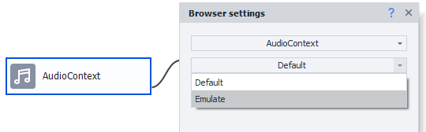

This option serves to increase the browser profile's uniqueness and offers two values: default and emulation. By default, it’s taken from the project settings; in the other case, it’s emulated randomly.

### Canvas

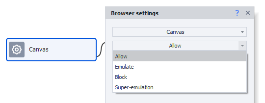

Another browser property that helps give your bot individuality. This is a web page rendering element based on [WebGL](https://developer.mozilla.org/en-US/docs/WebGL "https://developer.mozilla.org/en-US/docs/WebGL") technology for hardware-accelerated 3D graphics, which has its own unique fingerprint. There are three options: allow according to project settings, emulate, and block.

:::info Info
The “Super Emulation” mode was added in ZennoPoster 7.7.0.0. It works only in Chromium engine. Read more in the article Profile | Canvas/WebGL.
:::

:::note Note
Mainly, Canvas transmits data about your web system characteristics, and this data is widely used on many sites for anti-fraud or automation protection.
:::

### ClientRects

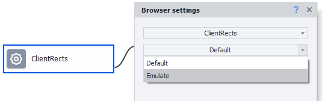

Another fingerprint based on obtaining hashes when images are scaled. It can be emulated or used as default.

### Flash/Java/Silverlight

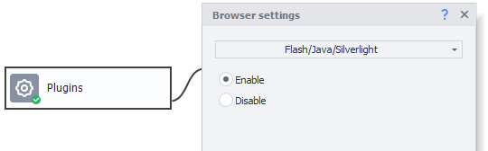

Enables or disables popular (but now obsolete) browser plugins. Helps work with old sites, reducing resource load and the amount of transferred traffic.

If Flash is enabled by this option but for some reason doesn’t work in Chrome, add [❗→ launch arguments](https://zennolab.atlassian.net/wiki/spaces/RU/pages/534315477#%D0%90%D1%80%D0%B3%D1%83%D0%BC%D0%B5%D0%BD%D1%82%D1%8B "https://zennolab.atlassian.net/wiki/spaces/RU/pages/534315477#%D0%90%D1%80%D0%B3%D1%83%D0%BC%D0%B5%D0%BD%D1%82%D1%8B") `--enable-system-flash --disable-software-rasterizer --disable-smooth-scrolling` . For more info: [Flash not working in browser](https://zennolab.kayako.com/ru/article/392-ne-rabotaet-flash-v-brauzere "https://zennolab.kayako.com/ru/article/392-ne-rabotaet-flash-v-brauzere")

### JavaScript

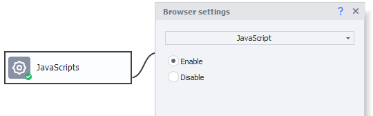

Enables/disables JavaScript support in the browser.

:::warning Attention
Almost all modern websites become unusable when JavaScript is disabled, as scripts often form not just the layout, but even the content, not to mention numerous JS-based protections. However, sometimes, temporarily disabling JS with this action, doing something on the site (such as logging in), and then enabling it again can be useful. This hack can help with buggy or tricky sites.
:::

### Javascript Authorization

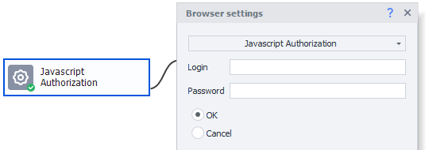

Sometimes, sites prompt users to log in via a modal window shown by Javascript. This is especially common in server panels, router admin panels, etc. This action lets you pass login and password to a script and authorize. You can add the relevant [❗→ project variables](https://zennolab.atlassian.net/wiki/spaces/RU/pages/486309922 "https://zennolab.atlassian.net/wiki/spaces/RU/pages/486309922") into these fields.

### Javascript Confirm

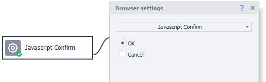

This feature confirms a modal window shown by Javascript. You can choose to click either “**OK**” or “**Cancel**” in the action.

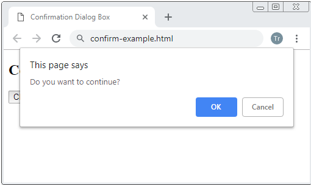

### Javascript Prompt

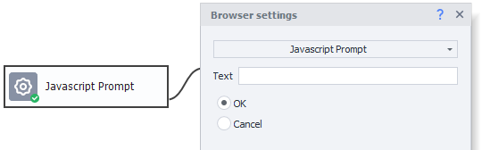

Pretty much the same as the previous property, but lets you pass a value, which can be from a variable or typed in the text field. 

:::note Note
This block is often used to solve "Answer the secret question" protections you see on some forums. In this case, the question is shown in a popup window using Javascript.
:::

### Popup Blocking

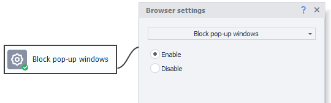

This setting blocks opening new tabs in the browser.

If a link is supposed to open in a new tab and this setting is enabled, it won’t open.

### Geolocation

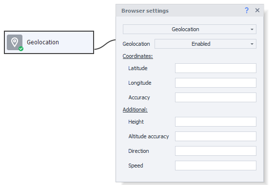

For correct operation on some sites, when working with maps, or just for better bot emulation to appear like a real user, it’s recommended to emulate geolocation as close as possible to the country/city of the emulated user, as well as match the GEO of the used proxies. With the “Geolocation” action, you can specify pre-calculated coordinates (latitude and longitude), their accuracy, elevation above sea level with its accuracy, direction, and speed.

#### Coordinates

- Latitude and longitude are set in degrees.
- Accuracy - meters

#### Extras

- Elevation above sea level in meters.
- Elevation accuracy - meters
- Direction - degrees (0 - north, 90 - east, 270 - west).
- Speed - meters per second

:::tip Tip
When using the Set Proxy function (described below), geolocation can be emulated automatically.
:::

### Load plugins in same window

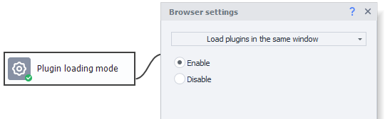

This option allows you to take screenshots of Flash and other plugins. If plugins load in a different window, a blank square will be shown instead of the plugin’s image.

### Stylesheet loading

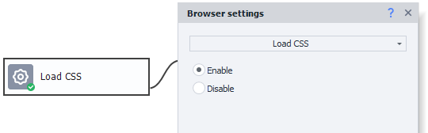

With this property, you can disable CSS styles on a page. This may reduce resource consumption, but can also alter page layout and cause errors. Use this option with caution.

### Frame loading

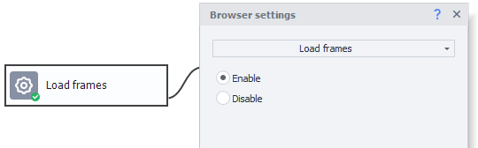

Frames often show HTML from other sites, various social media widgets, ads, and other junk. By disabling frames, you can noticeably speed up page loading and reduce resource usage.

### Start instance

Sometimes, in templates that work with requests, you need to start a browser instance briefly — for example, if a user has logged out and you need to reauthorize via the browser. That’s what this property is for.

To start a browser, choose it from the drop-down list and specify any necessary arguments. You can use the current browser profile or create a new one based on project settings.

After completing the task, you can return to “no browser” mode by adding a block with the "**No browser**" setting.

:::note Note
There are cases when, on a certain page or at a certain step, you need to switch browsers (for example, if the layout breaks). In that case, this block is also handy — you can switch from Chrome to Firefox in real time, do what you need, and then switch back.
:::

#### “Site Isolation (beta)” Checkbox

Site Isolation is a Chrome security feature that gives you extra protection against certain vulnerabilities. It uses Chrome’s sandboxing to make it harder for untrusted sites to access your data or steal info from your logins on other sites.

When activated, this checkbox turns on site isolation. This helps emulations pass certain checks on some sites, for example, Cloudflare Turnstile.

#### Arguments

When launching an instance, you can specify arguments. Find the list of available arguments at:

- [Run Chromium with flags](https://www.chromium.org/developers/how-tos/run-chromium-with-flags "https://www.chromium.org/developers/how-tos/run-chromium-with-flags")
- [List of Chromium Command Line Switches](https://peter.sh/experiments/chromium-command-line-switches/ "https://peter.sh/experiments/chromium-command-line-switches/")

#### Use path to profile folder

:::info Info
Profile folders were added in ZennoPoster version 7.3.1.0. Read more in the article Working with Profile Folder.
:::

When this option is enabled, you need to specify the path to the profile folder that should be loaded for this instance.

##### **Path**

Full path to the profile folder (you can use [❗→ variables](https://zennolab.atlassian.net/wiki/spaces/RU/pages/735608872 "https://zennolab.atlassian.net/wiki/spaces/RU/pages/735608872")).

##### **Create folder if it doesn’t exist**

If this option is OFF and there is no profile folder at the specified path, the action will end in error.

If this option is ON and no profile folder is found at the specified path, a new empty profile folder will be created.

##### **Create missing variables on load**

When [❗→ saving a profile folder with an action](https://zennolab.atlassian.net/wiki/spaces/RU/pages/486539291#%D0%A1%D0%BE%D1%85%D1%80%D0%B0%D0%BD%D0%B8%D1%82%D1%8C-%D0%BF%D1%80%D0%BE%D1%84%D0%B8%D0%BB%D1%8C-%D0%BF%D0%B0%D0%BF%D0%BA%D1%83 "https://zennolab.atlassian.net/wiki/spaces/RU/pages/486539291#%D0%A1%D0%BE%D1%85%D1%80%D0%B0%D0%BD%D0%B8%D1%82%D1%8C-%D0%BF%D1%80%D0%BE%D1%84%D0%B8%D0%BB%D1%8C-%D0%BF%D0%B0%D0%BF%D0%BA%D1%83"), you can also save project variables.

If you turn on this setting, the variables saved with the profile folder will be loaded into the project as well.

#### Apply current browser profile

##### **Enabled**

The launched instance will be linked to the profile that was in the project when the instance launched.

:::warning Attention
If you launch an instance along with a profile folder and enable the Apply current browser profile option, the profile folder data will be overwritten by the project's current profile.
:::

##### **Disabled**

A new profile will be generated when launching the instance.

**Integration with "Start Instance" action**

A new browser type has been added to the standard "Start Instance" action — **"Chromium from ZennoBrowser (beta)"**.

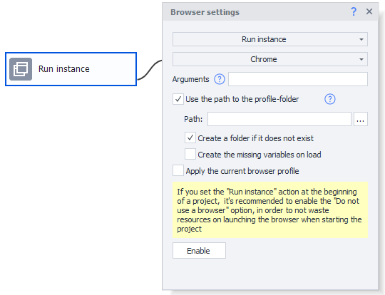

This integration provides a unified approach to launching different browser types within a single action.

You can find detailed instructions on integration in the section [❗→ ZennoPoster integration with ZennoBrowser](https://zennolab.atlassian.net/wiki/spaces/RU/pages/3641737224) 

### Images

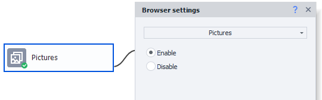

Disabling images really helps save resources. If your tasks don’t involve graphics, feel free to turn images off.

:::note Note
These days, users rarely disable images to save traffic, so on some sites (especially social networks), this method may seem suspicious.
:::

:::warning Attention
In image-disabling mode, solving captchas via services or programs will most likely not work and you’ll get an error.
:::

### Media (Video/Audio)

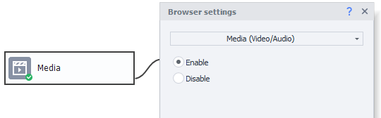

Enables/disables media content with HTML elements like `<video/>`, `<audio/>`, etc. Also helps save traffic and resources.

### User action wait

:::info Info
Starting with ZennoPoster 7.7.0.0, this action was moved to a separate action — User action wait
:::

Old description. For versions below 7.7.0.0

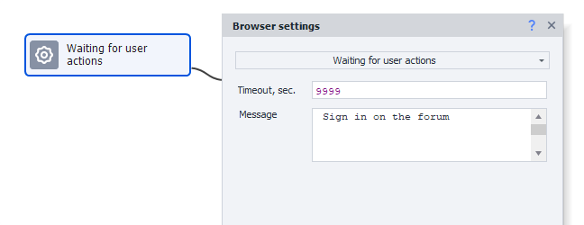

This feature is useful if, for any reason, you need to intervene in the project’s workflow and do something manually in the browser.

1. Timeout during which all necessary actions must be performed (if you don’t know it, set it to 99999, for example). After the timeout, the template will continue.
2. A message as a hint. It will be shown at the top of the instance window.

**Action wait window**

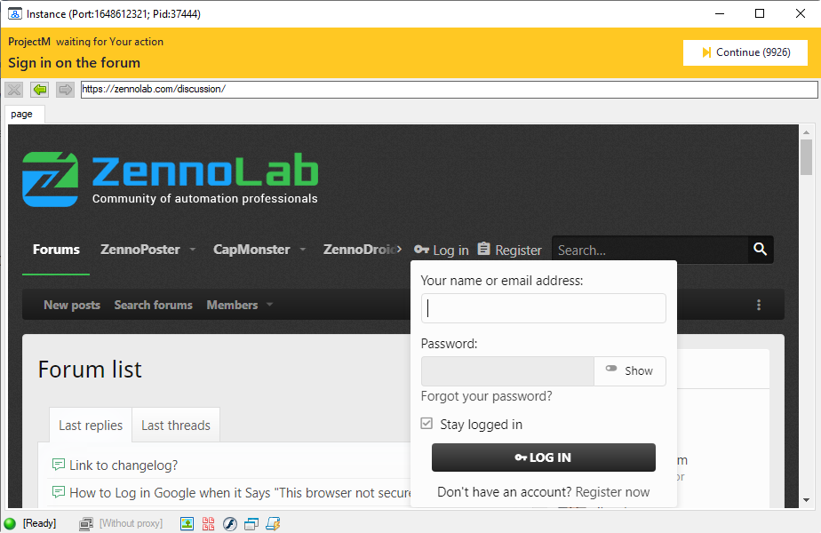

After this action is run, the browser window will open.
At the top (orange background), top left is the project name that opened this window (in this case *ProjectM).
Below the project name is the text you set in the action.
On the right is the “Continue” button, and in brackets is the number of seconds left until the window automatically closes.

This is useful, for example, for template users who are wary of saving login data or for entering credit card info.

### Clear cookies

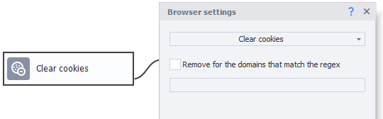

A block with this property will clear browser cookies for all sites or only for the domains you specify, using [❗→ regular expressions](https://zennolab.atlassian.net/wiki/spaces/RU/pages/534086111 "https://zennolab.atlassian.net/wiki/spaces/RU/pages/534086111"). 

:::info Info
In ZennoPoster 7.3.1.0, a Cookies action was added. It lets you not only clear cookies, but also save/load them in various formats.
:::

### Clear cache

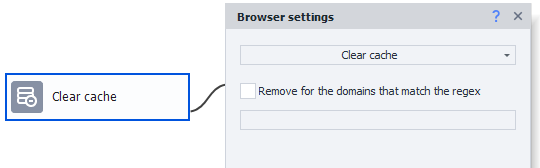

Cache is a special place on your computer’s hard drive where visited pages, images, and any other data from viewed pages are stored. For better anonymity, it’s a good idea to clear cache before each session (a special option for this is in project settings), but you can also clear cache during the workflow. Just like with “Clear Cookies,” cache can also be cleared for a particular domain or a group of domains specified by [❗→ regular expression](https://zennolab.atlassian.net/wiki/spaces/RU/pages/534086111 "https://zennolab.atlassian.net/wiki/spaces/RU/pages/534086111").

### Folder for file downloads

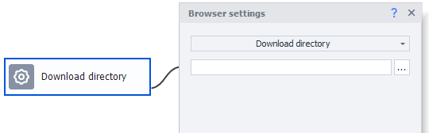

By selecting a local folder on your computer, you set where files, images, videos, and other documents should be saved on download. Otherwise (if not specified), files will download to the [❗→ ZennoPoster temp folder](https://zennolab.atlassian.net/wiki/spaces/RU/pages/808845378#%D0%9F%D1%83%D1%82%D1%8C-%D0%BA-%D0%BA%D1%83%D0%BA%D0%B0%D0%BC-%D0%B8-%D0%BA%D1%8D%D1%88%D1%83 "https://zennolab.atlassian.net/wiki/spaces/RU/pages/808845378#%D0%9F%D1%83%D1%82%D1%8C-%D0%BA-%D0%BA%D1%83%D0%BA%D0%B0%D0%BC-%D0%B8-%D0%BA%D1%8D%D1%88%D1%83").

### Reload instance

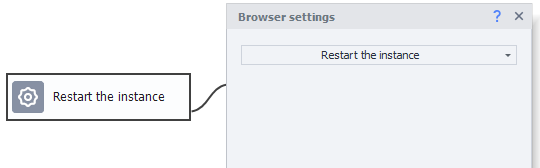

Closes and reopens the project instance without losing data. Sometimes, in projects that use the browser in a loop for a long time, you may encounter crashes and errors due to lack of memory. In such cases, this action helps. It reloads the instance and frees up memory at the same time.

### Content policy

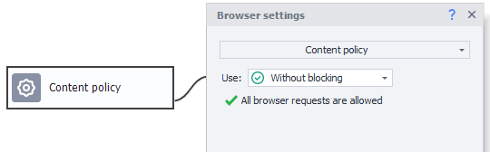

This action helps make your project more secure and ties up less traffic and resources. You can block requests to user-defined URLs and domains. This tool is also available in the [❗→ traffic window](https://zennolab.atlassian.net/wiki/spaces/RU/pages/735805465 "https://zennolab.atlassian.net/wiki/spaces/RU/pages/735805465"). 

There are three options:

1. **No restrictions** - default mode.
2. **Whitelist** - all requests will be blocked except for the addresses and domains you specify.
3. **Blacklist** - only the requests you specify will be blocked.

:::note Note
With “Content Policy,” you can solve different real-world tasks — for example, blocking not all images, but just GIFs, or blocking analytics scripts and various protections.
:::

### Ads

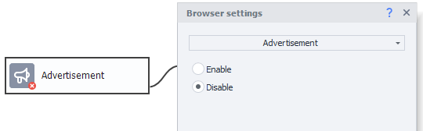

Disables ad banners to save traffic.

:::note Note
The file with blocking rules is located in the installed program folder - Progs\Data\Filters\easylist.txt If you edit easylist.txt, you’ll need to delete Progs\Data\Filters\easylist.zpdata afterwards.
:::

### Busy state

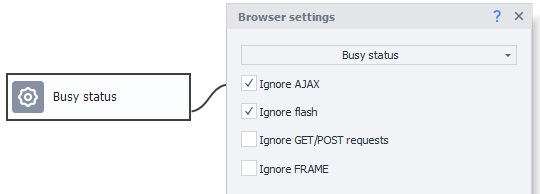

Lets you turn off waiting for full load for each of the listed components individually: Ajax, Flash, GET/POST-requests, FRAME.

:::note Note
Users often face a situation when the browser waits a long time for a frame with content from a “down” site to load. As a result, time and resources are wasted. This action lets you flexibly disable such problematic elements.
:::

### Browser notifications

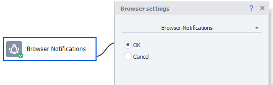

Turns browser notifications (location, push notifications, and other popups that can get in the way of scraping or posting, or even block working with the site) on or off.

### Emulation level

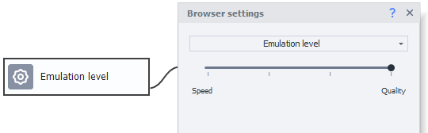

This setting is similar to the one in [❗→ project properties](https://zennolab.atlassian.net/wiki/spaces/RU/pages/534315477 "https://zennolab.atlassian.net/wiki/spaces/RU/pages/534315477"), but here you can flexibly adjust the emulation level as your template runs. Move the slider to focus either on speed or quality, or choose a balance.

:::note Note
You can adjust emulation level individually for every action block in the Action Properties under the Extras tab.
:::

### Set Proxy

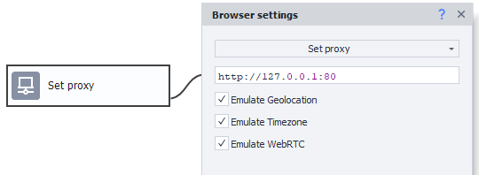

A block with this property sets a proxy, and, if needed, can automatically emulate geolocation, timezone, and WebRTC for the set proxies (select via checkboxes). You can set a proxy by passing the value via a variable or as a string, in the correct format.

:::note Note
ZennoPoster uses the following proxy formats: With authentication: protocol://login:password@ip:port Without authentication: protocol://ip:port protocol can be http, socks4, or socks5. If you don't specify the protocol, http is used by default.
:::

:::info Info
The following features of the Set Proxy action were added in ZennoPoster 7.7.2.0:
:::

#### How to detect proxy “exit” IP

Geolocation, timezone, and WebRTC emulations depend on knowing what IP address you have when working through a proxy.

**Automatically** - the program will try to detect the "exit" IP via ZennoLab servers.

**Manually specified** - you specify the proxy "exit" IP yourself.

#### Ignore errors checkbox

If this option is enabled and the "exit" IP couldn't be detected automatically, the "entry" proxy IP will be used for emulation.

If disabled, the block will fail.

#### DNS over HTTPS templates

:::info Info
Works only in Chromium engine.
:::

A field for specifying a URI template for a DNS-over-HTTPS resolver.

To specify multiple resolvers, separate templates with spaces.

If the URI template contains the dns variable, GET will be used; otherwise, POST will be used.

:::note Note
Sample value: `https://dns.example.net/dns-query{?dns}`
:::

### Set Certificate

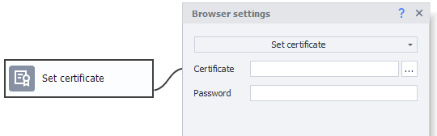

Some sites (like Webmoney) require a certificate to work with them. Just specify the local path to the certificate file and its password.

### Files to upload to server

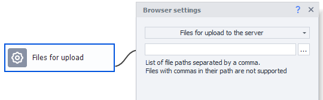

This block sets local paths to files to be uploaded to the server in the next steps. For example, when attaching an image to an email. In a regular browser, a file chooser opens for you to pick the files, then clicking “OK” uploads them to the site. 
In ZennoPoster, this window won't appear; files are uploaded right after clicking the relevant HTML element.

For uploading multiple files, separate the file paths with commas.

### Time zone

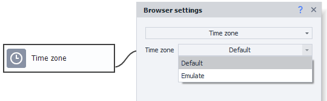

Lets you emulate a time zone as entered in the fields for hours and minutes.

### Delay emulation

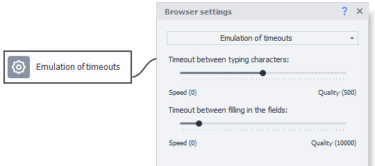

Sets general emulation options for all blocks, both for typing each character and before switching between fields. With the two sliders, you can prioritize speed or quality.

### Touchscreen emulation

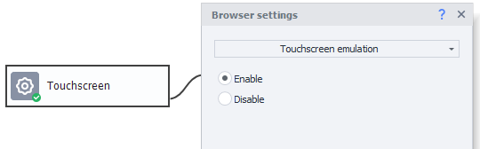

For the correct emulation of Touch events in the browser (instead of the mouse), you need to enable this option. This action is added automatically when recording in [❗→ "Touch Events" input mode](https://zennolab.atlassian.net/wiki/spaces/RU/pages/534315373#11.-%D0%A0%D0%B5%D0%B6%D0%B8%D0%BC-%D0%B2%D0%B2%D0%BE%D0%B4%D0%B0 "https://zennolab.atlassian.net/wiki/spaces/RU/pages/534315373#11.-%D0%A0%D0%B5%D0%B6%D0%B8%D0%BC-%D0%B2%D0%B2%D0%BE%D0%B4%D0%B0") in the [❗→ browser window](https://zennolab.atlassian.net/wiki/spaces/RU/pages/534315373 "https://zennolab.atlassian.net/wiki/spaces/RU/pages/534315373").

  

## Usage example

Let’s look at an example of using this action.

Say you need to generate maximally random coordinates, or coordinates that change as the bot is on the site (the bot is “traveling”).

To do this, activate the "**Browser Settings**" block and enable **Geolocation**. To generate random numbers, you can use the macro `{ -Random.Double- | --10- | -10- }` (this macro will randomly yield non-integers in the range -10 to 10) or pre-calculate latitude/longitude values (calculating them in a loop by adding a counter), and insert those values into the relevant fields.

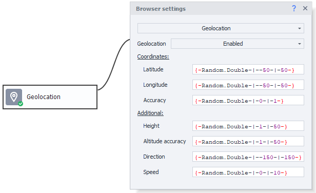

## Useful links

- [Canvas API](https://developer.mozilla.org/ru/docs/Web/API/Canvas_API "https://developer.mozilla.org/ru/docs/Web/API/Canvas_API")
- [❗→ Proxy usage](https://zennolab.atlassian.net/wiki/spaces/RU/pages/492208129 "https://zennolab.atlassian.net/wiki/spaces/RU/pages/492208129")
- [❗→ Project Settings](https://zennolab.atlassian.net/wiki/spaces/RU/pages/534315477 "https://zennolab.atlassian.net/wiki/spaces/RU/pages/534315477")