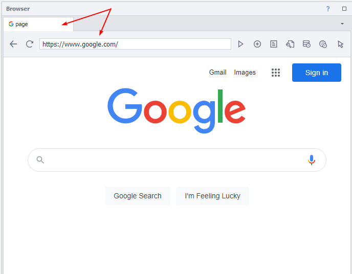
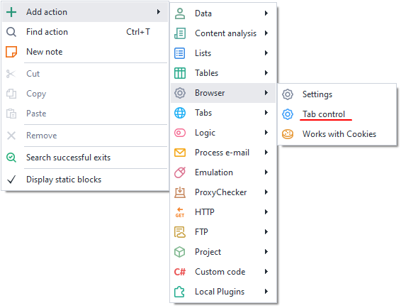
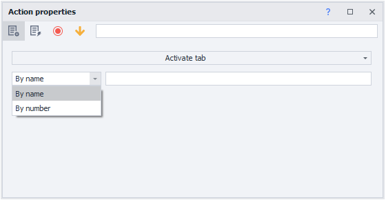
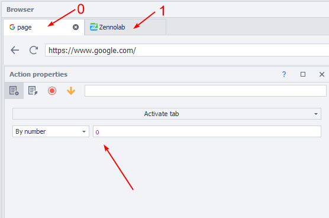
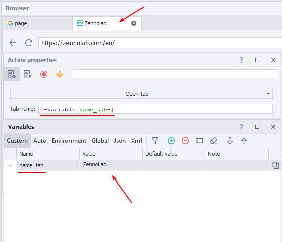
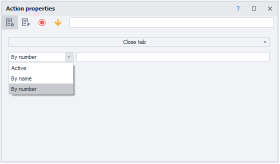
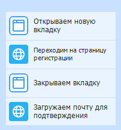

:::info **Please read the [*Material Usage Rules on this site*](../../../../Disclaimer).**
:::

> 🔗 **[Original page](https://zennolab.atlassian.net/wiki/spaces/RU/pages/534020201)** — Source of this material

_______________________________________________  

## Description

A browser tab is a site tab in your browser.

In the image, we have a tab open named "Yandex" with the Yandex homepage loaded.

## Where can this be used? 

- Working with multiple sites simultaneously
- Closing pop-up sites
- Opening an additional browser window with the desired site
- Switching to the required site window
- Naming a site window for easier navigation while working

## How to add this action to your project?

Use the context menu **Add Action** → **Browser** → **Manage Tab**

Or use the [❗→ smart search](https://zennolab.atlassian.net/wiki/spaces/RU/pages/506200090/ProjectMaker+7#%D0%A3%D0%BC%D0%BD%D1%8B%D0%B9-%D0%BF%D0%BE%D0%B8%D1%81%D0%BA-%D0%B4%D0%B5%D0%B9%D1%81%D1%82%D0%B2%D0%B8%D0%B9 "https://zennolab.atlassian.net/wiki/spaces/RU/pages/506200090/ProjectMaker+7#%D0%A3%D0%BC%D0%BD%D1%8B%D0%B9-%D0%BF%D0%BE%D0%B8%D1%81%D0%BA-%D0%B4%D0%B5%D0%B9%D1%81%D1%82%D0%B2%D0%B8%D0%B9").

## How to work with this?

### Activate tab

:::info Info
This action only works with already open windows.
:::

- **By name** – the browser will activate the window with the name specified in the action. You can specify a variable with the tab name.

:::info Info
It's important to use the correct case for the tab name. If your tab is called Google, but in the action you enter google, the action will not work.
:::

- **By number** – opens the tab by number from left to right.

:::info Info
Tab numbering starts at 0. The first tab will always have number 0, and subsequent tabs will be 1, 2, 3, and so on.
:::

  

### Open tab

- The action will create a new browser window with the specified name. You can also enter a variable in the field if you generate the name randomly or use a prepared list.

  

### Close tab

- *Active – the tab that is currently in front of you.
- *By name – enter the name or a variable that contains the tab name, preserving the case.
- *By number – enter the tab number. Numbering goes left to right, starting at 0. If you need to close the very first tab, enter zero in the field; the next tabs are numbered 1, 2, 3, and so on.

## Example of use: 

You're registering on a site and need to confirm your account via email.

1. Select to open a tab, specifying the name
2. Load the site and perform the necessary actions
3. Select to close the tab by specifying the window name from step 1 or the tab number

  

## Useful links

1. [❗→ Browser Window](/wiki/spaces/RU/pages/534315373 "/wiki/spaces/RU/pages/534315373")
2. [❗→ Settings](https://zennolab.atlassian.net/wiki/spaces/RU/pages/534020228/- "https://zennolab.atlassian.net/wiki/spaces/RU/pages/534020228/-")