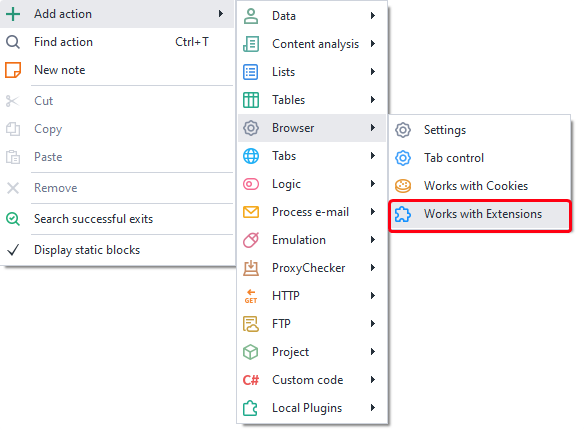
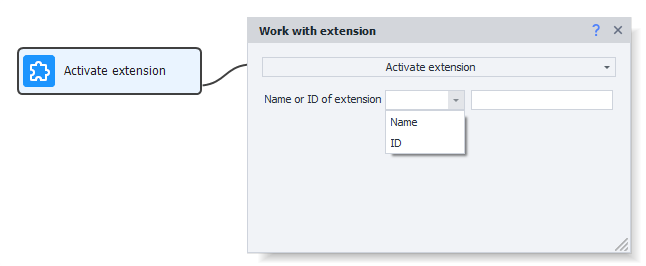
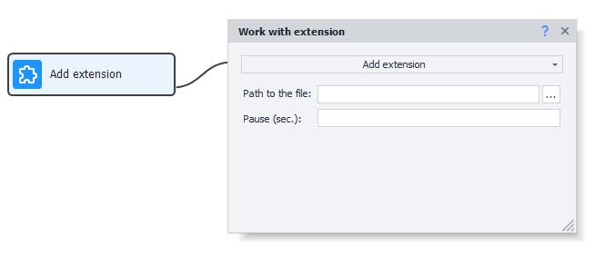
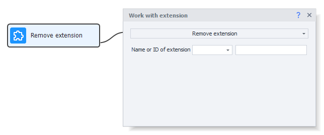
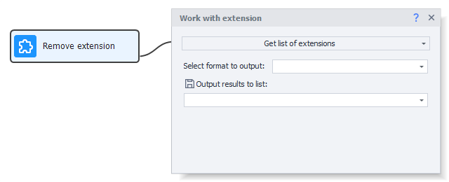

---
sidebar_position: 4
title: "Working with Extensions"
description: "Converted from HTML to MDX"
date: "2025-07-24"
converted: true
originalFile: "Работа с расширениями.txt"
targetUrl: "https://zennolab.atlassian.net/wiki/spaces/RU/pages/2081423361"
---
import DisclaimerNotice from '@site/src/components/DisclaimerNotice';

<DisclaimerNotice />

> 🔗 **[Original Page](https://zennolab.atlassian.net/wiki/spaces/RU/pages/2081423361)** — Source for this material

_______________________________________________   

## Description

:::info Info
Added in ZennoPoster 7.6.0.0 as “Beta”
:::

With this action, you can manage extensions in the browser.

  

## How do I add this action to a project?

Via the context menu **Add Action** → **Browser** → **Working with Extensions**




Or use the [❗→ smart search](https://zennolab.atlassian.net/wiki/spaces/RU/pages/506200090/ProjectMaker+7#%D0%A3%D0%BC%D0%BD%D1%8B%D0%B9-%D0%BF%D0%BE%D0%B8%D1%81%D0%BA-%D0%B4%D0%B5%D0%B9%D1%81%D1%82%D0%B2%D0%B8%D0%B9 "https://zennolab.atlassian.net/wiki/spaces/RU/pages/506200090/ProjectMaker+7#%D0%A3%D0%BC%D0%BD%D1%8B%D0%B9-%D0%BF%D0%BE%D0%B8%D1%81%D0%BA-%D0%B4%D0%B5%D0%B9%D1%81%D1%82%D0%B2%D0%B8%D0%B9").

  

## Where can you use this?

- Ad blocking on websites
- Using crypto wallets and interacting with blockchain
- Connecting to a VPN
- Any other functions provided by browser extensions

  

## How do you work with this action?

### Activating an Extension




Activating an extension means opening its popup window, if it has one.

The cube activates the extension by its name or ID (similar to clicking the extension icon in a regular browser)

- *Extension Name or ID* – what value to look for.
- *Value* – the value used to search for and activate the extension.

:::info Info
To get the Id or Name of the extension, use the Get Extension List option.
:::

<details>
<summary>C# Equivalent</summary>

```csharp
var extension1 = instance.GetExtensionById("EXTENSION_ID");
extension1 = instance.GetExtensionByName("EXTENSION_NAME");
extension1.Activate();
```


</details>
### Installing an Extension




Installs an extension from a CRX file.

How to download an extension as a CRX file is described below, in the paragraph *How to Download a crx Extension File.*

- **File Path** – path to the crx file

:::info Info
A "Pause" option was added in 7.7.0.0
:::

- **Pause (sec.)** – a pause may be needed when installing certain extensions to make sure it is installed correctly before you start working with it.

<details>
<summary>C# Equivalent</summary>


```csharp
instance.InstallCrxExtension("PATH_TO_CRX_FILE");
```


</details>
### Removing an Extension




Removes an extension by its name or ID (similar to clicking the extension icon in a regular browser)

- *Extension Name or ID* – what value to look for.
- *Value* – the value used to search for and activate the extension.

:::info Info
To get the Id or Name of the extension, use the Get Extension List option.
:::

<details>
<summary>C# Equivalent</summary>

```csharp
var extension1 = instance.GetExtensionById("EXTENSION_ID");
extension1 = instance.GetExtensionByName("EXTENSION_NAME");
instance.UninstallExtension(extension1);

// OR...
instance.UninstallExtension("EXTENSION_ID");
```

</details>
### Getting the List of Extensions




Returns a list with information about all installed extensions

- **Output Format** – the format in which the info will be saved (*Name, *ID, or *Name and ID)
- **Put Result in List** – which [❗→ list](/wiki/spaces/RU/pages/534053375 "/wiki/spaces/RU/pages/534053375") will store the data about the extensions

<details>
<summary>C# Equivalent</summary>

```csharp
var allExtensions = instance.GetAllExtensions();
//allExtensions[0].Name
//allExtensions[0].Id
```

</details>
* * *

## How to Store Extension State Between Project Runs

You should use [❗→ profile folders](/wiki/spaces/RU/pages/1251475485 "/wiki/spaces/RU/pages/1251475485") for this. All installed extensions and their state will be automatically saved there.

* * *

## How to Download a crx Extension File

### Preparing the Browser

First, you’ll need to set up your Chrome browser at home.

1. Go to the [extension store](https://chrome.google.com/webstore/category/extensions "https://chrome.google.com/webstore/category/extensions")
2. Find one of the extensions that can download crx files directly from extension pages and install it in your browser.
Here are some examples:

 1. [CRX Extractor/Downloader](https://chrome.google.com/webstore/detail/crx-extractordownloader/ajkhmmldknmfjnmeedkbkkojgobmljda "https://chrome.google.com/webstore/detail/crx-extractordownloader/ajkhmmldknmfjnmeedkbkkojgobmljda") – this one will be used as an example below.
 2. [Get CRX](https://chrome.google.com/webstore/detail/get-crx/dijpllakibenlejkbajahncialkbdkjc "https://chrome.google.com/webstore/detail/get-crx/dijpllakibenlejkbajahncialkbdkjc")
 3. [Extension Source Downloader](https://chrome.google.com/webstore/detail/extension-source-download/dlbdalfhhfecaekoakmanjflmdhmgpea "https://chrome.google.com/webstore/detail/extension-source-download/dlbdalfhhfecaekoakmanjflmdhmgpea")

### Downloading the Extension File

Downloading a crx file using [CRX Extractor/Downloader](https://chrome.google.com/webstore/detail/crx-extractordownloader/ajkhmmldknmfjnmeedkbkkojgobmljda "https://chrome.google.com/webstore/detail/crx-extractordownloader/ajkhmmldknmfjnmeedkbkkojgobmljda")

1. Go to your desired extension’s page. For example – [Google Translate](https://chrome.google.com/webstore/detail/google-translate/aapbdbdomjkkjkaonfhkkikfgjllcleb "https://chrome.google.com/webstore/detail/google-translate/aapbdbdomjkkjkaonfhkkikfgjllcleb")
2. Activate the extension and click the button to download the extension


3. Choose where to save the file

* * *

## Useful Links

- [❗→ Browser Window](/wiki/spaces/RU/pages/534315373 "/wiki/spaces/RU/pages/534315373")
- [❗→ Using Profile Folders](/wiki/spaces/RU/pages/1251475485 "/wiki/spaces/RU/pages/1251475485")