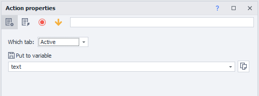
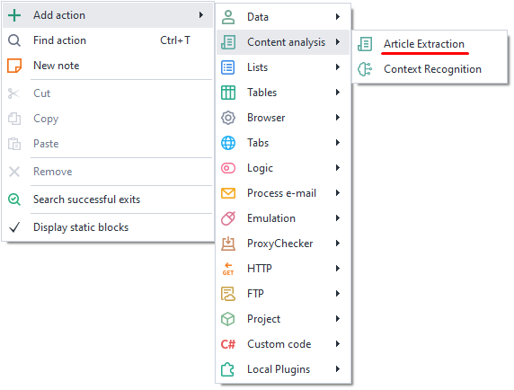
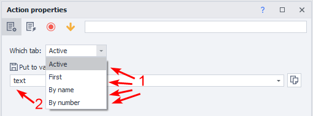
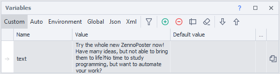
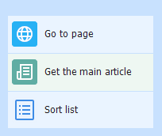

---
sidebar_position: 2
title: "Article Extraction"
description: "Converted from HTML to MDX"
date: "2025-07-24"
converted: true
originalFile: "Извлечение статьи (Article Extraction).txt"
targetUrl: "https://zennolab.atlassian.net/wiki/spaces/RU/pages/534315067/Article+Extraction"
---
import DisclaimerNotice from '@site/src/components/DisclaimerNotice';

<DisclaimerNotice />

> 🔗 **[Original page](https://zennolab.atlassian.net/wiki/spaces/RU/pages/534315067/Article+Extraction)** — Source of this material

_______________________________________________  

## Description

Allows you to extract the main article from a resource page.

## Where can it be used:

- Parsing content from websites
- Working with text

## How to add this action to your project?

Using the context menu, select **Add Action** → **Content Analysis** → **Article Extraction**

Or use the [❗→ Smart Search](https://zennolab.atlassian.net/wiki/spaces/RU/pages/506200090/ProjectMaker+7#%D0%A3%D0%BC%D0%BD%D1%8B%D0%B9-%D0%BF%D0%BE%D0%B8%D1%81%D0%BA-%D0%B4%D0%B5%D0%B9%D1%81%D1%82%D0%B2%D0%B8%D0%B9 "https://zennolab.atlassian.net/wiki/spaces/RU/pages/506200090/ProjectMaker+7#%D0%A3%D0%BC%D0%BD%D1%8B%D0%B9-%D0%BF%D0%BE%D0%B8%D1%81%D0%BA-%D0%B4%D0%B5%D0%B9%D1%81%D1%82%D0%B2%D0%B8%D0%B9").

## How to work with the action?

1. Tab with the loaded page:
a) **Active** - the tab currently displayed to you.
b) **First** - the first window on the left.
c) **By Name** - specify the tab name or variable (case-sensitive).
d) **By Number** - set the tab number. Tabs are numbered from left to right starting at 0. If you need to close the very first tab, enter zero in the field; subsequent tabs are 1, 2, 3, and so on.
2. Result variable.

Example

You need to extract the main article from the homepage https://zennolab.com/ru/

Since we're working in a single tab, select *Active

Once the action is complete, the article will be stored in the *text variable

  

## Example use case:

Go to the page and extract the text. Put the resulting content into a list for further processing.

1. Go to the page.
2. Extract the main article and put it into a variable.
3. Save it to a list.

This allows you to quickly parse text without the need for multiple tools.

  

## Useful links

1. [❗→ Content Creation](/wiki/spaces/RU/pages/489095179 "/wiki/spaces/RU/pages/489095179")
2. [❗→ Context Recognition](/wiki/spaces/RU/pages/534315397 "/wiki/spaces/RU/pages/534315397")
3. [❗→ Variables Window](/wiki/spaces/RU/pages/735608872 "/wiki/spaces/RU/pages/735608872")
4. [❗→ Tab Management](/wiki/spaces/RU/pages/534020201 "/wiki/spaces/RU/pages/534020201")