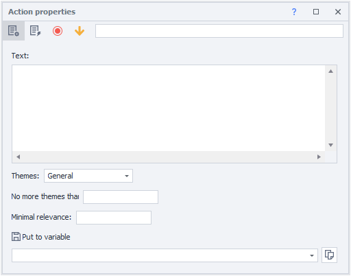
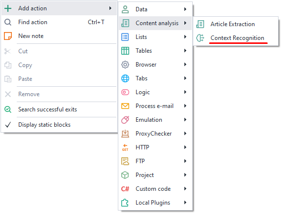
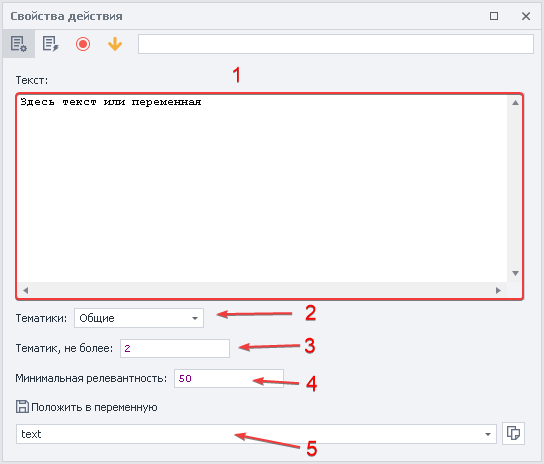
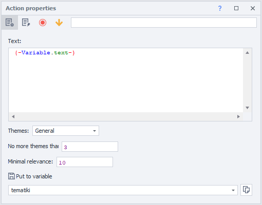
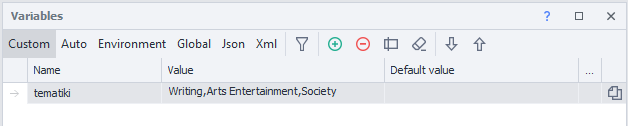

---
sidebar_position: 3
title: "Context Recognition"
description: "Converted from HTML to MDX"
date: "2025-07-24"
converted: true
originalFile: "Распознавание контекста (Contex Recognition).txt"
targetUrl: "https://zennolab.atlassian.net/wiki/spaces/RU/pages/534085781/Contex+Recognition"
---
import DisclaimerNotice from '@site/src/components/DisclaimerNotice';

<DisclaimerNotice />

> 🔗 **[Original page](https://zennolab.atlassian.net/wiki/spaces/RU/pages/534085781/Contex+Recognition)** — Source of this material

_______________________________________________  

## Description

Allows you to determine the topic of content.

:::info Information
Works only with English-language content
:::

## How to add the action to your project?

Via the context menu: **Add Action** → **Content Analysis** → **Context Recognition**

Or use the [❗→ smart search](https://zennolab.atlassian.net/wiki/spaces/RU/pages/506200090/ProjectMaker+7#%D0%A3%D0%BC%D0%BD%D1%8B%D0%B9-%D0%BF%D0%BE%D0%B8%D1%81%D0%BA-%D0%B4%D0%B5%D0%B9%D1%81%D1%82%D0%B2%D0%B8%D0%B9 "https://zennolab.atlassian.net/wiki/spaces/RU/pages/506200090/ProjectMaker+7#%D0%A3%D0%BC%D0%BD%D1%8B%D0%B9-%D0%BF%D0%BE%D0%B8%D1%81%D0%BA-%D0%B4%D0%B5%D0%B9%D1%81%D1%82%D0%B2%D0%B8%D0%B9").

## What is it used for?

- Identifying the topic of a text
- Filtering websites by topic for link placement
- Content parsing
- Determining text by given criteria

## How do you work with this action?

If you need to determine the topic of a text outside of a project, you can use the [❗→ Context Recognition](/wiki/spaces/RU/pages/534315397 "/wiki/spaces/RU/pages/534315397") tool.

1. A field for inputting the text or variable.
2. Topics: 
a) **General** – about 20 broad topic categories.
b) **Detailed** – more specific topics, about 250 categories.
3. Set the maximum number of topics the analyzer should return; you can use a variable.
4. Set the minimum text relevance from 0 to 100%; you can use a variable.
5. Variable to store the result.

:::info Information
All topics that meet the criteria will be placed in the variable, separated by a semicolon (“;”)
:::

Example

Parse the text from a website's main page and identify at least three topics.

Parse the main article from the homepage into the *text variable. Instead of looking for the text yourself, use the main text extraction feature from the web page. You can find it in the “[❗→ Article Extraction](https://zennolab.atlassian.net/wiki/spaces/RU/pages/534315067/ "https://zennolab.atlassian.net/wiki/spaces/RU/pages/534315067/")” action.

Since the site covers many topics, set a low relevance percentage.

After the action is performed, the result will be stored in the *tematiki variable.

The topics are listed and separated with a “**;**“

  

## Usage example

Context Recognition is popular among SEO specialists. One of the most common uses is determining the topic of websites before placing links.

Instead of posting your links everywhere and risking getting banned by search engines, you can first determine the topic of the page where you want to leave your link. If the text doesn’t match your site's topic, you shouldn't leave a link there. Likewise, you can check the topics of all outbound links on your own site.

Suppose you have a database of links for posting. Using **Context Recognizer**, you can divide your database into several topic-based lists. Then, when you need to promote a site, you'll use only the links that fit your site's topic. For example, you can publish a car insurance article in an automotive blog rather than in one announcing new movies.

You can also parse a site (for example, a blog) and find the pages that best match your ad’s topic. By leaving relevant comments and posts, you’ll get not only topic-matching links, but also a better chance of getting through moderation, which is especially important on quality resources.

  

## Useful links

1. [❗→ Context Recognition](/wiki/spaces/RU/pages/534315397 "/wiki/spaces/RU/pages/534315397")
2. [❗→ Article Extraction](https://zennolab.atlassian.net/wiki/spaces/RU/pages/534315067/Article+Extraction "https://zennolab.atlassian.net/wiki/spaces/RU/pages/534315067/Article+Extraction")
3. [❗→ Content Creation](/wiki/spaces/RU/pages/489095179 "/wiki/spaces/RU/pages/489095179")