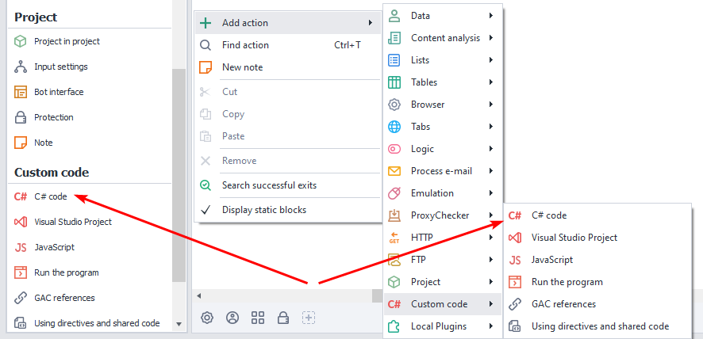
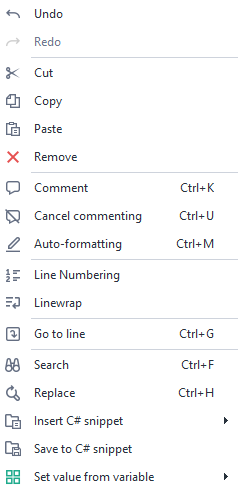
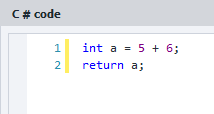
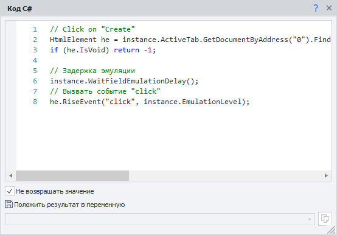
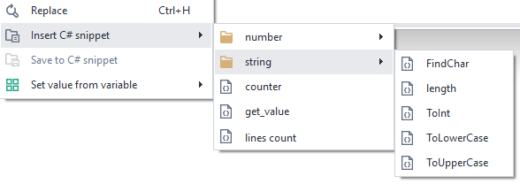
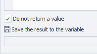
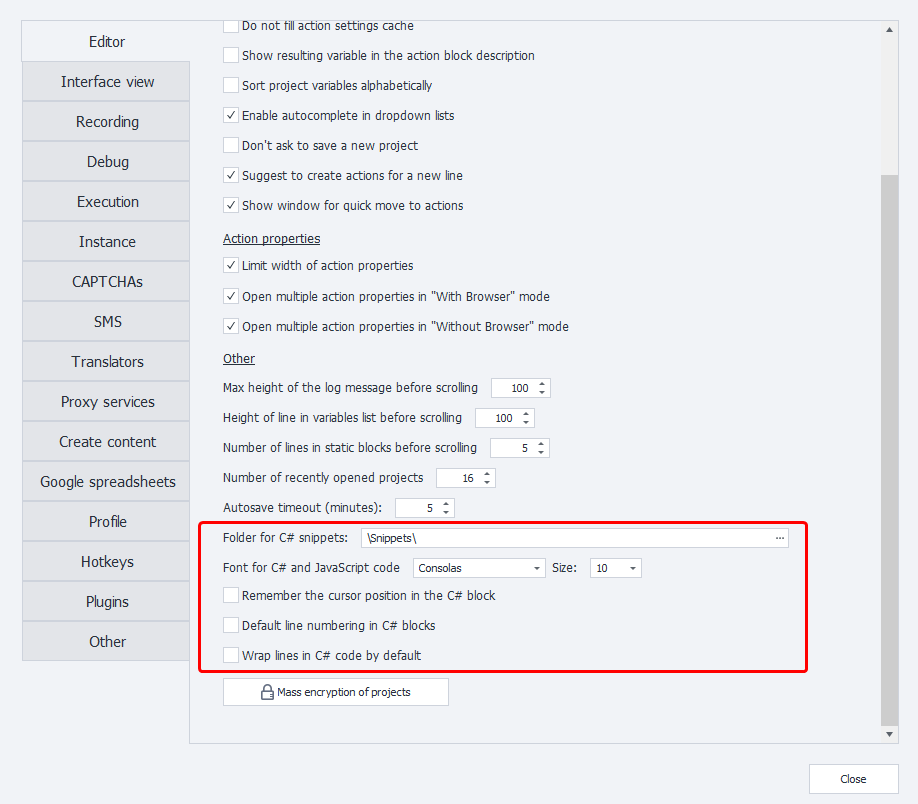
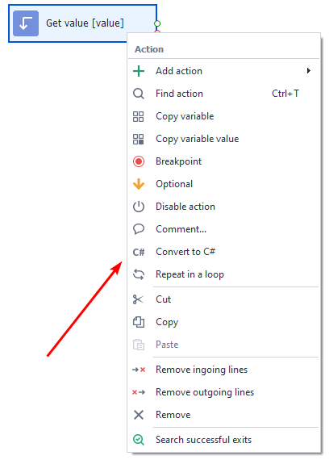
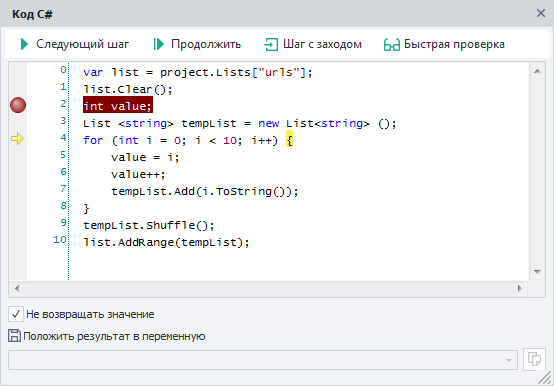

---
sidebar_position: 1
title: "C# Code (.NET C# Code)"
description: ""
date: "2025-08-04"
converted: true
originalFile: "C# код (Си шарп код .net).txt"
targetUrl: "https://zennolab.atlassian.net/wiki/spaces/RU/pages/492011596/C+.net"
---
:::info **Please read the [*Material Usage Rules on this site*](../Disclaimer).**
:::

> 🔗 **[Original page](https://zennolab.atlassian.net/wiki/spaces/RU/pages/492011596/C+.net)** — Source of this material

_______________________________________________  

## Description

This action allows you to insert code snippets written in the popular C# programming language into your project, greatly expanding ZennoPoster's capabilities and use cases.

**C#** is an object-oriented language, but this action does not use all the features of that approach (like classes and inheritance); the code is executed sequentially, except when using classes and public variables from [❗→ Using Directives and Shared Code](https://zennolab.atlassian.net/wiki/spaces/RU/pages/492109917 "https://zennolab.atlassian.net/wiki/spaces/RU/pages/492109917")

## How do I add this action to my project?

Via the context menu **Add Action** → **Custom Code** → **C# Code**




Or use the [❗→ smart search](https://zennolab.atlassian.net/wiki/spaces/RU/pages/506200090/ProjectMaker+7#%D0%A3%D0%BC%D0%BD%D1%8B%D0%B9-%D0%BF%D0%BE%D0%B8%D1%81%D0%BA-%D0%B4%D0%B5%D0%B9%D1%81%D1%82%D0%B2%D0%B8%D0%B9 "https://zennolab.atlassian.net/wiki/spaces/RU/pages/506200090/ProjectMaker+7#%D0%A3%D0%BC%D0%BD%D1%8B%D0%B9-%D0%BF%D0%BE%D0%B8%D1%81%D0%BA-%D0%B4%D0%B5%D0%B9%D1%81%D1%82%D0%B2%D0%B8%D0%B9").

## Where can this be used?

- Almost any block actions can be replaced with similar ones written in C#, speeding up development and improving code performance.
- Using any C# developments in your project.
- Integrating third-party libraries and using them in your code.

  

## How does the action work?

The *Custom C# Code* block is a regular text editor with basic code highlighting.

You can use any project variables as input ([❗→ Working with Variables](https://zennolab.atlassian.net/wiki/spaces/RU/pages/486309922 "https://zennolab.atlassian.net/wiki/spaces/RU/pages/486309922")), and save the result into variables, text files, tables, and databases. To use the project's methods and properties, use the `project` object, and to interact with the browser, use the `instance` object.

:::note Tip
If you want to use a project variable in your code, call it like this — `project.Variables["counter"].Value`, where `counter` is the variable name.
:::

  

### Context Menu




Right-clicking on the block window opens a context menu with the following options:

#### Undo\Redo

Undo the last change to the code. If the undo was a mistake, you can redo the undone input. Note that these actions only affect the **C#** code window and won't alter other blocks. For similar undo/redo actions in the main workspace with blocks, use the appropriate toolbar buttons in ProjectMaker.

#### Cut\Copy\Paste\Delete

Standard code editing operations.

#### Comment\Uncomment

Commenting is a very useful feature, especially in large projects or during debugging. You can add information about changes, relationships, or the purpose of code pieces in comments. You can also quickly enable/disable parts of your code for error checking and testing by commenting/uncommenting specific lines or code blocks. To comment out a piece of code, select it and click this menu item.

#### Line Numbers




Enables/disables line numbers, which are helpful for navigating code quickly and locating problems after reviewing error logs. For small projects, you can turn off line numbers to expand your working area.

:::note Tip
Default behavior for this setting can be set in the program’s options.
:::

#### Word Wrap

Enables automatic word wrapping if a line does not fit into the current window.

Below you can see the same window with word wrap on and off.

Wrap ON


Wrap OFF




:::note Tip
You can set the default for this behavior in the program settings.
:::

#### Go to Line

In bigger projects, it is important to quickly find the problematic piece of code. Errors are shown in the program logs. Clicking this menu item opens a dialog where you can enter the line and column number. Confirming moves the cursor directly to that spot in the block's code.

#### Find

Opens the search window for this action's code. You can set options: case sensitivity, whole words only, backwards search, and using regular expressions or wildcards when searching. Click *Find Next to go to the first found result; clicking again finds the next one, and so on.

#### Replace

Similar to *Find, except that after locating a match, it is immediately replaced with your input. You can replace found values one by one or click *Replace All to change all matches at once.

#### Insert C# Snippet

Inserts the entire contents of the selected file at the current cursor position.

This menu item is hidden by default. To show it, you need to add at least one file to the [❗→ C# Snippet Directory](https://zennolab.atlassian.net/wiki/spaces/RU/pages/725385223#%D0%94%D0%B8%D1%80%D0%B5%D0%BA%D1%82%D0%BE%D1%80%D0%B8%D1%8F-C%23-%D1%81%D0%BD%D0%B8%D0%BF%D0%BF%D0%B5%D1%82%D0%BE%D0%B2 "https://zennolab.atlassian.net/wiki/spaces/RU/pages/725385223#%D0%94%D0%B8%D1%80%D0%B5%D0%BA%D1%82%D0%BE%D1%80%D0%B8%D1%8F-C%23-%D1%81%D0%BD%D0%B8%D0%BF%D0%BF%D0%B5%D1%82%D0%BE%D0%B2") or save a code fragment using the *Save as C# Snippet function (described below).
You can move files in the directory into folders to organize them conveniently.




#### Save as C# Snippet

Lets you save the selected code fragment into a TXT file as a snippet for later use and quick insertion in other projects.

:::note Tip
The directory where snippets are saved can be [❗→ changed in the program settings](https://zennolab.atlassian.net/wiki/spaces/RU/pages/725385223 "https://zennolab.atlassian.net/wiki/spaces/RU/pages/725385223").
:::

#### Set Value from Variable

Hovering over this context menu item opens a list of all the project's [❗→ ***Custom***](https://zennolab.atlassian.net/wiki/spaces/RU/pages/735608872#%D0%A1%D0%B2%D0%BE%D0%B8 "https://zennolab.atlassian.net/wiki/spaces/RU/pages/735608872#%D0%A1%D0%B2%D0%BE%D0%B8") and [❗→ ***Auto-generated***](https://zennolab.atlassian.net/wiki/spaces/RU/pages/735608872#%D0%90%D0%B2%D1%82%D0%BE "https://zennolab.atlassian.net/wiki/spaces/RU/pages/735608872#%D0%90%D0%B2%D1%82%D0%BE") variables. When you select the desired variable, an insert like `project.Variables["myVar"].Value` appears, representing the value of the variable `myVar`.
This value is always a string, so if you want to use it as another type, you will need to convert it.

### Do Not Return Value




Disabling this checkbox lets you send back the result of your code using the `return` statement.

### Store the Result in a Variable

From this list, you can select any variable to store the value returned by `return`, as long as you disabled the checkbox above.

:::note Tip
Every C# statement must end with a semicolon ; . This helps the compiler determine where statements end. Without this symbol, the project will throw an error at launch.
:::

  

## Settings

To set default settings for the “**C#**“ block, use this section of the [❗→ program settings](https://zennolab.atlassian.net/wiki/spaces/RU/pages/725385223 "https://zennolab.atlassian.net/wiki/spaces/RU/pages/725385223").




  

## Converting Actions to Code

It is important to note that ZennoPoster has built-in features to help beginners quickly get comfortable with C# and start using the language right away. Many actions can be converted to C# code, and you can then work with that code just like with the original block. To do this, after creating a block and configuring its properties, simply select *Convert to C# in the context menu and then paste the copied code into a *C# Code block.




  

## Debugging C#

For complex or large C# code fragments, it can be difficult to quickly find errors. That’s why debugging C# code—step-by-step monitoring of variable changes and data in lists, tables, and databases—is necessary. Just like in the main ZennoPoster project, each C# action can be debugged in ProjectMaker by setting one or more breakpoints.

To add a breakpoint, click in the field to the left of the code editor next to the desired line. Then, press *Next to start running the block. Using the navigation panel above the code editor, step through the code line by line or jump to the next breakpoint while watching variable changes in the [❗→ Variables Window](https://zennolab.atlassian.net/wiki/spaces/RU/pages/735608872 "https://zennolab.atlassian.net/wiki/spaces/RU/pages/735608872"), making it easier to troubleshoot effectively.




  

## Usage Examples

Learning C# programming is beyond the scope of this document, but here are a few tips and practical examples that are commonly used by ZennoPoster users working with C#.

### Arithmetic with Integers

```csharp
int value1 = Convert.ToInt32(project.Variables["value1"].Value);
int value2 = Convert.ToInt32(project.Variables["value2"].Value);
int value3 = value1 + value2; // or value1 - value2 or value1 * value2 etc.
return value3.ToString(); // sum of two numbers
```

### Rounding the Result of Division

```csharp
float value1 = Convert.ToSingle(project.Variables["value1"].Value);
float value2 = Convert.ToSingle(project.Variables["value2"].Value);
return Math.Ceiling(value1/value2); // round up
// or
return Math.Ground(value1/value2); // round down
```

### Creating a List of Random Numbers from 1 to 10

:::note Tip
Note: in this example, the C# action does not return anything, unlike the two above where the final value was assigned to a variable in the block via `return`. Here, the result is saved to a list.
:::

:::note Tip
In this example, the keyword `var` refers to the type implicitly. It’s an alias for any type. The real type is determined by the `C#` compiler.
:::

```csharp
var list = project.Lists["numbers"];//access the project list to get the entity for one of them
list.Clear();//clear the list before filling it
int value;//declare integer variable
List <string> tempList = new List<string> ();//create a new string list, exists only within this action and will be destroyed after execution
for (int i = 0; i < 10; i++) {// loop 10 times
	value = i;//assign counter value to variable without changing the counter itself
	value++;//increment variable by 1
	tempList.Add(value.ToString());//add string version of number to temp list
}//repeat 10 times
tempList.Shuffle();//shuffle list
list.AddRange(tempList);//add shuffled list to the result list with numbers from 1 to 10
```

### Getting a Random Line from a File with Account Logins and Splitting it into Login and Password

You can use the `return` operator to return **null**. The **null** keyword is a literal for an empty reference, not pointing to any object. Returning **null** from C# action will make it exit down the red line—this is often used to connect blocks. In the example below, if the account list is empty, you can show a warning (though you could also do this inside C# with `project.SendInfoToLog("Empty list", true);`) and fill the list from a TXT file with new accounts.

```csharp
IZennoList list = project.Lists["accounts"];//get the list with attached TXT file storing logins:passwords line by line
if (list.Count== 0) return null;//if list is empty, exit block via red line
Random rnd = new Random();//create random number generator
string str = list[rnd.Next(0, list.Count)];//pick a random index and get that string
string [] arr = str.Split(':');//split line into array using ':' as delimiter
project.Variables["login"].Value = arr[0];//first element is login (array/list indexes always start at 0), assign to login variable
project.Variables["password"].Value = arr[1];//second element is password
```

### Working with HTML Elements

With C#, you can use the `instance` object methods just like standard blocks, but at a higher level. In the example below, we get a collection of HTML elements and add their children's links to a list.

:::note Tip
For quickly obtaining HTML element attribute values, it's convenient to first add a block using the Action Builder for that element, then convert to C#—the resulting code usually needs just small tweaks.
:::

```csharp
var list = project.Lists["urls"];//list to store URLs
HtmlElementCollection hec = instance.ActiveTab.GetDocumentByAddress("0").FindElementsByAttribute("li", "class", "pageNav-page", "regexp");//get collection of <li> HTML elements with class containing "pageNav-page"
for (int i = 0; i < hec.Count; i++) {
	HtmlElement he = hec.GetByNumber(i);//loop through collection
	if (he.IsVoid) break;//if element is inaccessible, break
	string attribute = he.FirstChild.GetAttribute("href");//get 'href' attribute of first child (URL)
	list.Add(attribute);//add URL to list
}
```

### Working with Files: Getting Image Dimensions (width x height)

:::note Tip
The @ symbol before a string means the compiler takes the string as is, without treating backslashes as escape characters. Without it, you’d need double slashes in the path for correct operation.
:::

```csharp
Image img = Image.FromFile(project.Directory + @"/temp.jpg");//get image from file
int width = img.Width;//get image width
int height = img.Height;//and height
return width.ToString() + "x"+ height.ToString();//return string with dimensions
```

### Using OwnCode and Images: Placing a Semi-transparent Watermark at the Center

:::note Tip
In practice you often want to move some C# functions into a separate place and call them from different actions. That’s what OwnCode (your code) is for. You can add a function to this class and access it from blocks. This function can take parameters (arguments) and return results. The example below creates a SetImageOpacity function that takes an image and an opacity value and returns the modified image. This requires using System.Drawing.Imaging;
:::

```csharp
Image original = Image.FromFile(project.Directory + @"/image.jpg");//the source image

int w = original.Width;//dimensions
int h = original.Height;

int w_wm = (int) w/10;//watermark width, 10% of the base image

Image wm = OwnCode.CommonCode.SetImageOpacity(Image.FromFile(project.Directory + @"/wm.png"), .5F);//get watermark image, change opacity using function from the shared code class
float scale = (float)wm.Height / wm.Width; //watermark proportions
int h_wm = (int) (w_wm * scale);//calculate new watermark height based on scaling
int x = (int) (w/2 - w_wm/2);//x position for center
int y = (int) (h/2 - h_wm/2);//y position for center

Graphics gr = Graphics.FromImage(original);//create graphics object from base image
gr.DrawImage(wm, x, y, w_wm, h_wm);//draw watermark over the image at new position and size

original.Save(project.Directory + @"/image_result.jpg", System.Drawing.Imaging.ImageFormat.Jpeg);//save image as JPEG
original.Dispose();//release used objects
wm.Dispose();
gr.Dispose();
```

And the actual `SetImageOpacity` class, which goes inside `OwnCode.CommonCode`:

```csharp
using System.Drawing.Imaging;
public static Image SetImageOpacity(Image image, float opacity)  
{  
    try  {  
		Bitmap bmp = new Bitmap(image.Width, image.Height);
        // create graphics from image
        using (Graphics gfx = Graphics.FromImage(bmp)) {
            // create color matrix  
            ColorMatrix matrix = new ColorMatrix();      
            // set opacity
            matrix.Matrix33 = opacity;  
            // create new attributes
            ImageAttributes attributes = new ImageAttributes();      
            // set color matrix for image
            attributes.SetColorMatrix(matrix, ColorMatrixFlag.Default, ColorAdjustType.Bitmap);    
            // draw image
            gfx.DrawImage(image, new Rectangle(0, 0, bmp.Width, bmp.Height), 0, 0, image.Width, image.Height, GraphicsUnit.Pixel, attributes);
        }
        return bmp;  
    }  
    catch (Exception ex)  
    {  
        return null;  
    }  
} 
```

### Working with Regex

:::note Tip
Regular expressions, which are fully supported in C#, make it convenient to parse data, find required values, assign and modify variables, and clean up text. The example below removes all HTML tags from an element’s content.
:::

```csharp
string html = project.Variables["value1"].Value;//get code from variable
return Regex.Replace(html, @"<.*?>", String.Empty);//remove HTML tags and return result
```

### Working with Macros

:::note Tip
With the Macros object, you can access many functions for working with the file system or text processing. For example, you can process Spintax in C#—the same as the dedicated block.
:::

```csharp
return Macros.TextProcessing.Spintax("{0|1|2}");//randomly chooses and outputs one of the three values
```

  

## Useful Links

- [❗→ ZennoPoster API Documentation (Managing from .NET Code)](https://zennolab.atlassian.net/wiki/spaces/RU/pages/495058994/ "https://zennolab.atlassian.net/wiki/spaces/RU/pages/495058994/")
- [Official C# programming guide](https://docs.microsoft.com/ru-ru/dotnet/csharp/programming-guide/ "https://docs.microsoft.com/ru-ru/dotnet/csharp/programming-guide/")
- [A large collection of snippets (mostly C#) created by the ZennoPoster community](https://github.com/ZennoHelpers/Snippets "https://github.com/ZennoHelpers/Snippets")