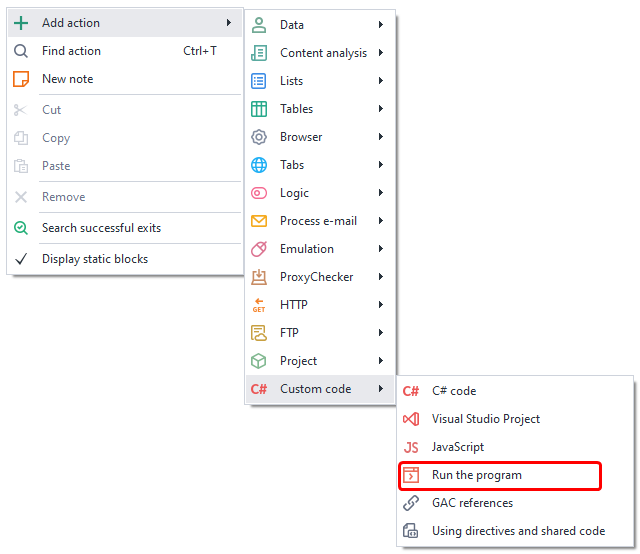
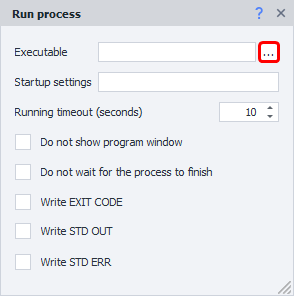
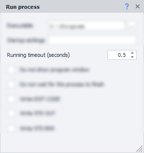
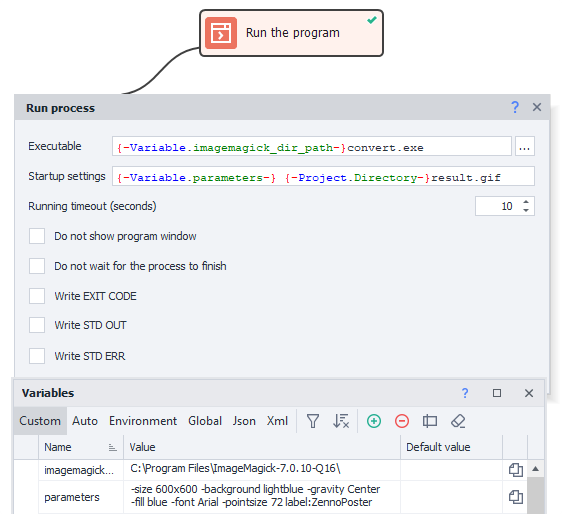
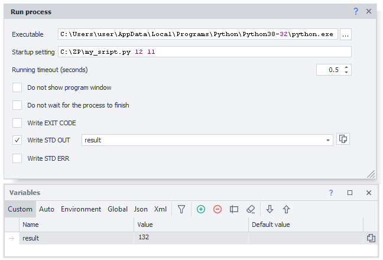
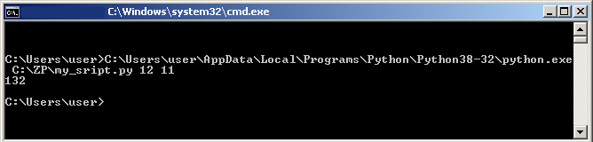

:::info **Please read the [*Material Usage Rules on this site*](../../../../Disclaimer).**
:::

> 🔗 **[Original Page](https://zennolab.atlassian.net/wiki/spaces/RU/pages/534315231)** — Source of this material

_______________________________________________  

## Description

This action is for launching third-party programs. You can launch regular desktop applications (Notepad, WinRar, Paint) as well as console utilities (ffmpeg, ImageMagick). You also have the option to pass launch parameters.

  

## How to Add this Action to a Project?

Using the context menu **Add Action** → **Custom Code** → **Launch Program**




Or use [❗→ Smart Search](https://zennolab.atlassian.net/wiki/spaces/RU/pages/506200090/ProjectMaker+7#%D0%A3%D0%BC%D0%BD%D1%8B%D0%B9-%D0%BF%D0%BE%D0%B8%D1%81%D0%BA-%D0%B4%D0%B5%D0%B9%D1%81%D1%82%D0%B2%D0%B8%D0%B9 "https://zennolab.atlassian.net/wiki/spaces/RU/pages/506200090/ProjectMaker+7#%D0%A3%D0%BC%D0%BD%D1%8B%D0%B9-%D0%BF%D0%BE%D0%B8%D1%81%D0%BA-%D0%B4%D0%B5%D0%B9%D1%81%D1%82%D0%B2%D0%B8%D0%B9").

  

## Where Can This Be Used?

- Most commonly, it’s used to launch console utilities. For example:
    - [❗→ ImageMagick](https://imagemagick.org/index.php "https://imagemagick.org/index.php") — a set of programs (console utilities) for reading and editing files in many graphic formats (images).
    - [❗→ FFmpeg](https://ffmpeg.org/ "https://ffmpeg.org/") — a set of free open-source libraries for recording, converting, and streaming digital audio and video in various formats.
    - running scripts in [❗→ Python](https://www.python.org/ "https://www.python.org/") and other programming languages.
- Launching any other applications

  

## How to Work with the Action?




### Executable File

The full path to the file you want to run (clicking the “File Selection” button (highlighted by a red square) will open the standard file dialog on your computer).  
- <span style={{color: 'red'}}><strong>If the file is not found at the specified path, the action will end with an error</strong></span>
- You can use [❗→ variable macros](https://zennolab.atlassian.net/wiki/spaces/RU/pages/486309922 "https://zennolab.atlassian.net/wiki/spaces/RU/pages/486309922")
- If the folder for the executable is in the [PATH environment variable](https://ru.wikipedia.org/wiki/PATH_%28%D0%BF%D0%B5%D1%80%D0%B5%D0%BC%D0%B5%D0%BD%D0%BD%D0%B0%D1%8F%29 "https://ru.wikipedia.org/wiki/PATH_(%D0%BF%D0%B5%D1%80%D0%B5%D0%BC%D0%B5%D0%BD%D0%BD%D0%B0%D1%8F)"), you can just provide the filename without the full path (`notepad.exe` or `calc.exe`)

### Launch Parameters

These are additional commands that are passed to the program being launched. Each program has its own launch parameters (you can use [❗→ variable macros](https://zennolab.atlassian.net/wiki/spaces/RU/pages/486309922 "https://zennolab.atlassian.net/wiki/spaces/RU/pages/486309922")).

- For example, launching a new Chrome browser window with the URL https://zennolab.com will look like this:


- When launching console utilities, arguments are passed in this field.

### Timeout

It’s useful if you know roughly how long the program will run. If the called program doesn’t finish within the specified number of seconds, the action will end with an error.

:::note Note
You can specify fractional values.
:::




<span style={{color: 'red'}}><strong>You can disable this behavior; see details below</strong></span>

### Do Not Show Process Window

When this option is enabled, the launched program will not be displayed.

### Do Not Wait for Process to Finish

If you enable this setting, *Timeout will be ignored and the action will not wait for the program to finish.

### Save EXIT CODE

The [return code](https://ru.wikipedia.org/wiki/%D0%9A%D0%BE%D0%B4_%D0%B2%D0%BE%D0%B7%D0%B2%D1%80%D0%B0%D1%82%D0%B0 "https://ru.wikipedia.org/wiki/%D0%9A%D0%BE%D0%B4_%D0%B2%D0%BE%D0%B7%D0%B2%D1%80%D0%B0%D1%82%D0%B0") with which the launched program finished.

Usually, if the program ends normally, it returns 0 (zero). If something else is returned, the program may have ended with an error. To find out what a code means, you can search for `program_name exit code return_code`, e.g. `ffmpeg exit code 137`

### Save STD OUT

This is the standard output stream. In other words, everything the program writes to the console window (unless it’s an error message) is STD OUT.

Example:

when you install ImageMagick, it adds its folder to the [PATH environment variable](https://ru.wikipedia.org/wiki/PATH_%28%D0%BF%D0%B5%D1%80%D0%B5%D0%BC%D0%B5%D0%BD%D0%BD%D0%B0%D1%8F%29 "https://ru.wikipedia.org/wiki/PATH_(%D0%BF%D0%B5%D1%80%D0%B5%D0%BC%D0%B5%D0%BD%D0%BD%D0%B0%D1%8F)"), so there’s no need to write the full path to the executable; you can just write ```xml
magick.exe &lt;arguments_here&gt;
```. To demonstrate STD OUT, let’s run the program with the `-usage` argument (the program will respond with basic info about itself) and redirect STD OUT to a variable.


### Save STD ERR

This will store data if the program reports any errors.

Example:

Let’s repeat the previous command, but make a typo in the command and write `-usage22`


As you can see in the screenshot, the error message was captured in STD ERR, indicating that an invalid argument was passed or not enough arguments were provided. At the same time, STD OUT also captured some data — the program gives us a hint on how to use it correctly.

:::note Note
You can repeat the commands described above. To do this, you’ll need to install ImageMagick, then open a console window (`Win+R → type cmd.exe → press Enter`) and enter the commands `magick-usage` and `magick-usage22`
:::

* * *

## Example Usage

Let’s look at a few examples using ImageMagick.

Goal: create an image 600 by 600 pixels, with a light blue background, with the text “ZennoPoster” (in blue), font — Arial, font size — 72. Save the result as a file at `C:\Users\user\Desktop\result.gif` next to the template. The command will look like this (convert is one of the utilities included with ImageMagick. The path to the executable and desktop may be different on your computer):

```bash
C:\Program Files\ImageMagick-7.0.10-Q16\convert.exe -size 600x600 -background lightblue -gravity Center -fill blue -font Arial -pointsize 72 label:ZennoPoster C:\Users\user\Desktop\result.gif
```

:::note Note
For more details about specific arguments, use your favorite search engine. This goes beyond the scope of this help file.
:::

:::warning Warning
To run the command correctly in cmd.exe, you need to enclose the path to the executable in quotes — "C:\Program Files\ImageMagick-7.0.10-Q16\convert.exe"
:::

### Example #1. ImageMagick All Parameters Hardcoded

|  |
| :--: |
| Unfortunately, not all launch parameters fit in the screenshot |


After running this action, a file named result.gif will appear on the desktop.


### Example #2. ImageMagick Parameters Passed as Variables




- In this example, the path to the folder with the executable was placed in a [❗→ variable](https://zennolab.atlassian.net/wiki/spaces/RU/pages/486309922 "https://zennolab.atlassian.net/wiki/spaces/RU/pages/486309922") (for example, the template might run on different computers, and each one may have its own path).
- All parameters were also placed in a variable (it’s not necessary to store everything in one variable. You can create a separate variable for each argument and list them all in the *Launch Parameters* field)
- The final file `result.gif` is saved in the same directory as the project file. (`{ -Project.Directory- }` is a system variable that stores the full path to the current project directory)

:::warning Warning
The project must be saved on your computer when using the `{ -Project.Directory- }` variable. Otherwise, this variable will be empty.
:::

### Example #3. Running a Python Script

:::warning Warning
For this example to work, Python must be installed on your system.
:::

Sometimes, when searching online for solutions, you may find scripts written in various programming languages that do exactly what you need. Of course, you could completely rewrite the script in C# and launch it with the [❗→ Custom C# code](https://zennolab.atlassian.net/wiki/spaces/RU/pages/492011596/C+.net "https://zennolab.atlassian.net/wiki/spaces/RU/pages/492011596/C+.net") action. Or, you can launch the script using the *Launch Program* action and use its result. We’ll look at the latter, using Python as an example.

There's a script located at `C:\ZP\my_sript.py`, which takes two numbers as input, multiplies them, and prints the result to the console (your script might generate an image, text, or could be a neural network that solves captchas; in general, anything).




- For the executable, specify `C:\Users\user\AppData\Local\Programs\Python\Python38-32\python.exe` (on your computer, the path might differ).
- In the *launch parameters* field, enter the path to the script first (`C:\ZP\my_sript.py`), followed by two arguments (`12 11).`
- After launching this action, the result variable will contain the action result — 132.

Here’s what launching that same script looks like in cmd.exe




* * *

## Useful Links

- [❗→ Variables](https://zennolab.atlassian.net/wiki/spaces/RU/pages/486309922 "https://zennolab.atlassian.net/wiki/spaces/RU/pages/486309922")
- [❗→ Variables Window](https://zennolab.atlassian.net/wiki/spaces/RU/pages/735608872 "https://zennolab.atlassian.net/wiki/spaces/RU/pages/735608872")