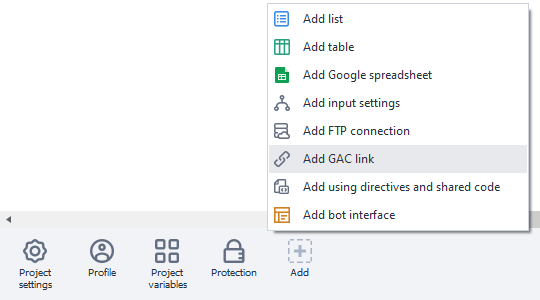
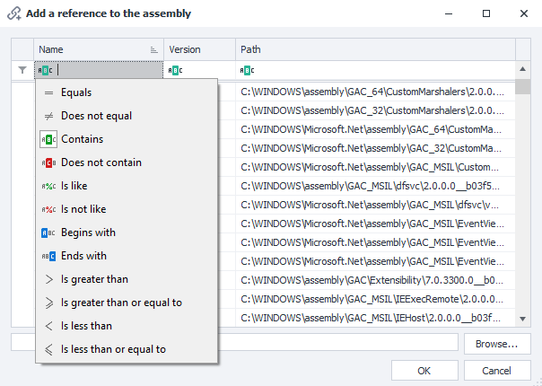

---
sidebar_position: 4
title: "References from the Global Assembly Cache (GAC)"
description: ""
date: "2025-08-04"
converted: true
originalFile: "Ссылки из Global Assembly Cache (GAC).txt"
targetUrl: "https://zennolab.atlassian.net/wiki/spaces/RU/pages/492175442/Global+Assembly+Cache+GAC"
---
:::info **Please read the [*Material Usage Rules on this site*](../Disclaimer).**
:::

> 🔗 **[Original page](https://zennolab.atlassian.net/wiki/spaces/RU/pages/492175442/Global+Assembly+Cache+GAC)** — Source of this material

_______________________________________________  

:::info Information
This article has been copied from the ZennoPoster documentation, since these steps are identical in both programs. The original is References from GAC. Within this article, you may encounter screenshots, internal documentation links, and other elements that pertain to ZennoPoster.
:::

## Description

When using C# snippets, you have access to all the features of the C# language. It includes an extensive library of classes and methods that cover most tasks you might encounter. You can learn about the classes and their capabilities on the page [.NET Framework Class Library](http://msdn.microsoft.com/ru-ru/library/gg145045%28v=vs.110%29.aspx "http://msdn.microsoft.com/ru-ru/library/gg145045(v=vs.110).aspx")

If you can't find a class that solves your problem, you can connect an external class library. To do this, you need to add the **References from GAC** element to the panel, where you can add your library.

## How to use it?

If you can't find a class that solves your problem when using C# snippets, you can connect an external class library. To do this, add the **References from GAC** element to the static blocks panel.

A new element will appear on the static blocks panel:

When you open this element, a window will appear listing the currently connected libraries.

Use the “Add” button to add your library, either by selecting it from the list or uploading it from a file.

You can also set a filter to search for the data you need.

Once you've added the required library, you need to specify a new namespace using the block [❗→ using Directives and Shared Code](https://zennolab.atlassian.net/wiki/spaces/RU/pages/534086229/Using- "https://zennolab.atlassian.net/wiki/spaces/RU/pages/534086229/Using-").

When using either the standard .NET Framework class library or a third-party library, to access classes without specifying the namespace and to keep your code neat, it's recommended to use [❗→ using Directives and Shared Code](https://zennolab.atlassian.net/wiki/spaces/RU/pages/534086229/Using- "https://zennolab.atlassian.net/wiki/spaces/RU/pages/534086229/Using-").