---
sidebar_position: 6
title: "Visual Studio Project"
description: ""
date: "2025-08-04"
converted: true
originalFile: "Проект Visual Studio.txt"
targetUrl: "https://zennolab.atlassian.net/wiki/spaces/RU/pages/1375109121/Visual+Studio"
---
:::info **Please read the [*Material Usage Rules on this site*](../Disclaimer).**
:::

> 🔗 **[Original page](https://zennolab.atlassian.net/wiki/spaces/RU/pages/1375109121/Visual+Studio)** — Source of this material

_______________________________________________  

## Description

:::info Information
This block is available starting from version 7.3.2.0
:::

The **“Visual Studio Project”** action allows you to use a project created in Microsoft Visual Studio 2019 within a ZennoPoster project, opening up unlimited possibilities for writing, debugging code, and connecting external libraries.

## How do I add this action to my project?

You can add it via the context menu: **Add Action** → **Your Code** → **Visual Studio Project**

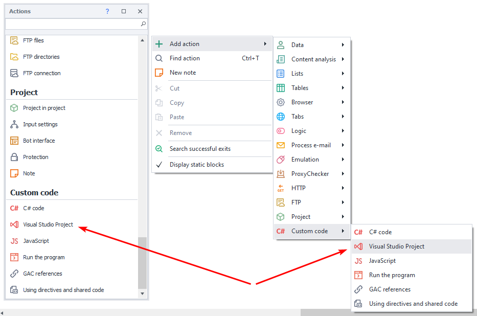

Or use the [❗→ smart search](https://zennolab.atlassian.net/wiki/spaces/RU/pages/506200090/ProjectMaker+7#%D0%A3%D0%BC%D0%BD%D1%8B%D0%B9-%D0%BF%D0%BE%D0%B8%D1%81%D0%BA-%D0%B4%D0%B5%D0%B9%D1%81%D1%82%D0%B2%D0%B8%D0%B9 "https://zennolab.atlassian.net/wiki/spaces/RU/pages/506200090/ProjectMaker+7#%D0%A3%D0%BC%D0%BD%D1%8B%D0%B9-%D0%BF%D0%BE%D0%B8%D1%81%D0%BA-%D0%B4%D0%B5%D0%B9%D1%81%D1%82%D0%B2%D0%B8%D0%B9").

## What is this used for?

- Seamless integration of third-party libraries and their use in your code
- Creating your own libraries for reuse across different projects

## How do I work with this action?

The **“Visual Studio Project”** action can work in two modes:

- Using a Visual Studio solution
- Using a Dll

In **“Use Visual Studio Solution”** mode, the block properties look like this:

Controls:

1. Select the block’s operating mode
2. Path to the solution containing the project
3. The project that will run when the block is executed
4. Project configuration
5. Flag to merge output dll and dependencies into a single dll file using ILRepack
6. Button to switch to **“Use Dll”** mode
7. **“Connect to Visual Studio”** button
8. **“Create new Visual Studio project”** button

In **“Use Dll”** mode, the block properties look like this:

Controls:

1. Select the block’s operating mode
2. Path to the dll that will be run when the block is executed

### “Use Visual Studio Solution” mode

#### Creating a project and connecting to Visual Studio

:::warning Attention
To use this action in “Visual Studio Solution” mode, you must have:
- Visual Studio 2019 installed. You can download the free Community version from the official website: https://visualstudio.microsoft.com/ru/vs/community/
- The target platform for the project as .Net Framework 4.6.2 ([Download .NET SDKs for Visual Studio (microsoft.com)](https://dotnet.microsoft.com/download/visual-studio-sdks))
:::

To create a project and connect to Visual Studio, follow these steps:

1. Add the action and select the “Use Visual Studio Solution” mode

2. Create a new project by clicking the **“Create new Visual Studio project” (1)** button

:::info Information
If you already have a project created, you can skip the following steps and simply select the solution, project, and configuration in the block’s properties and connect to Visual Studio using the “Connect to Visual Studio” (2) button.
:::

3. A window will appear where you need to enter the project name, location, and solution name, and then click **“OK”**

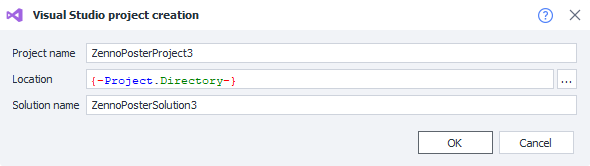

4. This will start the process of creating the Visual Studio solution

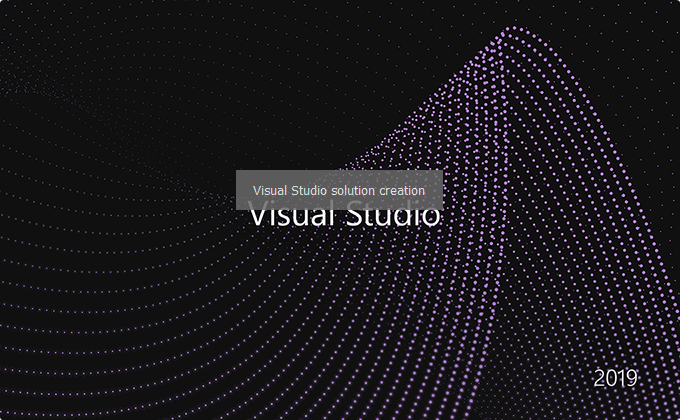

5. And then the process of connecting to Visual Studio will begin.

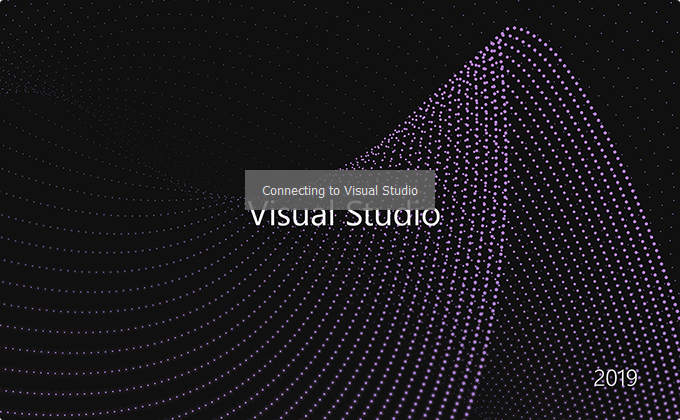

Connecting to Visual Studio provides interaction between Project Maker and Visual Studio. This interaction allows you to:

- Record actions from Project Maker’s browser directly into Visual Studio source code
- Debug the Visual Studio project with access to the Project Maker browser and project

6. After connecting, the Project Maker browser window will open in Visual Studio. If it does not open automatically, you can access it via **View→Other Windows→ZennoPosterToolWindow**.

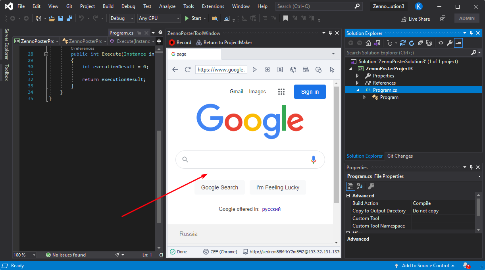

:::info Information
To connect to Visual Studio, you need the **ZennoPosterVisualStudioExtension** extension. It will be installed in Visual Studio automatically on the first connection.
:::

:::warning Attention
If you don't see **View→Other Windows→ZennoPosterToolWindow** in the menu, the **ZennoPosterVisualStudioExtension** might not be installed or could be disabled. In Visual Studio, open **Extensions→Manage Extensions**, go to **Installed**, and check the status of **ZennoPosterVisualStudioExtension**. If it’s not installed, try restarting Project Maker and reconnecting to Visual Studio. If the problem persists, please contact technical support.
:::

#### Working in Visual Studio, project structure

To make your project usable with this action, it needs to meet the following requirements (projects created via Project Maker meet all these requirements by default):

- Include references to ZennoPoster’s common libraries: `Global.dll`, `ZennoLab.CommandCenter.dll`, `ZennoLab.Emulation.dll`, `ZennoLab.InterfacesLibrary.dll`. These libraries are in the ZennoPoster installation folder.
- Contain a class that implements the `IZennoExternalCode` interface. When code is executed, the method `public int Execute(Instance instance, IZennoPosterProjectModel project)` will be called. It should return 0 on success or any other value for an error.

The automatically created project contains a single file, **Program.cs**, with the implementation of the `Execute` method.

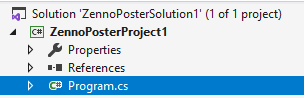

Embedding the Project Maker browser in Visual Studio allows you to record actions directly into your source code. To enable/disable recording, click the "Record" button on the browser window’s toolbar.

To send the browser back to Project Maker, click the "Return to Project Maker" button.

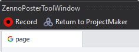

When recording is enabled, entering a new URL in the browser creates a new action file named `ActionGroupXXX.cs` (XXX is the sequential action set number), and code to call this action is added to `Program.cs`.

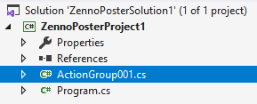

To access the browser or the project from the Execute method, the `instance` and `project` objects are provided, and you can work with them as described in [❗→ C# code (.NET)](https://zennolab.atlassian.net/wiki/spaces/RU/pages/492011596/C+.net "https://zennolab.atlassian.net/wiki/spaces/RU/pages/492011596/C+.net").

To debug your code, use the standard **“Start”** button in Visual Studio.

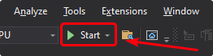

### Using dll

:::warning Attention
To use this action in "Use dll" mode, you do NOT need Visual Studio installed. This mode lets you move a finished project between different computers. You just need to make sure all the required dlls are available on each computer (for example, copy them into the project folder).
:::

After you finish developing your project in Visual Studio, you can quickly switch to directly using the output dll by clicking the **"Use as dll"** button

After you click that button, a window will open where you can choose what to do

1. Build the solution (required step)
2. Merge the output dll and libraries into a single dll file with ILRepack (reduces the number of files to transfer with the project)
3. Copy the dll to the required path (by default, the project folder macro is used)
4. Change the block’s mode to **"Use as dll"** and set the dll path
5. Show the built dll in Explorer

:::info Information
You can also manually change the mode and set the desired dll path. To run the dll, it must contain a class implementing the `IZennoExternalCode` interface.
:::

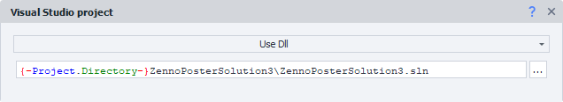

## Possible errors and how to fix them

### Project Target Framework Not Installed

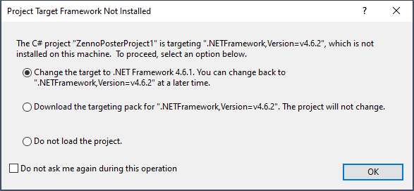

This error means the .Net 4.6.2 developer pack is not installed. You need to download and install it from the official site: [Download .NET SDKs for Visual Studio (microsoft.com)](https://dotnet.microsoft.com/download/visual-studio-sdks)

### Call was rejected by callee (RPC\_E\_CALL\_REJECTED)

This error means Visual Studio is rejecting connection requests from ProjectMaker. This most often happens when you need to do something in Visual Studio (a dialog window might have appeared). Switch to Visual Studio and complete the required actions there. Then try connecting to Visual Studio again. If the error persists, restart Visual Studio. If this still doesn’t help, please contact technical support.

### After connecting to Visual Studio, block property rendering works incorrectly

This problem looks like the following. Notice that when you click different blocks or blank spaces on the diagram, the block properties do not refresh correctly.

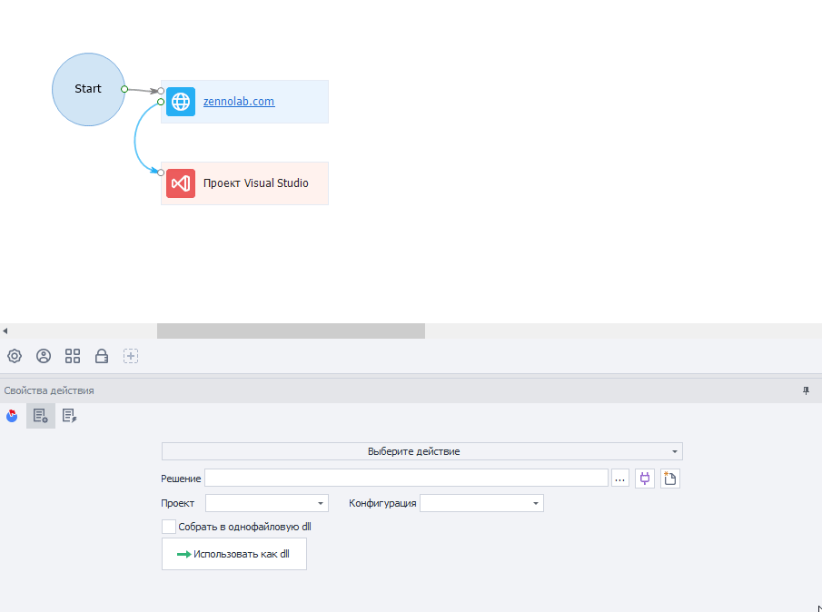

To resolve the issue, check your Visual Studio settings.

Russian version (**Средства→Параметры…→Общие**):

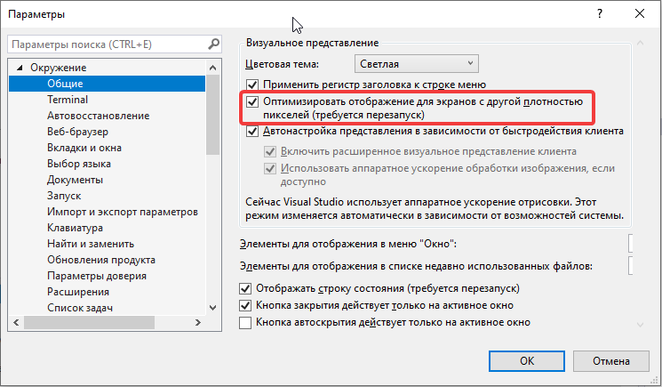

English version (**Tools→Options…→General**):

You can find a detailed explanation of this setting here: [Per-Monitor support for Visual Studio extensions](https://docs.microsoft.com/ru-ru/visualstudio/extensibility/ux-guidelines/per-monitor-awareness-extenders?view=vs-2019 "https://docs.microsoft.com/ru-ru/visualstudio/extensibility/ux-guidelines/per-monitor-awareness-extenders?view=vs-2019")

If this option is unavailable, try updating Windows and Visual Studio, or follow the instructions for manually adding a registry key:

https://docs.microsoft.com/en-us/visualstudio/designers/disable-dpi-awareness?view=vs-2019#add-a-registry-entry

## Useful Links

- [❗→ ZennoPoster API Documentation (controlling from .NET code)](https://zennolab.atlassian.net/wiki/spaces/RU/pages/495058994/ "https://zennolab.atlassian.net/wiki/spaces/RU/pages/495058994/")
- [Official C# Programming Guide](https://docs.microsoft.com/ru-ru/dotnet/csharp/programming-guide/ "https://docs.microsoft.com/ru-ru/dotnet/csharp/programming-guide/")
- [ILRepack Utility](https://github.com/gluck/il-repack "https://github.com/gluck/il-repack")