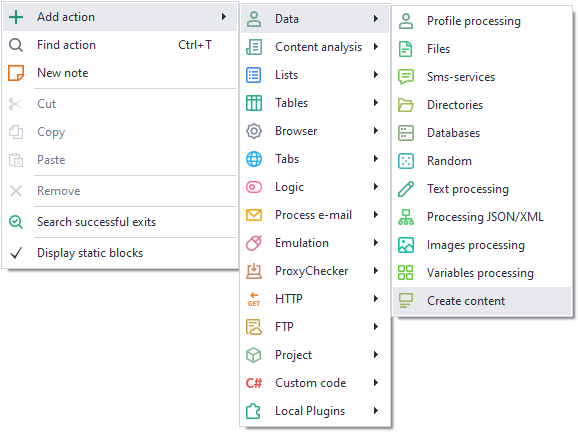
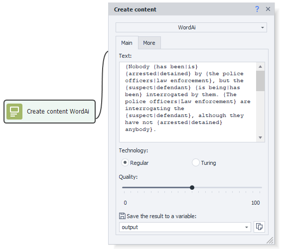
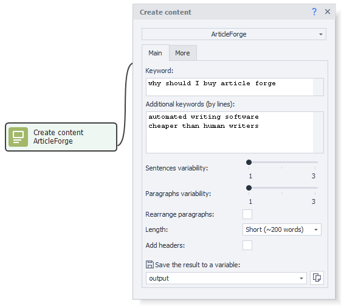
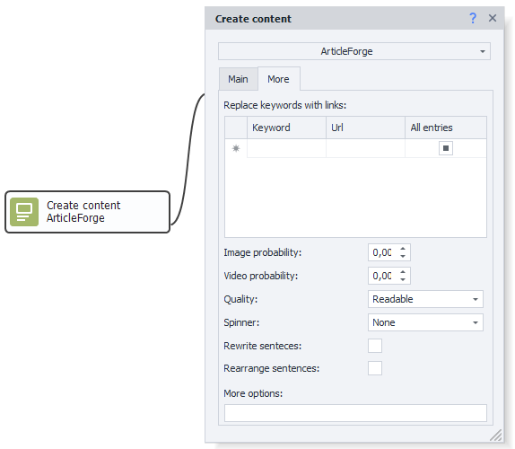

---
sidebar_position: 11
title: "Content Creation"
description: " "
date: "2025-07-24"
converted: true
originalFile: "Создание контента.txt"
targetUrl: "https://zennolab.atlassian.net/wiki/spaces/RU/pages/489095179"
---
import DisclaimerNotice from '@site/src/components/DisclaimerNotice';

<DisclaimerNotice />

> 🔗 **[Original page](https://zennolab.atlassian.net/wiki/spaces/RU/pages/489095179)** — Source of this material

_______________________________________________  

## Description

ZennoPoster allows you to connect and use services for creating unique text — **WordAI** and **ArticleForge**. These services use artificial intelligence to understand text and can automatically rewrite content, achieving readability on par with human-written text. The only downside is that these services do not support the Russian language, so they are mainly relevant for those working in the English-speaking segment of the internet.

## How do I add this action to a project?

You can add it via the context menu **Settings → Content Creation**. Beforehand, make sure to set up authorization for the services in the [❗→ program settings](/wiki/spaces/RU/pages/808812655 "/wiki/spaces/RU/pages/808812655").

Or you can use the [❗→ smart search](https://zennolab.atlassian.net/wiki/spaces/RU/pages/506200090/ProjectMaker+7#%D0%A3%D0%BC%D0%BD%D1%8B%D0%B9-%D0%BF%D0%BE%D0%B8%D1%81%D0%BA-%D0%B4%D0%B5%D0%B9%D1%81%D1%82%D0%B2%D0%B8%D0%B9 "https://zennolab.atlassian.net/wiki/spaces/RU/pages/506200090/ProjectMaker+7#%D0%A3%D0%BC%D0%BD%D1%8B%D0%B9-%D0%BF%D0%BE%D0%B8%D1%81%D0%BA-%D0%B4%D0%B5%D0%B9%D1%81%D1%82%D0%B2%D0%B8%D0%B9").

## How to use the action?

### WordAi Service

In the “Text” field, enter the text you want to rewrite, choose the text generation technology — Regular or Turing — and select the desired text recognition quality. If needed, set additional parameters. The result will be saved to the selected variable.

You can learn more about WordAi on the [official website](http://wordai.com "http://wordai.com").

### ArticleForge Service

Enter a main keyword and optional additional keywords (one per line), then select sentence and paragraph variation. You can enable paragraph shuffling and add headings, as well as choose the text length — from 50 to 750 words.

In the advanced settings, you can select keyword replacement with a desired link, set the probability of inserting images and videos, and specify text quality — regular, unique, very unique, readable, very readable. In the “Spinner” section, you can choose one of three text generation methods — none, regular, or turing. You can also enable sentence rewriting and restructuring modes. In the “additional parameters” section, you can set extra options provided by the service. The result will be saved to the selected variable.

You can learn more about ArticleForge on the [official website](https://www.articleforge.com/ "https://www.articleforge.com/").

## Example usage

To create many pages on a website with unique text, you can set the source text and connect synonymizing services.

1. Enter your service identification data.
2. Add the “Content Creation” action to your project.
3. Set the parameters for text processing.
4. Get unique text for each page.

This way, you’ll get readable and, most importantly, unique text for your website.