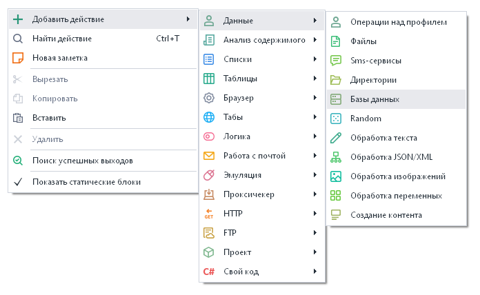
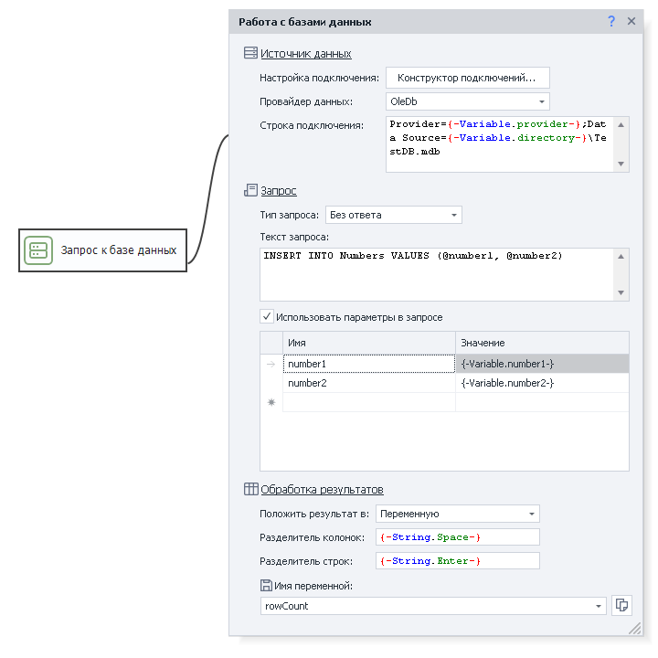
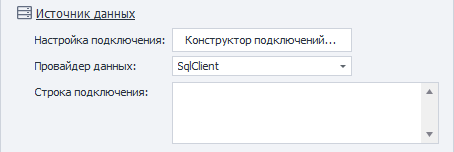
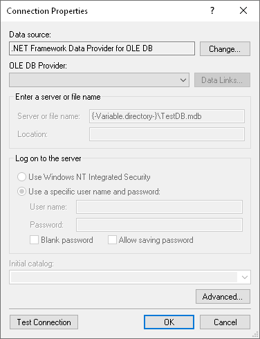
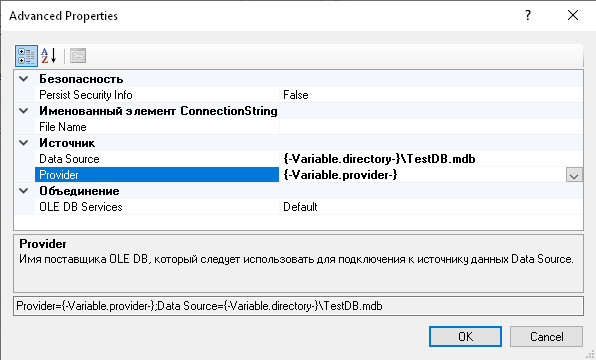
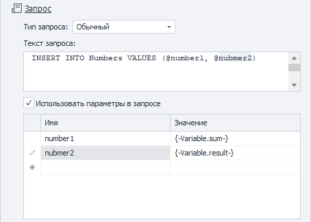
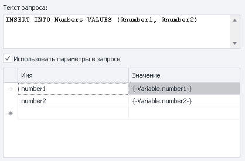
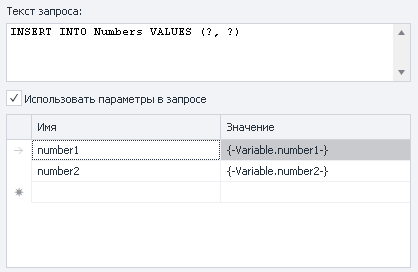
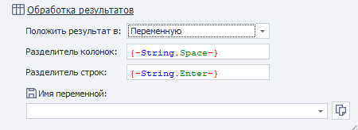
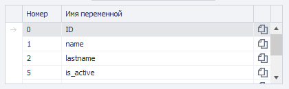

:::info **Please review the [*Guidelines for using materials on this resource*](../Disclaimer).**
:::

> 🔗 **[Original page](https://zennolab.atlassian.net/wiki/spaces/RU/pages/486473806)** — Source of this material

_______________________________________________  

## Description

ZennoPoster allows you to work with different types of databases, such as Microsoft SQL, MySQL, PostgreSQL, SQLite, and others. You can connect to databases on your local computer or a remote server and load the data you need for your web tasks.

## How do I add an action to a project?

Right-click and select **Add action** → **Section name** → **Action name**

Or use the [❗→ smart search](https://zennolab.atlassian.net/wiki/spaces/RU/pages/506200090/ProjectMaker+7#%D0%A3%D0%BC%D0%BD%D1%8B%D0%B9-%D0%BF%D0%BE%D0%B8%D1%81%D0%BA-%D0%B4%D0%B5%D0%B9%D1%81%D1%82%D0%B2%D0%B8%D0%B9 "https://zennolab.atlassian.net/wiki/spaces/RU/pages/506200090/ProjectMaker+7#%D0%A3%D0%BC%D0%BD%D1%8B%D0%B9-%D0%BF%D0%BE%D0%B8%D1%81%D0%BA-%D0%B4%D0%B5%D0%B9%D1%81%D1%82%D0%B2%D0%B8%D0%B9").

## How does this action work?

  

### Data source

To connect to a database, you’ll need to set up the connection properly. The process will differ depending on the DBMS.

#### Connection builder

To make constructing a connection string easier, you can use the *Connection Builder*. Based on the information you provide, a *Connection String* will be generated.

Screenshots

:::warning Attention
You can't use variable macros in the Connection Builder.
:::

#### Data providers

ZennoPoster supports several data providers:

- **SqlClient** – provider for native SQLServer connections;
- **MySqlClient** – provider for native MySQL connections;
- **OleDb** – one of the standards allowing you to connect to various DBMSs (including SQLServer);
- **Odbc** – another standard for connecting to DBMSs.

#### Connection string

The connection string includes various login parameters (such as username and password). Examples of connection strings for different DBMSs can be found [at this link](https://www.connectionstrings.com/ "https://www.connectionstrings.com/").
If you don’t want to create this string manually, you can use the *Connection Builder* (described above).

How do I connect to PostgreSQL?

Our user **Lord\_Alfred** wrote a detailed guide on connecting ZennoPoster to PostgreSQL via ODBC. We recommend checking it out:

[PostgreSQL (DBMS) and ZennoPoster — connecting via ODBC](https://zennolab.com/discussion/threads/postgresql-subd-i-zennoposter-podkljuchenie-cherez-odbc.43320/)

  

### Query

#### Query type

There are several query types

##### **Query without response**

Used for operations that don't return data from the database (for example, INSERT or DELETE). The response for this type of operation is the number of records affected.

##### **Scalar query**

Lets you retrieve a single value. For example, if you need to execute an aggregate function (select sum(price) from fruit).

##### **Regular query**

Returns a data table.

#### Query text

SQL query input field.

#### Use parameters in query

To simplify query creation, you can use parameters. They will be inserted into the appropriate places in the query text. There are named and unnamed parameters. In the first case, the name matters; in the second, the order of variables is important.
Which parameter type you use depends on your DBMS.

:::note Tip
When you use parameters, the text inside them will be automatically escaped.
:::

##### **Named parameters**

Example of a query with named parameters:

##### **Unnamed parameters**

Example of a query with unnamed parameters:

  

### Processing results

In this section, you need to choose where to save the query result.

#### Save result to

##### **Variable**

All rows and columns returned from the query will be saved in one [❗→ variable](/wiki/spaces/RU/pages/486309922 "/wiki/spaces/RU/pages/486309922").

You also need to select the separators that will be used between rows and columns.

##### **List**

If you want to save the results to a [❗→ list](/wiki/spaces/RU/pages/534053375 "/wiki/spaces/RU/pages/534053375"), be sure to specify which separator to use for columns. As a result, each row from the database will be stored as a separate list element, and the column separator will be inserted between columns.

##### **Table**

When writing data to a table, the cells will be filled according to the query.

##### **Variables**

*Row number** - A query might return several rows, so you need to specify which one to process (numbering starts from zero!).

In the table below, select the index of the cell in the row and the variable to save that cell to (numbering starts from zero!).

## Useful links

- [❗→ Working with variables](/wiki/spaces/RU/pages/486309922 "/wiki/spaces/RU/pages/486309922")
- [❗→ List](/wiki/spaces/RU/pages/534053375 "/wiki/spaces/RU/pages/534053375")
- [❗→ Tables](/wiki/spaces/RU/pages/534315019 "/wiki/spaces/RU/pages/534315019")
- [❗→ Text processing](/wiki/spaces/RU/pages/488865793 "/wiki/spaces/RU/pages/488865793")