---
sidebar_position: 4
title: "Directories"
description: "Converted from HTML to MDX"
date: "2025-07-24"
converted: true
originalFile: "Directories.txt"
targetUrl: "https://zennolab.atlassian.net/wiki/spaces/RU/pages/534052965"
---
import DisclaimerNotice from '@site/src/components/DisclaimerNotice';

<DisclaimerNotice />

> 🔗 **[Original page](https://zennolab.atlassian.net/wiki/spaces/RU/pages/534052965)** — Source of this material

_______________________________________________  

## Description

This action allows you to work with directories:

- Create
- Copy
- Move
- Delete
- Retrieve one or multiple files
- Check if a directory exists

## How to add the action to a project?

Via the context menu **Add Action** → **Data** → **Directories**

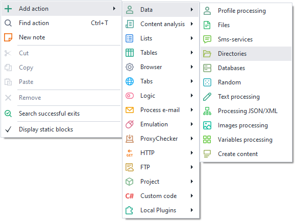

Or you can use the [❗→ smart search](https://zennolab.atlassian.net/wiki/spaces/RU/pages/506200090/ProjectMaker+7#%D0%A3%D0%BC%D0%BD%D1%8B%D0%B9-%D0%BF%D0%BE%D0%B8%D1%81%D0%BA-%D0%B4%D0%B5%D0%B9%D1%81%D1%82%D0%B2%D0%B8%D0%B9 "https://zennolab.atlassian.net/wiki/spaces/RU/pages/506200090/ProjectMaker+7#%D0%A3%D0%BC%D0%BD%D1%8B%D0%B9-%D0%BF%D0%BE%D0%B8%D1%81%D0%BA-%D0%B4%D0%B5%D0%B9%D1%81%D1%82%D0%B2%D0%B8%D0%B9").

## Where can you use this action?

- Get a file from a directory (either by order or at random):

 - An article file for posting on a blog
 - An avatar image for registering on a forum
- When parsing, you can create a separate directory for each product to store images, descriptions, and other needed info

## How to use the action?

The following actions are available for working with directories and are selected in the properties window:

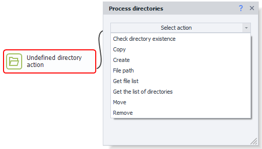

### Copy

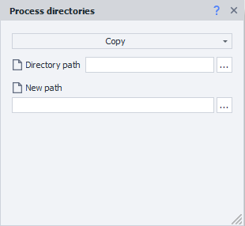

This action allows you to copy a directory with all its contents to a new path.

#### Directory path

Here, you specify the path to the source folder.

#### New path

The path where the directory should be copied.

:::warning Attention
If the new path includes directories that don’t exist, they will be created. If a directory already exists at the new path, NOTHING WILL BE COPIED, and the action will complete successfully (using the green branch).
:::

### Move

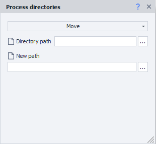

Moves a directory to the specified path.

#### Directory path

Here, you specify the path to the source folder.

#### New path

The path where the directory should be moved.

:::warning Attention
If the new path includes directories that don’t exist, they will be created. If a directory already exists at the new path, NOTHING WILL BE MOVED, and the action will complete successfully (using the green branch).
:::

### Get directory list

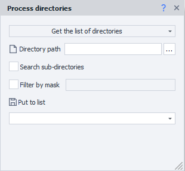

This action allows you to get a list of all directories at the specified path.

#### Directory path

Here, you specify the path to the folder.

#### Search in subdirectories

- If the checkbox is NOT CHECKED, only directories at the first level under the “Directory path” will be returned.
- If the checkbox is CHECKED, the search will also include all subdirectories, regardless of their depth.

#### Mask filter

If this checkbox is checked, you can enter a [❗→ search mask](https://zennolab.atlassian.net/wiki/spaces/RU/pages/534052965#%D0%9F%D0%BE%D0%B8%D1%81%D0%BA-%D0%BF%D0%BE-%D0%BC%D0%B0%D1%81%D0%BA%D0%B5 "https://zennolab.atlassian.net/wiki/spaces/RU/pages/534052965#%D0%9F%D0%BE%D0%B8%D1%81%D0%BA-%D0%BF%D0%BE-%D0%BC%D0%B0%D1%81%D0%BA%D0%B5") in the field to the right. You can use several masks separated by the | symbol.

The result is saved to a [❗→ list](/wiki/spaces/RU/pages/534053375 "/wiki/spaces/RU/pages/534053375").

### Get file list

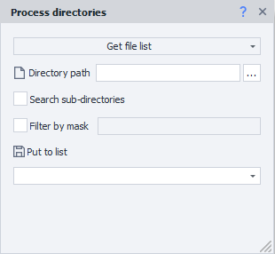

This action allows you to get a [❗→ list](/wiki/spaces/RU/pages/534053375 "/wiki/spaces/RU/pages/534053375") of all [❗→ files](/wiki/spaces/RU/pages/486309948 "/wiki/spaces/RU/pages/486309948") at the specified path.

#### Directory path

Here, you specify the path to the folder.

#### Search in subdirectories

- If the checkbox is NOT CHECKED, only files at the first level under the “Directory path” will be returned.
- If the checkbox is CHECKED, the search will also include files in subdirectories regardless of their depth.

#### Mask filter

If this checkbox is checked, you can enter a [❗→ search mask](https://zennolab.atlassian.net/wiki/spaces/RU/pages/534052965#%D0%9F%D0%BE%D0%B8%D1%81%D0%BA-%D0%BF%D0%BE-%D0%BC%D0%B0%D1%81%D0%BA%D0%B5 "https://zennolab.atlassian.net/wiki/spaces/RU/pages/534052965#%D0%9F%D0%BE%D0%B8%D1%81%D0%BA-%D0%BF%D0%BE-%D0%BC%D0%B0%D1%81%D0%BA%D0%B5") in the field to the right. You can use several masks separated by the | symbol.

The result is saved to a [❗→ list](/wiki/spaces/RU/pages/534053375 "/wiki/spaces/RU/pages/534053375").

### Check if directory exists

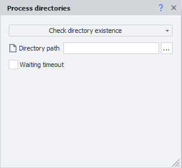

With this action, you can check whether a directory exists at the given path. If the directory is found, the action will exit via the green branch (success); if not, it will exit via the red branch (error).

#### Directory path

Here, you specify the path to the folder you want to check for existence.

#### Timeout

:::note Note
This is set in seconds.
:::

If the action doesn't immediately find the directory, it will wait for the specified amount of time for it to appear.

### File path

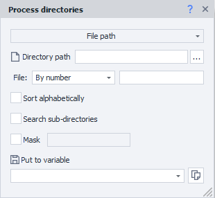

This action allows you to get the path to one [❗→ file](/wiki/spaces/RU/pages/486309948 "/wiki/spaces/RU/pages/486309948") from a directory at the given path.

#### Directory path

Here, you specify the path to the folder.

#### File 

##### **By number**

You need to specify the exact file number (starting from zero).

##### **Random**

A random available file path will be returned.

#### Sort alphabetically

*Description coming soon.

#### Search in subdirectories

- If the checkbox is NOT CHECKED, a file will be chosen from those inside the directory at “Directory path.”
- If the checkbox is CHECKED, the search will also include subdirectories regardless of their depth.

#### Mask

If this checkbox is checked, you can enter a [❗→ search mask](https://zennolab.atlassian.net/wiki/spaces/RU/pages/534052965#%D0%9F%D0%BE%D0%B8%D1%81%D0%BA-%D0%BF%D0%BE-%D0%BC%D0%B0%D1%81%D0%BA%D0%B5 "https://zennolab.atlassian.net/wiki/spaces/RU/pages/534052965#%D0%9F%D0%BE%D0%B8%D1%81%D0%BA-%D0%BF%D0%BE-%D0%BC%D0%B0%D1%81%D0%BA%D0%B5") in the field to the right. You can use several masks separated by the | symbol.

The result is saved to a [❗→ variable](/wiki/spaces/RU/pages/486309922 "/wiki/spaces/RU/pages/486309922").

### Create

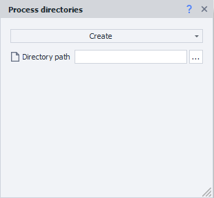

This action lets you create a new directory at the path specified in the *Directory path* field.

:::warning Attention
If a directory already exists at the specified path, it WILL NOT be overwritten. The action will exit via the green branch (success).
:::

### Delete

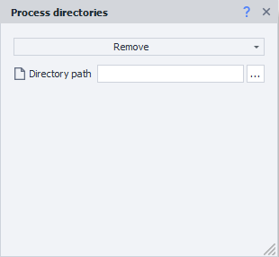

This action allows you to delete the folder specified in *Directory path* along with all its contents. If you try to delete a folder that doesn't exist, the action will still exit via the green branch.

:::warning Attention
Directories deleted this way do not go to the Recycle Bin and are permanently deleted!
:::

## Usage example

When registering on various sites, you often need to upload an avatar. Let’s say you have a directory with prepared images, containing files with various extensions (jpg, jpeg, png, tiff, etc.), and you need to pick one. The site you want to register on requires files to be in PNG format only. For this task, use the *File path* action and select a random file path. To pick only PNG files, use the mask `*.png`.

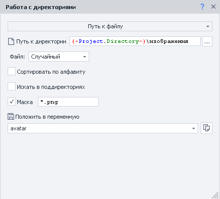

> `{-Project.Directory-}` is a ProjectMaker system variable that stores the full path to the folder containing the template file.

 After running this block, the *avatar variable will contain the absolute path to the file.

## Mask search

You can use special characters for mask search:

- ? — any single character except a dot
- \ — any number of any characters
- | — use this when you want to apply several masks at the same time (works for files only)

Examples

| **Mask** | **Description** |
| --- | --- |
|`*.*` | Any files with any extension |
| `*.jpg` | Files with the `.jpg` extension: • image.jpg • avatar.jpg • 1.jpg |
| `*.p*` | Files with extensions starting with `p`: • document.pdf • presentation.ppt • document.project • 1.p |
| `кар*.*` | Files with any extension, whose name starts with “кар”: • карета.jpg • картинка.ico • картошка.html |
| `*mat?.html` | `.html` files where the name starts with any characters, then “mat”, then one more character: • automate.html • tomato.html • mate.html |
| `doc?????.xls` | `.xls` files starting with “doc” followed by 5 any characters (except dot): • document.xls • doc-1208.xls • doctrine.xls |
| `???.??` | Files with a three-character name and a two-character extension: • abc.ps • job.ai • 123.45 |
| `?????` | Files with a five-character name and no extension: • house • image • tasks |
| `*.xlsx \| *.docx` | Any xlsx and/or docx document: • invoice.docx • resume.docx • project.xlsx • default.xlsx |

[Original article](https://www.febooti.com/products/automation-workshop/online-help/file-wildcard-mask/ "https://www.febooti.com/products/automation-workshop/online-help/file-wildcard-mask/")
  

## Useful links

- [❗→ Files](/wiki/spaces/RU/pages/486309948 "/wiki/spaces/RU/pages/486309948")
- [❗→ List](/wiki/spaces/RU/pages/534053375 "/wiki/spaces/RU/pages/534053375")
- [❗→ List operations](/wiki/spaces/RU/pages/534085798 "/wiki/spaces/RU/pages/534085798")
- [❗→ Text processing](/wiki/spaces/RU/pages/488865793 "/wiki/spaces/RU/pages/488865793")