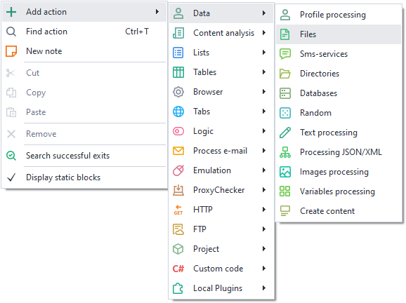
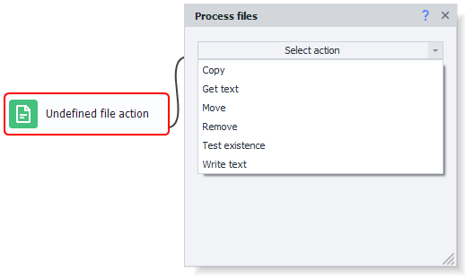
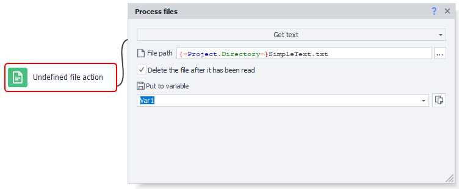
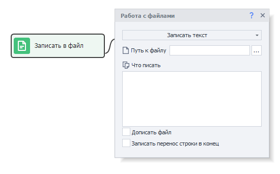
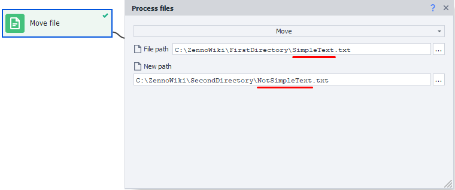
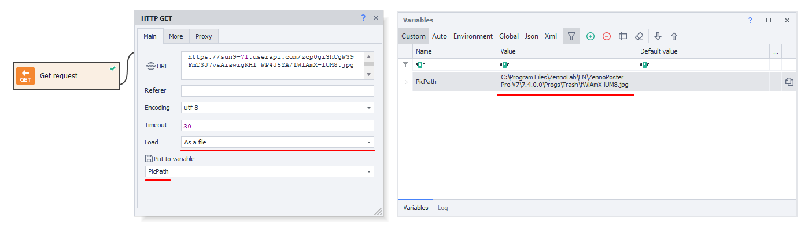
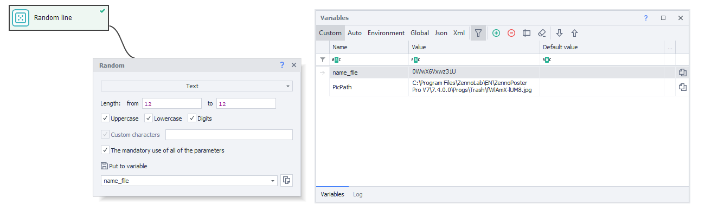

---
sidebar_position: 1
title: "Files"
description: "Converted from HTML to MDX"
date: "2025-07-24"
converted: true
originalFile: "Files.txt"
targetUrl: "https://zennolab.atlassian.net/wiki/spaces/RU/pages/486309948"
---
import DisclaimerNotice from '@site/src/components/DisclaimerNotice';

<DisclaimerNotice />

> 🔗 **[Original page](https://zennolab.atlassian.net/wiki/spaces/RU/pages/486309948)** — Source of this material

_______________________________________________  

## Description

ZennoPoster allows you to automate working with files.

## Where can this be used?

- Insert prepared text from a file when posting on forums,
- Placing ads on various websites,
- Adding automatic comments,
- Write data to files when parsing websites,
- Keep detailed logs in a file,
- Delete or move unnecessary files.

## How to add an action to your project?

Via the context menu **Add Action** → **Data**→ **Files**

Or use the [❗→ Smart Search](https://zennolab.atlassian.net/wiki/spaces/RU/pages/506200090/ProjectMaker+7#%D0%A3%D0%BC%D0%BD%D1%8B%D0%B9-%D0%BF%D0%BE%D0%B8%D1%81%D0%BA-%D0%B4%D0%B5%D0%B9%D1%81%D1%82%D0%B2%D0%B8%D0%B9 "https://zennolab.atlassian.net/wiki/spaces/RU/pages/506200090/ProjectMaker+7#%D0%A3%D0%BC%D0%BD%D1%8B%D0%B9-%D0%BF%D0%BE%D0%B8%D1%81%D0%BA-%D0%B4%D0%B5%D0%B9%D1%81%D1%82%D0%B2%D0%B8%D0%B9").

## How to work with this action?

The following actions for working with files are available, which can be selected in the properties window:

### Get Text

Copying text from a file, with an option to save it to a variable.

#### File path

Here, you need to specify the path to the file from which the data will be read.

:::note Note
You can use variable macros.
:::

#### Delete file after reading

After the action is performed, the file will be deleted.

### Write Text

Add text to a file.

#### What to write

The text you want to write to the file.

:::note Note
You can use variable macros.
:::

#### Append to file

If this option is enabled, the text you specify will be **added** to the end of the file. If unchecked, the file will be **completely overwritten** with your text.

#### Add line break at the end

A line break (`\r\n`) will be added to the end of your text after it's written to the file. This is necessary for more correct writing of multiple lines of data to a file.

:::info Info
When working in multithreaded mode, it is recommended to use a List and write lines to a file using the List Operations action.
:::

### Move

This moves a file to the specified directory. This option can also be used to rename a file.

:::note Note
You need to specify the full path to an existing file, as well as the desired path and new filename after moving.
:::

### Check Existence

Checks if a file exists at the specified path.

- If the file exists – green (success) output, if not – red (fail) output;
- Timeout – how long the action will wait for the file to appear, in seconds.

### Copy

Similar to moving, but the original file is not deleted.

### Delete

Deletes a file at the specified path.

## Possible practical uses

Let's set the following task:

1. Download an image from vk.com
2. Rename it
3. Move it to the desired folder

Suppose you already have a direct link to the image: https://sun9-71.userapi.com/zcp0gi3hCgW39FmT3J7vsAiawigKHI_WP4J5YA/fWlAmX-lUM8.jpg

Using a [❗→ GET request](https://zennolab.atlassian.net/wiki/spaces/RU/pages/534315165/GET- "https://zennolab.atlassian.net/wiki/spaces/RU/pages/534315165/GET-"), download the image to your computer. Use PicPath as the variable. After this action, the specified variable will contain the direct file path to the image:

Next, create a **“Random”** action to generate a filename. More on Random here: [❗→ Random numbers and strings (Random)](/wiki/spaces/RU/pages/534315050 "/wiki/spaces/RU/pages/534315050")

Now, create a **“Files”** action and select the **“Move”** option.

For the "File path" field, specify: `{ -Variable.PicPath- }`;

For the "New path" field: `{ -Project.Directory- }Полицейский\{ -Variable.name_file- }.jpg`

`{ -Project.Directory- }` is a macro that uses the directory where your project is located (read more about this and other macros [❗→ here](https://zennolab.atlassian.net/wiki/spaces/RU/pages/735608872#%D0%9E%D0%BA%D1%80%D1%83%D0%B6%D0%B5%D0%BD%D0%B8%D0%B5 "https://zennolab.atlassian.net/wiki/spaces/RU/pages/735608872#%D0%9E%D0%BA%D1%80%D1%83%D0%B6%D0%B5%D0%BD%D0%B8%D0%B5")).

After this action is completed, the file will be moved to the desired folder and you can upload the next image.

:::warning Warning
When working with images, make sure to use the same file extension that was used when downloading.
:::

To get the file extension, you can use the [❗→ Text Processing](/wiki/spaces/RU/pages/488865793 "/wiki/spaces/RU/pages/488865793") action and regular expressions. More details: [❗→ Regular Expression Tester](/wiki/spaces/RU/pages/534086111 "/wiki/spaces/RU/pages/534086111")

## Useful links

- [❗→ Directories](/wiki/spaces/RU/pages/534052965 "/wiki/spaces/RU/pages/534052965")
- [❗→ Regular Expression Tester](/wiki/spaces/RU/pages/534086111 "/wiki/spaces/RU/pages/534086111")
- [❗→ Text Processing](/wiki/spaces/RU/pages/488865793 "/wiki/spaces/RU/pages/488865793")
- [❗→ Working with variables](/wiki/spaces/RU/pages/486309922 "/wiki/spaces/RU/pages/486309922")
- [❗→ List](/wiki/spaces/RU/pages/534053375 "/wiki/spaces/RU/pages/534053375")