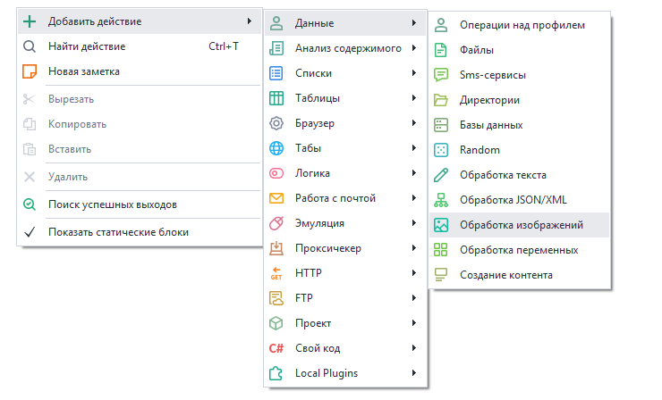
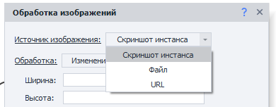
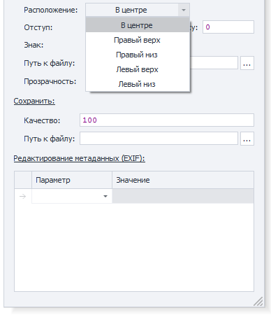
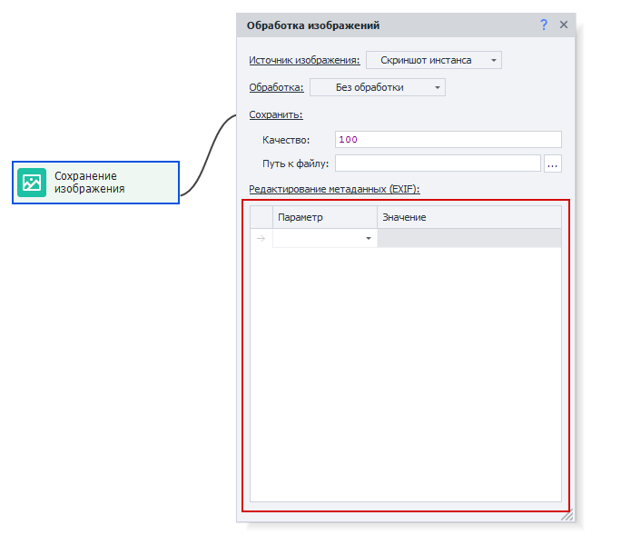
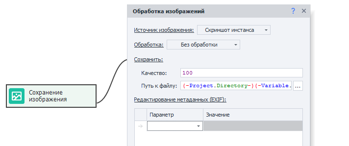

:::info **Please see the [*Terms of Use for Materials on this Resource*](../Disclaimer).**
:::

> 🔗 **[Original page](https://zennolab.atlassian.net/wiki/spaces/RU/pages/488865806)** — Source of this material

_______________________________________________  

## Description

An action for editing and saving images.

## How to add the action to a project?

Via the context menu **Add Action** → **Data** → **Image Processing**

Or use the [❗→ smart search](https://zennolab.atlassian.net/wiki/spaces/RU/pages/506200090/ProjectMaker+7#%D0%A3%D0%BC%D0%BD%D1%8B%D0%B9-%D0%BF%D0%BE%D0%B8%D1%81%D0%BA-%D0%B4%D0%B5%D0%B9%D1%81%D1%82%D0%B2%D0%B8%D0%B9 "https://zennolab.atlassian.net/wiki/spaces/RU/pages/506200090/ProjectMaker+7#%D0%A3%D0%BC%D0%BD%D1%8B%D0%B9-%D0%BF%D0%BE%D0%B8%D1%81%D0%BA-%D0%B4%D0%B5%D0%B9%D1%81%D1%82%D0%B2%D0%B8%D0%B9").

## What is it used for?

- Editing the visual aspect of images
- Changing / clearing metadata
- Saving an instance screenshot

## How to use the action?

### Image Source

1. **Instance Screenshot** – takes a screenshot of the current tab of the instance (browser)
2. **File** – processes a file. When selected, you need to specify the file path on your computer. Macros can be used.
3. **URL** – after selecting, you need to specify the link to the image, which will be processed.

:::warning Attention
If you use a URL as the image source, please note that downloading happens through your real IP address, even if a proxy is set in the project.
:::

## Processing

### No Processing

The image will not be changed.

Useful for saving an instance screenshot or saving an image from a URL to your computer.

### Resize

Allows you to change the image size

- **"Width"** and **"Height"** – numerical values set according to the **"Size"** field settings.
- **Size** – you can specify either a percentage or pixels.
- **Preserve aspect ratio** – if checked, the values you enter for **"Width"** and **"Height"** will be forced to the same value.
- **Do not enlarge the image** – if the specified width or height is greater than the image's width and height, resizing will not be applied.

### Crop

Allows you to crop an image

- **Area** – Visible or Custom.

 - **Visible** – Only relevant for the “Instance Screenshot” option. Crops the screenshot to the window boundaries, so only the visible part of the site is captured.
 - **Custom** – crops the whole image according to the set parameters, which are set in the listed fields below.
 - **Left** / **Top** / **Width** / **Height** – values in pixels or percentages.
 - **Size** – choose either **"In pixels"** or **"In percent"**.

### Rotate

Allows you to rotate the image by the desired number of degrees.

### Watermark

- Allows you to overlay text or an image on the processed file.

 - **Overlay type** – arrangement option: **"Horizontal"** or **"Diagonal"**.

#### More about the Horizontal overlay type

1. Placement – where the text/image will be placed

2. Offset – specify the offset from the left or top, in pixels. The offset is relative to the placement chosen earlier.

- **Mark** – image or text.

 - Image – you need to specify its path.
 - Text – you need to enter the desired text and choose the desired font (to the right of the *Font field there is a button that opens the visual builder for customizing the text).
- **Transparency** – percentage value for the opacity of the overlaid text or image. The higher the value, the more transparent it is.

### Mirror

Allows you to "mirror" the image according to specified parameters.

### Clear Exif

Allows you to clear all image metadata.

### Save

You need to specify the quality in percent and the path where to save the file.

The path should include the file name and extension. You can also use [❗→ variables](/wiki/spaces/RU/pages/486309922 "/wiki/spaces/RU/pages/486309922").

### Edit Metadata (EXIF)

Allows you to change specific metadata. You can use this with all processing types except "Clear Exif".

## Usage Example

Let's imagine you have created a template, and at some point while working with a website, it results in an error. To understand what's going wrong, you can take a screenshot at the moment of the error to evaluate the situation visually.

Create an action [❗→ Random Numbers and Strings (Random)](/wiki/spaces/RU/pages/534315050 "/wiki/spaces/RU/pages/534315050"), then generate a number or "thread" name and save it into a variable `{ -Variable.thread- }`.

Next, you need to create a [❗→ Bad End](/wiki/spaces/RU/pages/534020265 "/wiki/spaces/RU/pages/534020265") block and connect it to the image processing action. Set the configuration as in the screenshot:

As the path, specify: `{ -Project.Directory- }{ -Variable.thread- }\Instance_screenshot.jpg`

You can also save the page code `{ -Page.Dom- }` using the [❗→ Write to file](/wiki/spaces/RU/pages/486309948 "/wiki/spaces/RU/pages/486309948") action. This helps catch errors occurring during browser work.

## Useful Links

- [❗→ Files](/wiki/spaces/RU/pages/486309948 "/wiki/spaces/RU/pages/486309948")
- [❗→ GET request](/wiki/spaces/RU/pages/534315165 "/wiki/spaces/RU/pages/534315165")
- [❗→ Get data from web page](/wiki/spaces/RU/pages/534085840 "/wiki/spaces/RU/pages/534085840")
- [❗→ Random Numbers and Strings (Random)](/wiki/spaces/RU/pages/534315050 "/wiki/spaces/RU/pages/534315050")