:::info **Please read the [*Rules for using materials on this resource*](../Disclaimer).**
:::

> 🔗 **[Original page](https://zennolab.atlassian.net/wiki/spaces/RU/pages/488964124/JSON+XML)** — Source of this material

_______________________________________________  

## Description

This action is used for processing and working with JSON and XML.

:::warning Attention
Only one JSON and one XML object can be processed at a time in a project. If you need to handle multiple sets of data of the same format, you'll need to do it one by one.
:::

### JSON

JSON (JavaScript Object Notation) is a simple data exchange format that's easy to read and write for both humans and computers.

Example:

```json
{
   "firstName": "Иван",
   "lastName": "Иванов",
   "address": {
       "streetAddress": "Московское ш., 101",
       "city": "Ленинград",
       "postalCode": 101101
   },
   "phoneNumbers": [
       "812 123-1234",
       "916 123-4567"
   ]
}
```

### XML

XML (*eXtensible Markup Language*) is a markup language similar to HTML. It's meant for transferring data, not displaying it. XML tags are not predefined. You have to set whatever tags you need yourself.

```xml
<CATALOG>
	<CD>
		<TITLE>Имперская Пародия</TITLE>
		<ARTIST>Боб Дилан</ARTIST>
		<COUNTRY>США</COUNTRY>
		<COMPANY>Колумбия</COMPANY>
		<PRICE>10.90</PRICE>
		<YEAR>1985</YEAR>
	</CD>
	<CD>
		<TITLE>Спрячь свое сердце</TITLE>
		<ARTIST>Бонни Тайлер</ARTIST>
		<COUNTRY>Соединенное Королевство</COUNTRY>
		<COMPANY>Записи си-би-эс</COMPANY>
		<PRICE>9.90</PRICE>
		<YEAR>1988</YEAR>
	</CD>
	<CD>
		<TITLE>Лучшие Хиты</TITLE>
		<ARTIST>Долли Партон</ARTIST>
		<COUNTRY>США</COUNTRY>
		<COMPANY>Ар-Си-Эй</COMPANY>
		<PRICE>9.90</PRICE>
		<YEAR>1982</YEAR>
	</CD>
</CATALOG>
```

:::note Note
Sometimes services return text that's not formatted nicely (like the examples above), but all in one line, making it much harder to read. In these situations, you can use so-called beautifiers. The Tester X/JSON Path already has this built-in (the Beautify button). For the action itself, it doesn't matter whether the text is in one line or nicely formatted—what matters is that it is put together correctly.
:::

## How do I add this action to a project?

Right-click and select **Add Action** → **Data** → **Process JSON/XML**

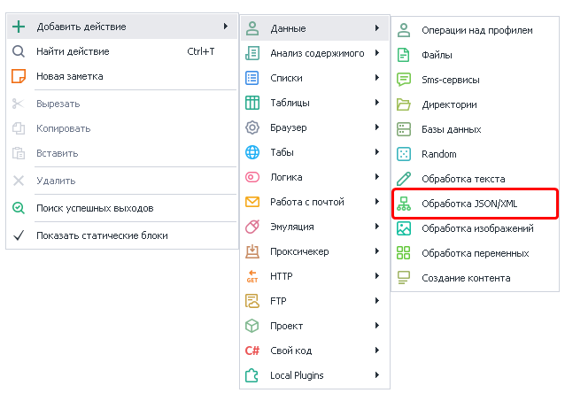


Or you can use the [❗→ smart search](https://zennolab.atlassian.net/wiki/spaces/RU/pages/506200090/ProjectMaker+7#%D0%A3%D0%BC%D0%BD%D1%8B%D0%B9-%D0%BF%D0%BE%D0%B8%D1%81%D0%BA-%D0%B4%D0%B5%D0%B9%D1%81%D1%82%D0%B2%D0%B8%D0%B9 "https://zennolab.atlassian.net/wiki/spaces/RU/pages/506200090/ProjectMaker+7#%D0%A3%D0%BC%D0%BD%D1%8B%D0%B9-%D0%BF%D0%BE%D0%B8%D1%81%D0%BA-%D0%B4%D0%B5%D0%B9%D1%81%D1%82%D0%B2%D0%B8%D0%B9").

## Where is JSON/XML used?

Most often, these formats are used in [APIs](https://ru.wikipedia.org/wiki/API "https://ru.wikipedia.org/wiki/API") of various services.

For example, services for recognizing [❗→ captchas](/wiki/spaces/RU/pages/808845385 "/wiki/spaces/RU/pages/808845385") or [❗→ SMS services](https://zennolab.atlassian.net/wiki/spaces/RU/pages/809074773/ "https://zennolab.atlassian.net/wiki/spaces/RU/pages/809074773/") (if you're working with them directly using [❗→ GET](/wiki/spaces/RU/pages/534315165 "/wiki/spaces/RU/pages/534315165")-, [❗→ POST](/wiki/spaces/RU/pages/534315180 "/wiki/spaces/RU/pages/534315180")- and [❗→ other](/wiki/spaces/RU/pages/489259052 "/wiki/spaces/RU/pages/489259052") requests, bypassing the [❗→ SMS Processing Services](/wiki/spaces/RU/pages/486539308 "/wiki/spaces/RU/pages/486539308") and [❗→ Captcha Recognition](/wiki/spaces/RU/pages/534053026 "/wiki/spaces/RU/pages/534053026") actions) usually work with at least one of these formats (sometimes both at once).

## How do I use the action?

First, you need to choose the data type you want to work with.

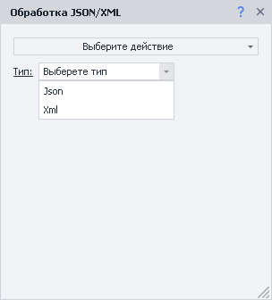


### Parsing

The data must be processed, and that's what the *Parsing action is for.

| 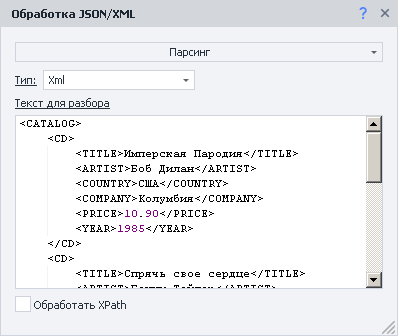 |
| :--: |
| Here, the XML from the Description is processed |


#### Variables Window

The result of the action is stored in a project variable called Json or Xml, depending on what you parsed. You can view the contents in the [❗→ Variables Window](/wiki/spaces/RU/pages/735608872 "/wiki/spaces/RU/pages/735608872")

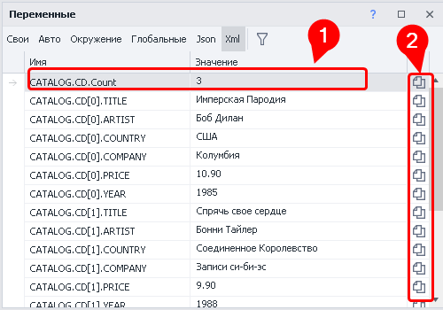


Since in the example we parsed XML, we selected the relevant tab in the *Variables Window.

The *Count (1) variable stores the number of elements—very convenient to use as a limit when looping through the data. For example, if the example also had `<DVD>` tags at the same level as `<CD>`, then there would be a variable CATALOG.DVD.Count with the number of `<DVD>` tags.

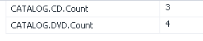


By using the special buttons (2) you can quickly copy the [❗→ variable macro](/wiki/spaces/RU/pages/486309922 "/wiki/spaces/RU/pages/486309922") to the clipboard.

#### Variable Macros

Here's an example of one of the variable macros: `{ -Xml.CATALOG.CD[1].ARTIST- }.`

You can use other variables inside this variable, for instance:


```
{-Xml.CATALOG.{-Variable.item_type-}[{-Variable.counter-}].{-Variable.property-}-}
```


| 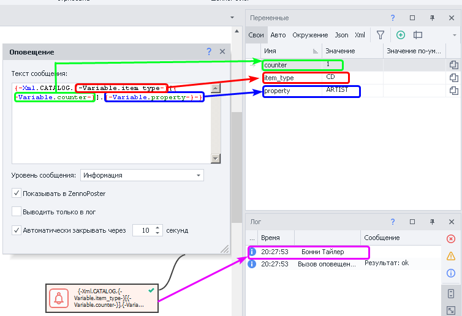 |
| :--: |
| Substituting data from other variables and the result (based on the data from the Description section. Indexing starts at zero.) |


:::note Note
To quickly insert a variable, you can press CTRL+SPACE in any text field. A dropdown menu will appear; double-click on Xml or Json in this menu (depending on what you're working with). Then put a dot, and another menu with the parsed variables will show up.
:::

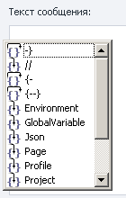


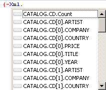


#### Process JsonPath/XPath

This option is used when, out of all the data processed by the *Parsing action, you need to extract a specific subset. In this case, you write an [❗→ XPath](/wiki/spaces/RU/pages/862093419 "/wiki/spaces/RU/pages/862093419") (for XML) or JsonPath (for JSON) expression. The [❗→ Tester X/JSON Path](/wiki/spaces/RU/pages/534315390 "/wiki/spaces/RU/pages/534315390") can help you write these expressions. You can also use variable macros in the expression field.

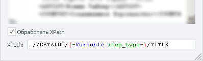


#### XML Features

XML nodes can have attributes. To access them in macros, you use square brackets with the string value. (For example: `{ -Xml.CATALOG.CD[0]["item"]- }`).

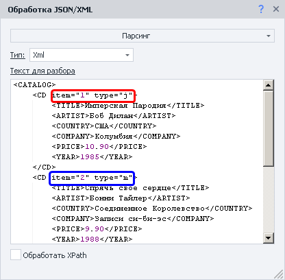


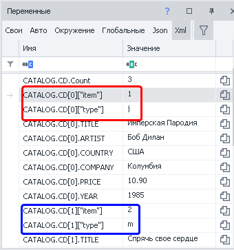


#### Processing Speed

Parsing a large JSON or XML while debugging in ProjectMaker might take some time. But when running in ZennoPoster, parsing is much faster.

  

### Add to List

This action is used when you want to extract a specific property from each element in all the data. You can use [❗→ variables](/wiki/spaces/RU/pages/486309922 "/wiki/spaces/RU/pages/486309922").

**Property** refers to the field that will be processed as an array. You can use nesting by using a dot (for example: store.employees). If the field isn’t an array, only one item will be added to the list.

**Subproperty**—since arrays can contain complex objects, you can specify which value to take from them for the list.

If we use the data from the *Description section and imagine we only need the years for each CD, the action could be set up like this:

|  |
| :--: |
| The variable `{ -Variable.item_type- }` contains CD |


  

### Add to Table

This action is similar to the previous one, but here you can get not just one property, but several. You can use [❗→ variables](/wiki/spaces/RU/pages/486309922 "/wiki/spaces/RU/pages/486309922").

|  |
| :--: |
| The variable `{ -Variable.item_type- }` contains CD and `{ -Variable.property- }` contains ARTIST |


Columns are named like in Excel—capital (!) Latin letters, in alphabetical order. If a column is skipped, it'll be empty. In the screenshot, you can see that column C isn’t specified, and this is how it appears in the final table:

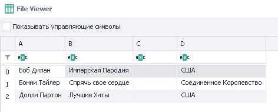


  

## Working with code

In C#, JSON and XML objects are stored in the project object. They have the dynamic type, so the code editor can't always show full intellisense (dropdown suggestions).

Example of working with XML:

```csharp
project.Xml.FromString(project.Variables["XmlText"].Value);
return project.Xml.PurchaseOrder.Address[0]["Type"];
```

Example 2:

```csharp
var list = new List<string>();
for(int i = 0; i &lt; project.Xml.PurchaseOrder.Address.Count; i++)
{
 list.Add(project.Xml.PurchaseOrder.Address[i].Name.Value);
}
return string.Join(", ", list);
```

Example 3:

```csharp
var list = new List<string>();
foreach(dynamic i in project.Xml.PurchaseOrder.Address)
{
 list.Add(i.Name.Value);
}
return string.Join(", ", list);
```

It works the same way with Json. However, keep in mind you don't use "Value" when accessing properties.

Example:

```csharp
return project.Json.employees[1].firstName;
```

  

## Usage Example

### JSON

Here's a website: [http://ip-api.com](http://ip-api.com/ "http://ip-api.com/"), which returns detailed information about an IP address using a basic API. This is useful for:

- making sure your project is using a proxy and not your main IP,
- selecting a country/city during registration, based on the proxy's info.

It can return data in different formats (more details here - https://ip-api.com/docs), but we're interested in JSON for now.

To get information, send a [❗→ GET request](/wiki/spaces/RU/pages/534315165 "/wiki/spaces/RU/pages/534315165") to http://ip-api.com/json, then process the result with the *Parse action and work with the received data.

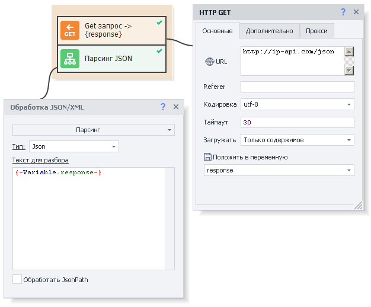


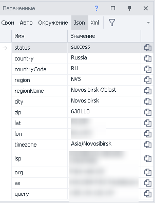


  

### XML + XPath Processing

We'll use the data from the *Description section.

Let's say we only need the album titles. For this task, we'll create the XPath expression `//CATALOG/CD/TITLE`.

| 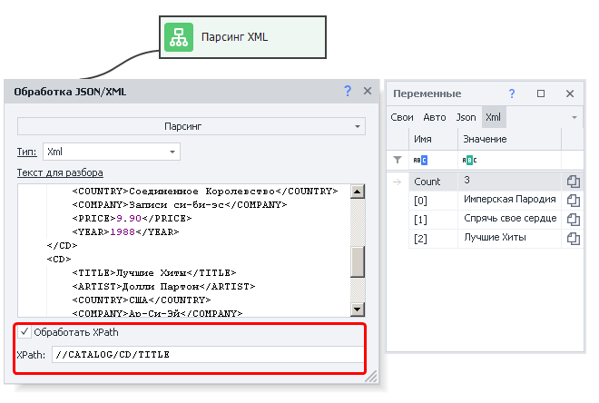 |
| :--: |
| Action settings and result (on the right) |


  

## Useful Links

- [❗→ Variables Window](/wiki/spaces/RU/pages/735608872 "/wiki/spaces/RU/pages/735608872")
- [❗→ Working with variables](/wiki/spaces/RU/pages/486309922 "/wiki/spaces/RU/pages/486309922")
- [❗→ XPath](/wiki/spaces/RU/pages/862093419 "/wiki/spaces/RU/pages/862093419")
- [❗→ Tester X/JSON Path](/wiki/spaces/RU/pages/534315390 "/wiki/spaces/RU/pages/534315390")
- [❗→ Text processing](/wiki/spaces/RU/pages/488865793 "/wiki/spaces/RU/pages/488865793")
- [❗→ Loops](/wiki/spaces/RU/pages/489259031 "/wiki/spaces/RU/pages/489259031")