:::info **Please read the [*Material Usage Rules on this site*](../../../../Disclaimer).**
:::

> 🔗 **[Original page](https://zennolab.atlassian.net/wiki/spaces/RU/pages/486539291)** — Source of this material

_______________________________________________  

## Description

For online work, ZennoPoster uses a special entity called the Project Profile.

A profile combines commonly used parameters such as:

1. **Virtual identity** – first name, last name, date of birth, email, nationality, and other parameters.
2. **Virtual browser** – UserAgent, Proxy, browser fingerprint, etc.

:::info Information
A profile is regenerated every time you click the “Start Over” button in ProjectMaker or when a new project is run in ZennoPoster.
:::


**📹 There was a video here**

To configure the initial profile generation, you need to set it up in the [❗→ static block](https://zennolab.atlassian.net/wiki/spaces/RU/pages/534053179 "https://zennolab.atlassian.net/wiki/spaces/RU/pages/534053179") → [❗→ Profile](https://zennolab.atlassian.net/wiki/spaces/RU/pages/483426308 "https://zennolab.atlassian.net/wiki/spaces/RU/pages/483426308"). Here you can specify the profile language, gender, desired regions, as well as browser settings.

## How do I add the action to my project?

Use the context menu **Add action** → **Data** → **Profile operations**

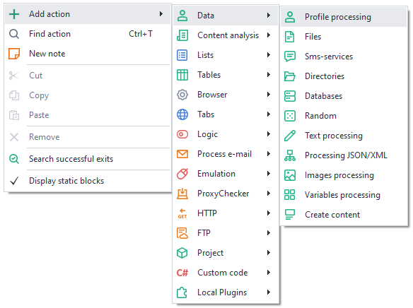


Or use the [❗→ smart search](https://zennolab.atlassian.net/wiki/spaces/RU/pages/506200090/ProjectMaker+7#%D0%A3%D0%BC%D0%BD%D1%8B%D0%B9-%D0%BF%D0%BE%D0%B8%D1%81%D0%BA-%D0%B4%D0%B5%D0%B9%D1%81%D1%82%D0%B2%D0%B8%D0%B9 "https://zennolab.atlassian.net/wiki/spaces/RU/pages/506200090/ProjectMaker+7#%D0%A3%D0%BC%D0%BD%D1%8B%D0%B9-%D0%BF%D0%BE%D0%B8%D1%81%D0%BA-%D0%B4%D0%B5%D0%B9%D1%81%D1%82%D0%B2%D0%B8%D0%B9").

## What is this used for?

You can save and load a profile into a template, allowing you to use different profiles for working on different resources. This helps bypass bot protection.

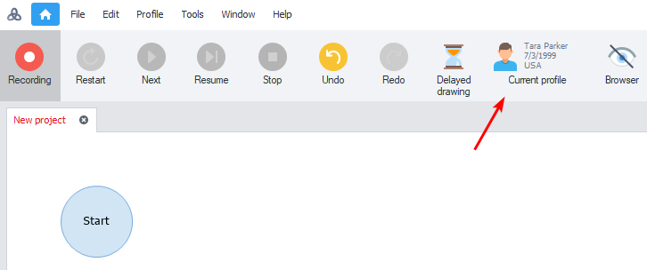


To view the current profile, you can click the “Current profile” button at the top of the program interface. Read more about all the profile settings here: [❗→ Profile window](https://zennolab.atlassian.net/wiki/spaces/RU/pages/735903758 "https://zennolab.atlassian.net/wiki/spaces/RU/pages/735903758") 

## How to work with the action?

### Saving a profile

After registering on a website or performing other actions in a template, you can save the profile data for later use in other projects. The profile file (\.zpprofile) stores all instance data: cookies, User Agent, computer information generated for the instance, first name, last name, login, city, etc.

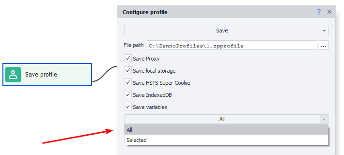


:::warning Attention
Be careful with the “Save variables” checkbox. If you save your profile with this option, the selected variable values will be overwritten the next time it is loaded.
:::

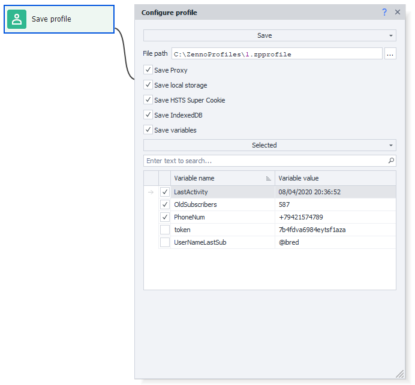


For the correct execution of the template, only save the variables you need. However, you can always choose “All” from the dropdown list.

  

### Loading a profile

If you have previously saved profiles, you can load them for use in your project.

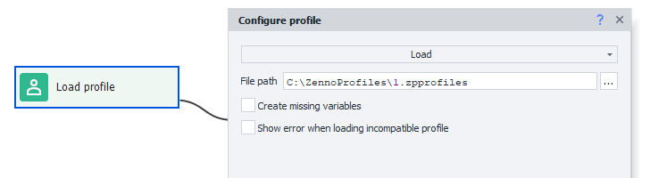


**Create missing variables** – when this option is enabled, any missing variables listed in the profile will be automatically created and added to your project. This is useful if you want to add a profile to your project that was saved when working in another project.

**Show an error when loading an incompatible profile** – when this option is enabled, if you try to load profiles that were created on a different browser engine than your current [❗→ project engine](https://zennolab.atlassian.net/wiki/spaces/RU/pages/534315477#%D0%A2%D0%B8%D0%BF-%D0%B1%D1%80%D0%B0%D1%83%D0%B7%D0%B5%D1%80%D0%B0 "https://zennolab.atlassian.net/wiki/spaces/RU/pages/534315477#%D0%A2%D0%B8%D0%BF-%D0%B1%D1%80%D0%B0%D1%83%D0%B7%D0%B5%D1%80%D0%B0"), the project will end with an error (for example, if your current project uses the Firefox 52 engine, but you try to load a profile created with the Chrome engine).

:::info Information
This setting was added in ZennoPoster 7.2.1.0
:::

  

### Remap fields

You can manually edit parts of the profile. For some data you can set the value you need, and for others you can regenerate it.

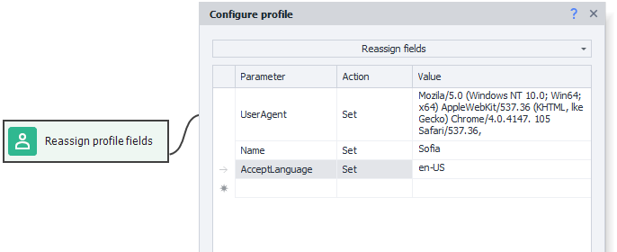


#### Why do this?

- Set your own UserAgent values;
- Set desired names, surnames, birth dates, and other “identity” info;
- Set desired browser resolution;
- Set desired logins/passwords/email;
- Any other possible customization of the profile for your needs.

You can use data from the profile in other actions later, for example in the [❗→ Text processing](https://zennolab.atlassian.net/wiki/spaces/RU/pages/488865793 "https://zennolab.atlassian.net/wiki/spaces/RU/pages/488865793") block. To do this, use macros from [❗→ environment variables](https://zennolab.atlassian.net/wiki/spaces/RU/pages/735608872#%D0%9F%D1%80%D0%BE%D1%84%D0%B8%D0%BB%D1%8C "https://zennolab.atlassian.net/wiki/spaces/RU/pages/735608872#%D0%9F%D1%80%D0%BE%D1%84%D0%B8%D0%BB%D1%8C"), for example: `{ -Profile.Name}`

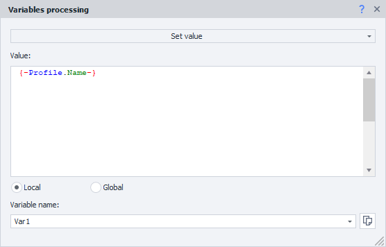


:::note Note
You just need to type \{ -Profile. and ProjectMaker will suggest all possible choices in a dropdown list.
:::

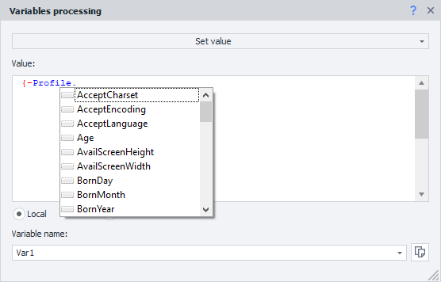


  

### Update

:::info Information
Available in ZennoPoster starting from version 7.3.1.0.
:::

This action will update the current profile to a similar one with the latest browser version.

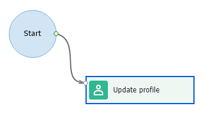


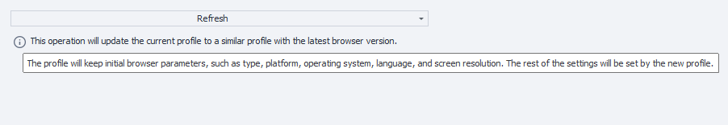


The search is performed using the project filter and by matching the following parameters of the new profile to the current one: browser type, OS, platform, language, and screen resolution.

The action doesn’t just update the browser version, it completely replaces the profile with the found one (all parameters will be new except the ones used for searching).

ZennoPoster can load up to 4000 profiles to look for a suitable match (there’s no point loading more, as the server generates 4000 profiles per day), and ProjectMaker can load 400.

  

### Save profile-folder

:::info Information
Available starting with ZennoPoster version 7.3.1.0.
:::

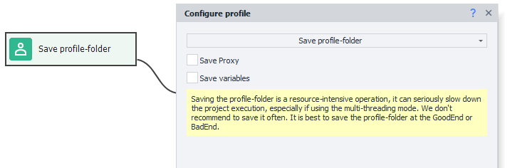


A profile-folder feature was added in ZennoPoster 7.3.1.0. You can read more about it here: [❗→ Using the profile-folder](https://zennolab.atlassian.net/wiki/spaces/RU/pages/1251475485 "https://zennolab.atlassian.net/wiki/spaces/RU/pages/1251475485") 

With this function, you can save it.

You can also save the current project proxy and/or variables (all or only selected) along with the profile-folder.

:::warning Attention
Saving a profile-folder is a resource-intensive operation and can greatly slow down your project, especially when running multithreaded. It is not recommended to save frequently. The best places to save are on Good End or Bad End in your project.
:::

  

## Possible practical application

Imagine you’re working with a service that has followers. After finishing, save the current date and time to a **LastActivity** variable. To do this, use the [❗→ Variable Processing](https://zennolab.atlassian.net/wiki/spaces/RU/pages/486309922#%D0%AD%D0%BA%D1%88%D0%B5%D0%BD-%E2%80%9C%D0%9E%D0%B1%D1%80%D0%B0%D0%B1%D0%BE%D1%82%D0%BA%D0%B0-%D0%BF%D0%B5%D1%80%D0%B5%D0%BC%D0%B5%D0%BD%D0%BD%D1%8B%D1%85%E2%80%9D "https://zennolab.atlassian.net/wiki/spaces/RU/pages/486309922#%D0%AD%D0%BA%D1%88%D0%B5%D0%BD-%E2%80%9C%D0%9E%D0%B1%D1%80%D0%B0%D0%B1%D0%BE%D1%82%D0%BA%D0%B0-%D0%BF%D0%B5%D1%80%D0%B5%D0%BC%D0%B5%D0%BD%D0%BD%D1%8B%D1%85%E2%80%9D") ** action and in the data field enter the macro `{ -TimeNow.Date- }` (for more on available macros, see the [❗→ Variable Window](https://zennolab.atlassian.net/wiki/spaces/RU/pages/735608872 "https://zennolab.atlassian.net/wiki/spaces/RU/pages/735608872") article).

The **OldSubcribers** variable contains the number of followers you got while running the template.

The **PhoneNum** variable contains the phone number linked to the account.

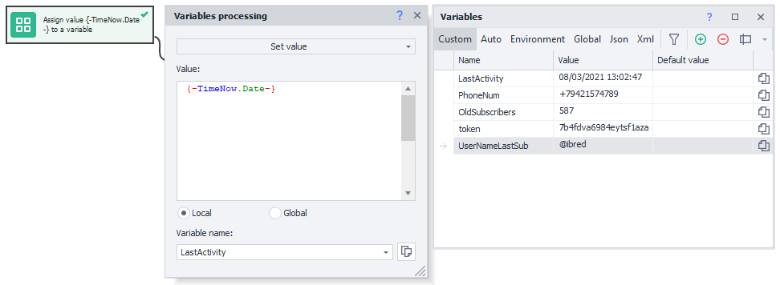


Save your profile, specifying which variables you want to save.

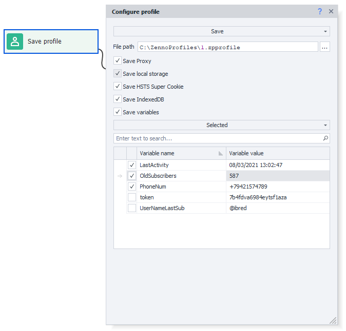


:::tip Tip
Starting in version 7.3.1.0, saving profiles is easier and more intuitive when working with profile-folders.
:::

For example, if you don’t need the token and UserNameLastSub variables, just don’t save them.

Later, you can use “Load profile” to get the variables you need and then use them for personal activity logging. For example, create a [❗→ Notification (Notification/Write to log)](https://zennolab.atlassian.net/wiki/spaces/RU/pages/534053050 "https://zennolab.atlassian.net/wiki/spaces/RU/pages/534053050") ** action and enter the following text:

```
Profile loaded.
Profile name: {-Profile.Name-};
Last profile activity: {-Variable.LastActivity-};
Subscribers count after previous check: {-Variable.OldSubcribers-};
Phone number: {-Variable.PhoneNum-}.
```

This uses several macros: `{-Profile.Name-}` - profile name, `{-Variable.LastActivity-}` - the `LastActivity` variable, `{-Variable.OldSubcribers-}` - the `OldSubcribers` variable, `{-Variable.PhoneNum-}` - the `PhoneNum` variable. The output in the log will look like this:

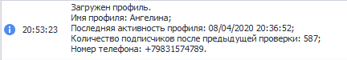


Also, when saving and loading your profile, you can use [❗→ user variables](https://zennolab.atlassian.net/wiki/spaces/RU/pages/486309922 "https://zennolab.atlassian.net/wiki/spaces/RU/pages/486309922"), [❗→ environment variables](https://zennolab.atlassian.net/wiki/spaces/RU/pages/1976762378 "https://zennolab.atlassian.net/wiki/spaces/RU/pages/1976762378"), and their combinations. For example, if you use the following string `{-Project.Directory-}ProfilesZenno\{-Profile.Login-}.zpprofile` as the "File path" when saving a profile, a file named `rosenhydo1987.zpprofile` will be saved in the Profiles folder (this folder will be created next to the project file if it does not exist at the time the action is run).


## Useful links

- [❗→ Profile](https://zennolab.atlassian.net/wiki/spaces/RU/pages/483426308 "https://zennolab.atlassian.net/wiki/spaces/RU/pages/483426308") – configure initial profile generation settings.
- [❗→ Profile window](https://zennolab.atlassian.net/wiki/spaces/RU/pages/735903758 "https://zennolab.atlassian.net/wiki/spaces/RU/pages/735903758") – info about the generated profile.
- [❗→ Random numbers and strings (Random/Rand)](https://zennolab.atlassian.net/wiki/spaces/RU/pages/534315050 "https://zennolab.atlassian.net/wiki/spaces/RU/pages/534315050") – for generating logins.
- [❗→ List operations](https://zennolab.atlassian.net/wiki/spaces/RU/pages/534085798 "https://zennolab.atlassian.net/wiki/spaces/RU/pages/534085798") – for working with your own data lists.
- [❗→ Google Sheets (PM)](https://zennolab.atlassian.net/wiki/spaces/RU/pages/735576090 "https://zennolab.atlassian.net/wiki/spaces/RU/pages/735576090") – for working with data lists.
- [❗→ Text processing](https://zennolab.atlassian.net/wiki/spaces/RU/pages/488865793 "https://zennolab.atlassian.net/wiki/spaces/RU/pages/488865793") – for updating customizable project variables.
- [❗→ Variable window](https://zennolab.atlassian.net/wiki/spaces/RU/pages/735608872 "https://zennolab.atlassian.net/wiki/spaces/RU/pages/735608872")