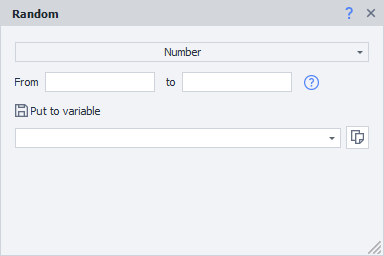
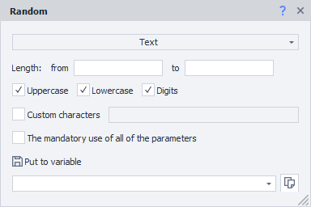
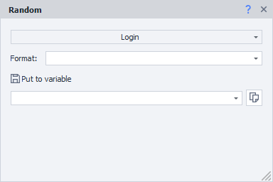

---
sidebar_position: 6
title: "Random (random numbers and strings)"
description: "Converted from HTML to MDX"
date: "2025-07-24"
converted: true
originalFile: "Random (случайные числа и строки).txt"
targetUrl: "https://zennolab.atlassian.net/wiki/spaces/RU/pages/534315050/Random"
---
import DisclaimerNotice from '@site/src/components/DisclaimerNotice';

<DisclaimerNotice />

> 🔗 **[Original page](https://zennolab.atlassian.net/wiki/spaces/RU/pages/534315050/Random)** — Source of this material

_______________________________________________  

## Description

The Random action is used to generate random data - strings, numbers, and usernames.

## Where can it be used:

- Selecting a random element or elements on a page (together with other actions).
- Password generation.
- Generating a date of birth (for this, you'll need to use several Random Number actions in a row).
- Postal code generation
- Username generation

## How to use the action?

### Number generation

- **From**  - the lower boundary of the generated number.
- **To** - the upper boundary of the generated number, **NOT INCLUDED.**

Example: when generating a number from 3 to 6, each time this action is run, it will generate one of the numbers - 3, 4, 5

  

### Text generation

- **Length** - set the minimum and maximum length of the resulting string. As with numbers, the upper boundary is NOT included (so if you're generating a string from 3 to 10 characters, each time this action runs, it will produce a random string with a minimum length of 3 and a maximum of 9; the length will also be random each time)
- Checkboxes **Uppercase, Lowercase, Digits** - check the options you want included in the resulting string. Note that only English alphabet characters are used.
- **Custom characters** - if you select this option, you need to enter a string of characters in the input field on the right. The generated string will contain only these specified characters.
- **Mandatory use of all the above parameters** - if this checkbox is checked, the resulting string will contain at least one character from each of the selected options (**Uppercase, Lowercase, Digits, Custom characters**).

For example, if you run this action 5 times with length set from 5 to 9 and with "Uppercase", "Lowercase", and "Digits" options enabled, you'll get results like this:

> w6ZxAw  
> 0M5oke7  
> ZlE3SY  
> Tos6KRZ  
> l5a640Pk  

### Username generation

Usernames are generated based on a specified formula. The screenshot shows several preset formula options. More about the formulas:

*Currently, the supported languages are Eng - English, Lat - Latin, Jap - Japanese.

For example, if you write `[Eng|4]`, a nickname of 4 English syllables will be generated, with syllable ordering probability similar to real words. By tweaking the generation formula, you can create more complex constructions:

`[RndSym|[RndNum|0|4]|0123456789][Lat|3][RndSym|[RndNum|0|2]|-][Jap|1][RndText|2|D]`

where `[RndSym|[RndNum|0|4]|0123456789]` - at the beginning of the username there are 0 to 3 digits;

 `[Lat|3]` - 3 Latin syllables;

`[RndSym|[RndNum|0|2]|-]` - one or two hyphens may appear;

`[Jap|1]` - one Japanese syllable;

`[RndText|2|D]` - then two random letters or digits;

As a result, usernames like these will be generated:

> 053bomenca-iem  
> 7lialeme-nozr  
> 46atbemig-poex  
> simpvido-se8f  
> 3afosuxhif6  
> frigulimdeif  
> misssefu-yucn  
> 5grasacin-maew  
> trodalcelfu88  
> 6nasercia-risc  
  
## Useful links

- [❗→ Profile actions](/wiki/spaces/RU/pages/486539291 "/wiki/spaces/RU/pages/486539291")
- [❗→ Text processing](/wiki/spaces/RU/pages/488865793 "/wiki/spaces/RU/pages/488865793")