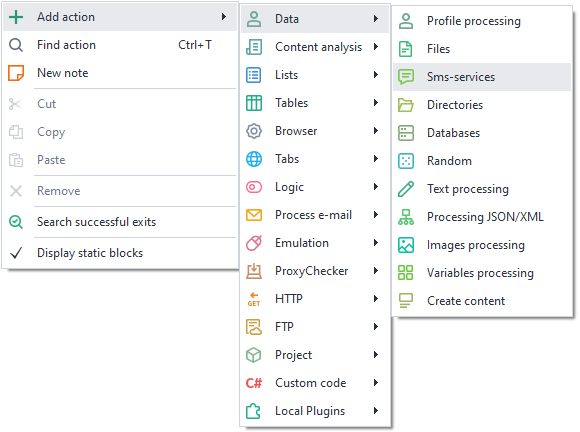
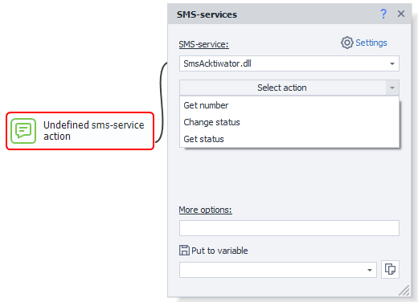
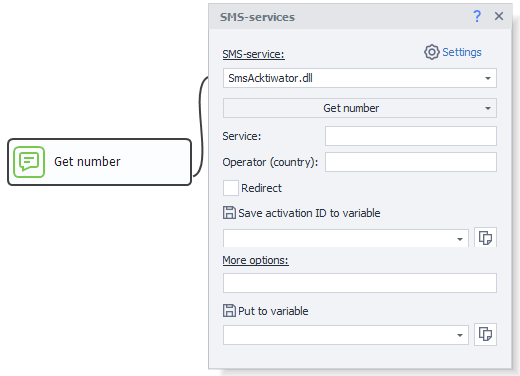
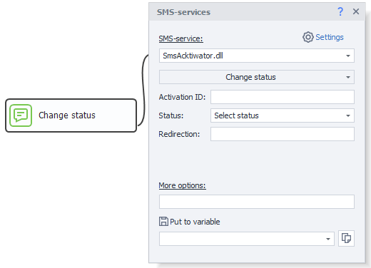
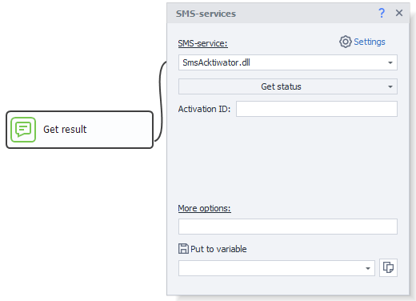
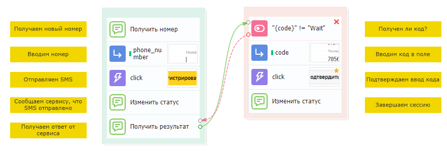

---
sidebar_position: 3
title: "Services for SMS Processing"
description: "Converted from HTML to MDX"
date: "2025-07-24"
converted: true
originalFile: "Сервисы для обработки SMS.txt"
targetUrl: "https://zennolab.atlassian.net/wiki/spaces/RU/pages/486539308/SMS"
---
import DisclaimerNotice from '@site/src/components/DisclaimerNotice';

<DisclaimerNotice />

> 🔗 **[Original page](https://zennolab.atlassian.net/wiki/spaces/RU/pages/486539308/SMS)** — Source of this material

_______________________________________________  

## What is it used for

This action is used to work with SMS services, allowing you to get a number from the selected service and use it in your workflow.

## How to add the action to your project?

Through the context menu **Add action** → **Data** → **SMS services**

Or use [❗→ smart search](https://zennolab.atlassian.net/wiki/spaces/RU/pages/506200090/ProjectMaker+7#%D0%A3%D0%BC%D0%BD%D1%8B%D0%B9-%D0%BF%D0%BE%D0%B8%D1%81%D0%BA-%D0%B4%D0%B5%D0%B9%D1%81%D1%82%D0%B2%D0%B8%D0%B9 "https://zennolab.atlassian.net/wiki/spaces/RU/pages/506200090/ProjectMaker+7#%D0%A3%D0%BC%D0%BD%D1%8B%D0%B9-%D0%BF%D0%BE%D0%B8%D1%81%D0%BA-%D0%B4%D0%B5%D0%B9%D1%81%D1%82%D0%B2%D0%B8%D0%B9").

## What is this used for?

To receive an SMS message for registration on websites that require SMS verification.

## How to work with the action?

:::note Note
First, you need to connect the API key of one of the SMS services in the program settings.
:::

The action has the following main settings:

### SMS service

Select the SMS service you will work with. Service settings are described in the article [❗→ SMS services](https://zennolab.atlassian.net/wiki/spaces/RU/pages/809074773 "https://zennolab.atlassian.net/wiki/spaces/RU/pages/809074773").

### Select an action

#### Get number

##### **Service**

The site/app you need to get a number for.

:::note Note
Permissible values should be specified in the documentation for your chosen activation service.
:::

##### **Operator (country)**

This field usually specifies the country code for the required number.

:::note Note
Country codes vary from service to service, so make sure to check the documentation for your chosen activation service.
:::

##### **Perform forwarding**

Should forwarding be performed?

:::note Note
Check the documentation of your chosen activation service to see if forwarding is available.
:::

##### **Put activation ID in variable**

The activation ID will be saved in the variable you specify here. You’ll need this ID later when the project waits for the SMS.

#### Change status

Notifies the service that the number's status has changed.

##### **Activation ID**

Here you need to specify the activation ID you received at the **Get number** step.

:::note Note
You can use a variable macro.
:::

##### **Status**

- **SMS sent** – The SMS was sent to the specified number.
- **Resend code** – for cases when, for some reason, the SMS had to be sent again.
- **Cancel request** – when you no longer need the number; often, services will refund the used funds to your account.
- **Number already used** – used to notify the service that the number is not suitable because it is already used.
- **Complete** – notifies the service that the number has been used successfully.

##### **Forwarding**

Number to which forwarding is set

  

#### Get status

Gets the status of the number. If SMS is pending, the program will attempt to receive it for 3 minutes. If the SMS is not received within this time, the result variable will get the value “Wait,” and you’ll need to repeat the “Get status” operation. Some services have very long response times for SMS (around 15 minutes).

##### **Activation ID**

Here you need to specify the activation ID you received at the **Get number** step.

:::note Note
You can use a variable macro.
:::

  

### Additional parameters

Services can accept extra parameters that are not provided in the action's settings.

Format: `parameter=value`

You can pass several parameters at once. Separate them from each other with an & (ampersand): `&parameter1=value1&parameter2=value2&parameterN=valueN`.

:::warning Attention
The parameter names, their purposes, and allowed values differ from service to service. Please check the documentation for your chosen service.
:::

  

### Save to variable

Select the variable in which the result will be stored.

  

## How does it work?

The general workflow for each service is as follows:

1. Order a number and receive it.
2. Send an SMS message to the received number.
3. Notify the service that the message was sent.
4. Wait to receive the message.
5. Finish the session.

  

## Example template

A sample workflow for working with an SMS service in a ZennoPoster template is shown below:

:::warning Attention
This is just an example! Do not use infinite loops in your templates—this can lead to your template freezing and losing money (if an infinite loop is set to get a number and for some reason the template cannot exit this loop, it will keep requesting numbers until your account runs out of funds).
:::

  

## Useful links

- [❗→ SMS services](https://zennolab.atlassian.net/wiki/spaces/RU/pages/809074773 "https://zennolab.atlassian.net/wiki/spaces/RU/pages/809074773")
- [❗→ Text processing](https://zennolab.atlassian.net/wiki/spaces/RU/pages/488865793 "https://zennolab.atlassian.net/wiki/spaces/RU/pages/488865793")
- [❗→ Working with JSON and XML](https://zennolab.atlassian.net/wiki/spaces/RU/pages/488964124 "https://zennolab.atlassian.net/wiki/spaces/RU/pages/488964124")
- [❗→ Working with variables](https://zennolab.atlassian.net/wiki/spaces/RU/pages/486309922 "https://zennolab.atlassian.net/wiki/spaces/RU/pages/486309922")