:::info **Please review the [*Rules for using materials on this resource*](../Disclaimer).**
:::

> 🔗 **[Original page](https://zennolab.atlassian.net/wiki/spaces/RU/pages/488865793)** — Source of this material

_______________________________________________  

## Description

This action is used for various text manipulations that are very commonly needed in practice. Processing scraped text, cleaning it up, translating to other languages – all this and more can be handled by the text processing “block”.

## How do I add an action to the project?

Either via the context menu **Add Action** → **Data** → **Text Processing**

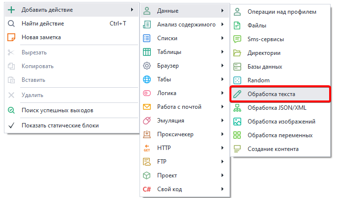


Or use the [❗→ Smart Search](https://zennolab.atlassian.net/wiki/spaces/RU/pages/506200090/ProjectMaker+7#%D0%A3%D0%BC%D0%BD%D1%8B%D0%B9-%D0%BF%D0%BE%D0%B8%D1%81%D0%BA-%D0%B4%D0%B5%D0%B9%D1%81%D1%82%D0%B2%D0%B8%D0%B9 "https://zennolab.atlassian.net/wiki/spaces/RU/pages/506200090/ProjectMaker+7#%D0%A3%D0%BC%D0%BD%D1%8B%D0%B9-%D0%BF%D0%BE%D0%B8%D1%81%D0%BA-%D0%B4%D0%B5%D0%B9%D1%81%D1%82%D0%B2%D0%B8%D0%B9").

## Where is text processing used?

- [❗→ Escape String](https://zennolab.atlassian.net/wiki/spaces/RU/pages/488865793#Escape-%D1%81%D1%82%D1%80%D0%BE%D0%BA%D0%B8 "https://zennolab.atlassian.net/wiki/spaces/RU/pages/488865793#Escape-%D1%81%D1%82%D1%80%D0%BE%D0%BA%D0%B8"). For escaping special characters
- [❗→ Regex](https://zennolab.atlassian.net/wiki/spaces/RU/pages/488865793#Regex "https://zennolab.atlassian.net/wiki/spaces/RU/pages/488865793#Regex"). Search text using regular expressions
- [❗→ Spintax](https://zennolab.atlassian.net/wiki/spaces/RU/pages/488865793#Spintax "https://zennolab.atlassian.net/wiki/spaces/RU/pages/488865793#Spintax"). Randomize or make text unique
- [❗→ Split](https://zennolab.atlassian.net/wiki/spaces/RU/pages/488865793#Split "https://zennolab.atlassian.net/wiki/spaces/RU/pages/488865793#Split"). Split a string into multiples using a delimiter
- [❗→ ToChar](https://zennolab.atlassian.net/wiki/spaces/RU/pages/488865793#ToChar "https://zennolab.atlassian.net/wiki/spaces/RU/pages/488865793#ToChar"). Convert a Unicode code to a character
- [❗→ ToLower, ToUpper](https://zennolab.atlassian.net/wiki/spaces/RU/pages/488865793#ToLower "https://zennolab.atlassian.net/wiki/spaces/RU/pages/488865793#ToLower"). Change text from uppercase to lowercase and vice versa
- [❗→ Trim](https://zennolab.atlassian.net/wiki/spaces/RU/pages/488865793#Trim "https://zennolab.atlassian.net/wiki/spaces/RU/pages/488865793#Trim"). Remove extra whitespace characters from text
- [❗→ UrlEncode, UrlDecode](https://zennolab.atlassian.net/wiki/spaces/RU/pages/488865793#UrlDecode "https://zennolab.atlassian.net/wiki/spaces/RU/pages/488865793#UrlDecode"). Encode / Decode URLs
- [❗→ Into variable, list, table](https://zennolab.atlassian.net/wiki/spaces/RU/pages/488865793#%D0%92-%D0%BF%D0%B5%D1%80%D0%B5%D0%BC%D0%B5%D0%BD%D0%BD%D1%83%D1%8E "https://zennolab.atlassian.net/wiki/spaces/RU/pages/488865793#%D0%92-%D0%BF%D0%B5%D1%80%D0%B5%D0%BC%D0%B5%D0%BD%D0%BD%D1%83%D1%8E"). Save data into a variable, list, or table
- [❗→ Replace](https://zennolab.atlassian.net/wiki/spaces/RU/pages/488865793#%D0%97%D0%B0%D0%BC%D0%B5%D0%BD%D0%B0 "https://zennolab.atlassian.net/wiki/spaces/RU/pages/488865793#%D0%97%D0%B0%D0%BC%D0%B5%D0%BD%D0%B0"). Replace in text
- [❗→ Translate](https://zennolab.atlassian.net/wiki/spaces/RU/pages/488865793#%D0%9F%D0%B5%D1%80%D0%B5%D0%B2%D0%BE%D0%B4 "https://zennolab.atlassian.net/wiki/spaces/RU/pages/488865793#%D0%9F%D0%B5%D1%80%D0%B5%D0%B2%D0%BE%D0%B4"). Translate to another language
- [❗→ Prepare JavaScript](https://zennolab.atlassian.net/wiki/spaces/RU/pages/488865793#%D0%9F%D0%BE%D0%B4%D0%B3%D0%BE%D1%82%D0%BE%D0%B2%D0%BA%D0%B0-JavaScript "https://zennolab.atlassian.net/wiki/spaces/RU/pages/488865793#%D0%9F%D0%BE%D0%B4%D0%B3%D0%BE%D1%82%D0%BE%D0%B2%D0%BA%D0%B0-JavaScript"). Process text for use in a Logic (IF-ELSE) or JavaScript action
- [❗→ Get substring](https://zennolab.atlassian.net/wiki/spaces/RU/pages/488865793#%D0%9F%D0%BE%D0%B4%D1%81%D1%82%D1%80%D0%BE%D0%BA%D0%B0 "https://zennolab.atlassian.net/wiki/spaces/RU/pages/488865793#%D0%9F%D0%BE%D0%B4%D1%81%D1%82%D1%80%D0%BE%D0%BA%D0%B0")
- [❗→ Transliteration](https://zennolab.atlassian.net/wiki/spaces/RU/pages/488865793#%D0%A2%D1%80%D0%B0%D0%BD%D1%81%D0%BB%D0%B8%D1%82%D0%B5%D1%80%D0%B0%D1%86%D0%B8%D1%8F "https://zennolab.atlassian.net/wiki/spaces/RU/pages/488865793#%D0%A2%D1%80%D0%B0%D0%BD%D1%81%D0%BB%D0%B8%D1%82%D0%B5%D1%80%D0%B0%D1%86%D0%B8%D1%8F"). Transliterate text

## How does the action work?

The properties window mainly consists of three sections:

1. Input string – text, variable, or a combination of them.
2. Actions on the string, properties, and their settings.
3. Output string (result) in a variable.

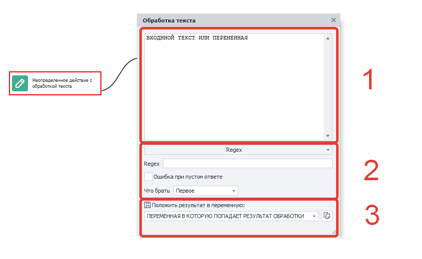


:::info Info
Place your cursor in the input area, press Ctrl+Space and select useful constants and project variables from the dropdown list. For example, you can quickly insert the project proxy `{ -Project.Proxy- }` or the URL of the active tab `{ -Page.Url- }` (you can find other available environment variables in the Variables Window article)
:::

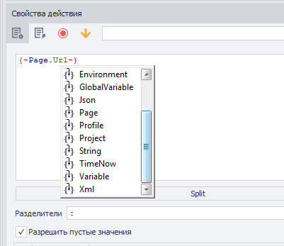


All available operations for this “block”:

### Escape String

Escaping characters.
This action escapes spaces and the symbols `*+?|{[()^$.#` (it adds a slash before each listed character - `\`). This method is often used for working with queries and so that the [regular expressions](/wiki/spaces/RU/pages/534086111 "/wiki/spaces/RU/pages/534086111") processor treats these characters literally, not as commands or meta-characters.  

Before: `{"animal": "cat"}`  
After: `\{"animal":\ "cat"}`

  

### Regex

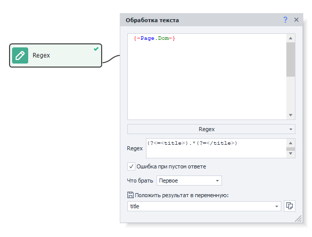


Processing text using regular expressions.
Regex makes it very convenient to parse strings and extract the required substring by pattern. This action enables you not only to parse the first found value, but also the whole group, and save values to variables or a table.

#### “Regex” input field

Enter a regular expression in this field, which will be used to search the text. Example - 
```regex
(?<=<title>).*(?=</title>) 
``` 

:::note Note
Regex Tester can help you compose regular expressions
:::

#### Error on empty result

If this setting is enabled and the regular expression doesn’t find anything in the text, the action will end with an error (exit through the red branch).

:::warning Attention
Please note: if the regular expression returns an empty string, even when “Error on empty result” is enabled, the action will exit through the green branch. For example, if there’s nothing in the title tag on the site: `<title></title>`, then the expression `(?<=<title>).*(?=</title>)` will trigger but return an empty string — the action will complete successfully. But if there were no `<title></title>` in the text at all, then the expression would find nothing and the action would exit through the red branch.
:::

#### What to grab

##### **First**

The first match will be saved to a variable.

##### **All**

Save all matches to a list.

##### **A specific match**

Save only one match.
In the field that appears you can specify the match index (**zero-based!**) or select *Last* or *Random* value.

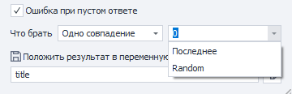


##### **Match numbers**

Save only the matches with the specified indices to a list (**zero-based!**, enter separated by commas).

##### **To variables**

This function is used when working with group regexes. Here’s an example under the spoiler:

<details>
<summary>Click here to expand the example</summary>

Suppose we have the following text:

`21.01.2003, 11:34:00.9299
11.12.2013, 01:22:55.3021
04.01.2007, 08:00:06.0032`

And our task is to break it down into components. Let’s use this regex: `(\d{2}).(\d{2}).(\d{4}), (\d{2}):(\d{2}):(\d{2}).(\d{4})`

Here’s how the result looks in the [❗→ Regex Tester](/wiki/spaces/RU/pages/534086111 "/wiki/spaces/RU/pages/534086111"):

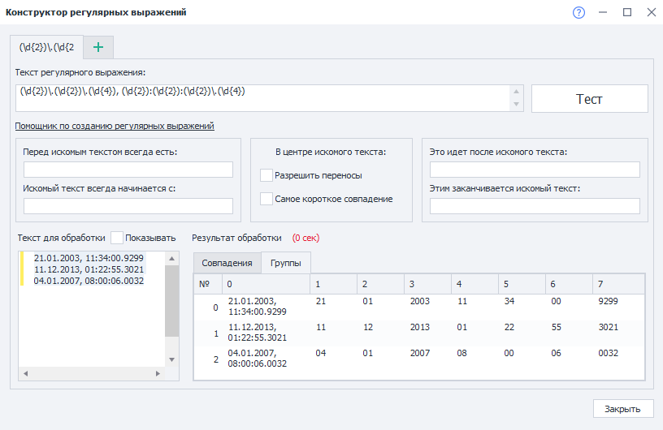


Now let’s say we want to get the day, month, and year from the second line into variables. Here’s how you can do it:

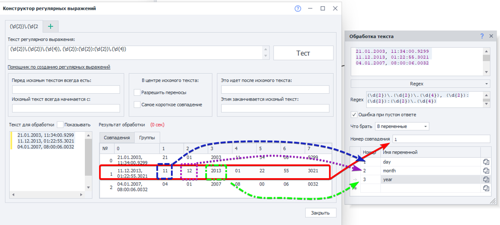


**Match index** in our case is the line number. Since indexing starts from zero, to take the second line, set **1**

Next, you need to specify the group number and the variable to save the result into. Group indexing also starts from zero. But group **0** contains the entire matched string (`11.12.2013, 01:22:55.3021`). So for day set group 1, for month – 2, and for year – 3.

</details>
##### **To table**

Very similar to the previous function (**To variables**) but with the difference that here all results are saved to a [❗→ table](/wiki/spaces/RU/pages/735903776 "/wiki/spaces/RU/pages/735903776"), not just one. You can exclude some of the found groups from the final result.

<details>
<summary>Click here to expand the example</summary>

Using the same text as above:


```
21.01.2003, 11:34:00.9299
11.12.2013, 01:22:55.3021
04.01.2007, 08:00:06.0032
```

The task is to break it down and save to a table. Use the regex: `(\d{2}).(\d{2}).(\d{4}), (\d{2}):(\d{2}):(\d{2}).(\d{4})`


Here’s how the result looks in the [❗→ Regex Tester](/wiki/spaces/RU/pages/534086111 "/wiki/spaces/RU/pages/534086111"):


Let’s suppose we don’t need seconds and milliseconds in the final table. Here’s what it might look like:

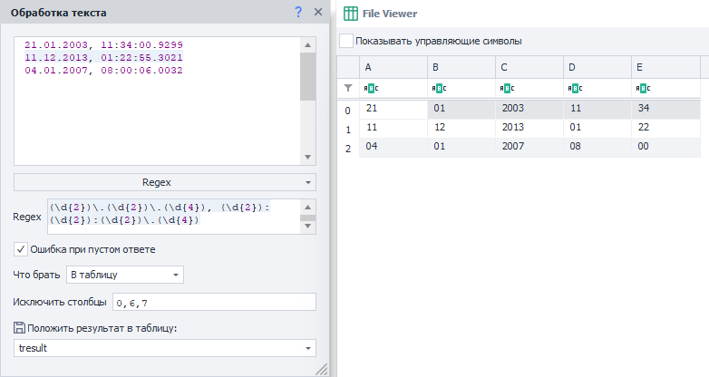


Group **0** contains the entire match (the whole line in our example) so exclude it. Groups 6 and 7 are seconds and milliseconds, respectively.

</details>
#### Example Use Case

Let’s look at a concrete example – parsing links using regular expressions built with the [❗→ builder](/wiki/spaces/RU/pages/534086111 "/wiki/spaces/RU/pages/534086111"). 

For example, let’s say our task is to get profile links for active users of the [ZennoLab forum](https://zennolab.com/discussion/ "https://zennolab.com/discussion/"). Here’s how:

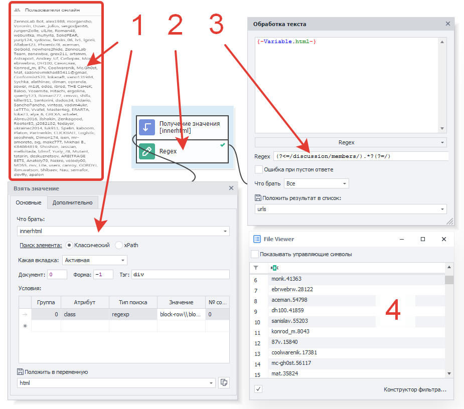


1. Use the [❗→ Get Value](/wiki/spaces/RU/pages/534315124 "/wiki/spaces/RU/pages/534315124") block to get the HTML code of the element containing the links to users currently online in the forum.
2. Add a “Regex” action. For the pattern in the Regex action’s properties, use the [❗→ Regex Builder](/wiki/spaces/RU/pages/534086111 "/wiki/spaces/RU/pages/534086111").
3. In the action’s properties, set the input variable to “html”, and save the result to the “urls” list.
4. After running the block, you get a list of unique user ids, which you can use to build user profile URLs.

  

### Spintax

Randomization or unique-ifying of text.
Spintax makes it easy to synonymize texts. Spintax is a structure made up of curly braces and vertical bars that allows you to randomly pick substrings from the string. In the simplest form, spintax looks like:
`{option1|option2|option3}`. When executed, one of those three options is randomly selected and placed in the result variable.
Spintax constructions can of course get more complex and deeply nested, allowing you to generate thousands of text variations from the same base text.

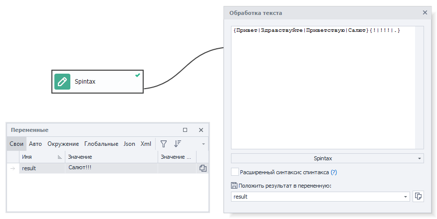


#### Extended Spintax Syntax

- `{Red|White|Blue}` — one value will appear in the result, e.g. “White”
- `[ Red| White| Blue]` — all values appear in random order, e.g. “White Blue Red”
- `[+_+Red|White|Blue]` — all values in a random order, separated by the given delimiter, e.g. “White_Red_Blue”

Nesting is unlimited (e.g.: `[+{_|- }+Red|White|Blue {1|2}] `= “White-Blue 2-Red”). Special characters can be escaped: `[+\++Red|\[White\]|Blue]` - result is “[White]+Red+Blue”

* * *

### Split

Splitting text by some separator character (delimiter).
This operation turns a string into an array of strings. It’s basically a simpler version of RegExp for splitting strings by characters.

#### Delimiters

Specify the character(s) by which the data will be split.

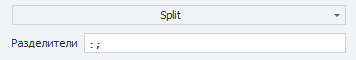


#### Allow empty values

Let’s look at this option with an example.

Suppose you have a string like `first name;last name;gender;year of birth`. The action could look like this:

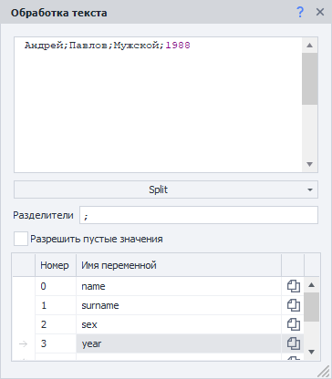


But if one of the parts is missing, like `gender` (`Андрей;Павлов;;1988`), then the birth year gets written to the gender (`sex`) variable. That’s exactly what the *Allow empty values* setting is for – if you enable it, the gender variable will get an empty string and the year will save to the correct variable.

#### Example Use Case

Let’s see how split works in a common task — breaking down a proxy string. Bought proxies are often in this format: `login:password@host:port`
There are two delimiters here — `:` (colon) and `@`. Here’s how you can set up the action:

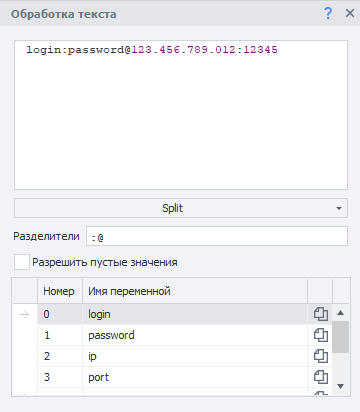


Both symbols are specified together as the delimiter.

* * *

### ToChar

Converts an integer value to a [Unicode character](https://ru.wikipedia.org/wiki/%D0%AE%D0%BD%D0%B8%D0%BA%D0%BE%D0%B4 "https://ru.wikipedia.org/wiki/%D0%AE%D0%BD%D0%B8%D0%BA%D0%BE%D0%B4").
Every Unicode character has its own code, and this feature allows you to convert a number to the corresponding character. For example, the symbol `♛` has the number `9819`.

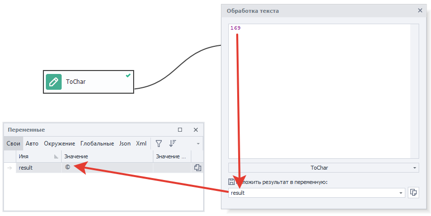


* * *

### ToLower

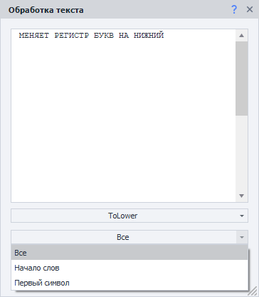


Changes the letter case to lowercase depending on the property chosen. For example, let’s take the string `МЕНЯЕТ РЕГИСТР БУКВ НА НИЖНИЙ`

#### All

Will replace all uppercase letters with lowercase letters in the text.

| **Was**<figure><div><div aria-disabled="false"><div></div></div></div></figure> | **Became**<figure><div><div aria-disabled="false"><div></div></div></div></figure> |
| --- | --- |
| **Was**<figure><div><div aria-disabled="false"><div></div></div></div></figure> | **Became**<figure><div><div aria-disabled="false"><div></div></div></div></figure> |
| --- | --- |
| МЕНЯЕТ РЕГИСТР БУКВ НА НИЖНИЙ | меняет регистр букв на нижний |

#### Word Start

Converts only the first letter of each word to lowercase.

| **Was**<figure><div><div aria-disabled="false"><div></div></div></div></figure> | **Became**<figure><div><div aria-disabled="false"><div></div></div></div></figure> |
| --- | --- |
| **Was**<figure><div><div aria-disabled="false"><div></div></div></div></figure> | **Became**<figure><div><div aria-disabled="false"><div></div></div></div></figure> |
| --- | --- |
| МЕНЯЕТ РЕГИСТР БУКВ НА НИЖНИЙ | мЕНЯЕТ рЕГИСТР бУКВ нА нИЖНИЙ |

#### First character

Changes only the first character of the given text to lowercase.

| **Was**<figure><div><div aria-disabled="false"><div></div></div></div></figure> | **Became**<figure><div><div aria-disabled="false"><div></div></div></div></figure> |
| --- | --- |
| **Was**<figure><div><div aria-disabled="false"><div></div></div></div></figure> | **Became**<figure><div><div aria-disabled="false"><div></div></div></div></figure> |
| --- | --- |
| МЕНЯЕТ РЕГИСТР БУКВ НА НИЖНИЙ | мЕНЯЕТ РЕГИСТР БУКВ НА НИЖНИЙ |

* * *

### **ToUpper**

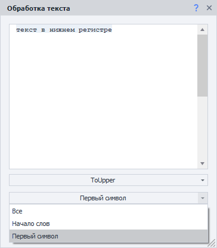


Changes the letter case to uppercase depending on the property chosen. For example, let’s take the string `текст в нижнем регистре`

#### All

Will convert all lowercase letters in the text to uppercase.

| **Was**<figure><div><div aria-disabled="false"><div></div></div></div></figure> | **Became**<figure><div><div aria-disabled="false"><div></div></div></div></figure> |
| --- | --- |
| **Was**<figure><div><div aria-disabled="false"><div></div></div></div></figure> | **Became**<figure><div><div aria-disabled="false"><div></div></div></div></figure> |
| --- | --- |
| текст в нижнем регистре | ТЕКСТ В НИЖНЕМ РЕГИСТРЕ |

#### Word Start

Changes only the first character of each word in the text to uppercase.

| **Was**<figure><div><div aria-disabled="false"><div></div></div></div></figure> | **Became**<figure><div><div aria-disabled="false"><div></div></div></div></figure> |
| --- | --- |
| **Was**<figure><div><div aria-disabled="false"><div></div></div></div></figure> | **Became**<figure><div><div aria-disabled="false"><div></div></div></div></figure> |
| --- | --- |
| текст в нижнем регистре | Текст В Нижнем Регистре |

#### First character

Changes only the first character of the given text to uppercase.

| **Was**<figure><div><div aria-disabled="false"><div></div></div></div></figure> | **Became**<figure><div><div aria-disabled="false"><div></div></div></div></figure> |
| --- | --- |
| **Was**<figure><div><div aria-disabled="false"><div></div></div></div></figure> | **Became**<figure><div><div aria-disabled="false"><div></div></div></div></figure> |
| --- | --- |
| текст в нижнем регистре | Текст в нижнем регистре |

  

### Trim

This function is used to remove extra characters at the beginning and/or end of the given string. 

Most often, it’s used if you need to clean up a string from leftover spaces, line breaks, tabs — things that so often show up after parsing. 

#### What to trim

Here, you choose which characters to remove. It can be a preset for all whitespace characters (space, line break, tab), or you can specify your own set of characters.

#### Where to trim

Where to remove characters – **Start of string**, **End** or **Start and End.**

  

### UrlDecode

Decodes a string encoded with UrlEncode (described below).

This action is especially obvious when decoding Cyrillic:
Was: `%D0%9F%D1%80%D0%B8%D0%B2%D0%B5%D1%82%2C%20%D0%BC%D0%B8%D1%80%21`
Became: `Привет, мир!`

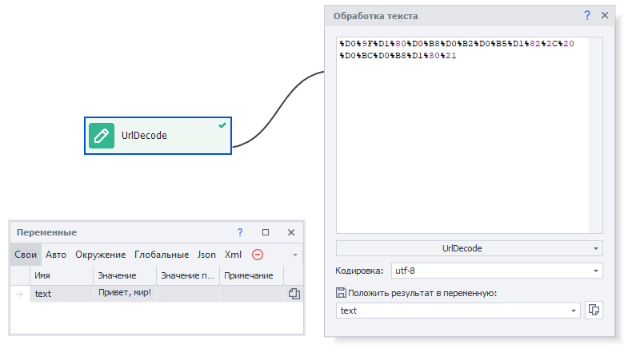


* * *

### UrlEncode

URLs can only contain Latin letters, digits, and a few punctuation marks. All other characters sent in an HTTP request must be encoded with UrlEncode, or the server might interpret the request incorrectly.

#### Encode only values in variables

Very handy for building [❗→ HTTP requests](/wiki/spaces/RU/pages/534085713 "/wiki/spaces/RU/pages/534085713"), since you don’t need to encode the site address, only the parameters. Here’s how you can set up the action:

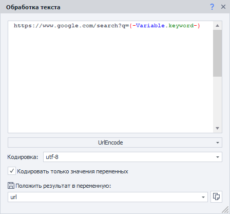


The variable `{ -Variable.keyword- }` contains `что такое urlencode`. After completion, the variable `{ -Variable.url- }` will contain: `https://www.google.com/search?q=%d1%87%d1%82%d0%be+%d1%82%d0%b0%d0%ba%d0%be%d0%b5+urlencode`

* * *

### To Variable

This action simply saves everything you put in the input window – variables, text, characters, project constants – to a variable.

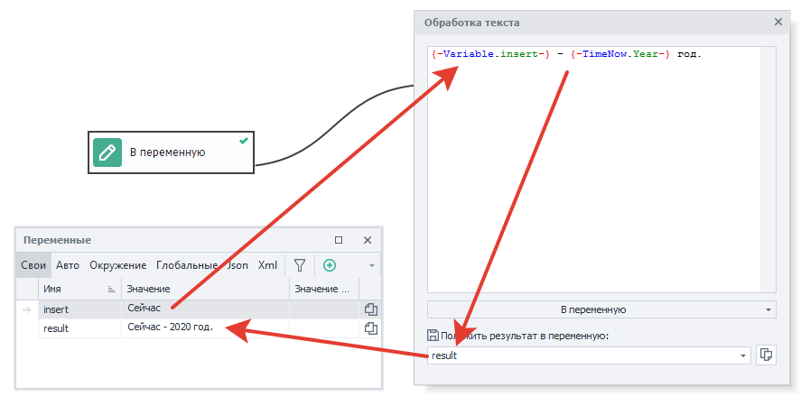


* * *

### To List

This action splits text by the specified delimiter in the properties and saves the lines to a [❗→ list](/wiki/spaces/RU/pages/534053375 "/wiki/spaces/RU/pages/534053375").

#### Delimiter

- Enter – newline character
- Space
- Custom text – you can specify a single character (like `;`) or multiple characters (**note:** if you specify multiple characters, they will be treated as *one* delimiter!)
- Custom Regex – use a [❗→ regular expression](/wiki/spaces/RU/pages/534086111 "/wiki/spaces/RU/pages/534086111").

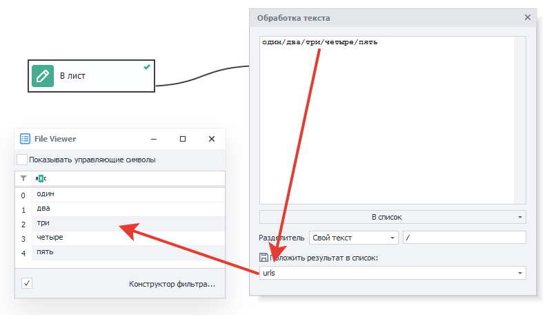


* * *

### To Table

This action splits the given text into rows and columns (according to the specified delimiters) and puts the data into a [❗→ table](/wiki/spaces/RU/pages/735903776 "/wiki/spaces/RU/pages/735903776").

#### Delimiters

- Enter – newline character
- Space
- Custom text – you can specify a single character (like `;`) or several characters (**note:** if you specify multiple characters here, they will be treated as a single delimiter!)
- Custom Regex – use a [❗→ regular expression](/wiki/spaces/RU/pages/534086111 "/wiki/spaces/RU/pages/534086111").

  

### Replace

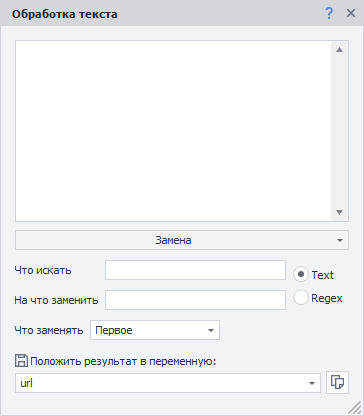


This action looks for a substring in a string, replaces it with another, and then saves the result to a variable. 

#### What to search for

The substring to find (or a [❗→ regular expression](/wiki/spaces/RU/pages/534086111 "/wiki/spaces/RU/pages/534086111") if the search type is *Regex*).

#### What to replace with

What the found substring will be replaced with.

#### Search type

*Text – looks for exactly the string entered in **What to search for**.

*Regex – enter the regular expression in **What to search for**, and matches will be searched with it.

#### What to replace

##### **First**

Only the first found match will be replaced.

##### **All**

All matches will be replaced.

##### **A specific match**

Replace only one specified match (zero-based) or *Last*.

##### **Match numbers**

Specify (comma separated) the match numbers to replace (zero-based!).

  

### Translate

Translates a string from one language to another.

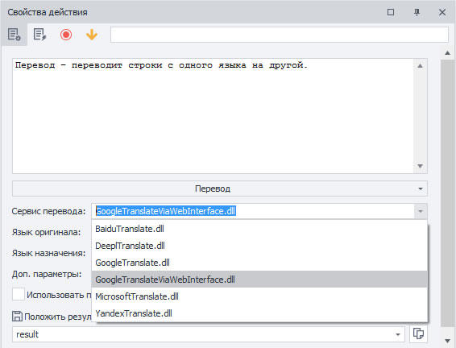


The translation action has a wide range of translation services to choose from, making it flexible for text uniqueness and allowing you to select the highest-quality translations.

#### Translation service

Choose the service to be used for the translation. Available options:

- [Baidu](https://www.npmjs.com/package/baidu-translate-api "https://www.npmjs.com/package/baidu-translate-api")
- [DeepL](https://www.deepl.com/ru/docs-api/ "https://www.deepl.com/ru/docs-api/")
- [Google](https://cloud.google.com/translate "https://cloud.google.com/translate")
- [Google via web interface](https://translate.google.com/ "https://translate.google.com/")
- [Microsoft](https://www.microsoft.com/en-us/translator/business/translator-api/ "https://www.microsoft.com/en-us/translator/business/translator-api/")
- [Yandex](https://tech.yandex.com/translate/ "https://tech.yandex.com/translate/")

API keys for these services can be added in the [❗→ ZennoPoster settings](https://zennolab.atlassian.net/wiki/spaces/RU/pages/808747136/ZennoPoster "https://zennolab.atlassian.net/wiki/spaces/RU/pages/808747136/ZennoPoster").

#### Original language, Target language

Which language you’re translating from and to.

Here are a few examples: English – en, Spanish – es, German – de, Russian – ru ([full list](http://www.loc.gov/standards/iso639-2/php/code_list.php "http://www.loc.gov/standards/iso639-2/php/code_list.php"))

:::warning Attention
Language codes may differ between services. For a complete and reliable list, check the chosen service’s documentation.
:::

:::note Note
You can set the language to “auto” and the system will try to detect the original language automatically, but the result is not guaranteed.
:::

#### Additional parameters

Check the documentation of your chosen service for any additional parameters you can provide.

#### Use project proxy (if possible)

If possible, the translation request will be sent through the currently set proxy.

### Prepare JavaScript

Processes a string for correct use in JavaScript. Mostly it escapes quotes and other special characters. This macro prepares text so it can be inserted as a string into a [❗→ JavaScript](https://zennolab.atlassian.net/wiki/spaces/RU/pages/489259137/JavaScript "https://zennolab.atlassian.net/wiki/spaces/RU/pages/489259137/JavaScript") or [❗→ IF](https://zennolab.atlassian.net/wiki/spaces/RU/pages/534315151/...+...+IF "https://zennolab.atlassian.net/wiki/spaces/RU/pages/534315151/...+...+IF") action. ProjectMaker also has a [❗→ JavaScript tester](https://zennolab.atlassian.net/wiki/spaces/RU/pages/534086128/JavaScript "https://zennolab.atlassian.net/wiki/spaces/RU/pages/534086128/JavaScript") where you can test your code. This “block” helps you escape quotes, apostrophes, and other special characters.

Before: 
```
<a href="https://zennolab.com/">
```
After:
```
<a href=\"https://zennolab.com/\">
```

  

### Substring

Extracts a piece of text from a string as specified by two indices — **from** one character **to** another in the action properties. For example, if we take the first sentence of this paragraph and want a substring from character 95 to the end of the text, we’ll get “to another.“ .

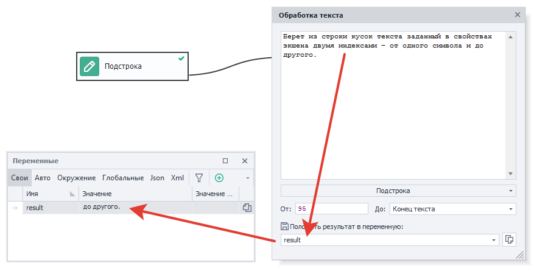


  

### Transliteration

Sometimes you still need to *convert Cyrillic to Latin*. That’s exactly what this action does.

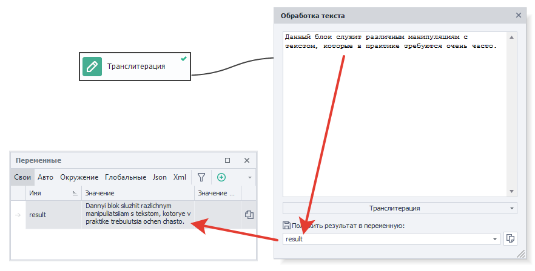


  

## Useful links

- [❗→ Regex Tester](/wiki/spaces/RU/pages/534086111 "/wiki/spaces/RU/pages/534086111")
- [❗→ Variables Window](/wiki/spaces/RU/pages/735608872 "/wiki/spaces/RU/pages/735608872")