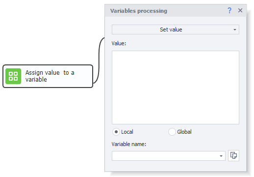
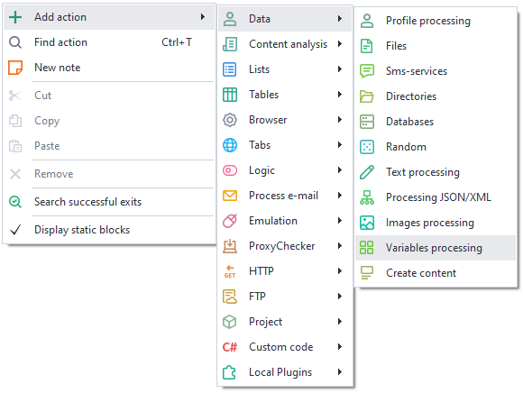
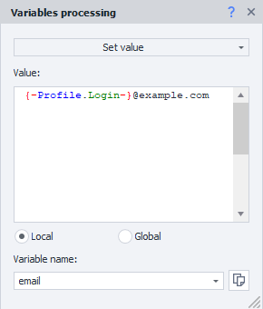
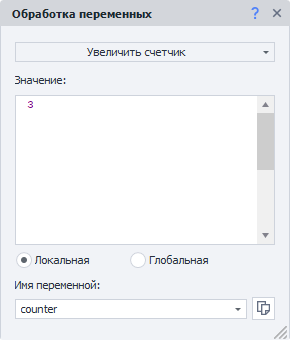
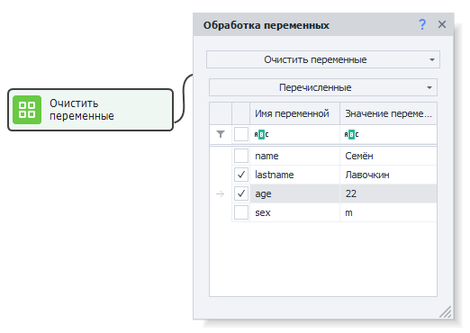
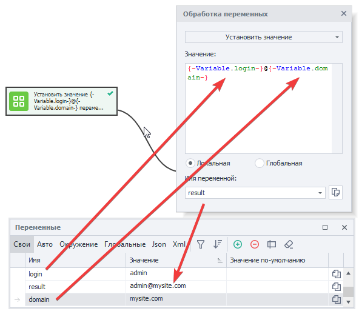
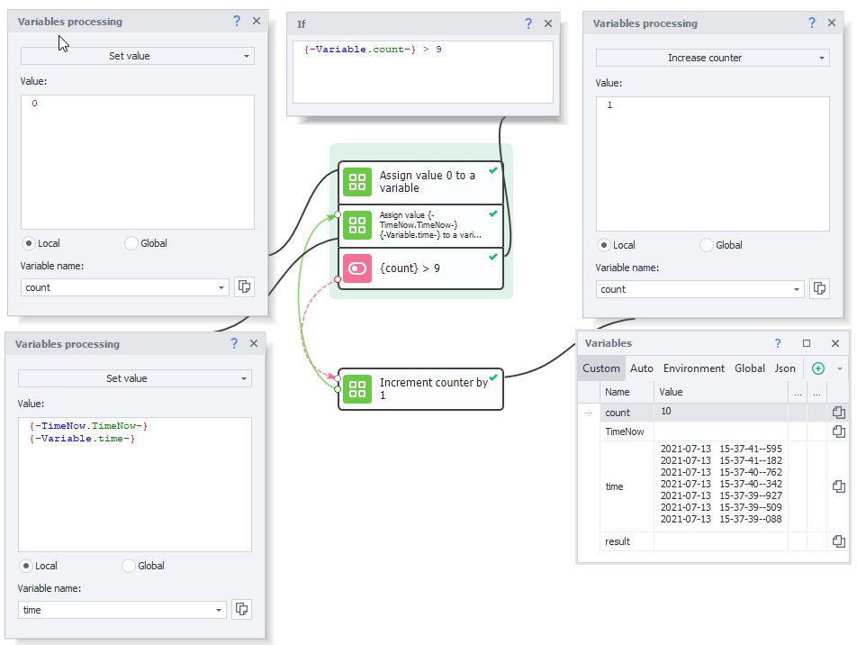

---
sidebar_position: 10
title: "Variable Handling"
description: "Converted from HTML to MDX"
date: "2025-07-24"
converted: true
originalFile: "Обработка переменных.txt"
targetUrl: "https://zennolab.atlassian.net/wiki/spaces/RU/pages/486309922"
---
import DisclaimerNotice from '@site/src/components/DisclaimerNotice';

<DisclaimerNotice />

> 🔗 **[Original page](https://zennolab.atlassian.net/wiki/spaces/RU/pages/486309922)** — Source for this material

_______________________________________________  

## Description

A variable is a memory container that can hold a set or calculated value. In ZennoPoster, you can create variables, rename them, delete them, and assign various values to them. The easiest way to work with variables is through the [❗→ Variables Window](/wiki/spaces/RU/pages/735608872 "/wiki/spaces/RU/pages/735608872").

You should distinguish between **C#** variables, which are strictly typed, and project variables, which are not strictly typed. However, the values of these two types of variables can always be converted without any data loss or distortion.

Variables are the foundation of any project in programming. 

## How do I add an action to a project?

Via the context menu, choose **Add action** → **Data** → **Variable handling**

Or use the [❗→ smart search](https://zennolab.atlassian.net/wiki/spaces/RU/pages/506200090/ProjectMaker+7#%D0%A3%D0%BC%D0%BD%D1%8B%D0%B9-%D0%BF%D0%BE%D0%B8%D1%81%D0%BA-%D0%B4%D0%B5%D0%B9%D1%81%D1%82%D0%B2%D0%B8%D0%B9 "https://zennolab.atlassian.net/wiki/spaces/RU/pages/506200090/ProjectMaker+7#%D0%A3%D0%BC%D0%BD%D1%8B%D0%B9-%D0%BF%D0%BE%D0%B8%D1%81%D0%BA-%D0%B4%D0%B5%D0%B9%D1%81%D1%82%D0%B2%D0%B8%D0%B9").

## What are they used for?

- To set and change variable values.
- To increment or decrement counter variables.

## How to work with this action?

### Set value

You can assign a variable a static string, number, the value of another variable, the value of an environment variable, or any combination of the above.

### Increase/Decrease counter

The counter mode supports both incrementing and decrementing the value. You can increase or decrease the counter not just by one, but by any number specified in the "**Value**" field.
The chosen variable in the "**Variable Name**" field will have its value increased or decreased.

### Clear variables

:::info Info
Added in ZennoPoster 7.7.0.0
:::

With this action, you can clear the contents of variables.

There are 3 clearing modes:

- All
- Listed only
- All except those listed

This is useful, for example, when a template is running in a loop and you need to clear variable data before starting a new iteration so that values from the previous phase do not carry over to the next one.

### Global variables and Namespace

Regular variables are only visible within one project thread (if the project runs in multithreaded mode, each thread will have its own local and independent variable).

Global variables, on the other hand, are **available to all projects and their threads** in ZennoPoster.

To avoid confusion, global variables have an additional property—a namespace—which must be specified whenever you create or reference them.

## Example use cases

Let’s look at a few practical examples of using variables in projects.

### Assigning a value to a variable

You can assign or change a variable’s value either in the special [❗→ Variables Window](/wiki/spaces/RU/pages/735608872 "/wiki/spaces/RU/pages/735608872"), or via the “**Data**“ → “**Variable handling**“ block.

In this example, an email address is formed by combining string variables for the login and website domain.

### Working with a counter variable and environment variables

Let’s imagine a scenario where we need to generate a list of ten current timestamps.

1. Create a variable called `count` to serve as a counter and assign it the value `0` using the “**Variable handling**“ block.
2. Using the same block, get the current timestamp with the [❗→ environment variable](https://zennolab.atlassian.net/wiki/spaces/RU/pages/735608872#%D0%9E%D0%BA%D1%80%D1%83%D0%B6%D0%B5%D0%BD%D0%B8%D0%B5 "https://zennolab.atlassian.net/wiki/spaces/RU/pages/735608872#%D0%9E%D0%BA%D1%80%D1%83%D0%B6%D0%B5%D0%BD%D0%B8%D0%B5") `{ -TimeNow.TimeNow- }`. Add it to the `time` variable and save the result back to `time`.
3. Now, repeat the procedure from step 2 nine more times. To do this, use the “**IF**“ block to compare the value of the `count` counter to the maximum value `9` using [❗→ IF (If... Then...)](/wiki/spaces/RU/pages/534315151 "/wiki/spaces/RU/pages/534315151").
4. If the condition is not met (counter is less than or equal to 9), increase `count` by `1` with the “**Variable handling**“ block (“**Increase counter**” option) and repeat step 2.
5. If the condition is met (counter is greater than 9), finish processing and output the result of the `time` variable to the log. You can view the result in the [❗→ Variables Window](/wiki/spaces/RU/pages/735608872 "/wiki/spaces/RU/pages/735608872")

## Useful links

- [❗→ Variables Window](/wiki/spaces/RU/pages/735608872 "/wiki/spaces/RU/pages/735608872")
- Using variables – [YouTube link](https://www.youtube.com/watch?v=YvmrETeOJD8 "https://www.youtube.com/watch?v=YvmrETeOJD8").
- Variable initialization – [YouTube link](https://www.youtube.com/watch?v=2vXkJIk86yE "https://www.youtube.com/watch?v=2vXkJIk86yE").
- Deleting a variable from a project – [YouTube link](https://www.youtube.com/watch?v=LX3wqMh24-4 "https://www.youtube.com/watch?v=LX3wqMh24-4").
- Counter variable – [YouTube link](https://www.youtube.com/watch?v=gtkflXeyMG0 "https://www.youtube.com/watch?v=gtkflXeyMG0").
- Getting a variable’s value – [YouTube link](https://www.youtube.com/watch?v=WIE_IRtq-DI "https://www.youtube.com/watch?v=WIE_IRtq-DI"). 