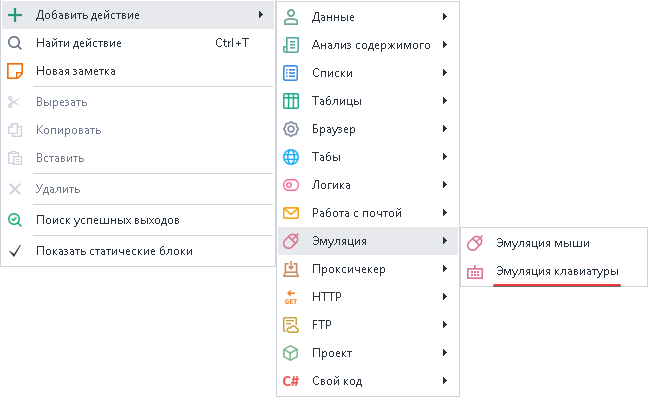
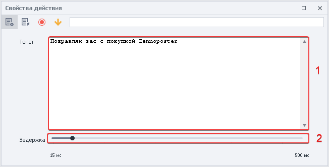
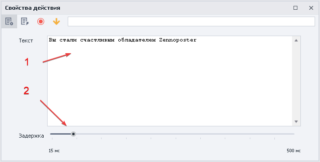
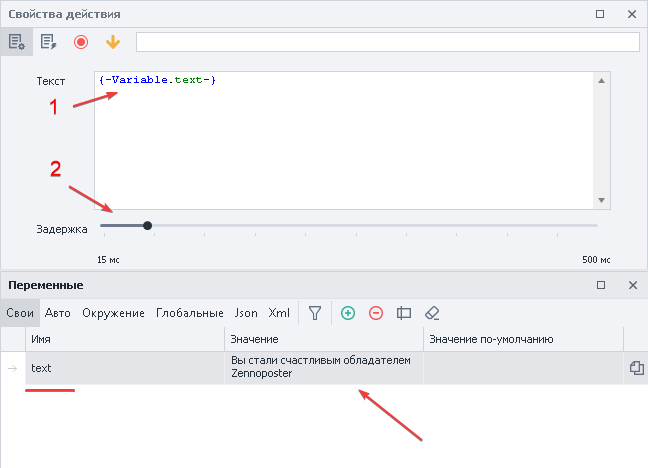
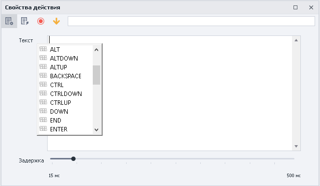
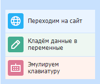

---
sidebar_position: 2
title: "Keyboard Emulation"
description: ""
date: "2025-08-04"
converted: true
originalFile: "Эмуляция клавиатуры.txt"
targetUrl: "https://zennolab.atlassian.net/wiki/spaces/RU/pages/735608949"
---
:::info **Please read the [*Rules for Using Materials on This Resource*](../Disclaimer).**
:::

> 🔗 **[Original page](https://zennolab.atlassian.net/wiki/spaces/RU/pages/735608949)** — Source of this material

_______________________________________________  
# Keyboard Emulation

  

## Description

Emulation of typing text or pressing keys on a website.

  

## How do you add this action to your project?

Via the context menu **Add Action** → **Emulation** → **Keyboard Emulation**

Or you can use the [❗→ smart search](https://zennolab.atlassian.net/wiki/spaces/RU/pages/506200090/ProjectMaker+7#%D0%A3%D0%BC%D0%BD%D1%8B%D0%B9-%D0%BF%D0%BE%D0%B8%D1%81%D0%BA-%D0%B4%D0%B5%D0%B9%D1%81%D1%82%D0%B2%D0%B8%D0%B9 "https://zennolab.atlassian.net/wiki/spaces/RU/pages/506200090/ProjectMaker+7#%D0%A3%D0%BC%D0%BD%D1%8B%D0%B9-%D0%BF%D0%BE%D0%B8%D1%81%D0%BA-%D0%B4%D0%B5%D0%B9%D1%81%D1%82%D0%B2%D0%B8%D0%B9").

  

## What is this used for?

- Filling input fields
- Typing text
- Emulating key presses

  

## How do you work with this action?

### Action Setup

1. The field for *text*, [❗→ *variables](https://zennolab.atlassian.net/wiki/spaces/RU/pages/735608872 "https://zennolab.atlassian.net/wiki/spaces/RU/pages/735608872") and *special keys*.
2. Pause between keystrokes.

:::note Note
You can use text, variables, and special keys all at the same time.
:::

  

### Static Text

1. Enter static text.
2. Set the input parameters.

:::note Note
The text will remain unchanged throughout the entire project.
:::

  

### Working with Variables

A variable in the action will let you enter new text each time.

1. Set the desired variable.
2. Adjust the delay slider.

:::note Note
The text will change depending on the variable's value.
:::

  

### Using Special Keys

Lets you emulate keys like *Enter*, *CTRL*, *END*, etc.

1. Place your mouse cursor in the *Text* field.
2. Press the hotkeys **CTRL + Space** to open the context menu.
3. Select the desired key from the list.

  

## Usage Example

Many sites have learned to track keystrokes, so for maximum reliability, you can fill out forms using keyboard emulation.

It works something like this:

1. Go to the website.
2. Open the profile editing section.
3. Save the required data into the relevant variables.
4. Pass the variables into the keyboard emulation action.
5. After placing the cursor in the input field, start the cube.
6. The site will see you as a real user and accept the data.

  

## Useful Links

1. [❗→ Variables window](https://zennolab.atlassian.net/wiki/spaces/RU/pages/735608872 "https://zennolab.atlassian.net/wiki/spaces/RU/pages/735608872")
2. [❗→ Project settings](https://zennolab.atlassian.net/wiki/spaces/RU/pages/534315477 "https://zennolab.atlassian.net/wiki/spaces/RU/pages/534315477")
3. [❗→ Mouse emulation](https://zennolab.atlassian.net/wiki/spaces/RU/pages/534315158 "https://zennolab.atlassian.net/wiki/spaces/RU/pages/534315158")